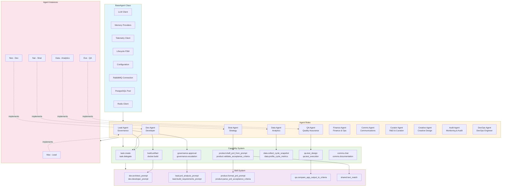

# Agent Design Architecture

This diagram shows the hierarchical structure of the SquadOps agent system, from the base agent class through roles, capabilities, and skills.

## Component Details

### BaseAgent Core Components

- **LLM Client**: Routes to configured LLM provider (Ollama, OpenAI, etc.)
- **Memory Providers**: LanceDBAdapter for agent-level memory, SqlAdapter for Squad Memory Pool
- **Telemetry Client**: Platform-aware telemetry (OpenTelemetry, AWS, Azure, GCP, Null)
- **Lifecycle FSM**: State machine managing agent lifecycle (STARTING, READY, WORKING, BLOCKED, CRASHED, STOPPING)
- **Configuration**: Centralized config loading from `config/` directory
- **RabbitMQ Connection**: Message queue for inter-agent communication
- **PostgreSQL Pool**: Database connection for task logging and cycle data
- **Redis Client**: Caching and coordination

### Role System

Roles are defined in `agents/roles/registry.yaml` and include:
- **Lead**: Governance and coordination (reasoning_style: governance)
- **Dev**: Code generation and architecture (reasoning_style: deductive)
- **Strat**: Product strategy and planning (reasoning_style: abductive)
- **QA**: Testing and security (reasoning_style: counterfactual)
- **Data**: Analytics and insights (reasoning_style: inductive)
- And more...

### Capability System

Capabilities are reusable functions that agents can execute. They are:
- Defined in `agents/capabilities/catalog.yaml`
- Bound to agents via `agents/capability_bindings.yaml`
- Loaded dynamically via `CapabilityLoader`
- Executed with agent instance context

### Skill System

Skills are lower-level building blocks used by capabilities:
- Domain-specific (dev, lead, product, qa, shared)
- Deterministic or non-deterministic
- Reusable across multiple capabilities
- Defined in `agents/skills/registry.yaml`

### Agent Instances

Agent instances are configured in `agents/instances/instances.yaml`:
- Each instance has an ID, display name, role, and model
- Instances implement roles and inherit their capabilities
- Multiple instances can share the same role

