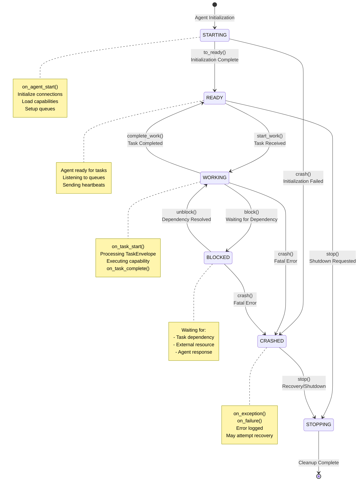
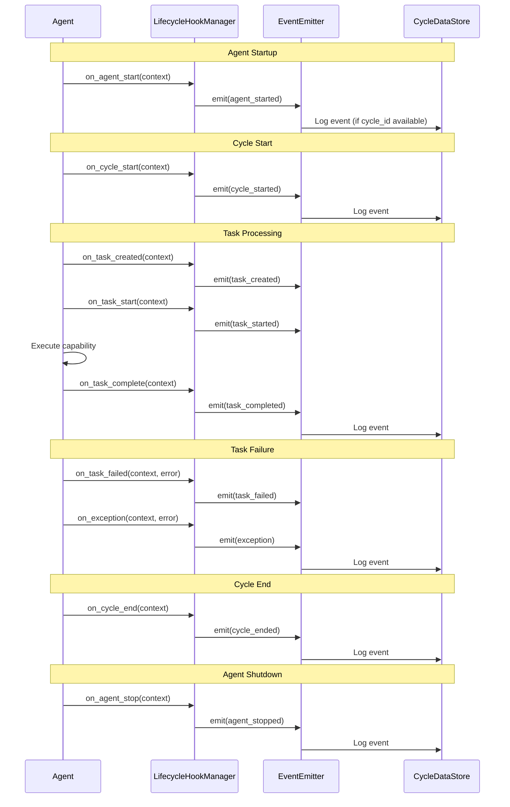

# Agent Lifecycle

This diagram shows the FSM-based agent lifecycle, state transitions, and lifecycle hooks.

## Lifecycle Hooks

## State Transitions

### Allowed Transitions

| From State | Trigger | To State | Description |
|------------|---------|----------|-------------|
| STARTING | `to_ready()` | READY | Initialization successful |
| STARTING | `crash()` | CRASHED | Initialization failed |
| READY | `start_work()` | WORKING | Task received |
| READY | `stop()` | STOPPING | Shutdown requested |
| WORKING | `complete_work()` | READY | Task completed successfully |
| WORKING | `block()` | BLOCKED | Waiting for dependency |
| WORKING | `crash()` | CRASHED | Fatal error occurred |
| BLOCKED | `unblock()` | WORKING | Dependency resolved |
| BLOCKED | `crash()` | CRASHED | Fatal error occurred |
| CRASHED | `stop()` | STOPPING | Recovery or shutdown |
| STOPPING | (cleanup) | [*] | Agent terminated |

### Invalid Transitions

- Any transition not listed above will raise `MachineError`
- Auto-transitions are disabled for safety
- State validation ensures agents follow proper lifecycle

## Lifecycle Events

### Event Structure

All lifecycle events include:
- `event_type`: Type of event (e.g., "agent_started", "task_completed")
- `agent_id`: Agent identifier
- `project_id`: Project identifier
- `cycle_id`: Execution cycle identifier
- `pulse_id`: Pulse identifier (if applicable)
- `task_id`: Task identifier (if applicable)
- `correlation_id`: Correlation identifier
- `causation_id`: Causation identifier
- `trace_id`: Distributed tracing identifier
- `span_id`: Span identifier
- `timestamp`: Event timestamp
- `metadata`: Additional event metadata

### Event Flow

1. **Lifecycle Hook Called**: Agent calls hook method (e.g., `on_task_start`)
2. **Context Built**: Hook builds context with full lineage fields
3. **Event Created**: `StructuredEvent` created from context
4. **Event Emitted**: Event sent to `EventEmitter`
5. **Event Logged**: Event logged to CycleDataStore (if cycle_id available)
6. **Non-Blocking**: Event emission is async and fail-safe

## State Entry Callbacks

When entering a state, the agent:
1. Logs the transition to CycleDataStore
2. Records previous and new lifecycle state
3. Includes cycle_id and task_id in transition log
4. Updates agent status in health check system

## Error Handling

- **FSM Errors**: Invalid transitions raise `MachineError`
- **Hook Errors**: Hook failures are logged but don't break execution
- **Event Emission Errors**: Event emission failures are non-fatal
- **Crash Recovery**: Agents can transition from CRASHED to STOPPING for cleanup

## Lifecycle State Properties

- **lifecycle_state**: Current state from FSM (read-only property)
- **state**: Internal FSM state (managed by Transitions library)
- **current_task**: Currently executing task ID
- **lifecycle_fsm**: FSM machine instance

