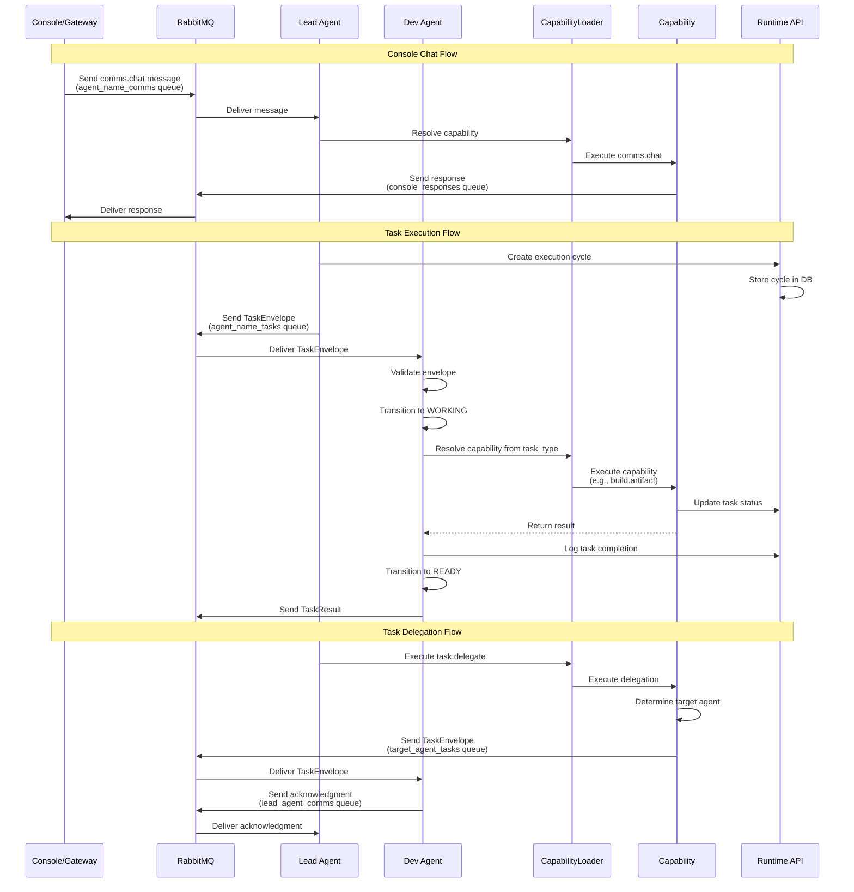
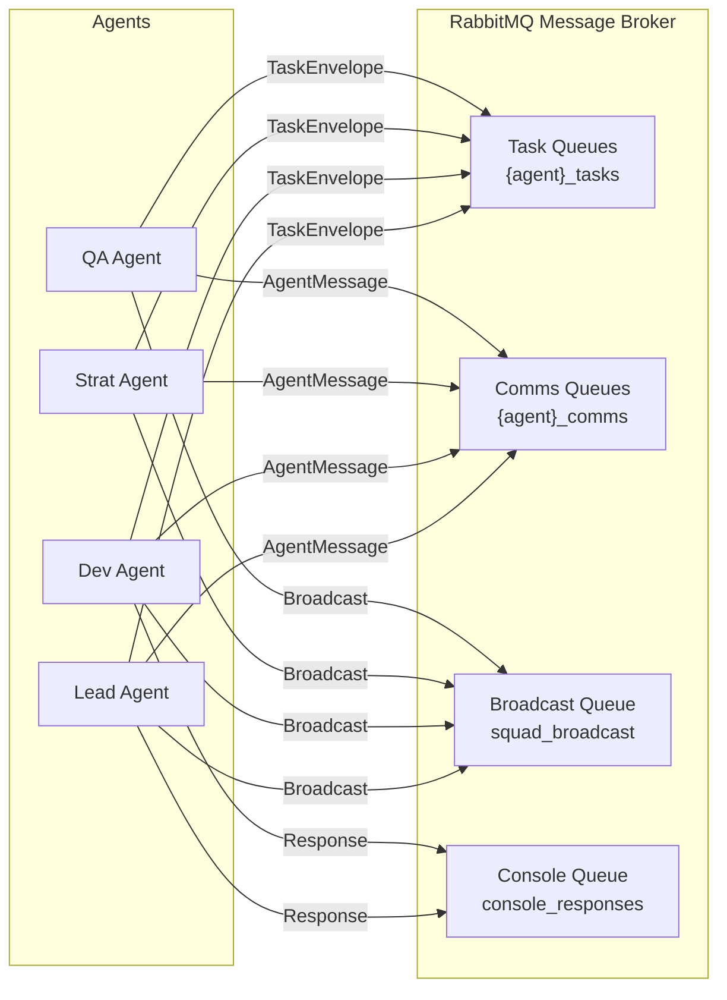
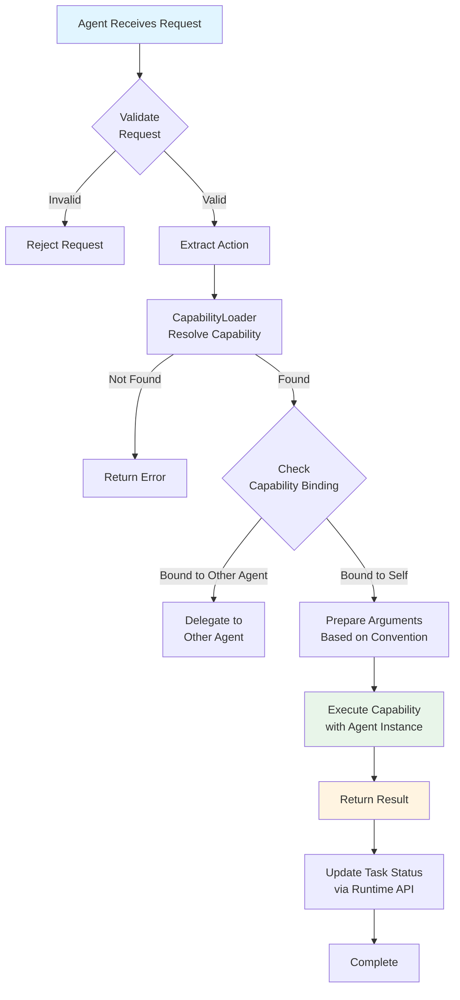

# Communication Flow

This diagram shows how agents communicate, how tasks are routed, and how capabilities are invoked.

## Queue Architecture

## Capability Invocation Flow

## Message Types

### TaskEnvelope
- **Format**: JSON serialized ACI TaskEnvelope
- **Queue**: `{agent_id}_tasks`
- **Purpose**: Task execution requests
- **Fields**: task_id, agent_id, cycle_id, task_type, inputs, lineage fields

### AgentMessage
- **Format**: JSON serialized AgentMessage dataclass
- **Queue**: `{agent_id}_comms` or `squad_broadcast`
- **Purpose**: Inter-agent communication
- **Fields**: sender, recipient, message_type, payload, context, timestamp, message_id

### AgentRequest
- **Format**: JSON with action, payload, metadata
- **Queue**: `{agent_id}_comms`
- **Purpose**: Capability invocation requests
- **Fields**: action (capability name), payload, metadata (pid, cycle_id, etc.)

## Routing Rules

1. **Task Routing**:
   - TaskEnvelope routed to `{agent_id}_tasks` queue
   - Agent processes from its own task queue
   - TaskResult returned via same mechanism

2. **Capability Routing**:
   - Capability name resolved via `CapabilityLoader`
   - Binding checked in `capability_bindings.yaml`
   - If bound to different agent, task delegated
   - If bound to self, capability executed directly

3. **Message Routing**:
   - Direct messages: `{recipient}_comms` queue
   - Broadcast messages: `squad_broadcast` queue
   - Console responses: `console_responses` queue

4. **Console Chat Routing**:
   - Gateway sends to `{agent_name}_comms` queue
   - Agent processes via `comms.chat` capability
   - Response sent to `console_responses` queue
   - Gateway matches response via correlation_id

