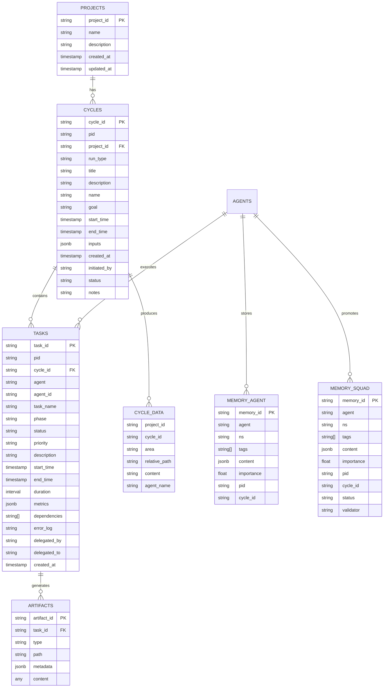

# Data Model

This diagram shows the data structures, storage systems, and relationships in SquadOps.



## Storage Systems

### Database Schema (PostgreSQL)

#### Projects Table
- Root entity for all projects
- Each project can have multiple execution cycles
- Referenced by cycles via `project_id`

#### Cycle Table
- Represents an execution cycle (formerly ECID)
- Contains cycle metadata: name, goal, start_time, end_time
- Stores inputs as JSONB (PIDs, repo, branch)
- Links to project via `project_id`

#### Agent Task Log Table
- Records all tasks executed by agents
- Tracks task lifecycle: status, start_time, end_time, duration
- Stores metrics as JSONB
- Links to cycle via `cycle_id`
- Supports task delegation (delegated_by, delegated_to)

### CycleDataStore (File System)

Structure: `cycle_data/<project_id>/<cycle_id>/`

Areas:
- **meta**: Cycle metadata and configuration
- **shared**: Shared artifacts across agents
- **agents**: Agent-specific artifacts (`agents/<agent_name>/`)
- **artifacts**: Build outputs, manifests, etc.
- **tests**: Test reports and results
- **telemetry**: Event streams (JSONL format)

Example:
```
cycle_data/
  warmboot_selftest/
    EC-2025-11-27-0001/
      meta/
        cycle_info.json
      shared/
        prd.md
      agents/
        max/
          task_log.json
        neo/
          build_plan.json
      artifacts/
        app.tar.gz
        manifest.json
      tests/
        test_report.json
      telemetry/
        max.jsonl
        neo.jsonl
```

### Memory System

#### Agent-Level Memory (LanceDB)
- Stored per-agent in LanceDB
- Namespace: `role`
- Used for agent-specific memories
- Accessed via `LanceDBAdapter`

#### Squad Memory Pool (PostgreSQL)
- Shared across all agents
- Namespace: `squad`
- Promoted from agent-level memory
- Requires validation before promotion
- Accessed via `SqlAdapter`

### Task Models

#### TaskEnvelope (ACI Contract)
- Standardized task format for agent execution
- Contains lineage fields: project_id, cycle_id, pulse_id, correlation_id, causation_id, trace_id, span_id
- Immutable identity fields
- Required fields: task_id, agent_id, cycle_id, task_type, inputs

#### TaskResult
- Terminal result from agent execution
- Status: SUCCEEDED, FAILED, or CANCELED
- Contains outputs (on success) or error (on failure)

#### Task
- Full task model matching database schema
- Includes lifecycle timestamps and metrics
- Supports dependencies and delegation

### Relationships

1. **Project → Cycle**: One-to-many
   - Each project can have multiple execution cycles
   - Cycles are identified by unique `cycle_id`

2. **Cycle → Task**: One-to-many
   - Each cycle contains multiple tasks
   - Tasks are scoped to a cycle

3. **Task → Artifact**: One-to-many
   - Each task can produce multiple artifacts
   - Artifacts are stored in CycleDataStore

4. **Agent → Memory**: One-to-many
   - Agents store memories in both agent-level and squad-level storage
   - Memories are tagged with cycle_id and pid for traceability

5. **Cycle → CycleData**: One-to-many
   - Each cycle produces artifacts in CycleDataStore
   - Organized by area and agent name


