# System Overview

This diagram provides a high-level view of the SquadOps architecture, showing infrastructure components, agent containers, and execution flow.

```mermaid
graph TB
    subgraph Infrastructure["Infrastructure Layer"]
        RabbitMQ[RabbitMQ<br/>Message Broker]
        Postgres[PostgreSQL<br/>Database]
        Redis[Redis<br/>Cache]
        RuntimeAPI[Runtime API<br/>Task Management]
        HealthCheck[Health Check<br/>Agent Gateway]
        Observability[Observability<br/>Telemetry & Metrics]
    end

    subgraph AgentContainers["Agent Containers"]
        LeadContainer[Lead Agent Container<br/>Max]
        DevContainer[Dev Agent Container<br/>Neo]
        StratContainer[Strat Agent Container<br/>Nat]
        QAContainer[QA Agent Container<br/>Eve]
        DataContainer[Data Agent Container<br/>Data]
    end

    subgraph ExecutionFlow["Execution Flow"]
        Project[Project]
        Cycle[Execution Cycle]
        Pulse[Pulse]
        Task[Task]
    end

    subgraph Storage["Storage Systems"]
        CycleData[CycleDataStore<br/>File System]
        MemoryAgent[Agent Memory<br/>LanceDB]
        MemorySquad[Squad Memory<br/>PostgreSQL]
    end

    subgraph External["External Interfaces"]
        Console[Console/Gateway]
        TelemetryBackend[Telemetry Backend<br/>OpenTelemetry/AWS/Azure]
    end

    LeadContainer <--> RabbitMQ
    DevContainer <--> RabbitMQ
    StratContainer <--> RabbitMQ
    QAContainer <--> RabbitMQ
    DataContainer <--> RabbitMQ

    LeadContainer <--> Postgres
    DevContainer <--> Postgres
    StratContainer <--> Postgres
    QAContainer <--> Postgres
    DataContainer <--> Postgres

    LeadContainer <--> Redis
    DevContainer <--> Redis
    StratContainer <--> Redis
    QAContainer <--> Redis
    DataContainer <--> Redis

    LeadContainer <--> RuntimeAPI
    DevContainer <--> RuntimeAPI
    StratContainer <--> RuntimeAPI
    QAContainer <--> RuntimeAPI
    DataContainer <--> RuntimeAPI

    LeadContainer <--> HealthCheck
    DevContainer <--> HealthCheck
    QAContainer <--> HealthCheck
    StratContainer <--> HealthCheck
    DataContainer <--> HealthCheck

    LeadContainer --> Observability
    DevContainer --> Observability
    StratContainer --> Observability
    QAContainer --> Observability
    DataContainer --> Observability

    Console <--> HealthCheck
    HealthCheck <--> RabbitMQ

    Observability --> TelemetryBackend

    Project --> Cycle
    Cycle --> Pulse
    Pulse --> Task

    Task --> CycleData
    Cycle --> CycleData
    LeadContainer --> MemoryAgent
    DevContainer --> MemoryAgent
    StratContainer --> MemoryAgent
    QAContainer --> MemoryAgent
    DataContainer --> MemoryAgent

    MemoryAgent --> MemorySquad

    style Infrastructure fill:#e1f5ff
    style AgentContainers fill:#fff4e1
    style ExecutionFlow fill:#e8f5e9
    style Storage fill:#f3e5f5
    style External fill:#fce4ec
```

## Infrastructure Components

### RabbitMQ
- **Purpose**: Asynchronous message broker for inter-agent communication
- **Queues**: Task queues, comms queues, broadcast queue
- **Usage**: Task routing, capability invocation, inter-agent messaging

### PostgreSQL
- **Purpose**: Persistent storage for projects, cycles, tasks, and squad memory
- **Tables**: projects, cycle, agent_task_log, squad_memory
- **Usage**: Task logging, cycle management, memory promotion

### Redis
- **Purpose**: Caching and coordination
- **Usage**: Session management, temporary state

### Runtime API
- **Purpose**: RESTful API for task and cycle management
- **Endpoints**: `/api/v1/tasks/*`, `/api/v1/execution-cycles/*`
- **Usage**: Task status updates, cycle creation, task logging

### Health Check
- **Purpose**: Agent health monitoring and console gateway
- **Features**: Agent status dashboard, console chat interface
- **Usage**: Agent discovery, health monitoring, interactive console

### Observability
- **Purpose**: Telemetry collection and metrics
- **Backends**: OpenTelemetry, AWS CloudWatch, Azure Monitor, GCP, Null
- **Usage**: Distributed tracing, metrics collection, logging

## Agent Containers

Each agent runs in its own container with:
- **BaseAgent**: Core agent functionality
- **Role Implementation**: Specific role (lead, dev, strat, etc.)
- **Capabilities**: Loaded dynamically based on role
- **Memory Providers**: LanceDB for agent memory, SQL for squad memory
- **LLM Client**: Configured LLM provider
- **Telemetry**: Platform-aware telemetry client

## Execution Flow

### Project → Cycle → Pulse → Task

1. **Project**: Long-lived unit of work (e.g., `warmboot_selftest`)
   - Registered in `projects` table
   - Can have multiple execution cycles

2. **Execution Cycle**: Single end-to-end attempt to move project forward
   - Identified by unique `cycle_id`
   - Contains metadata: name, goal, start_time, end_time, inputs
   - Stored in `cycle` table and `cycle_data/` directory

3. **Pulse**: Sub-cycle grouping of related tasks
   - Optional grouping mechanism
   - Can contain multiple tasks
   - Stored in PulseContext

4. **Task**: Individual unit of work
   - Executed by a single agent
   - Contains task_type, inputs, lineage fields
   - Stored in `agent_task_log` table

## Storage Systems

### CycleDataStore
- **Location**: `cycle_data/<project_id>/<cycle_id>/`
- **Structure**: Organized by areas (meta, shared, agents, artifacts, tests, telemetry)
- **Purpose**: Persistent storage of cycle artifacts and telemetry

### Agent Memory (LanceDB)
- **Location**: Per-agent LanceDB database
- **Namespace**: `role`
- **Purpose**: Agent-specific memories and context

### Squad Memory (PostgreSQL)
- **Location**: `squad_memory` table in PostgreSQL
- **Namespace**: `squad`
- **Purpose**: Shared memories promoted from agent-level

## External Interfaces

### Console/Gateway
- **Purpose**: Interactive interface for users
- **Features**: Chat with agents, view agent status, monitor cycles
- **Communication**: Via Health Check service and RabbitMQ

### Telemetry Backend
- **Purpose**: External observability platform
- **Options**: OpenTelemetry Collector, AWS CloudWatch, Azure Monitor, GCP
- **Data**: Traces, metrics, logs

