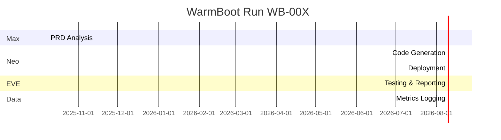

# 🧠 WarmBoot Run Report — v0.2 Template

**Run ID:** WB-00X  
**Framework Version:** v0.2.0  
**Date:** YYYY-MM-DD  
**Branch:** `warmboot/run-00X`  
**Commit Tag:** `v0.2-warmboot-00X`  
**Squad Configuration:** Max + Neo + EVE  
**Benchmark App:** HelloSquad (PID-001)

---

## 🚀 1. Run Overview

| Category | Description |
|-----------|-------------|
| **Objective** | Define purpose of this WarmBoot (e.g., testing full PRD → code → test → deploy cycle) |
| **Agents Active** | Max, Neo, EVE |
| **Infra Services** | RabbitMQ, PostgreSQL, Redis, Prefect, FastAPI Health |
| **Duration** | HH:MM:SS |
| **Artifacts Produced** | `/docs/`, `/testing/`, `/data/`, `/warmboot_runs/WB-00X/` |
| **Outcome** | ✅ Successful / ⚠️ Partial / ❌ Failed |

---

## 🧩 2. Process Traceability (PID-001)

| Artifact | Filename | Linked Protocol |
|-----------|-----------|----------------|
| Business Process | `BP-001-HelloSquad.md` | Traceability v1.1 |
| Use Case | `UC-001-HelloWorld.md` | Traceability v1.1 |
| Test Plan | `TP-001-HelloSquad.md` | Testing v1.1 |
| QA Checklist | `QA-001-HelloSquad.md` | Testing v1.1 |
| KDE Registry Entry | `/data/kde_registry.md` | Data Governance v1.0 |
| Tagging Spec | `/analytics/tagging_spec.md` | Tagging Protocol v1.0 |
| Metrics Map | `/metrics/metrics_map.md` | Data Governance v1.0 |

---

## 🧠 3. Agent Task Summary

| Agent | Task | PID | Start | End | Duration | Status | Artifacts |
|--------|------|-----|--------|------|-----------|----------|------------|
| Max | Analyze PRD | 001 | 09:00 | 09:10 | 10m | ✅ Completed | `prd_analysis_log.md` |
| Neo | Generate App | 001 | 09:10 | 09:40 | 30m | ✅ Completed | `hello_app/` |
| EVE | Run Tests | 001 | 09:40 | 09:55 | ✅ Completed | `pytest_results.xml` |
| Data | Log Metrics | 001 | 09:55 | 10:00 | ✅ Completed | `agent_task_logs.json` |

> _Data collected via Task Logging Protocol — stored in `agent_task_logs` table and visualized as Gantt._

---

## 📊 4. Gantt Visualization (Mermaid Snippet)

---

## 🧪 5. Testing Artifacts (EVE)

| Artifact | Description | Tool | Status |
|-----------|-------------|------|--------|
| `TP-001-HelloSquad.md` | Test Plan | Markdown | ✅ |
| `TC-001-HelloSquad.md` | Test Cases | Pytest | ✅ |
| `TCR-001-HelloSquad.md` | Coverage Report | Coverage.py | ✅ |
| `SEC-001-HelloSquad.md` | Security Testing | OWASP ZAP | ✅ |
| `PERF-001-HelloSquad.md` | Performance Testing | k6 | ✅ |
| `PEN-001-HelloSquad.md` | Penetration Testing | Burp Suite, Nikto, Nmap | ⚙️ In Progress |
| `QA-001-HelloSquad.md` | QA Checklist | Manual | ✅ |

---

## 📈 6. Metrics & Performance

| Metric | Value | Source |
|--------|--------|--------|
| Total Tasks | 4 | Task Log |
| Avg Duration / Agent | 15m | Task Log |
| Build Success Rate | 100% | EVE Report |
| Test Coverage | 89% | Coverage.py |
| Vulnerabilities Found | 2 (Low) | OWASP ZAP |
| Memory Peak | 3.2GB | Prefect Telemetry |
| GPU Utilization | 22% | Agent Logs |

---

## 🔐 7. Data Governance Summary (Data Agent)

| KDE Name | Type | Sensitivity | Linked KPI | Retention |
|-----------|------|--------------|-------------|------------|
| user_id | UUID | PII | Login Success Rate | 180 days |
| message_latency | Float | Low | Agent Response Time | 90 days |

> _See `/data/kde_registry.md` and `/metrics/metrics_map.md` for lineage details._

---

## 🩺 8. Health Check Snapshot

| Component | Status | Version | Notes |
|------------|---------|----------|--------|
| RabbitMQ | ✅ | 3.12.11 | 0 queued |
| PostgreSQL | ✅ | 15.3 | 85% disk used |
| Redis | ✅ | 7.2 | Cache healthy |
| Prefect | ✅ | 2.16.5 | Flow succeeded |
| Max Agent | ✅ | v1.0.0 | Responsive |
| Neo Agent | ✅ | v1.0.0 | Idle |
| EVE Agent | ✅ | v1.0.0 | Testing complete |

---

## 🧩 9. Governance & Compliance Review

| Check | Responsible | Status |
|--------|--------------|--------|
| PID mapped to all artifacts | Max | ✅ |
| KDEs classified | Data | ✅ |
| Security reports validated | EVE | ✅ |
| Pen Testing remediation logged | Max | ⚙️ In Progress |
| Documentation committed | Nat | ✅ |
| Branch tagged `v0.2-warmboot-00X` | Max | ✅ |

---

## 💡 10. Observations & Optimization Signals

| Category | Observation | Action |
|-----------|--------------|--------|
| Build Time | Code gen step taking 30m | Split build/deploy logic |
| Test Coverage | High but missing API edge case | Add TC-002 |
| Docker Disk | Usage 85% | Implement cleanup step |
| EVE Parallelization | Sequential tests | Introduce async pytest |
| Governance | Manual checklists | Automate validation pipeline |

---

## 🧮 11. WarmBoot Scorecard (Auto-Generated)

| Dimension | Weight | Score | Weighted |
|------------|--------|--------|-----------|
| Code Quality | 0.25 | 9/10 | 2.25 |
| Test Coverage | 0.25 | 8.9/10 | 2.23 |
| Security | 0.15 | 7/10 | 1.05 |
| Governance | 0.15 | 8/10 | 1.20 |
| Performance | 0.10 | 8/10 | 0.80 |
| Observability | 0.10 | 9/10 | 0.90 |
| **Total Score** | 1.00 | — | **8.43 / 10** |

---

## 🧠 12. Lessons Learned & Next Optimization

- Introduce checkpoint-based logging per Comms & Concurrency Protocol.  
- Implement Secrets Vault for production deployments.  
- Prepare EVE for penetration test automation.  
- Prepare Data for metrics visualization dashboard.  

---

> **Summary:**  
> WarmBoot Run `WB-00X` achieved full PRD → Code → Test → Deploy cycle with measurable outputs. The next iteration (v0.2.1) should emphasize parallel task execution, full test automation, and security remediation integration.
