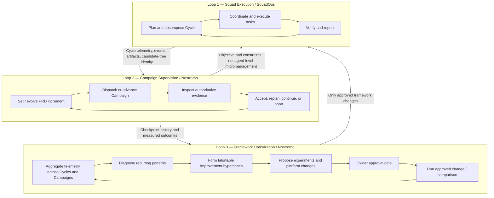

# IDEA — Nostromo as the SquadOps Framework Optimization Crew

> **Recorded 2026-10-01** as the owner wrote it. It is an input to `docs/plans/2-0-0-plan.md` and to the
> Campaign SIP's revision (`sips/proposed/SIP-Campaign-Orchestration.md`, rev 2), which record how 2.0
> adopts it. The owner's rulings of the same day amend it:
> - **Loop 2 does not choose the increment.** The strategy role proposes each increment, on a short
>   leash: the crew approves, amends or rejects every proposal at the checkpoint, and watches how
>   increments are proposed and implemented, so it can recommend improvements to the feature-writing step.
> - **The continuation policy stays in SquadOps.** The crew holds the escalation queue and an abort.
> - **The crew may run local inference on the Spark between squad cycles and between campaigns,** never
>   while the squad runs a cycle. That is the crew operating model's §36, as written.
> - **The ship's recorder is deterministic code**, which may run during a cycle.
> - **The crew is commissioned on 2.0's pre-campaign work.**
> - **Every proposal predicts a mechanism**, not only a rate.
> - **The calibration cycle (#1709) is Loop 3's baseline.**

**Status:** IDEA / proposed experiment charter
**Date:** 2026-10-01
**Initial proving ground:** SquadOps 2.0 Campaign Evolution-001 (Group Run)
**Owner / approval authority:** Jason
**Operating organizations:** Nostromo (external supervisor, investigator, builder) and SquadOps (execution platform under study)

---

## 1. Executive idea

Evolve Nostromo beyond an implementation and defect-triage crew into an **empirical optimization organization for SquadOps**. SquadOps executes work; Nostromo observes *how* that work is performed, discovers framework defects and limitations, formulates improvement hypotheses, proposes controlled experiments, and—only after owner approval—implements and validates framework changes.

The first proving ground is iterative enhancement of the existing **Group Run** application through a SquadOps 2.0 Campaign. Group Run is the experimental fixture, **not** the primary product of this exercise. The highest-priority outcome is a measurably improved SquadOps framework.

### Dual outcomes, explicitly prioritized

1. **Primary — SquadOps framework improvement:** reliable Campaign progression, better coordination, meaningful verification, lower operational friction, stronger autonomy, and evidenced improvements after platform changes.
2. **Secondary — application delivery improvement:** better speed, cost, and quality in successive *accepted* increments to Group Run.

The crew's value is not the volume of issues filed. It is whether those issues and proposed experiments lead to reproducible, useful framework improvements.

## 2. Three nested operating loops

**Operating cadence:** Loop 1 acts within Cycles; Loop 2 acts at Campaign checkpoints; Loop 3 examines trends across one or more Cycles/Campaigns and evaluates whether a *framework-level* intervention is warranted. Loops are distinct even if the same Nostromo crew supports Loops 2 and 3.

## 3. First experiment: Campaign Evolution-001

Use the existing Group Run PRD as a baseline. Add bounded, additive feature increments to the same codebase over successive Cycles in a single Campaign.

Illustrative sequence (the crew may adjust the feature selection within an approved envelope):

| Stage | SquadOps activity | Nostromo activity |
|---|---|---|
| Baseline | Execute Group Run base PRD | Observe existing behavior and establish reference metrics |
| Cycle 1 checkpoint | Submit candidate tree, run reports, verification evidence | Independently inspect outcome, classify defects, authorize next PRD increment |
| Cycle 2 | Extend accepted app with a new feature | Check continuity, handoffs, cost, quality, and previously accepted behavior |
| Cycle 3 | Add another increment or repair a documented defect | Check integrated behavior and ability to absorb external feedback |
| Campaign close | Produce complete Campaign ledger | Consolidate framework findings, improvement hypotheses, and morning approval report |

**Critical principle:** A broken Group Run feature is not automatically a SquadOps platform defect. Nostromo must determine whether it is an ordinary implementation bug, a missing framework capability, a coordination failure, a verification escape, or an observability gap.

## 4. Measurement model

### A. Product iron triangle — necessary, but secondary

Measure against **accepted functionality**, not merely commits, lines of code, task completions, or tests passing.

| Dimension | Suggested measurements |
|---|---|
| Speed | Elapsed Cycle time; time to accepted PRD increment; execution versus waiting time; repair/rework duration |
| Cost | Tokens by agent/phase/model; API spend; compute utilization; cost per accepted feature; replay/repair overhead |
| Quality | Independently accepted requirements; defects found and escaped; regression rate; integration correctness; severity-adjusted repair burden |

Record feature scope and complexity so one Cycle is not labeled an improvement simply because its task was easier. Preserve budgets, tools, model configuration, and baselines for comparisons where feasible.

### B. Framework improvement — primary scorecard

| Area | Questions to investigate |
|---|---|
| Platform defects | What reproducible failures prevent successful Campaign execution? |
| Missing capability | What control-plane, orchestration, memory, or tooling affordance is absent? |
| Coordination | Where are handoffs, task assignments, work duplication, or dependency management inefficient? |
| Autonomy | How many interventions are required and why? |
| Observability | Can Nostromo explain the current state, prior decisions, blockers, and failures using the available evidence? |
| Recovery | Can runs/Cycles be cancelled, isolated, inspected, and replayed safely? |
| Continuity | Does the next Cycle inherit accepted code, PRD revisions, constraints, and evidence without rediscovery? |
| Improvement validation | Does an approved platform modification demonstrably improve subsequent comparable execution? |

**North-star research question:** Does each iteration of SquadOps reduce human effort, elapsed time, and compute cost to deliver verified product increments *without degrading quality*?

Do not collapse these dimensions into an opaque composite score. Report trade-offs openly.

## 5. Telemetry Nostromo needs

Nostromo requires authenticated, role-appropriate CLI/API access to operate and observe the platform. A lightweight bridge over existing SquadOps application services is acceptable for the first test; avoid an independent shadow control plane.

### Required controls

- Create, start, inspect, advance, stop, and abort authorized Campaigns.
- Inspect task graphs, agent activity, blockers, Cycle/run states, and progress.
- Pause/cancel stalled runs and Cycles according to documented lifecycle transitions.
- Invoke evidence replay and **isolated** execution replay with a fresh run identity.
- Obtain WorkloadRunReport, verifier output, logs, events, and precise candidate-tree references.
- Submit an approved PRD revision or checkpoint decision for the next Cycle.

### Required measurements and provenance

Capture: Campaign ID, Cycle ID, run ID, task ID, agent/model identity, PRD revision, candidate-tree SHA, accepted-tree SHA, timestamped state changes, task handoffs, tool invocations, resource waits, retry/repair attempts, verification outcomes, token/compute consumption, cancellation/replay events, and external supervisory actions.

Mother's ship's recorder should correlate **both loops** into a unified timeline. An event stream provides timely notification; authoritative API snapshots and historical queries remain necessary after reconnection or missed events. Keep low-level telemetry separate from meaningful coordination messages.

Every control operation must have actor, authorization context, target, reason, correlation/idempotency key, outcome, and audit trail. A replay must not overwrite accepted Campaign state or repeat external side effects without authorization.

## 6. Nostromo optimization mandate and division of responsibilities

| Crew | Optimization responsibility |
|---|---|
| **Mother** | Operate approved controls; collect, normalize, correlate, and preserve telemetry; produce the ship's recorder |
| **Ash** | Mine trends, research alternative techniques, develop falsifiable hypotheses |
| **Dallas** | Adversarially challenge causal interpretations; seek counterexamples and confounders; differentiate facts from speculation |
| **Parker** | Assess implementation feasibility, dependencies, architecture impact, and remediation options |
| **Brett** | Reproduce defects, independently inspect evidence, design validation and regression experiments |
| **Ripley** | Own the Campaign/optimization charter; consolidate recommendations; decide within delegated operating authority; request owner approval |

Nostromo may select bounded Group Run PRD increments, inspect/replay/cancel authorized experiments, and create evidence-backed GitHub issues. It may **not** silently modify or merge the SquadOps framework, extend budget/scope, or promote an architectural change without owner approval.

## 7. Turning telemetry into hypotheses

The crew should proactively look for recurring behaviors, not just explicit error messages.

| Illustrative observation (not an actual measured result) | Framework hypothesis worth testing |
|---|---|
| High proportion of time waiting for handoffs | Scheduling/delegation creates avoidable idle time |
| Builder repeatedly needs repair attempts | Emission or accepted-patch contracts need refinement |
| QA consumes substantial tokens but finds few meaningful faults | Risk-targeted verification could improve value per token |
| Cycle N+1 re-discovers decisions from Cycle N | Campaign ledger/handoff context is insufficient |
| Multiple agents stall on Spark inference | Shared-model request scheduling, not role design, is the bottleneck |
| CLI state and event stream disagree | Lifecycle transitions or observational consistency require attention |

Treat observations, causal hypotheses, and experimentally validated effects as **different epistemic statuses**.

### Required optimization proposal schema

Every proposed improvement should include:

1. **Observed evidence:** affected Campaign/Cycle/run IDs, exact artifacts, timestamps, and reproducibility.
2. **Problem and scope:** defect, missing capability, or optimization opportunity; platform versus application attribution.
3. **Hypothesis:** what mechanism is thought to create the observed cost, delay, or quality issue.
4. **Proposed change:** smallest practical framework change, implementation scope, and alternatives considered.
5. **Prediction:** measurable expected effect, expressed *before* running the experiment.
6. **Experimental design:** comparison/baseline, controlled conditions, repetitions, and acceptance/rejection criteria.
7. **Risk:** possible regressions, quality trade-offs, and rollback path.
8. **Decision requested:** investigate further, approve experiment, approve implementation, defer, or reject.

Example:

> **Hypothesis:** Replacing indiscriminate QA test generation with risk-targeted verification reduces QA tokens by 25% without reducing independent defect detection.
> **Test:** Run comparable Group Run increments against the current and candidate verification approaches, with held-out defects/requirements and tracked repair burden.
> **Decision:** Adopt only if cost improvement is reproducible and quality does not regress under the stated acceptance checks.

The numbers above are illustrative experimental predictions, **not observed claims**.

## 8. Improvement workflow and approval boundary

1. **Exercise:** Nostromo dispatches a bounded Group Run Campaign; SquadOps executes.
2. **Observe:** Collect iron-triangle and platform telemetry at each Cycle checkpoint.
3. **Diagnose:** Reproduce suspicious behavior, inspect logs/evidence, check for existing GitHub issues, identify confounders.
4. **Propose:** Open a clear defect/enhancement issue and prepare a falsifiable optimization proposal; Dallas challenges it.
5. **Owner approval:** Jason selects what Nostromo may investigate, experiment with, implement, or defer.
6. **Implement:** Nostromo executes only approved changes through its normal development/review workflow.
7. **Validate:** Repeat a comparable scenario against a preserved baseline; report observed benefit or failure of the hypothesis.
8. **Retain learning:** Record results so later Campaigns can test whether the improvement generalizes.

If a critical platform failure makes further execution uninformative, stop and preserve evidence rather than burn the night's budget encountering the same failure.

## 9. Morning deliverable: Nostromo Framework Improvement Report

Provide a concise owner-facing report with linked evidence and GitHub issues:

1. **Executive finding:** Did the experiment uncover an actionable platform limitation or improvement?
2. **Group Run delivery:** accepted PRD increments; speed, cost, quality; regressions and remaining defects.
3. **Campaign health:** Cycles completed, retries, cancellations, replay attempts, interventions and continuity problems.
4. **Platform defects:** reproducibility, severity, observed versus expected, links to artifact/run/tree and GitHub issue.
5. **Enhancements and optimization opportunities:** evidence, hypotheses, implementation options, predicted effects.
6. **Approval requests:** concise specific decisions, impact, risk, experiment budget, and proposed order.
7. **Next-night plan:** what can safely continue if proposals are approved, and which blockers require resolution first.

**Sample owner-facing sentence:** “Across six Campaign Cycles, we observed three recurring coordination inefficiencies. Two framework experiments are proposed, with expected impacts and falsifiable comparisons attached. Approval requested; no framework modifications have been applied.” This is an example of the desired style, not a statement of actual findings.

## 10. Initial acceptance criteria

The 2.0 shakeout is useful if it establishes all of the following:

- Nostromo operates an authorized Group Run Campaign without manual copying of context between organizations.
- SquadOps advances the **same** application through at least two additive PRD increments and preserves previously accepted behavior.
- Nostromo can independently retrieve authoritative state, logs, candidate-tree identity, acceptance evidence, and telemetry for each Cycle.
- A deliberately stalled test run can be cancelled cleanly; an isolated Cycle replay can be requested without modifying the accepted Campaign state.
- Nostromo detects and correctly classifies at least one meaningful framework defect, missing capability, **or** evidence-backed optimization opportunity (do not invent findings to satisfy this criterion).
- A corresponding reproducible issue or research proposal and morning report are submitted for owner decision.
- For any subsequently approved framework improvement, Nostromo conducts a controlled validation and reports the actual effect—even if the prediction fails.

The first night need not show that SquadOps has already improved. It must establish an honest, repeatable **method for discovering and validating improvement**.

## 11. Phased rollout

**Phase A — 2.0 / instrumentation and first shakeout:** Group Run Campaign; minimum API/CLI permissions; event correlation; checkpoint reports; issue-raising authority; morning handoff. Use explicit Campaign ledgers and deterministic handoff, without waiting for full cross-Campaign memory.

**Phase B — repeated evidence and optimization:** Run several comparable Campaigns; build trend summaries; validate first owner-approved framework changes against saved baselines; capture both beneficial and negative results.

**Phase C — broader memory and transfer:** As cross-cycle/cross-Campaign memory matures, retain validated organizational lessons; test whether findings transfer to other projects and squad formations.

**Phase D — cross-domain generality:** Apply the same supervisory/optimization method to Minecraft embodied construction, Backspring reselling, and autonomous operations. Distinguish universal SquadOps improvements from domain-specific adapters and tricks.

## 12. Guiding principle

> **SquadOps performs the work. Nostromo studies how SquadOps performs the work, proposes evidence-backed improvements, and validates approved changes. Jason retains authority over the framework's evolution.**

The longer-term aspiration is not autonomous issue generation or autonomous code churn; it is an increasingly effective, independently observable agent organization whose improvements can be measured, challenged, and transferred between domains.
