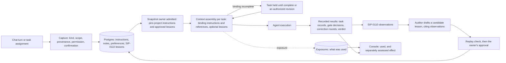

# SIP: Memory Entry Points

**Status:** Proposed (draft, revision 2, 2026-10-09)
**Target (proposed, for the owner's ruling, §8 Q25):**
- **2.3, stabilization:** the legacy agent store made dormant and its failures visible; chat's conversation history
  reaching the agent, with session ownership checked; the context-assembly port, inert. None of it changes what a task
  is given;
- **2.4, feature:** the two entry points, the typed records, the snapshot, comparison-arm and disclosure contracts, and
  the console view;
- **retirement:** the legacy store retired in **the stabilization release after its replacement ships and passes
  acceptance**: 2.5 if Q25 places the entry points in 2.4, 2.7 if in 2.6.
- **Nothing enters 2.2.** The 2.2 experiment's scope and its arms are unchanged (the owner, 2026-10-09).

**Revision 2 (2026-10-09): the owner's review of revision 1 (commit `107d23e`).** Seven specification gaps were
tightened without widening the scope:
1. a binding instruction is never silently omitted, and an incomplete binding context holds dispatch (§3.6);
2. "lessons disabled" is separate from "all memory context removed" (§3.7);
3. an instruction's work target is separate from its snapshot owner, and its reach into retries is stated (§3.7);
4. emergency withdrawal of a task instruction halts and restarts with corrected bindings (§3.8);
5. session ownership and provenance links are authorized (§3.3, §3.4);
6. the acceptance matrix and the interface no longer contradict the design (§3.2, §3.3, §3.6, §5);
7. dependencies and the retirement's placement are corrected (§6).

**Authors:** Jason Ladd (the direction and the review, 2026-10-09); Claude Code (this draft)
**Extends:** SIP-0110 Cross-Cycle Memory. **On acceptance this lands in SIP-0110** as a numbered amendment and ledger rows.
It is not a second memory SIP, and it adds no learning mechanism. SIP-0110 owns memory's scopes, lifecycle and payload
(`sips/PORTFOLIO.md` Q4). Its rules for lessons (evidence, the auditor's draft, the replay check, the owner's approval,
the pinned snapshot) are unchanged here.
**Supersedes (assumptions, not documents):** SIP-042's per-agent semantic store as the agents' memory; SIP-0021's
agent-specific memory patterns; SIP-0085 §10's per-agent semantic memory, its executor's contract P2-RC4 (memory is
best-effort) and its trigger-phrase capture (§4.2).
**Tracking:** epic #2173.

## Intake check

Checked against `sips/PORTFOLIO.md` on 2026-10-09, before this draft was recorded, and again for revision 2 (CLAUDE.md,
"SIP System"):

- **Overlaps:**
  - **SIP-0110 (accepted), all of it, by design.** This draft extends its substrate: the Postgres store beside the
    cycle registry (§0.8), the unit snapshot (§0.7), the exposure (§0.2) and the recall policy (§0.8). Boundary: lessons
    keep §0.4–§0.7 unchanged; the new record kinds are SIP-0110 payloads once accepted (Q4). Portfolio cluster 7.
  - **SIP-0085 Console Messaging (implemented).** It keeps chat's transport (console → runtime API → A2A) and its
    persistence (`chat_sessions`, `chat_messages`). Its memory design (§10) is superseded (§4.2). One of its stated
    behaviours, each turn built on the session's history (§4, §7, §9; the executor's contract P2-RC5), was never wired
    (#2175).
  - **SIP-0089 Agent Runtime State (implemented).** Its `Assignment` is a duty window (`squadops.runtime.models`), not a
    piece of project work. To avoid the collision, this draft calls the new record a **task instruction**, never an
    assignment. "Task assignment" below names the act of giving the squad work.
  - **SIP-0109 Campaign (accepted).**
    - Gate decisions, the plan gate's answers carried into the manifest (§24ad) and a returned proposal's note (§9.2)
      stay authoritative where they are. A task instruction is a new input beside them.
    - **Revision 2:** a task held for an incomplete binding context (§3.6), in a campaign, is surfaced through SIP-0109's
      escalation queue (#1708, §24bj) under the campaign's ruling bound, as a held gate is. SIP-0109 keeps the queue and
      its authority.
  - **SIP-0073, the model context registry.** It supplies the context window from which a task's total prompt budget is
    read (§3.6).
  - **SIP-0103 §5c.5, the operator-edit record (unplaced).** A change to the manifest goes through the manifest's own
    path, never through a memory record (§3.2).
  - **The Design Decision Register, #950.** Decision payloads live there. Memory references a decision; it never holds
    one (§3.2).
  - **Outcome Evaluation (proposed; its feature half heads 2.4 by Q1).** It supports application-quality claims: "memory
    improved the built application" needs its independent scenarios (§3.11). It is not required to deliver the entry
    points, and its own delivery is not blocked by them.
  - **The runtime-mode family and duty work (3.x by Q7 and Q8).** SIP-0110 §6 says duty and ambient callers reuse the
    recall policy. The context-assembly and capture interfaces here are what they would call. Nothing duty-related is built.
- **Conflicts (each waits for the owner's ruling, and both documents name it until then):**
  - **Q25, placement.** Q1 (ruled 2026-10-04) made 2.4 Outcome Evaluation's feature half. This draft proposes the entry
    points as a second 2.4 feature (§6).
  - **Q26, #2171.** As filed, #2171 restores the legacy store's embedding path. This draft recommends retiring that store
    instead, and moves #2171's live defect, the silent failure, to #2174 (§4.5).

The same findings are in the portfolio's queue and intake log.

## Delivery ledger (current as of 2026-10-09)

Proposed placements only. Nothing is placed until the owner rules on acceptance and Q25.

| part | status | where |
|---|---|---|
| the legacy agent store made dormant, its failures visible | **unplaced** | proposed 2.3; #2174 |
| chat's conversation history reaching the agent, with session ownership checked (SIP-0085 §4, §9; never wired) | **unplaced** | proposed 2.3; #2175 |
| the context-assembly port, inert, at the four seams | **unplaced** | proposed 2.3; #2176 |
| the typed records: notes, preferences, project and task instructions; permissions by kind | **unplaced** | proposed 2.4; #2177 |
| task instructions: the work target, retries, binding holds, emergency withdrawal | **unplaced** | proposed 2.4; #2178 |
| project instructions in the snapshot; the comparison arms; budgets and binding holds; disclosure | **unplaced** | proposed 2.4; #2179 |
| chat on the substrate: scoped context, capture with confirmation, chat exposures, project binding and provenance authorized | **unplaced** | proposed 2.4; #2180 |
| lesson inspection from chat; a conversational claim never becomes a lesson | **unplaced** | proposed 2.4; #2181 |
| the console's memory record view | **unplaced** | proposed 2.4; #2182 |
| the acceptance matrix, live on a deploy (§5) | **unplaced** | proposed 2.4; #2183 |
| the legacy store retired | **unplaced** | proposed: the stabilization release after #2180 ships and #2183 passes (2.5 if Q25 places the entry points in 2.4); #2184 |

**What closes this SIP:** acceptance, which moves these rows into SIP-0110's ledger. This document then closes, and
SIP-0110 closes with them shipped or dropped.

## 1. Summary

Today SquadOps has two memory paths that do not meet, and neither serves an operator.
- **Each agent has its own LanceDB store** (SIP-042). Only console chat uses it, and only one agent, joi, has chat
  enabled. On the deploy it cannot write a record (#2171), and every failure is logged at DEBUG.
- **SIP-0110's store is in Postgres.** It holds execution's observations and reviewed lessons, and supplies approved
  lessons to four authoring seams from a snapshot pinned per cycle or campaign.

An operator's instruction reaches a task only through the PRD, the request profile, or a gate. A "remember this" in chat
reaches nothing.

This draft makes **one substrate with typed records and two entry points**. Execution remains the design's driver.
- **Chat and task assignment both enter through one context-assembly step.** It retrieves only authorized, applicable
  records, from trusted scope.
- **Each record is captured with its kind, its scope and its provenance stated.**
- **A person's instruction is authoritative by its author's authority, not by evidence.**
  - It has its own lifecycle, and never passes through lesson validation.
  - It is binding: if it cannot be delivered whole, the task waits rather than running without it.
  - A conversational claim never becomes a lesson.
- **Learning stays SIP-0110's.** Execution produces observations. The auditor drafts a lesson from them. The owner
  approves it after a replay check, and it reaches later units through their pinned snapshots.
- **A lesson comparison varies only the lessons.** The same instructions reach both arms.
- **Every use is disclosed:** an exposure per task invocation, as now, and one per chat turn.

The legacy LanceDB store holds no record anywhere. This draft recommends making it dormant in 2.3, and retiring it in the
stabilization release after the new chat path ships and passes acceptance. A semantic index stays an optional retrieval
component, never the owner of a record.

## 2. What exists today (inventory, 2026-10-09, deploy `dep_34b4117e7ede`)

### 2.1 Two memory paths

| | the legacy agent store (SIP-042) | Cross-Cycle Memory (SIP-0110) |
|---|---|---|
| where | LanceDB, one directory per agent container (`/app/data/memory_db`), opened by every agent (`src/squadops/agents/entrypoint.py:476–481`) | Postgres, beside the cycle registry, behind `CrossCycleMemoryStorePort` (`src/squadops/ports/memory/cross_cycle.py`) |
| interface | `MemoryPort`: `store`, `search`, `get`, `delete` (`src/squadops/ports/memory/store.py`) | `FailurePatternRecallPort.recall` and `.disclose` (`src/squadops/ports/memory/recall.py`), and the store's records |
| written by | console chat, on a trigger phrase (`adapters/comms/chat_executor.py:39`, `:315`) | three projections from execution (§0.3); the auditor's drafts; the owner's approvals |
| read by | console chat, every message (`chat_executor.py:171`) | the plan composer and the correction runner, at four seams (§0.9) |
| who can reach it | only an agent with `a2a_messaging_enabled`, which only joi has (`entrypoint.py:559`; `agents/instances/instances.yaml:97`) | every cycle and campaign, through its pinned snapshot |
| records on the deploy | **none.** Eight stores: seven empty directories, and joi's one empty `memories` table (LanceDB version 1, created and never written) | observations 88, authoring envelopes 201, snapshots 14, revisions 1, approvals 0, exposures 174, assessments 0 |
| does a write work | **no** (#2171): the embedder is built at `localhost:11434` (`adapters/embeddings/factory.py:21`), and its model, `nomic-embed-text`, is not installed | yes |
| failures | logged at DEBUG and swallowed (`chat_executor.py:179`, `:318`) | five distinct recall outcomes; a failure marks the measurement invalid (§0.8) |
| survives recreation | yes, since #2112 (2026-10-09): eight named volumes | yes: Postgres |

### 2.2 The chat path, end to end

1. The console posts to `POST /api/v1/chat/{agent_id}` (`src/squadops/api/routes/chat/routes.py:108`). The route refuses
   an agent without messaging enabled, so in practice joi.
2. The route stores the session and the user's message in Postgres (`chat_sessions`, `chat_messages`,
   `infra/migrations/006_chat_tables.sql`), with a best-effort Redis copy. **A session has an agent and a user, and no
   project.**
3. It forwards **only the current message** to the agent over A2A (`routes.py:177–179`). `_load_history` (`:290`) is
   defined and never called. So the agent sees no earlier turn, against SIP-0085 §4, §7 and §9 and the executor's own
   contract P2-RC5 ("history comes from the proxy", `adapters/comms/chat_executor.py:10`).
4. Joi's `ChatAgentExecutor` builds a system prompt from its role, adds up to five LanceDB results (none exist), and
   streams the answer. If the message contains "remember this", "note that", "save this" or "store this", it tries to
   store the exchange. On this deploy that store fails, at DEBUG.
5. The route stores the answer.

**Data on the deploy:** two chat sessions with `comms-agent` (joi's former id), both on 2026-03-16, six messages, three of
them the user's, none with a trigger phrase.

### 2.3 How an operator's instruction reaches a task today

| the operator says it through | it reaches |
|---|---|
| the PRD and the request profile (`--request-profile`, `--set`) | every task, as the cycle's inputs |
| `squadops cycles create --notes` | no task. It is stored on the cycle and read only by the benchmark registry (`launched_counted_roll`) |
| a plan-gate ruling's notes | a refinement artifact; a returned design's `supervisor_note`; and, for an open manifest question, the manifest's decision (SIP-0109 §24ad, `cycles/manifest_authoring.py`) |
| a returned proposal's note | the proposal's revision (SIP-0109 §9.2) |
| an increment approval's notes | **no prompt.** Observed in `cmp_45729166756f` on 2026-10-08: the ruling bound only the change request |
| chat | nothing |

The within-cycle rungs (a re-roll's rejection context, a repair's failure evidence, a retry's prior-cycle brief) are the
system's own, not the operator's.

### 2.4 What is authoritative, and where

| fact | its owner |
|---|---|
| the application's contract: entities, endpoints, decisions | the interface manifest (SIP-0103) and its bound contract |
| a gate's decision and its reasons | `cycle_gate_decisions` (SIP-0064, SIP-0067) |
| a correction round and its failure | `run_loop_summaries` (SIP-0086) |
| a campaign's rulings | the campaign control log (SIP-0109) |
| a task, its inputs and its output | the task records and the artifact vault |
| a design decision's payload | the Design Decision Register, #950 |

SIP-0110 §11 already refuses memories of facts about the application under build. This draft keeps that rule for every
kind (§3.2).

### 2.5 What exists, what is extended, what is new

| | parts |
|---|---|
| **exists, reused as is** | the Postgres store and its port; lessons: draft, freeze, replay check, approval, revocation; the unit snapshot; exposures and authoring envelopes; the recall policy and its re-dispatch supply (`supply_the_redispatch`); the lessons API and CLI with `memory:read`, `memory:draft` and `memory:approve`; chat's transport and persistence; the gates' notes and §24ad; SIP-0109's escalation queue; the app-build indicators |
| **extended** | `RecallQuery` and `Exposure`, which assume a cycle or campaign (`memory/recall.py`; `memory/exposures.py:36–38`), gain a consumer type with no cycle and an explicit unbound case (§3.6); the snapshot pins project instructions beside lessons (§3.7); SIP-0110's "memory disabled" becomes `lessons: disabled`, with the broader removal named apart (§3.7); an exposure records every section supplied; chat's resume and reads check the session's owner and agent; a chat session gains its project, validated server-side; the chat route passes history and the assembled context; the lessons API serves chat's inspection |
| **new** | notes, preferences, project instructions and task instructions, each with its own lifecycle and permission; binding holds; capture with confirmation; the task-assignment entry point; a chat exposure per turn; the console's memory record view; the legacy store's retirement |

## 3. The design

### 3.1 Principles

1. **Execution is the driver.** Every kind is judged by what it does for coordination, task completion and build quality.
   Chat is a way in, not a second system.
2. **One substrate, typed records.** Records share a store, a scope model, provenance and disclosure. They do not share a
   table, a lifecycle or a permission.
3. **Authority and evidence are different gates.** A person's instruction is in force because someone with the authority
   confirmed it. A lesson is in force because evidence, a replay check and the owner's approval support it. Neither
   passes through the other's gate.
4. **A binding input is complete, or the task waits.** Instructions and the references they require are never dropped to
   fit, and never skipped on a failure. Only optional context is omitted, and the omission is disclosed.
5. **References, not copies.** A record that is about an authoritative fact points at it.
6. **Scope is stated at capture and taken from trusted context.** It is never inferred from an agent's text, never taken
   from a client's claim, and never widened silently.
7. **What a task sees is fixed by its admitted inputs.** New records reach later units, never a running one, except as a
   recorded intervention.
8. **A comparison varies one thing.** A lesson comparison varies only the lessons.
9. **Every use is disclosed, and use is never read as benefit.**

### 3.2 Record kinds

| kind | what it is | created by | scopes | reaches a task | reaches chat | stored in |
|---|---|---|---|---|---|---|
| **conversation history** | a chat session's messages | the chat route | the session (its owner, agent and project, if bound) | never | its own session, for its owner | `chat_sessions`, `chat_messages` (exist; a session gains `project_id`) |
| **note** | something a person asked to keep: a fact about the work, a pointer, a reminder. A **suggestion** is a note marked as a claim about how work should be done | a person, through chat capture or the API | user-private, project | **never.** It becomes an instruction only by an explicit, confirmed conversion | yes, at once, to authorized chat turns in its scope | `memory_notes` (new) |
| **preference** | how a person wants to be worked with: format, detail, cadence | that person | user-private | never | the person's own chats | `memory_preferences` (new) |
| **project instruction** | a standing directive for the project's work, with an applicability (task types, roles, stacks) | drafted from chat or the API; **confirmed** with `memory:instruct` (§3.3) | project | yes: **binding**, pinned in its snapshot owner's snapshot at admission, in its own slot | yes, with its status | `memory_instructions` (new, `scope = project`) |
| **task instruction** | a directive for selected tasks of one cycle: "for this cycle's `qa.test`, cover capacity 1" | the person giving the work: at cycle creation, at a gate, from chat (confirmed), or through the API | task: a **target cycle** and a task selector within it (§3.7) | yes: **binding**, to the selected tasks of its target cycle only | yes, with its status | `memory_instructions` (new, `scope = task`) |
| **authoritative decision or state** | the manifest's decisions and contracts, gate decisions, task records, round records, the control log, decision records | their owners (§2.4) | theirs | as today, as inputs; and as a **required reference** of an instruction (§3.6) | by reference, read when the turn is answered | **not by memory.** A record may carry a reference such as `manifest:decision:<id>@<revision>`, never a copy |
| **observation** | an occurrence from execution (SIP-0110 §0.3) | the projections | project | never directly | inspectable | `memory_observations` (exists) |
| **lesson** | reviewed, approved guidance (SIP-0110 §0.2–§0.6) | the auditor drafts; the owner approves | project, with applicability | yes: **optional**, at its four seams, from the snapshot | **explained, never applied** (§3.5) | `memory_revisions`, `memory_approvals` (exist) |

**Why notes never reach a task.** SIP-0110 §6's quarantine rule: what may influence measured execution is governed by
status, not origin. A note has no author authority over the work and no evidence behind it. To reach a task, a person
confirms it as an instruction, with a scope and the permission that scope needs, and the conversion is recorded.

**What memory refuses.** A note or instruction that restates an authoritative fact is stored as a reference to it. One
that would change it (a renamed endpoint, a different entity) is refused at capture, with the owning change path named:
the manifest's operator edit (SIP-0103 §5c.5) or a decision record (#950). Contradiction cannot be detected
deterministically in general. So the confirming person is shown the applicable authoritative records beside the
instruction, and each slot states the precedence (§3.6).

### 3.3 Scopes and authorization

- **The scopes:** user-private; agent (persistent identity, SIP-0088/0089); task (a target cycle and a task selector);
  project. Organization scope stays deferred (SIP-0110 §0.14). Cycle and campaign remain provenance and snapshot owners,
  not scopes (SIP-0110 §7).
- **Scope comes from trusted context.** A task's project, target cycle and snapshot owner come from its envelope. A chat
  turn's project comes from its session's stored binding (below). An agent-supplied namespace is never read (SIP-0110
  §0.8 step 1).
- **Permissions, by kind and scope, the same through chat and through the API:**

  | record | to create, revise or withdraw | to read |
  |---|---|---|
  | a user-private note, a preference | the signed-in person, for themselves | that person, and chats they own |
  | a project note | `memory:note` (new) | `memory:read`, and chats bound to the project |
  | a project instruction | `memory:instruct` (new) | `memory:read`, and the tasks it applies to |
  | a task instruction | `cycles:write` for a standalone cycle; `campaigns:supervise` for a campaign's cycle | `memory:read`, and its target tasks |
  | a lesson | `memory:draft` and `memory:approve` (unchanged) | `memory:read` |

  - Chat capture checks the same permission for the kind and scope it would create. The confirmation card offers only
    the choices the person holds.
  - Until a project membership model exists (§8 Q27), `memory:note` and `memory:instruct` are held by the admins who
    hold `memory:approve`. Anyone can still keep user-private notes and preferences.
- **Session ownership: a session id is not authorization.**
  - Every resume of a session, every read of its messages and every assembly of its history checks that the session's
    owner is the authenticated user and that its agent is the agent requested.
  - A failed check is refused without saying whether the session exists.
  - This is part of the history fix (#2175), and does not wait for a membership model.
- **Project binding is server-side.**
  - A session is bound to a project when it opens. The server checks that the project exists and that the person holds
    `memory:read`.
  - Every turn reads the project from the stored session, never from the client.
  - A session opened without a project is **unbound** and sees only its owner's private records (§3.6).
- **The gap, stated:** SquadOps has no project membership model. "Authorized for the project" means a valid scope and a
  server-side project binding, not a per-project member list (§8 Q27).

### 3.4 Provenance

Every record carries:
- its kind, scope, project and status;
- its source, typed: a chat message (session and message ids), a gate decision, a cycle request, an API call, or a
  conversion from another record;
- its author (a person's id; an agent's id and model, when an agent proposed it), and who confirmed it;
- its revision, and the revision it supersedes;
- each status change, with who, when and why;
- any references to authoritative records, each with its revision, and whether each is required (§3.6).

The record is never the only copy of its source. A chat-captured note points at the message it came from.

**Following a provenance link is authorized like reading its target.** A project instruction converted from a private
chat shows its source to other readers as "converted from a private chat turn by <author>, <time>". Only the session's
owner can follow the link, and it opens that one turn, never the session's other turns. Sharing the instruction never
shares the conversation it came from.

### 3.5 The two entry points

**Chat.**
- **A session is bound to a project when it opens,** server-side (§3.3). An unbound session sees only its owner's private
  records.
- **Each turn is answered from assembled context** (§3.6). The context holds:
  - the session's history, after the ownership check;
  - the person's preferences;
  - the notes in scope;
  - the project instructions in force;
  - task instructions for the cycles the turn names;
  - references to authoritative records.

  Context is assembled in the runtime API, which owns the store and the recall policy (SIP-0110 §0.8). The agent renders
  it through a prompt fragment and owns no memory. A chat turn executes no work, so nothing in it is binding. A part of
  its context that fails is disclosed in the reply.
- **Capture is explicit and confirmed.** The trigger phrases go.
  - The person asks to keep something, by a console action or in words.
  - The agent proposes a structured capture: the text, the kind, the scope and, for a task instruction, the target
    cycle and the task selector.
  - The console shows it as a confirmation card, offering only the kinds and scopes the person's permissions allow
    (§3.3). Nothing is stored until the person confirms.
  - The reply says what was saved, its id, its scope, and when it takes effect. For example: "in force for cycles and
    campaigns admitted from now; running ones keep their snapshot".
  - A failed save is said in the reply, shown in the console and logged at WARNING. It is never swallowed.
  - **Staged:** capturing a task or project instruction from chat arrives only when those instructions' execution paths
    are live (#2178, #2179). Until then, chat captures notes and preferences.
- **Lessons are inspected, not applied.**
  - Chat can list and explain approved lessons: their text, cited observations, applicability, replay check, approval,
    and the exposures that supplied them.
  - A lesson's applicability names task types, roles, stacks and models, and a chat turn is none of these. So chat never
    receives a lesson as guidance.
  - Chat cannot approve, draft or revise a lesson.
- **A conversational claim** ("QA should always mock the clock") is saved, if the person wants, as a note marked
  `suggestion`. The auditor may read suggestions as hypotheses. A lesson's revision must cite execution observations
  (`memory/approval.py` `draft_revision` refuses an unknown citation), and a suggestion is not one. So a claim alone can
  never become a lesson.

**Task assignment.** Giving the squad work: creating a cycle, ruling a gate, approving a proposal, or adding a task
instruction to a cycle.
- **At cycle creation:** `squadops cycles create … --instruction "<text>" --for <task type or role>`, and the API's
  field. The instructions are part of the cycle's admitted inputs.
- **At a gate:** a ruling may carry task instructions as a structured field, beside its free notes, for the cycle it
  rules or launches. This closes §2.3's gap: an increment approval's notes reach a prompt only when the ruling names them
  as instructions.
- **From chat:** a confirmed capture of kind task instruction, naming an existing cycle (staged, above).
- **Through the API or CLI:** `squadops instructions add --cycle <id> --for qa.test "<text>"`.

**A task instruction is authoritative for its target tasks only.**
- It reaches the tasks its selector names in its target cycle, and the dispatches §3.7 lists. It expires when that cycle
  closes, and it never widens itself.
- Making it project policy takes a new project instruction, confirmed with `memory:instruct` and recorded as a
  conversion with both ids.
- **An addition after admission is an intervention.** It is allowed only for a task not yet dispatched, and is recorded on
  the cycle (who, when, what, which tasks) and in the task's exposure and envelope. A counted roll refuses it. In a
  measurement window it sets the affected measurement apart (SIP-0110 §0.12).

### 3.6 Context assembly: the interface

The recall port today takes a `RecallQuery` whose unit is a cycle or a campaign. Its `Exposure` requires a run, a task
and a cycle. A chat turn has none of these, and must not invent them. An unbound chat has no project, and must not invent
one either. So context assembly takes a typed consumer and a typed project binding, and the types make a fabricated cycle
or project unrepresentable:

```python
class Need(StrEnum):
    BINDING = "binding"     # task and project instructions, and the references they require: never omitted
    OPTIONAL = "optional"   # lessons, notes, preferences, optional references: omitted whole and disclosed

class Disposition(StrEnum):            # SIP-0110 §0.8's outcomes, per section
    SUPPLIED = "supplied"; NONE_ELIGIBLE = "none_eligible"; DISABLED = "disabled"
    OMITTED_BY_BUDGET = "omitted_by_budget"   # an OPTIONAL section only
    INCOMPATIBLE = "incompatible"; FAILED = "failed"
    INCOMPLETE = "incomplete"          # a BINDING record not loaded, not resolved or not fitted: dispatch holds
    NOT_APPLICABLE = "not_applicable"  # e.g. a lesson section on a chat turn

@dataclass(frozen=True)
class ProjectBound:
    project_id: str                    # from the envelope, or the session's stored binding

@dataclass(frozen=True)
class Unbound:                         # a chat session opened with no project: its owner's private records only
    pass

@dataclass(frozen=True)
class TaskInvocation:                  # an authoring invocation at a consuming seam (SIP-0110 §0.9)
    run_id: str; task_id: str; attempt: int
    target_cycle_id: str               # the cycle this task belongs to: what task instructions match (§3.7)
    snapshot_owner: UnitRef            # the cycle itself, or its campaign: whose snapshot answers (§3.7)
    task_type: str; role: str; stack: str; model_family: str; agent_id: str
    prompt_budget: int                 # tokens: the model's window (SIP-0073) less the completion reserve and the task's own inputs

@dataclass(frozen=True)
class ChatTurn:                        # one turn; no cycle, run or task. Owner and agent already checked (§3.3)
    session_id: str; message_id: str; user_id: str; agent_id: str

@dataclass(frozen=True)
class ContextRequest:
    binding: ProjectBound | Unbound    # a TaskInvocation is always ProjectBound: refused at construction otherwise
    consumer: TaskInvocation | ChatTurn

@dataclass(frozen=True)
class Section:
    kind: str                          # task_instructions | project_instructions | references | lessons | notes | preferences
    need: Need
    disposition: Disposition
    supplied: tuple[RecordRef, ...]    # record id and revision, each
    omitted: tuple[tuple[RecordRef, str], ...]   # OPTIONAL sections only, and why
    unresolved: tuple[tuple[RecordRef, str], ...]  # BINDING sections only: what could not be loaded, resolved or fitted

@dataclass(frozen=True)
class ContextBundle:
    request: ContextRequest
    sections: tuple[Section, ...]
    complete: bool                     # False when any BINDING section is INCOMPLETE

class ContextAssemblyPort(ABC):
    async def assemble(self, request: ContextRequest) -> ContextBundle: ...  # never raises: a failure is a disposition
    async def disclose(self, bundle: ContextBundle) -> None: ...             # one exposure per invocation or turn
```

**Binding sections are complete, or the task is not dispatched.**
- The binding sections are task instructions, project instructions and the references they mark as required.
- **A bundle is incomplete when:**
  - a binding record cannot be loaded (the store fails);
  - a required reference cannot be resolved (the record is gone, or is not at the revision the instruction requires; a
    reference may require `@current`, resolved at dispatch and recorded, or a stated revision);
  - the binding sections together do not fit the task's prompt budget.
- **Then the task is held, undispatched, with the unresolved records and the reasons.** Recording the omission is not
  enough.
  - In a standalone cycle, the task holds as a gate does, and the hold shows in the cycle's status.
  - In a campaign, it is escalated through SIP-0109's queue under the campaign's ruling bound, as a held gate is.
- **It is released when the context is complete** (the store answers, the reference resolves), **or by an authorized
  revision:** the instruction revised, narrowed or withdrawn by someone who holds its permission (§3.3), or the budget
  raised by the owner. Each release is recorded on the run.

**Optional sections keep SIP-0110's behaviour.**
- The optional sections are lessons, optional references, and in chat, notes and preferences.
- An over-budget record is omitted whole and listed, never truncated.
- A failure is `failed`, and invalidates the measurement. It never reads as "none eligible".
- The task runs.

**Budgets: a total, then sections.**
- **The total prompt budget** is the task's model's context window (SIP-0073's registry), less the completion reserve and
  the task's own inputs.
- **The binding sections claim it first,** with no section cap below the total.
- **The optional sections then fill what is left,** in a fixed order (lessons, then optional references), each under its
  own cap. Lessons keep SIP-0110 §0.8's three patterns and token budget.
- A chat turn has a chat budget: history first, oldest turns dropped first with the cut stated, then records under their
  caps.

**The lesson section is SIP-0110's recall, unchanged.** For a task invocation, the assembler builds today's `RecallQuery`
from the snapshot owner and calls `FailurePatternRecallPort`. For a chat turn the section is `not_applicable`.

**Slots and precedence.**
- **Each section has its own slot,** rendered through a managed fragment (#448). With every section empty, unapproved or
  disabled, the prompt is byte-identical to today's (SIP-0110 §0.9).
- **The precedence, stated in every slot:** the authoritative records (the manifest, the contracts, the task's own
  requirements) outrank task instructions; task instructions outrank project instructions; project instructions outrank
  lessons. A note never reaches a task.

**Disclosure.**
- **A task invocation's exposure** is SIP-0110's, gaining a section list. It names the instruction and lesson revisions
  supplied, the optional records omitted and why, and the declaration the snapshot owner made (§3.7).
- **A hold** is recorded on the run, with its unresolved records and its release.
- **A chat turn's exposure** is new (`chat_exposures`), keyed by session and message.
- Every record keeps failures as failures, never as an empty corpus.

### 3.7 Targets, snapshots, interventions and the comparison arms

**Two bindings, kept apart.**
- **The snapshot owner** is the unit whose snapshot a task reads: a standalone cycle, or a campaign for all its proposals
  and cycles (SIP-0110 §0.7). It decides which project-instruction revisions and which lessons a task can get.
- **The work target** is what a task instruction is for: one cycle, and a task selector within it (task types, roles, or
  a task id). It decides which tasks get that instruction.
- **A task instruction is never matched through its snapshot owner.** Two cycles of one campaign share the campaign's
  snapshot, and may run the same task types. Cycle A's instruction for `qa.test` still reaches cycle A's `qa.test` and
  never cycle B's (T12).
- A directive for every cycle of a campaign is not a task instruction. It belongs in the campaign's objective or
  definition (SIP-0109), or is a project instruction.

**Retries and continuations.**
- **Within its target cycle,** a task instruction reaches every dispatch that authors or revises the targeted output:
  re-dispatched attempts, re-takes, and the repair task types that revise it (the plan's own table,
  `task_plan.repair_steps_for`).
- **Each dispatch resolves its bindings again** from their current status, and none is copied from the attempt before.
  SIP-0110 already supplies lessons this way (`supply_the_redispatch`).
- **A new cycle does not inherit it.** That covers a SIP-0109 retry, repair or fork continuation, and a relaunch.
- **The exception:** an instruction given with `carries_into: continuations`. Then the new cycle's admission records its
  own binding, linked to the original, which can be withdrawn separately.

**What the snapshot pins.** The in-force project-instruction revisions and the approved lessons, as two separate sets,
with the owner's declaration (below). A project instruction confirmed, revised or withdrawn while the owner runs reaches
later units only.

**A cycle's task instructions are its inputs.** Those given at admission are recorded with the cycle. An addition or a
withdrawal after admission is an intervention (§3.5, §3.8).

**The comparison arms: lessons are varied, requirements are not.**
- **`lessons: disabled` is the lesson-effectiveness control.**
  - The unit pins the same project-instruction revisions it would pin with lessons on, and gets its task instructions as
    given. Only the lesson set is empty.
  - A paired lesson comparison pins one instruction set for both arms. An instruction set that differs between the
    arms invalidates the pair.
- **`memory_context: none` is a different experiment, named as such.**
  - It withholds project instructions and lessons, and keeps only the unit's own task instructions (its work order) and
    its ordinary inputs.
  - It changes the task's requirements, so it is never used to read a lesson's effect, and its results are reported
    apart.
- **2.2 is unchanged.** SIP-0110's current "memory disabled" is `lessons: disabled`. In 2.2 no instruction exists, so its
  arms already differ only in lessons, and its experiment, pre-registration and records stay as they are.
- **Counted regression rolls declare `lessons: disabled`.** The instruction set each roll pins is recorded in its record.
  A set that differs from the previous roll's is flagged as a change to a listed input (SIP-0110 §0.12), so the yardstick
  never moves unannounced.
- **Guarantees, and a diagnostic.**
  - **The structural guarantees:** a `lessons: disabled` unit pins no lesson, and a task instruction whose provenance
    cites a lesson revision (chat's "apply lesson X to this task") is refused for it.
  - **The diagnostic:** a text check flags any prompt in such a unit that contains an approved lesson's text, normalized
    for whitespace. It is reported beside the guarantees as a **signal**, never as proof either way. It misses a
    paraphrase, and it can match a legitimate requirement. A flag is reviewed, never failed automatically.

### 3.8 Correction, supersession and withdrawal

| kind | correct or supersede | withdraw | effect on future work | effect on running work and on history |
|---|---|---|---|---|
| note | a new revision; the old one is kept, marked superseded | it is no longer retrieved | the next authorized chat turn | none on tasks (notes never reach one); earlier chat exposures keep the revision they used |
| preference | as a note | as a note | the person's next chat turn | none |
| project instruction | a new revision, confirmed again with `memory:instruct`; it names the revision it replaces | by `memory:instruct` | units admitted later | running units keep their snapshot, unless emergency-withdrawn (below); exposures keep the revision used |
| task instruction | before its task dispatches: a recorded intervention | before dispatch: the same; after dispatch: emergency withdrawal (below) | its target tasks only | exposures and envelopes keep what was used, marked if withdrawn; no later dispatch reuses it |
| lesson | SIP-0110: a new revision needs its own replay check and approval | revocation (`squadops lessons revoke`) | units admitted later | SIP-0110 §0.7 |

**Emergency withdrawal of a task instruction already dispatched.** A task instruction is an admitted input outside the
snapshot, so a new snapshot alone cannot remove it. So:
1. **The binding is marked withdrawn,** with who and why, as an intervention on the target cycle. A corrected revision,
   if one is given, is recorded with it.
2. **Halt.** The affected run stops at its next task boundary. An affected task in flight is cancelled, and its output is
   not accepted.
3. **Restart, from the earliest affected task.** It runs as a new run of the target cycle, or as new attempts where the
   correction loop already re-dispatches. The affected tasks are every task whose output, or whose inputs, came from a
   dispatch that received the instruction.
   - **Its bindings are resolved again:** the withdrawn instruction is absent, and the corrected revision is present.
   - **Its snapshot is the cycle's pinned one,** unless a project instruction or a lesson is revoked with it. Then a new
     snapshot is pinned, by SIP-0110 §0.7's emergency revocation.
4. **History is kept and never reused.** The earlier exposures and envelopes stay, marked "used a withdrawn instruction",
   and no later dispatch copies its inputs from them.
5. **The affected measurements are set apart** (SIP-0110 §0.12). T13 tests the whole path.

**Emergency withdrawal of a project instruction** follows SIP-0110 §0.7: the affected work is halted or restarted under a
new snapshot without it, with the same history rule.

**What a person sees.** The console shows each superseded or withdrawn revision with the cycles and turns that used it,
for example "revision 2, used by `cyc_…` `qa.test`; withdrawn after use; that run was restarted as run 2". Nothing is
deleted, and correcting a record never rewrites an exposure.

### 3.9 The loop



1. **Chat or task assignment** gives the squad context and requirements: a task instruction for the work at hand, or a
   project instruction for work to come. Each is confirmed with its scope, under the permission its kind needs.
2. **The snapshot owner is admitted.** Its snapshot pins the project instructions in force and the approved lessons. A
   cycle's task instructions are its inputs.
3. **Each consuming task gets assembled context.** Its binding instructions and their required references come whole,
   or the task waits. Its optional lessons come as the applicability and budget allow, and its exposure records exactly
   what it got.
4. **The agents execute.** Task records, gate decisions, correction rounds and the verdict are recorded where they always
   are.
5. **SIP-0110's projections turn eligible failures into observations.** The repeat report finds what recurs.
6. **The auditor drafts a candidate lesson** citing observations, never a chat claim. Suggestions may prompt it, and
   they are not evidence.
7. **A replay check, then the owner's approval.** The comparison varies only the lessons (§3.7). The lesson enters the
   next units' snapshots.
8. **Later work receives applicable guidance,** and the cycle repeats.
   - An instruction that causes trouble is revised or withdrawn by authority, without an evidence gate. Once dispatched,
     it goes through emergency withdrawal (§3.8).
   - A lesson that causes trouble is revoked by SIP-0110's path.

### 3.10 Retrieval, and an optional semantic index

- **For tasks: exact filtering only.** Project instructions and lessons come from the snapshot by applicability. Task
  instructions come by the target cycle and the task selector. No ranking, as in SIP-0110 §0.8.
- **For chat:**
  - task and project instructions by exact filters;
  - preferences, all of the person's active ones;
  - notes filtered by scope and status in Postgres first, then ordered by Postgres full-text match and recency, with a
    bound on count and tokens and the omissions listed.
- **A semantic index is optional,** added only for a concrete need: for example, measured misses in chat's note
  retrieval once notes outgrow keyword search. If added:
  - it is derived from the Postgres rows, keyed by record id and revision, and rebuildable;
  - scope and status are filtered in Postgres before ranking, which removes by construction the starvation #571 found
    (`.limit()` before filtering);
  - it owns no approval, scope, status or record;
  - `pgvector` in the same Postgres is preferred, for one store and one backup. A LanceDB index is acceptable only as a
    derived service, never as a per-agent store.

### 3.11 Disclosure and the console view

**The memory record view** (one page per record, reached from a project's memory list, filterable by kind, scope and
status):

| field | content |
|---|---|
| header | kind, scope, project, status, current revision |
| source | the chat message and session, gate decision, cycle request or API call it came from; author and confirmer. Linked only where the reader may follow it (§3.4) |
| revisions | each revision's text and when it was confirmed, superseded or withdrawn, by whom and why |
| references | the authoritative records it points at, each with its revision, and which are required |
| consuming tasks | each exposure that supplied it: the cycle, run, task and attempt, or the chat turn; which revision; the section's disposition; and any hold it caused |
| associated results | for each consuming task: its outcome, its run's verdict, and SIP-0110 §0.10's app-build indicators (correction rounds, rounds to green, acceptance), counted once per build |
| effect | **kept apart from use.** For a lesson: its assessments (`target_absence_rate`) and the window's finding (§0.10, §0.13). For an instruction or note: "no effect measured", unless an experiment reads one |

**"Memory was used" and "memory improved the outcome" never share a column.** The view says outright that a green build
beside an exposure is not evidence the record helped (SIP-0110 §0.10). An application-quality claim needs Outcome
Evaluation's independent scenarios (SIP-0110 §0.13).

**The chat reply discloses too:** a short line naming the records it used (id and revision), and any section that
failed.

## 4. The legacy path: what to keep, what to supersede, what to retire

### 4.1 What it does, and who uses it

§2.1 and §2.2 are the inventory:
- **Who uses it:** joi's chat.
- **What it does today:** nothing. Recall finds no record, and a store cannot embed.
- **What it holds:** no record in any of the eight stores.
- **The only chat data:** two sessions from 2026-03-16, in Postgres.

### 4.2 Assumptions superseded

| assumption | from | replaced by |
|---|---|---|
| an agent's memory is its own private store | SIP-042; SIP-0021 §3's agent-specific patterns | project-scoped records any authorized agent reads, one copy each; agent scope is one level, kept for identity memory (SIP-0110 §6) |
| memory is a vector store | SIP-042 | typed records in Postgres; a semantic index optional and derived (§3.10) |
| "remember this" stores the exchange | SIP-0085 §10; `_MEMORY_TRIGGERS` (`chat_executor.py:39`) | capture with a stated kind and scope, under the kind's permission, confirmed (§3.5) |
| recall is top-k similarity, without scope, authorization or disclosure | SIP-042, SIP-0085 | scoped, authorized, budgeted, disclosed (§3.6) |
| memory is best-effort and secondary: failures are silent | the chat executor's contract P2-RC4 (`chat_executor.py:9`) | a binding failure holds the task; an optional failure is a disposition, shown and logged at WARNING (§3.6) |
| the agent owns its memory | SIP-042, `entrypoint.py` | the runtime API assembles context; the agent renders it (§3.5) |
| recall and remember for duty and ambient go through `MemoryPort` | SIP-0110 §6 items 3 and 4 | through the recall policy and this draft's context-assembly and capture interfaces; the quarantine rule stands |

The supersessions are marked where they stand: SIP-0110 §5f, SIP-0085's amendment and SIP-0021's note.

### 4.3 Recommendation: dormant now, retired after the replacement passes acceptance

- **2.3, dormant (#2174):**
  - the chat executor stops calling the legacy store, and says so once at start ("legacy agent memory dormant",
    WARNING);
  - no embedder is built at an address nobody set;
  - any memory error that remains is visible;
  - the eight stores are re-inventoried and the result recorded.

  The code and the volumes stay, so nothing is lost if the inventory surprises.
- **Retired (#2184),** in the stabilization release after the replacement (#2180) ships and the acceptance matrix (#2183)
  passes: 2.5 if Q25 places the entry points in 2.4, 2.7 if in 2.6.
  - Re-inventory first. A record found is converted to a note, with its provenance, before anything is removed.
  - Then remove `MemoryPort`, the LanceDB adapter, the agents' store construction and the `lancedb` dependency.
  - Remove the eight volumes. **That is a compose change, made only on the owner's OK.**

  A stabilization release is where removing dead code belongs.
- **Not migrated: nothing exists to migrate.** If a record appears before retirement, it moves as a note.

### 4.4 #2112 stays separate

#2112's persistence work is done and verified (closed 2026-10-09): eight named volumes, records surviving two forced
recreations. Whether that store should remain is §4.3's question, decided at #2184, and does not reopen #2112.

### 4.5 #2171, reassessed

**Recommended disposition (§8 Q26): close #2171 as not planned. Do not restore the embedding path. Move its live defect
to #2174.**
- #2171 found three things:
  - the embedder is built at `localhost`;
  - its model is not installed;
  - the failure is silent.
- The first two only matter if the legacy store has a future, and this draft retires it. Installing `nomic-embed-text`
  would add a host dependency to a store that holds nothing and that no execution path reads.
- The third is a real defect wherever memory is used, and #2174 fixes it in 2.3.
- This draft makes no part of the new architecture depend on that embedding path.

## 5. Acceptance criteria

Each is a test the issue that builds it carries, and #2183 runs them together live on a deploy. Synthetic fixtures prove
the mechanism. They are never evidence that memory improved anything (SIP-0110 §0.15).

| # | scenario | observable result |
|---|---|---|
| T1 | a project instruction for `qa.test` is confirmed (from chat once #2179 is live, or the API) | the next admitted cycle's `qa.test` envelope carries it in the instructions slot, and its exposure names the revision; its `development.develop` does not |
| T2 | one project instruction applicable to dev and qa, and one project note | every eligible task (`development.develop`, `qa.test`) receives the **same instruction revision**; every eligible chat turn (two sessions, or two agents with chat) receives the **same note revision**; **no task receives the note**; the store holds one row each |
| T3 | a task instruction for standalone cycle A's `qa.test` | cycle A's `qa.test` gets it; cycle B's does not; no project instruction exists; widening it needs `memory:instruct` and records a conversion |
| T4 | records in projects P1 and P2, one user's private note, and an unbound session | P1's tasks and chats get nothing of P2's; another user's chat and every task get none of the private note; the unbound session gets only its owner's private records |
| T5 | "QA should always mock the clock", said in chat | it is stored, if confirmed, as a `suggestion` note; `draft_revision` refuses it as a citation; no snapshot carries it; there is no route from it to an approval |
| T6 | while a cycle and a campaign run: a project instruction confirmed, a lesson approved, a note saved | the running units' later tasks get their admission snapshot's content, byte for byte; **units admitted later receive the new instruction and lesson**; **the note is available at once to authorized chat turns**, and to no task |
| T7 | records written through the API, then the runtime API's and Postgres's containers recreated | every record, revision and exposure reads back unchanged |
| T8 | **binding:** a project instruction whose read fails; a required reference that does not resolve; binding instructions over the prompt budget. **optional:** a lesson read that fails; a chat save that fails | **each binding case holds the task undispatched,** with the unresolved record and reason on the run, and it dispatches only after the context completes or an authorized revision releases it; each optional case runs: the task's exposure records `failed` and its measurement is invalid, never "none eligible"; the chat reply says the note was not saved, the console shows the failure, and a WARNING is logged |
| T9 | a `lessons: disabled` unit paired with a lessons-on unit, with a lesson approved and a project instruction in force | both receive the **same project-instruction revisions and task instructions**, and differ only in the lesson slot; no lesson reaches the disabled unit through any entry point; a lesson-citing task instruction is refused for it; the text diagnostic is reported as a signal and fails nothing; a `memory_context: none` unit is recorded and reported as its own experiment |
| T10 | the context interface | a chat turn's request carries no cycle, run or task and cannot be built with one; an unbound chat carries no project; a task invocation cannot be unbound; a task's lesson section equals SIP-0110's recall for the same snapshot owner and inputs |
| T11 | the console record view | it shows source, scope, status, revisions, consuming tasks and associated results; its effect column reads "no effect measured" for an instruction with exposures and a green build |
| T12 | two cycles in one campaign, sharing its snapshot and both running `qa.test`; a task instruction for cycle A's `qa.test` | it reaches cycle A's `qa.test`, its re-take and its `qa.test_repair`; it never reaches cycle B's `qa.test`; a continuation of cycle A does not get it unless it was given with `carries_into: continuations` |
| T13 | a task instruction withdrawn in an emergency after its task was dispatched, then the affected task restarted | the run halts at its next boundary; the restart's envelope and exposure lack the withdrawn instruction (and carry its corrected revision, if one was given); the earlier exposure still names it, marked withdrawn; nothing in the restart is copied from it |
| T14 | session ownership | another user's session id on resume, on a message read and in history assembly is refused, without revealing whether it exists; a session bound to agent X, used with agent Y, is refused; a project the client claims that differs from the session's stored binding is ignored |
| T15 | a project instruction converted from a private chat | another reader sees the source as "a private chat turn by <author>, <time>", and following the link is refused; the session's owner opens that one turn and no other |

## 6. Work breakdown and placement

| | issue | release (proposed) | depends on | what it delivers |
|---|---|---|---|---|
| #2174 | legacy agent memory dormant, failures visible | 2.3 | — | §4.3's first half; #2171's live defect |
| #2175 | chat history reaches the agent, ownership checked | 2.3 | — | SIP-0085 §4 and §9, as written; §3.3's session ownership; T14 |
| #2176 | the context-assembly port, inert | 2.3 | — | §3.6's types and port (binding and optional needs, `Unbound`, target and snapshot owner), the four seams through it, byte-identical prompts, T10 |
| #2177 | the typed records | 2.4 | #2176 | §3.2–§3.4 and §3.8's records: tables, port, adapters, permissions by kind, provenance and its link authorization, revisions; a session's project binding |
| #2178 | task instructions | 2.4 | #2177 | §3.5's task assignment; §3.7's target and retries; binding holds for task instructions; §3.8's emergency withdrawal; T3, T8 (task part), T12, T13 |
| #2179 | project instructions in the snapshot, and the comparison arms | 2.4 | #2177 | §3.6's budgets and holds for project instructions and required references; §3.7's snapshot and arms; `memory:instruct`; disclosure sections; T1, T6, T8 (project part), T9 |
| #2180 | chat on the substrate | 2.4 | **stage A:** #2175, #2176, #2177; **stage B (instruction capture):** #2178, #2179 | §3.5's chat; capture with confirmation; chat exposures; server-side project binding; provenance authorization; T2, T4, T14 (binding part), T15; stage B's capture of task and project instructions |
| #2181 | lesson inspection from chat | 2.4 | #2180 (stage A) | §3.5's inspection and suggestions; T5 |
| #2182 | the console memory view | 2.4 | #2177, #2179 | §3.11, provenance links authorized; T11 |
| #2183 | the acceptance matrix, live | 2.4 | #2178–#2182 | §5 on a deploy, T1–T15 |
| #2184 | retire the legacy store | the stabilization release after #2180 ships and #2183 passes (2.5 if Q25 places the entry points in 2.4) | #2180 live; #2183 passed; the owner's OK for the compose change | §4.3's second half |

**Why this placement:**
- **2.3 carries only what changes no task's input.**
  - #2174 removes a path that does nothing and makes failures visible.
  - #2175 is a defect against SIP-0085's own text, with the session-ownership checks it needs before it replays history.
  - #2176 is a rail with byte-identical prompts, as #2058 was for 2.2.
- **2.4 is the next even release, and the entry points are a feature:** new records, new inputs to tasks, and new console
  surfaces. They are not a chat bug fix.
  - Q1 gave 2.4's head to Outcome Evaluation's feature half. This draft proposes the entry points beside it, not instead
    of it.
  - **The relationship is one-way.** Outcome Evaluation supports application-quality claims: whether a memory record
    improved the built application can only be read from its independent scenarios. It is not required to deliver the
    entry points, and its own delivery is not blocked by them.
  - The alternative is 2.6, beside the squad-authored backlog, which would use task instructions heavily. That choice is
    Q25.
- **The retirement waits for the replacement.** It lands in the stabilization release after the replacement ships and
  passes acceptance, wherever Q25 puts it.
- **SIP-0110 Phase 2** (consolidation, promotion, semantic ranking) stays unplaced until the owner rules on 2.2's finding.
  Nothing here needs it.

## 7. What this does not do

- It does not change how a lesson is drafted, checked, approved, supplied or measured.
- It does not change 2.2's experiment, its arms or its records.
- It adds no built-in auditor, and no agent writes a lesson.
- It applies nothing mid-unit, except as a recorded intervention.
- It does not store application facts, contracts or decisions. Memory references them.
- It builds nothing duty- or ambient-related (3.x). Their callers would reuse §3.6.
- It adds no organization scope, and no project membership model (Q27).
- It adds no semantic ranking for tasks. Chat's optional index comes only on a measured need (§3.10).
- It does not rewrite the memory system ahead of the owner's acceptance.

## 8. Open questions for the owner

- **Q25: placement.** Recommended: the entry points in 2.4, beside Outcome Evaluation's feature half; the relationship
  between them is one-way (§6). The alternative is 2.6, beside the squad-authored backlog. The retirement follows in the
  next stabilization release either way.
- **Q26: #2171.** Recommended: close as not planned, with its live defect moved to #2174. The alternative is to restore
  the embedding path.
- **Q27: who holds `memory:note` and `memory:instruct`** until a membership model exists. Drafted: admins only. The
  alternative is a wider role.
- **Q28: chat beyond joi.** Today only joi has chat. Should other agents get chat once context is assembled centrally,
  for example the lead for a project's questions? It is a config flag (`a2a_messaging_enabled`), and this draft does not
  depend on it.
- **Q29: conversation-history retention.** How long sessions are kept, and whether a person can delete their own.

## 9. Post-acceptance amendments

None yet. On acceptance, this document's design lands in SIP-0110 as a numbered amendment, with these ledger rows.
