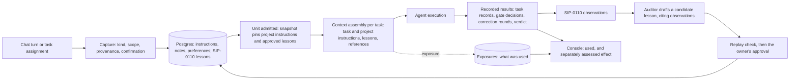

# SIP: Memory Entry Points

**Status:** Proposed (draft, revision 1, 2026-10-09)
**Target (proposed, for the owner's ruling, §8 Q25):**
- **2.3, stabilization:** the legacy agent store made dormant and its failures visible; chat's conversation history
  reaching the agent; the context-assembly port, inert. None of it changes what a task is given;
- **2.4, feature:** the two entry points, the typed records, the snapshot and disclosure extensions, and the console view;
- **2.5, stabilization:** the legacy store retired.
- **Nothing enters 2.2.** The 2.2 experiment's scope is unchanged (the owner, 2026-10-09).

**Authors:** Jason Ladd (the direction, 2026-10-09); Claude Code (this draft)
**Extends:** SIP-0110 Cross-Cycle Memory. **On acceptance this lands in SIP-0110** as a numbered amendment and ledger rows.
It is not a second memory SIP, and it adds no learning mechanism. SIP-0110 owns memory's scopes, lifecycle and payload
(`sips/PORTFOLIO.md` Q4), and its rules for lessons (evidence, the auditor's draft, the replay check, the owner's
approval, the pinned snapshot) are unchanged here.
**Supersedes (assumptions, not documents):** SIP-042's per-agent semantic store as the agents' memory; SIP-0021's
agent-specific memory patterns; SIP-0085 §10's per-agent semantic memory, its executor's contract P2-RC4 (memory is
best-effort) and its trigger-phrase capture (§4.2).
**Tracking:** epic #2173.

## Intake check

Checked against `sips/PORTFOLIO.md` on 2026-10-09, before this draft was recorded (CLAUDE.md, "SIP System"):

- **Overlaps:**
  - **SIP-0110 (accepted), all of it, by design.** This draft extends its substrate: the Postgres store beside the
    cycle registry (§0.8), the unit snapshot (§0.7), the exposure (§0.2) and the recall policy (§0.8). Boundary: lessons
    keep §0.4–§0.7 unchanged; the new record kinds are SIP-0110 payloads once accepted (Q4). Portfolio cluster 7.
  - **SIP-0085 Console Messaging (implemented).** It keeps chat's transport (console → runtime API → A2A) and its
    persistence (`chat_sessions`, `chat_messages`). Its memory design (§10) is superseded (§4.2), and one of its stated
    behaviours, each turn built on the session's history (§4, §7, §9; the executor's contract P2-RC5), was never wired
    (#2175).
  - **SIP-0089 Agent Runtime State (implemented).** Its `Assignment` is a duty window (`squadops.runtime.models`), not a
    piece of project work. To avoid the collision, this draft calls the new record a **task instruction**, never an
    assignment. "Task assignment" below names the act of giving the squad work.
  - **SIP-0109 Campaign (accepted).** Gate decisions, the plan gate's answers carried into the manifest (§24ad) and a
    returned proposal's note (§9.2) stay authoritative where they are. A task instruction is a new input beside them.
  - **SIP-0103 §5c.5, the operator-edit record (unplaced).** A change to the manifest goes through the manifest's own
    path, never through a memory record (§3.2).
  - **The Design Decision Register, #950.** Decision payloads live there. Memory references a decision; it never holds
    one (§3.2).
  - **Outcome Evaluation (proposed; its feature half heads 2.4 by Q1).** "Memory improved the built application" is a
    claim only its independent scenarios can support (§3.11).
  - **The runtime-mode family and duty work (3.x by Q7 and Q8).** SIP-0110 §6 says duty and ambient callers reuse the
    recall policy. The context-assembly and capture interfaces here are what they would call. Nothing duty-related is built.
- **Conflicts (each waits for the owner's ruling, and both documents name it until then):**
  - **Q25, placement.** Q1 (ruled 2026-10-04) made 2.4 Outcome Evaluation's feature half. This draft proposes the entry
    points as a second 2.4 feature (§6).
  - **Q26, #2171.** As filed, #2171 restores the legacy store's embedding path. This draft recommends retiring that store
    instead, and moves #2171's live defect, the silent failure, to #2174 (§4.5).

The same findings are in the portfolio's queue and intake log.

## Delivery ledger (current as of 2026-10-09)

Proposed placements only. Nothing is placed until the owner rules on acceptance and Q25.

| part | status | where |
|---|---|---|
| the legacy agent store made dormant, its failures visible | **unplaced** | proposed 2.3; #2174 |
| chat's conversation history reaching the agent (SIP-0085 §4, §9; never wired) | **unplaced** | proposed 2.3; #2175 |
| the context-assembly port, inert, at the four seams | **unplaced** | proposed 2.3; #2176 |
| the typed records: notes, preferences, project and task instructions | **unplaced** | proposed 2.4; #2177 |
| the task-assignment entry point: task instructions | **unplaced** | proposed 2.4; #2178 |
| project instructions pinned in the unit snapshot; disclosure; memory-disabled isolation | **unplaced** | proposed 2.4; #2179 |
| chat on the substrate: scoped context, capture with confirmation, a chat exposure per turn | **unplaced** | proposed 2.4; #2180 |
| lesson inspection from chat; a conversational claim never becomes a lesson | **unplaced** | proposed 2.4; #2181 |
| the console's memory record view | **unplaced** | proposed 2.4; #2182 |
| the acceptance matrix, live on a deploy (§5) | **unplaced** | proposed 2.4; #2183 |
| the legacy store retired | **unplaced** | proposed 2.5; #2184 |

**What closes this SIP:** acceptance, which moves these rows into SIP-0110's ledger. This document then closes, and
SIP-0110 closes with them shipped or dropped.

## 1. Summary

Today SquadOps has two memory paths that do not meet, and neither serves an operator.
- **Each agent has its own LanceDB store** (SIP-042). Only console chat uses it, and only one agent, joi, has chat
  enabled. On the deploy it cannot write a record (#2171), and every failure is logged at DEBUG.
- **SIP-0110's store is in Postgres.** It holds execution's observations and reviewed lessons, and supplies approved
  lessons to four authoring seams from a snapshot pinned per cycle or campaign.

An operator's instruction reaches a task only through the PRD, the request profile, or a gate. A "remember this" in chat
reaches nothing.

This draft makes **one substrate with typed records and two entry points**. Execution remains the design's driver.
- **Chat and task assignment both enter through one context-assembly step.** It retrieves only authorized, applicable
  records, from trusted scope.
- **Each record is captured with its kind, its scope and its provenance stated.**
- **Every use is disclosed:** an exposure per task invocation, as now, and one per chat turn.
- **Learning stays SIP-0110's.** Execution produces observations; the auditor drafts a lesson from them; the owner
  approves it after a replay check; and it reaches later units through their pinned snapshots.
- **A person's instruction is authoritative by its author's authority, not by evidence.** So it has its own lifecycle and
  never passes through lesson validation. A conversational claim never becomes a lesson.

The legacy LanceDB store holds no record anywhere. This draft recommends making it dormant in 2.3 and retiring it in 2.5,
after the new chat path is live. A semantic index stays an optional retrieval component, never the owner of a record.

## 2. What exists today (inventory, 2026-10-09, deploy `dep_34b4117e7ede`)

### 2.1 Two memory paths

| | the legacy agent store (SIP-042) | Cross-Cycle Memory (SIP-0110) |
|---|---|---|
| where | LanceDB, one directory per agent container (`/app/data/memory_db`), opened by every agent (`src/squadops/agents/entrypoint.py:476–481`) | Postgres, beside the cycle registry, behind `CrossCycleMemoryStorePort` (`src/squadops/ports/memory/cross_cycle.py`) |
| interface | `MemoryPort`: `store`, `search`, `get`, `delete` (`src/squadops/ports/memory/store.py`) | `FailurePatternRecallPort.recall` and `.disclose` (`src/squadops/ports/memory/recall.py`), and the store's records |
| written by | console chat, on a trigger phrase (`adapters/comms/chat_executor.py:39`, `:315`) | three projections from execution (§0.3); the auditor's drafts; the owner's approvals |
| read by | console chat, every message (`chat_executor.py:171`) | the plan composer and the correction runner, at four seams (§0.9) |
| who can reach it | only an agent with `a2a_messaging_enabled`, which only joi has (`entrypoint.py:559`; `agents/instances/instances.yaml:97`) | every cycle and campaign, through its pinned snapshot |
| records on the deploy | **none.** Eight stores: seven empty directories, and joi's one empty `memories` table (LanceDB version 1, created and never written) | observations 88, authoring envelopes 201, snapshots 14, revisions 1, approvals 0, exposures 174, assessments 0 |
| does a write work | **no** (#2171): the embedder is built at `localhost:11434` (`adapters/embeddings/factory.py:21`), and its model, `nomic-embed-text`, is not installed | yes |
| failures | logged at DEBUG and swallowed (`chat_executor.py:179`, `:318`) | five distinct recall outcomes; a failure marks the measurement invalid (§0.8) |
| survives recreation | yes, since #2112 (2026-10-09): eight named volumes | yes: Postgres |

### 2.2 The chat path, end to end

1. The console posts to `POST /api/v1/chat/{agent_id}` (`src/squadops/api/routes/chat/routes.py:108`). The route refuses
   an agent without messaging enabled, so in practice joi.
2. The route stores the session and the user's message in Postgres (`chat_sessions`, `chat_messages`,
   `infra/migrations/006_chat_tables.sql`), with a best-effort Redis copy. **A session has an agent and a user, and no
   project.**
3. It forwards **only the current message** to the agent over A2A (`routes.py:177–179`). `_load_history` (`:290`) is
   defined and never called. So the agent sees no earlier turn, against SIP-0085 §4, §7 and §9 and the executor's own
   contract P2-RC5 ("history comes from the proxy", `adapters/comms/chat_executor.py:10`).
4. Joi's `ChatAgentExecutor` builds a system prompt from its role, adds up to five LanceDB results (none exist), and
   streams the answer. If the message contains "remember this", "note that", "save this" or "store this", it tries to
   store the exchange. On this deploy that store fails, at DEBUG.
5. The route stores the answer.

**Data on the deploy:** two chat sessions with `comms-agent` (joi's former id), both on 2026-03-16, six messages, three of
them the user's, none with a trigger phrase.

### 2.3 How an operator's instruction reaches a task today

| the operator says it through | it reaches |
|---|---|
| the PRD and the request profile (`--request-profile`, `--set`) | every task, as the cycle's inputs |
| `squadops cycles create --notes` | no task. It is stored on the cycle and read only by the benchmark registry (`launched_counted_roll`) |
| a plan-gate ruling's notes | a refinement artifact; a returned design's `supervisor_note`; and, for an open manifest question, the manifest's decision (SIP-0109 §24ad, `cycles/manifest_authoring.py`) |
| a returned proposal's note | the proposal's revision (SIP-0109 §9.2) |
| an increment approval's notes | **no prompt.** Observed in `cmp_45729166756f` on 2026-10-08: the ruling bound only the change request |
| chat | nothing |

The within-cycle rungs (a re-roll's rejection context, a repair's failure evidence, a retry's prior-cycle brief) are the
system's own, not the operator's.

### 2.4 What is authoritative, and where

| fact | its owner |
|---|---|
| the application's contract: entities, endpoints, decisions | the interface manifest (SIP-0103) and its bound contract |
| a gate's decision and its reasons | `cycle_gate_decisions` (SIP-0064, SIP-0067) |
| a correction round and its failure | `run_loop_summaries` (SIP-0086) |
| a campaign's rulings | the campaign control log (SIP-0109) |
| a task, its inputs and its output | the task records and the artifact vault |
| a design decision's payload | the Design Decision Register, #950 |

SIP-0110 §11 already refuses memories of facts about the application under build. This draft keeps that rule for every
kind (§3.2).

### 2.5 What exists, what is extended, what is new

| | parts |
|---|---|
| **exists, reused as is** | the Postgres store and its port; lessons: draft, freeze, replay check, approval, revocation; the unit snapshot and memory disabled; exposures and authoring envelopes; the recall policy; the lessons API and CLI with `memory:read`, `memory:draft` and `memory:approve`; chat's transport and persistence; the gates' notes and §24ad; the app-build indicators |
| **extended** | `RecallQuery` and `Exposure`, which assume a cycle or campaign (`memory/recall.py`; `memory/exposures.py:36–38`), gain a consumer type with no cycle (§3.6); the snapshot pins project instructions beside lessons (§3.7); an exposure records every section supplied; a chat session gains its project; the chat route passes history and the assembled context; the lessons API serves chat's inspection |
| **new** | notes, preferences, project instructions and task instructions, each with its own lifecycle; capture with confirmation; the task-assignment entry point; a chat exposure per turn; the console's memory record view; the legacy store's retirement |

## 3. The design

### 3.1 Principles

1. **Execution is the driver.** Every kind is judged by what it does for coordination, task completion and build quality.
   Chat is a way in, not a second system.
2. **One substrate, typed records.** Records share a store, a scope model, provenance and disclosure. They do not share a
   table or a lifecycle.
3. **Authority and evidence are different gates.** A person's instruction is in force because someone with the authority
   confirmed it. A lesson is in force because evidence, a replay check and the owner's approval support it. Neither
   passes through the other's gate.
4. **References, not copies.** A record that is about an authoritative fact points at it.
5. **Scope is stated at capture and taken from trusted context.** It is never inferred from an agent's text, and never
   widened silently.
6. **What a unit sees is fixed when it is admitted.** New records reach later units, never a running one, except as a
   recorded intervention.
7. **Every use is disclosed, and use is never read as benefit.**

### 3.2 Record kinds

| kind | what it is | created by | scopes | reaches a task | reaches chat | stored in |
|---|---|---|---|---|---|---|
| **conversation history** | a chat session's messages | the chat route | the session (user, agent, project) | never | its own session | `chat_sessions`, `chat_messages` (exist; a session gains `project_id`) |
| **note** | something a person asked to keep: a fact about the work, a pointer, a reminder. A **suggestion** is a note marked as a claim about how work should be done | a person, through chat capture or the API | user-private, project | **never.** It becomes an instruction only by an explicit, confirmed conversion | yes, within its scope | `memory_notes` (new) |
| **preference** | how a person wants to be worked with: format, detail, cadence | that person | user-private | never | the person's own chats | `memory_preferences` (new) |
| **project instruction** | a standing directive for the project's work, with an applicability (task types, roles, stacks) | drafted from chat or the API; **confirmed** by a person holding the project's instruction authority (§3.3) | project | yes, pinned in the unit's snapshot at admission, in its own slot | yes, with its status | `memory_instructions` (new, `scope = project`) |
| **task instruction** | a directive for one task of one unit: "for this cycle's `qa.test`, cover capacity 1" | the person giving the work: at cycle creation, at a gate, from chat (confirmed), or through the API | task: a unit, and a task type, role or task id within it | that task only | yes, with its status | `memory_instructions` (new, `scope = task`) |
| **authoritative decision or state** | the manifest's decisions and contracts, gate decisions, task records, round records, the control log, decision records | their owners (§2.4) | theirs | as today, as inputs | by reference, read when the turn is answered | **not by memory.** A record may carry a reference such as `manifest:decision:<id>@<revision>`, never a copy |
| **observation** | an occurrence from execution (SIP-0110 §0.3) | the projections | project | never directly | inspectable | `memory_observations` (exists) |
| **lesson** | reviewed, approved guidance (SIP-0110 §0.2–§0.6) | the auditor drafts; the owner approves | project, with applicability | yes, at its four seams, from the snapshot | **explained, never applied** (§3.5) | `memory_revisions`, `memory_approvals` (exist) |

**Why notes never reach a task.** SIP-0110 §6's quarantine rule: what may influence measured execution is governed by
status, not origin. A note has no author authority over the work and no evidence behind it. To reach a task, a person
confirms it as an instruction, with a scope, and the conversion is recorded.

**What memory refuses.** A note or instruction that restates an authoritative fact is stored as a reference to it. One
that would change it (a renamed endpoint, a different entity) is refused at capture, with the owning change path named:
the manifest's operator edit (SIP-0103 §5c.5) or a decision record (#950). Contradiction cannot be detected
deterministically in general. So the confirming person is shown the applicable authoritative records beside the
instruction, and each slot states the precedence (§3.6).

### 3.3 Scopes and authorization

- **The scopes:** user-private; agent (persistent identity, SIP-0088/0089); task (a unit and a task within it); project.
  Organization scope stays deferred (SIP-0110 §0.14). Cycle and campaign remain provenance and units of pinning, not
  scopes (SIP-0110 §7).
- **Scope comes from trusted context.** A task's project and unit come from its envelope. A chat turn's project comes
  from its session's binding, set when the session opens. An agent-supplied namespace is never read (SIP-0110 §0.8
  step 1).
- **Who may create what:**
  - **notes and preferences:** any signed-in person, for themselves, or for a project they can read;
  - **task instructions:** whoever may give the unit its work (`cycles:write`, or `campaigns:supervise` at a campaign's
    gates);
  - **project instructions:** a new scope, `memory:instruct`. Until a project membership model exists, it is held by the
    same admins as `memory:approve`;
  - **lessons:** unchanged (`memory:draft`, `memory:approve`).
- **The gap, stated:** SquadOps has no project membership model. "Authorized for the project" means a valid scope and a
  project binding from trusted context, not a per-project member list (§8 Q27).

### 3.4 Provenance

Every record carries:
- its kind, scope, project and status;
- its source, typed: a chat message (session and message ids), a gate decision, a cycle request, an API call, or a
  conversion from another record;
- its author (a person's id; an agent's id and model, when an agent proposed it), and who confirmed it;
- its revision, and the revision it supersedes;
- each status change, with who, when and why;
- any references to authoritative records, each with its revision.

The record is never the only copy of its source. A chat-captured note points at the message it came from.

### 3.5 The two entry points

**Chat.**
- **A session is bound to a project when it opens.** A session with no project sees only user-private records.
- **Each turn is answered from assembled context** (§3.6): the session's history, the person's preferences, the notes in
  scope, the project instructions in force, task instructions for the units the turn names, and references to
  authoritative records. Context is assembled in the runtime API, which owns the store and the recall policy (SIP-0110
  §0.8). The agent renders it through a prompt fragment and owns no memory.
- **Capture is explicit and confirmed.** The trigger phrases go.
  - The person asks to keep something, by a console action or in words.
  - The agent proposes a structured capture: the text, the kind, the scope and, for a task instruction, the unit and
    task.
  - The console shows it as a confirmation card. Nothing is stored until the person confirms, and the card offers a
    narrower scope. Widening to project needs `memory:instruct`.
  - The reply says what was saved, its id, its scope, and when it takes effect, for example "in force for cycles and
    campaigns admitted from now; running ones keep their snapshot".
  - A failed save is said in the reply, shown in the console and logged at WARNING. It is never swallowed.
- **Lessons are inspected, not applied.** Chat can list and explain approved lessons: their text, cited observations,
  applicability, replay check, approval, and the exposures that supplied them. A lesson's applicability names task
  types, roles, stacks and models, and a chat turn is none of these, so chat never receives a lesson as guidance. Chat
  cannot approve, draft or revise one.
- **A conversational claim** ("QA should always mock the clock") is saved, if the person wants, as a note marked
  `suggestion`. The auditor may read suggestions as hypotheses. A lesson's revision must cite execution observations
  (`memory/approval.py` `draft_revision` refuses an unknown citation), and a suggestion is not one. So a claim alone can
  never become a lesson.

**Task assignment.** Giving the squad work: creating a cycle, ruling a gate, approving a proposal, or adding a task
instruction to a unit.
- **At cycle creation:** `squadops cycles create … --instruction "<text>" --for <task type or role>`, and the API's
  field. The instructions are part of the unit's admitted inputs.
- **At a gate:** a ruling may carry task instructions as a structured field, beside its free notes. This closes §2.3's
  gap: an increment approval's notes reach a prompt only when the ruling names them as instructions.
- **From chat:** a confirmed capture of kind task instruction, naming an existing unit.
- **Through the API or CLI:** `squadops instructions add --cycle <id> --for qa.test "<text>"`.

**What a task instruction is not:**
- **Authoritative for its task only.** It reaches the tasks its selector names in its unit, and expires when the unit
  closes. It never widens itself. Making it project policy takes a new project instruction, confirmed with
  `memory:instruct`, recorded as a conversion with both ids.
- **An addition after admission is an intervention.** It is allowed only for a task not yet dispatched, and it is
  recorded on the unit (who, when, what, which tasks) and in the task's exposure and envelope. A counted roll refuses it.
  In a measurement window it sets the affected measurement apart (SIP-0110 §0.12).

### 3.6 Context assembly: the interface

The recall port today takes a `RecallQuery` whose unit is a cycle or a campaign. Its `Exposure` requires a run, a task
and a cycle. A chat turn has none of these, and must not invent them. So context assembly takes a consumer that is
**either** a task invocation **or** a chat turn, and the type makes a fabricated cycle id unrepresentable:

```python
class Disposition(StrEnum):            # SIP-0110 §0.8's five outcomes, per section
    SUPPLIED = "supplied"; NONE_ELIGIBLE = "none_eligible"; DISABLED = "disabled"
    OMITTED_BY_BUDGET = "omitted_by_budget"; INCOMPATIBLE = "incompatible"; FAILED = "failed"
    NOT_APPLICABLE = "not_applicable"   # a lesson section on a chat turn

@dataclass(frozen=True)
class TaskInvocation:                  # an authoring invocation at a consuming seam (SIP-0110 §0.9)
    run_id: str; task_id: str; attempt: int
    unit_kind: UnitKind; unit_id: str  # the unit whose pinned snapshot answers (§0.7)
    task_type: str; role: str; stack: str; model_family: str; agent_id: str

@dataclass(frozen=True)
class ChatTurn:                        # one turn of a chat session; no cycle, run or task
    session_id: str; message_id: str; user_id: str; agent_id: str

@dataclass(frozen=True)
class ContextRequest:
    project_id: str                    # from the envelope or the session's binding, never an agent's text
    consumer: TaskInvocation | ChatTurn

@dataclass(frozen=True)
class Section:
    kind: str                          # task_instructions | project_instructions | lessons | notes | preferences | references
    disposition: Disposition
    supplied: tuple[RecordRef, ...]    # record id and revision, each
    omitted: tuple[tuple[RecordRef, str], ...]   # and why

@dataclass(frozen=True)
class ContextBundle:
    request: ContextRequest
    sections: tuple[Section, ...]

class ContextAssemblyPort(ABC):
    async def assemble(self, request: ContextRequest) -> ContextBundle: ...  # never raises: a failure is a disposition
    async def disclose(self, bundle: ContextBundle) -> None: ...             # one exposure per invocation or turn
```

- **The lesson section is SIP-0110's recall, unchanged.** For a task invocation, the assembler builds today's
  `RecallQuery` and calls `FailurePatternRecallPort`. For a chat turn the section is `not_applicable`.
- **Each section has its own slot,** rendered through a managed fragment (#448). With every section empty, unapproved or
  disabled, the prompt is byte-identical to today's (SIP-0110 §0.9).
- **The precedence, stated in every slot:** the authoritative records (the manifest, the contracts, the task's own
  requirements) outrank task instructions; task instructions outrank project instructions; project instructions outrank
  lessons. A note never reaches a task.
- **Budgets:** each section is bounded, in records and tokens. An over-budget record is omitted whole and listed, never
  truncated (SIP-0110 §0.8).
- **Disclosure:**
  - **a task invocation's exposure** is SIP-0110's, gaining a section list: which instruction and lesson revisions were
    supplied, and which were omitted and why;
  - **a chat turn's exposure** is new (`chat_exposures`), keyed by session and message.

  Both record failures as failures, never as an empty corpus.

### 3.7 Snapshots, interventions and memory disabled

- **The unit snapshot pins project instructions beside lessons.** It is pinned when a standalone cycle is created or a
  campaign admitted (SIP-0110 §0.7), and fixes the in-force project-instruction revisions with the approved lessons. A
  project instruction confirmed, revised or withdrawn while a unit runs reaches later units only.
- **A unit's task instructions are its inputs.** Those given at admission are recorded with the unit. A later one is an
  intervention (§3.5).
- **Emergency withdrawal** of a harmful instruction uses SIP-0110 §0.7's emergency revocation: the affected work is halted
  or restarted under a new snapshot, and the measurements are set apart.
- **Memory disabled means no memory-sourced section, through any entry point.**
  - A disabled unit pins no snapshot. So it receives no lesson and no project instruction, and no task ever receives a
    note.
  - A task instruction whose provenance cites a lesson revision (chat's "apply lesson X to this task") is refused for a
    disabled unit.
  - Text copied by hand is not structurally preventable. So the replay's validity check flags any prompt in a disabled
    unit that contains an approved revision's text, normalized for whitespace. Every instruction's text is in the
    envelope to check.

### 3.8 Correction, supersession and withdrawal

| kind | correct or supersede | withdraw | effect on future work | effect on running units and on history |
|---|---|---|---|---|
| note | a new revision; the old one is kept, marked superseded | it is no longer retrieved | the next chat turn | none on tasks (notes never reach one); earlier chat exposures keep the revision they used |
| preference | as a note | as a note | the person's next chat turn | none |
| project instruction | a new revision, confirmed again; it names the revision it replaces | withdrawn by `memory:instruct` | units admitted later | running units keep their snapshot unless emergency-withdrawn (§3.7); exposures keep the revision used |
| task instruction | before its task dispatches: a recorded intervention | the same | its task only | after dispatch it is history: the exposure and envelope keep what was used |
| lesson | SIP-0110: a new revision needs its own replay check and approval | revocation (`squadops lessons revoke`) | units admitted later | SIP-0110 §0.7 |

**What a person sees.** The console shows each superseded or withdrawn revision with the units and turns that used it,
for example "revision 2, used by `cyc_…` `qa.test`; superseded by revision 3 after use". Nothing is deleted. Correcting
a record never rewrites an exposure.

### 3.9 The loop



1. **Chat or task assignment** gives the squad context and requirements: a task instruction for the work at hand, or a
   project instruction for work to come, confirmed with its scope.
2. **The unit is admitted.** Its snapshot pins the project instructions in force and the approved lessons. Its task
   instructions are its inputs.
3. **Each consuming task gets assembled context:** its instructions, the lessons its applicability matches, and
   references. Its exposure records exactly what it got.
4. **The agents execute.** Task records, gate decisions, correction rounds and the verdict are recorded where they always
   are.
5. **SIP-0110's projections turn eligible failures into observations.** The repeat report finds what recurs.
6. **The auditor drafts a candidate lesson** citing observations, never a chat claim. Suggestions may prompt it, and
   they are not evidence.
7. **A replay check, then the owner's approval.** The lesson enters the next units' snapshots.
8. **Later work receives applicable guidance**, and the cycle repeats. An instruction that causes trouble is revised or
   withdrawn by authority, without an evidence gate. A lesson that causes trouble is revoked by SIP-0110's path.

### 3.10 Retrieval, and an optional semantic index

- **For tasks: exact filtering only.** Project instructions and lessons come from the snapshot by applicability. Task
  instructions come by the unit's binding and the task selector. No ranking, as in SIP-0110 §0.8.
- **For chat:**
  - task and project instructions by exact filters;
  - preferences, all of the person's active ones;
  - notes filtered by scope and status in Postgres first, then ordered by Postgres full-text match and recency, with a
    bound on count and tokens and the omissions listed.
- **A semantic index is optional,** added only for a concrete need: for example, measured misses in chat's note
  retrieval once notes outgrow keyword search. If added:
  - it is derived from the Postgres rows, keyed by record id and revision, and rebuildable;
  - scope and status are filtered in Postgres before ranking, which removes by construction the starvation #571 found
    (`.limit()` before filtering);
  - it owns no approval, scope, status or record;
  - `pgvector` in the same Postgres is preferred, for one store and one backup. A LanceDB index is acceptable only as a
    derived service, never as a per-agent store.

### 3.11 Disclosure and the console view

**The memory record view** (one page per record, reached from a project's memory list, filterable by kind, scope and
status):

| field | content |
|---|---|
| header | kind, scope, project, status, current revision |
| source | the chat message and session, gate decision, cycle request or API call it came from, linked; author and confirmer |
| revisions | each revision's text and when it was confirmed, superseded or withdrawn, by whom and why |
| references | the authoritative records it points at, each with its revision |
| consuming tasks | each exposure that supplied it: the unit, run, task and attempt, or the chat turn; which revision; the section's disposition |
| associated results | for each consuming task: its outcome, its run's verdict, and SIP-0110 §0.10's app-build indicators (correction rounds, rounds to green, acceptance), counted once per build |
| effect | **kept apart from use.** For a lesson: its assessments (`target_absence_rate`) and the window's finding (§0.10, §0.13). For an instruction or note: "no effect measured", unless an experiment reads one |

**"Memory was used" and "memory improved the outcome" never share a column.** The view says outright that a green build
beside an exposure is not evidence the record helped (SIP-0110 §0.10). An application-quality claim needs Outcome
Evaluation's independent scenarios (SIP-0110 §0.13).

**The chat reply discloses too:** a short line naming the records it used (id and revision), and any section that
failed.

## 4. The legacy path: what to keep, what to supersede, what to retire

### 4.1 What it does, and who uses it

§2.1 and §2.2 are the inventory:
- **Who uses it:** joi's chat.
- **What it does today:** nothing. Recall finds no record, and a store cannot embed.
- **What it holds:** no record in any of the eight stores.
- **The only chat data:** two sessions from 2026-03-16, in Postgres.

### 4.2 Assumptions superseded

| assumption | from | replaced by |
|---|---|---|
| an agent's memory is its own private store | SIP-042; SIP-0021 §3's agent-specific patterns | project-scoped records any authorized agent reads, one copy each; agent scope is one level, kept for identity memory (SIP-0110 §6) |
| memory is a vector store | SIP-042 | typed records in Postgres; a semantic index optional and derived (§3.10) |
| "remember this" stores the exchange | SIP-0085 §10; `_MEMORY_TRIGGERS` (`chat_executor.py:39`) | capture with a stated kind and scope, confirmed (§3.5) |
| recall is top-k similarity, without scope, authorization or disclosure | SIP-042, SIP-0085 | scoped, authorized, budgeted, disclosed (§3.6) |
| memory is best-effort and secondary: failures are silent | the chat executor's contract P2-RC4 (`chat_executor.py:9`) | a failure is a disposition, shown and logged at WARNING (§3.6) |
| the agent owns its memory | SIP-042, `entrypoint.py` | the runtime API assembles context; the agent renders it (§3.5) |
| recall and remember for duty and ambient go through `MemoryPort` | SIP-0110 §6 items 3 and 4 | through the recall policy and this draft's context-assembly and capture interfaces; the quarantine rule stands |

The supersessions are marked where they stand: SIP-0110 §5f, SIP-0085's amendment and SIP-0021's note.

### 4.3 Recommendation: dormant now, retired after the new chat path

- **2.3, dormant (#2174):**
  - the chat executor stops calling the legacy store, and says so once at start ("legacy agent memory dormant",
    WARNING);
  - no embedder is built at an address nobody set;
  - any memory error that remains is visible;
  - the eight stores are re-inventoried and the result recorded.

  The code and the volumes stay, so nothing is lost if the inventory surprises.
- **2.5, retired (#2184), after #2180 is live:**
  - re-inventory first. A record found is converted to a note, with its provenance, before anything is removed;
  - then remove `MemoryPort`, the LanceDB adapter, the agents' store construction and the `lancedb` dependency;
  - remove the eight volumes. **That is a compose change, made only on the owner's OK.**

  2.5 is a stabilization release, and removing dead code is its kind of work.
- **Not migrated: nothing exists to migrate.** If a record appears before retirement, it moves as a note.

### 4.4 #2112 stays separate

#2112's persistence work is done and verified (closed 2026-10-09): eight named volumes, records surviving two forced
recreations. Whether that store should remain is §4.3's question, decided at #2184, and does not reopen #2112.

### 4.5 #2171, reassessed

**Recommended disposition (§8 Q26): close #2171 as not planned. Do not restore the embedding path. Move its live defect
to #2174.**
- #2171 found three things:
  - the embedder is built at `localhost`;
  - its model is not installed;
  - the failure is silent.
- The first two only matter if the legacy store has a future, and this draft retires it. Installing `nomic-embed-text`
  would add a host dependency to a store that holds nothing and that no execution path reads.
- The third is a real defect wherever memory is used, and #2174 fixes it in 2.3.
- This draft makes no part of the new architecture depend on that embedding path.

## 5. Acceptance criteria

Each is a test the issue that builds it carries, and #2183 runs them together live on a deploy. Synthetic fixtures prove
the mechanism. They are never evidence that memory improved anything (SIP-0110 §0.15).

| # | scenario | observable result |
|---|---|---|
| T1 | a project instruction for `qa.test` is captured in chat and confirmed | the next admitted cycle's `qa.test` envelope carries it in the instructions slot, and its exposure names the revision; its `development.develop` does not |
| T2 | one project note and one project instruction, read by two agents | the dev and qa tasks (and two chat agents, if more than one has chat) get the same record id and revision; the store holds one row each; no agent has a copy |
| T3 | a task instruction for cycle A's `qa.test` | cycle A's `qa.test` gets it; cycle B's does not; no project instruction exists; widening it needs `memory:instruct` and records a conversion |
| T4 | records in projects P1 and P2, and one user's private note | P1's tasks and chats get nothing of P2's; another user's chat and every task get none of the private note |
| T5 | "QA should always mock the clock", said in chat | it is stored, if confirmed, as a `suggestion` note; `draft_revision` refuses it as a citation; no snapshot carries it; there is no route from it to an approval |
| T6 | while a cycle and a campaign run: a project instruction confirmed, a lesson approved, a note saved | the running units' later tasks get their admission snapshot's content, byte for byte; the next admitted unit gets the new |
| T7 | records written through the API, then the runtime API's and Postgres's containers recreated | every record, revision and exposure reads back unchanged |
| T8 | the store made to fail on save and on retrieval | the chat reply says it was not saved; the console shows the failed disposition; a WARNING is logged; a task's exposure records `failed`, and its measurement is invalid, never "none eligible" |
| T9 | a memory-disabled unit, with a lesson approved and a project instruction in force | no lesson and no project instruction reach any of its tasks through any entry point; a task instruction citing a lesson is refused; the replay validity check flags a disabled-unit prompt containing a lesson's text; prompts are byte-identical to memory-free ones |
| T10 | the context interface | a chat turn's request carries no cycle, run or task, and cannot be built with one; a task's lesson section equals SIP-0110's recall for the same snapshot and inputs |
| T11 | the console record view | it shows source, scope, status, revisions, consuming tasks and associated results; its effect column reads "no effect measured" for an instruction with exposures and a green build |

## 6. Work breakdown and placement

| | issue | release (proposed) | depends on | what it delivers |
|---|---|---|---|---|
| #2174 | legacy agent memory dormant, failures visible | 2.3 | — | §4.3's first half; #2171's live defect |
| #2175 | chat history reaches the agent | 2.3 | — | SIP-0085 §4 and §9, as written |
| #2176 | the context-assembly port, inert | 2.3 | — | §3.6's types and port, the four seams through it, byte-identical prompts, T10 |
| #2177 | the typed records | 2.4 | #2176 | §3.2–§3.4 and §3.8: tables, port, adapters, scopes, provenance, revisions; a session's project binding |
| #2178 | task instructions | 2.4 | #2177 | §3.5's task assignment; interventions; precedence; T3 |
| #2179 | project instructions in the snapshot | 2.4 | #2177 | §3.7; `memory:instruct`; disclosure sections; T1, T6, T9 |
| #2180 | chat on the substrate | 2.4 | #2175, #2176, #2177 | §3.5's chat; capture with confirmation; chat exposures; T2, T4, T8 |
| #2181 | lesson inspection from chat | 2.4 | #2180 | §3.5's inspection and suggestions; T5 |
| #2182 | the console memory view | 2.4 | #2177, #2179 | §3.11; T11 |
| #2183 | the acceptance matrix, live | 2.4 | #2178–#2182 | §5 on a deploy, T7 included |
| #2184 | retire the legacy store | 2.5 | #2180 live; the owner's OK for the compose change | §4.3's second half |

**Why this placement:**
- **2.3** carries only what changes no task's input. #2174 removes a path that does nothing and makes failures visible.
  #2175 is a defect against SIP-0085's own text. #2176 is a rail with byte-identical prompts, as #2058 was for 2.2.
- **2.4** is the next even release, and the entry points are a feature: new records, new inputs to tasks, new console
  surfaces. They are not a chat bug fix. Q1 gave 2.4's head to Outcome Evaluation's feature half. This draft proposes
  the entry points beside it, not instead of it, and they need each other: the entry points create interventions, and
  Outcome Evaluation is what can say whether the built application got better. The alternative is 2.6, beside the
  squad-authored backlog, which would use task instructions heavily. That is Q25.
- **2.5** retires the legacy store, once nothing reads it.
- **SIP-0110 Phase 2** (consolidation, promotion, semantic ranking) stays unplaced until the owner rules on 2.2's finding.
  Nothing here needs it.

## 7. What this does not do

- It does not change how a lesson is drafted, checked, approved, supplied or measured.
- It adds no built-in auditor, and no agent writes a lesson.
- It applies nothing mid-unit, except as a recorded intervention.
- It does not store application facts, contracts or decisions. Memory references them.
- It builds nothing duty- or ambient-related (3.x). Their callers would reuse §3.6.
- It adds no organization scope.
- It adds no semantic ranking for tasks. Chat's optional index comes only on a measured need (§3.10).
- It does not rewrite the memory system ahead of the owner's acceptance.

## 8. Open questions for the owner

- **Q25: placement.** The entry points in 2.4 beside Outcome Evaluation's feature half (recommended), or in 2.6 beside
  the squad-authored backlog.
- **Q26: #2171.** Close as not planned, its live defect moved to #2174 (recommended), or restore the embedding path.
- **Q27: who confirms project instructions** until a membership model exists: admins only, as drafted, or a wider role.
- **Q28: chat beyond joi.** Today only joi has chat. Should other agents get chat once context is assembled centrally,
  for example the lead for a project's questions? It is a config flag (`a2a_messaging_enabled`). This draft does not
  depend on it.
- **Q29: conversation-history retention.** How long sessions are kept, and whether a person can delete their own.

## 9. Post-acceptance amendments

None yet. On acceptance, this document's design lands in SIP-0110 as a numbered amendment, with these ledger rows.
