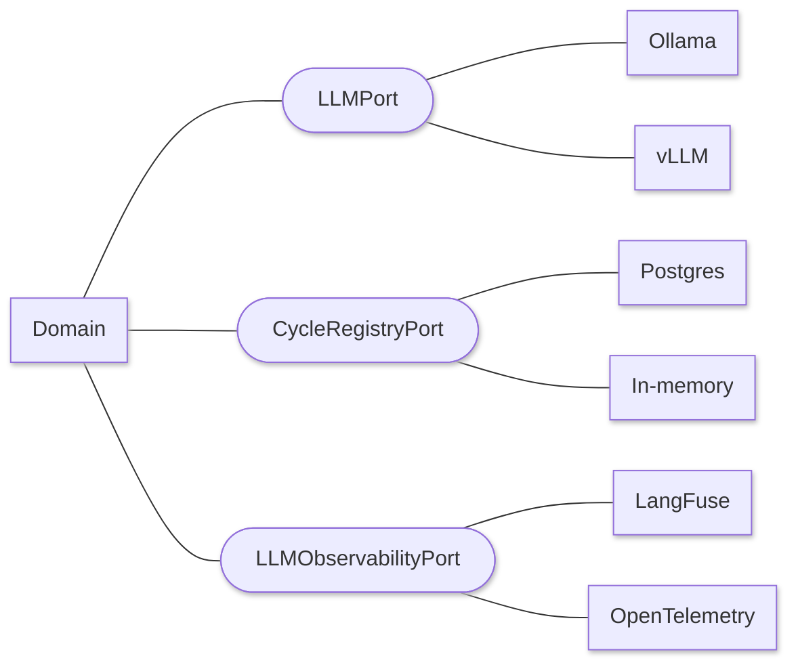

# Architecture

## Ports and adapters

Squad Ops is built as a hexagon. The domain defines interfaces; infrastructure
implements them. Swapping the inference engine, the message broker, or the
observability backend is a configuration change rather than a migration.

Three ports shown of eight; the full set is listed above. The domain never learns which adapter it was handed. That is what makes the
rightmost column swappable — and what makes a second adapter behind any port a
genuine test of whether the port was honest, rather than shaped around whichever
implementation happened to come first.

**Ports** — LLM provider, queue, cycle registry, artifact vault, authentication,
audit, LLM observability, filesystem.

**Adapters** — Ollama and vLLM for inference, RabbitMQ for messaging, PostgreSQL
for durable state, Keycloak for identity, LangFuse and OpenTelemetry for
observability, a content-hashed filesystem vault for artifacts.

Two properties fall out of this that matter more than the pattern itself:

**Capabilities are declared, not inferred.** An adapter states what it can do —
model listing, model management, streaming usage — and callers ask the port
rather than checking which class they were handed. A declared capability that
does not work fails a conformance suite every adapter must pass.

**Errors are translated at the boundary.** A transport failure becomes a typed
port error, because the failure classifier reads those types to decide whether a
failure is infrastructure or a genuine defect. A raw connection error escaping
the adapter would reclassify an outage as a squad mistake and spend a correction
round on it.

## Execution

Cycles are planned into tasks and dispatched to agent containers over RabbitMQ,
orchestrated with Prefect for visibility. Cycles, runs, gates, and artifacts are
persisted in PostgreSQL; artifacts are content-hashed and immutable, with
promotion from working to promoted a one-way operation.

Every run records the hash of the configuration it resolved, so a result can be
traced back to the exact squad, models, and settings that produced it. This is
what makes two measurement runs comparable — and it is why routing decisions
live in versioned configuration rather than in a runtime policy that no record
would capture.

## Local inference by design

There is no hosted API in the loop. The reference deployment runs a Qwen 27B
model on an NVIDIA DGX Spark; development runs smaller models locally. No
per-token cost, no rate limits, no source or requirement text leaving the
machine.

The cost is throughput. A local 27B model sets the wall-clock ceiling on every
cycle, which is why the inference engine sits behind a port with a conformance
suite every adapter must pass — swapping engines is a configuration change, and
a candidate engine has to prove it honours the contract before it is trusted
with a run.

## Design specs

Architectural decisions are recorded as **improvement proposals** that move
through proposed → accepted → implemented. Acceptance is a design commitment;
implementation is judged separately.

[Browse the proposals](design/sips/index.md){ .md-button }
