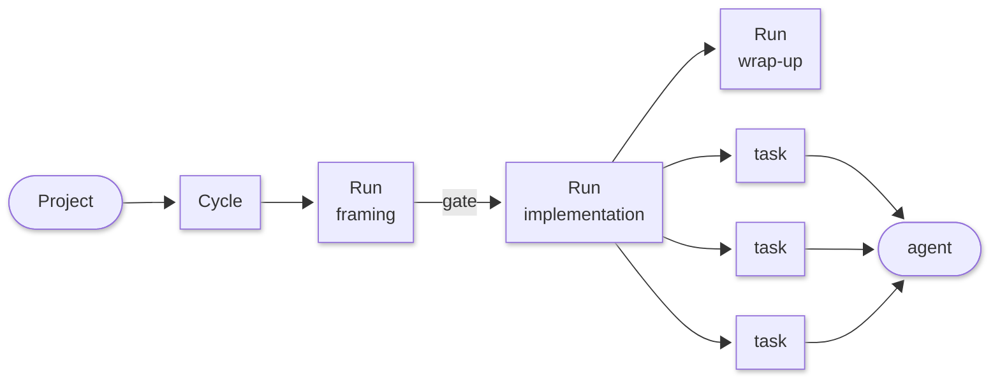
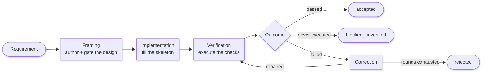
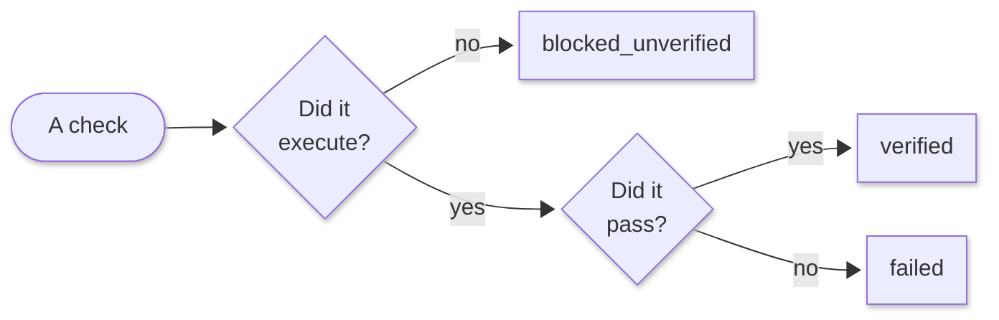
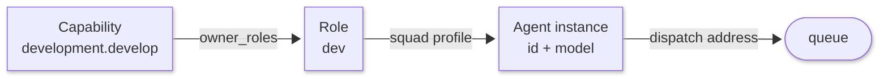

# Key concepts

Squad Ops has four levels. Most confusion about the system comes from collapsing
them, so it is worth being precise before anything else.



| Level | What it is |
|---|---|
| **Project** | The thing being built, and the namespace everything else hangs off |
| **Cycle** | One governed pass from a requirement to an application |
| **Run** | One **workload** within that cycle — framing, implementation, wrap-up |
| **Task** | One unit of work dispatched to one agent |

## Cycles

A cycle is created against a project with a requirement document, a **squad
profile** (which agents, on which models) and a **cycle request profile** (what
kind of pass this is). It is the unit you start, watch, and judge.

```bash
squadops cycles create play_game --squad-profile full --request-profile validated-fullstack
```

The request profile is where the shape of the cycle is declared — including its
**workload sequence**:

```yaml
workload_sequence:
  - type: framing
    gate: progress_plan_review
  - type: implementation
    gate: null
```

A cycle's status derives from its runs: `created`, `active`, `paused`,
`completed`, `failed`, `cancelled`. **`paused` means the cycle is waiting for an
operator at a gate between workloads.**

## Runs

**A run is one workload's execution.** A cycle that framed a design and then
implemented it has two runs, each a separate record with its own identity,
artifacts, and gate decisions.

Every run records the hash of the configuration it resolved — squad, models,
request profile, settings. Two runs sharing a hash executed under identical
configuration.

Runs are the resumability boundary too. Because each workload is its own run
with its own promoted artifacts, a cycle interrupted after framing can resume
into implementation without re-authoring the design.

Workload types are `framing`, `implementation`, `evaluation`, `refinement` and
`wrapup`. The field is free-form, so a request profile may declare its own.

## Tasks

A run is planned into a list of **task envelopes**, one per unit of work, each
addressed to a specific agent. The envelope is the contract between the runtime
and an agent container: identity (`task_id`, `agent_id`, `cycle_id`,
`task_type`), the inputs the task needs, and lineage fields —
`correlation_id`, `causation_id`, `trace_id`, `span_id` — that are always
present so a task can be traced back through the run that planned it.

Task types read as `role.verb`: `strategy.frame_objective`,
`development.author_manifest`, `development.develop`, `qa.test`,
`governance.merge_plan`, `data.analyze_failure`.

The plan is generated per run from the workload type, the squad profile, and —
once framing has produced them — the implementation plan and verification
contract. A build workload's task list derives from the design the squad
authored in the previous run.

## Flows and dispatch

The executor runs a plan under a declared **flow mode**:

| Mode | Behaviour |
|---|---|
| `sequential` | One task at a time, fail-fast |
| `fan_out_fan_in` | Parallel dispatch, barrier before the next stage |
| `fan_out_soft_gates` | Parallel dispatch with non-blocking checkpoints |

Dispatch is a request/reply over RabbitMQ: the executor publishes a task
message, an agent container consumes it, executes the handler for that task
type, and replies with a result. Agents run as separate processes, so the
envelope carries every input the handler needs.

**Prefect provides the view.** Each run opens a flow run and every dispatched
task nests inside it, so `http://localhost:4200` shows the run as a graph with
per-task logs. The executor makes the orchestration decisions; Prefect renders
them.

## Gates

Two different things are called gates, and they behave differently.

**In-run gates** are declared in the task flow policy and fire after a named
task type completes — `progress_plan_review` after `governance.review`, for
example. They interrupt the task sequence within a run.

**Inter-workload gates** sit between runs. These are the ones that move the
whole cycle to `paused` until someone decides. A gate decision is recorded on
the run with who decided it and when — and, when an operator accepts with a
waiver, exactly which checks were waived and why. The waiver sits *above* the
evidence and never edits it.

```bash
squadops runs gate play_game <cycle-id> <run-id> progress_plan_review --approve
```

## Artifacts

Everything a task produces goes to the artifact vault, content-hashed and
immutable. Artifacts start `working`; promotion to `promoted` is one-way.

Promotion carries work between workloads. When a framing run completes, its
promoted artifacts — the interface design, the implementation plan, the derived
contract — forward into the implementation run. Only promoted artifacts
forward.

---

## The pass itself

With the machinery established, the actual work of a cycle:



### 1. Framing — the design and the plan

Nine steps, dispatched in order to the roles that own them:

| # | Task | Role | Produces |
|---|---|---|---|
| 1 | `data.research_context` | data | Background the later steps read |
| 2 | `strategy.frame_objective` | strategy | The objective and scope |
| 3 | `development.design_plan` | dev | The technical design |
| 4 | `development.author_manifest` | dev | `interface_manifest.yaml` |
| 5 | `qa.define_test_strategy` | qa | The test approach |
| 6 | `governance.prepare_plan_authoring_brief` | lead | The brief proposers work from |
| 7 | `development.propose_plan_tasks`<br>`qa.propose_plan_tasks`<br>`strategy.propose_plan_guidance` | dev<br>qa<br>strategy | Competing task proposals |
| 8 | `governance.merge_plan` | lead | `implementation_plan.yaml` |
| 9 | `governance.review_plan` | lead | Sign-off |

**Step 4 runs in authored mode**, and its position is deliberate: after the
technical design, so dev is best informed, and before the test strategy, so QA
writes its strategy against the interface the implementation will be held to.

**Step 7 is configurable.** `plan_authoring_contributors` selects which roles
propose; the merger runs in sole-author mode when the list is empty.

The manifest carries the entities, endpoints, error contracts and screens. Two
gates check it before implementation starts:

| Gate | Checks |
|---|---|
| **Schema** | Parses, and is structurally complete |
| **Winnability** | The skeleton expands, the derived contract is satisfiable, fill slots enumerate, and test anchors cover the declared screens |

A design failing either gate returns to step 4 for revision, bounded by the
cycle's revision budget.

### 2. Review — question-gated

The cycle pauses for an operator when the authored design records an
**unresolved question**: the squad marking something the requirement leaves
undetermined. With no open questions the cycle proceeds and the gate decision
records `system:no_open_questions`.

The firing rule lives in `cycles/manifest_authoring.py::open_questions`. It keys
on the design, so a seeded manifest carrying an open question pauses the cycle
exactly as an authored one does.

### 3. Implementation — fill the slots

The accepted design expands into a skeleton: some files frozen, others slots to
be filled. Agents write into the slots. Writes outside a slot are rejected at
the emission gate.

### 4. Verification — execute, don't assume

Tests are **executed**. The application is installed, built, booted, and probed
over real HTTP against the contract derived from the design.



Each not-executed result carries a machine-readable reason from a fixed
taxonomy — `config_disabled`, `unsupported_stack`, environment gaps — recorded
on the roll-up alongside the checks that ran.

The same three-way split applies to the cycle verdict, and each verdict points
at a different repair target:

| Verdict | Repair target |
|---|---|
| `rejected` | The product — a criterion failed |
| `blocked_unverified` | The harness, environment, or run configuration |

### 5. Correction — bounded, and aimed

When something fails, the failure evidence is classified before anything is
repaired: is the defect in the application, in the test suite, or in the
machinery doing the measuring? Those route to different fixes, and confusing
them burns attempts.

Repairs run for a bounded number of rounds, carrying the failure evidence
forward so a later attempt knows what the earlier one was told. A chain that
stops making progress — the same failure signature twice — is terminated rather
than left to spend the budget rediscovering it.

---

## Capabilities, roles and squad profiles

These three are the concepts worth holding. Everything else about "the agents"
follows from them.



### Capability — the unit of work

A **capability** is a contract: an id like `development.develop` or `qa.test`,
the inputs it accepts, the outputs and artifacts it produces, the acceptance
checks that decide whether it delivered, and a timeout. It also declares
`owner_roles` — which roles are permitted to fulfil it.

A task's `task_type` *is* a capability id. When a run plans
`development.author_manifest`, it is naming a capability, and the contract for
that capability determines what the task must be given and what it must
produce.

Roughly 35 capabilities exist today, grouped by the role that owns them:

| Prefix | Examples |
|---|---|
| `strategy.` | `frame_objective` · `analyze_prd` · `propose_plan_guidance` |
| `development.` | `design_plan` · `author_manifest` · `develop` · `repair` |
| `builder.` | `assemble` · `assemble_repair` |
| `qa.` | `define_test_strategy` · `test` · `validate` · `assess_outcomes` |
| `data.` | `research_context` · `analyze_failure` · `gather_evidence` |
| `governance.` | `define_done` · `review_plan` · `merge_plan` · `correction_decision` |

### Role — who may fulfil it

A **role** is the abstraction the framework actually resolves against:
`strat`, `dev`, `builder`, `qa`, `data`, `lead`. Capabilities are owned by
roles; task plans are built from roles; correction routing decides which *role*
repairs a failure.

Nothing in the framework depends on a particular agent existing. It depends on
a role being **filled**.

### Squad profile — which instance fills the role

A **squad profile** is the configuration that answers "for this cycle, which
agent instance and which model fills each role?"

```yaml
profile_id: full
agents:
  - { agent_id: neo, role: dev,     model: "qwen3.6:27b", enabled: true }
  - { agent_id: eve, role: qa,      model: "qwen3.6:27b", enabled: true }
  - { agent_id: bob, role: builder, model: "qwen3.6:27b", enabled: true }
```

Each entry may also carry `config_overrides` (temperature, completion budget,
timeout), so a role can be tuned without touching code.

| Profile | Model | Purpose |
|---|---|---|
| `smoke` | 3B | Liveness and plumbing only. Not a quality signal. |
| `lite` | 7B | The whole pipeline, cheaply. Framework validation. |
| `full` | 27B | The quality squad. What measurements are run on. |
| `full-38` | 27B (newer) | Comparison arm — identical to `full` but for the model |

The profile is resolved at plan time and its hash is recorded on the run, which
is what makes two runs comparable.

### Agent instance ids

`neo`, `eve`, `bob` are addresses on the queue and labels in a log. A profile
assigns one per role, along with the model that instance runs.

The same id can run a different model in a different profile, and different ids
can fill the same role across profiles. Task routing resolves by role, so a
task's role determines its behaviour and its handler.
