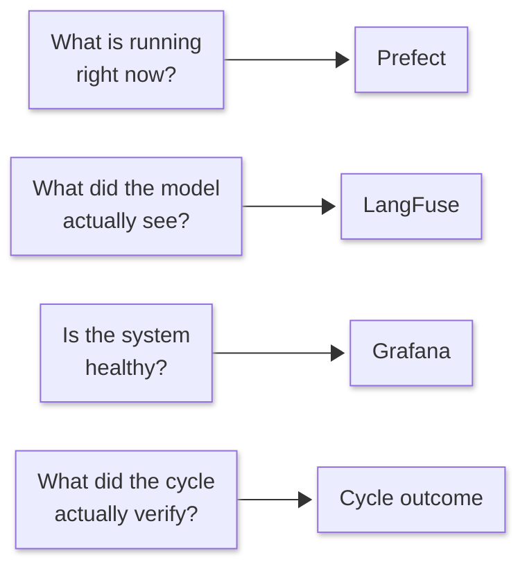

# Observability

Four surfaces, each answering a different question. Reaching for the wrong one
is the usual reason a cycle feels opaque.



| Surface | Answers | Where |
|---|---|---|
| **Prefect** | What is running, what failed, how long each task took | `:4200` |
| **LangFuse** | What the model was sent and what it returned | `:3001` |
| **Grafana / Prometheus** | Is the stack healthy over time | `:3000` |
| **Cycle outcome** | What was actually verified — the evidence record | CLI / API |

## Prefect — the run, as it happens

Every run opens a flow run, and every dispatched task nests inside it. That
gives you the run as a graph: which task is executing, which failed, how long
each took, and per-task logs streamed from the agent that ran them.

This is the right surface for *"is it stuck, and where"*. It is not the right
surface for judging quality — a green Prefect graph means the tasks completed,
not that the application works.

## LangFuse — what the model saw

Each generation is recorded with the prompt sent, the response returned, token
counts, latency, and throughput. Traces are correlated down the same hierarchy
the system uses — cycle → pulse → task → generation — so a generation can be
traced back to the run and task that produced it.

Generations also carry **prompt provenance**: which prompt template and version
produced them, plus hashes of the assembled system prompt and the rendered
request. When output changes between runs, that is how you tell whether the
prompt moved or the model did.

This is the surface for *"why did it produce that"*. It is also where a
throughput regression becomes visible, since tokens/sec is recorded per
generation.

!!! note "Local by default"

    LangFuse runs in the compose stack. No prompt or response text leaves the
    machine, which is a deliberate consequence of running inference locally —
    the observability layer would otherwise undo the property.

## Grafana and Prometheus — the stack

Service health, queue depth, database connections, request rates. This is
infrastructure monitoring rather than cycle insight — useful when the question
is *"is something wrong with the machine"* rather than *"is something wrong with
the work"*.

OpenTelemetry is the transport underneath; the collector accepts traces and
metrics on `:4317` / `:4318`.

## The cycle outcome — what was actually verified

The other three tell you what *happened*. This one tells you what it *means*,
and it is the only one that carries evidence integrity.

Every completed cycle produces a roll-up:

| Field | Meaning |
|---|---|
| `verdict` | `accepted` · `rejected` · `blocked_unverified` |
| `verified` | checks that executed **and** passed |
| `failed` | checks that executed and failed |
| `unverified` | checks that never executed, each with a machine-readable reason |
| `required_unmet` | required checks not satisfied |
| `waived` | checks an operator explicitly waived, with the reason |
| `inert` | checks chronically never executing across runs |

The `unverified` and `inert` fields are the ones that make the rest
trustworthy. A framework that reports only passes and failures cannot tell you
that its own verification was broken — and a check that has quietly never
executed for twenty runs is a far worse problem than one that fails loudly.

```bash
squadops cycles show play_game <cycle-id> --json
```
