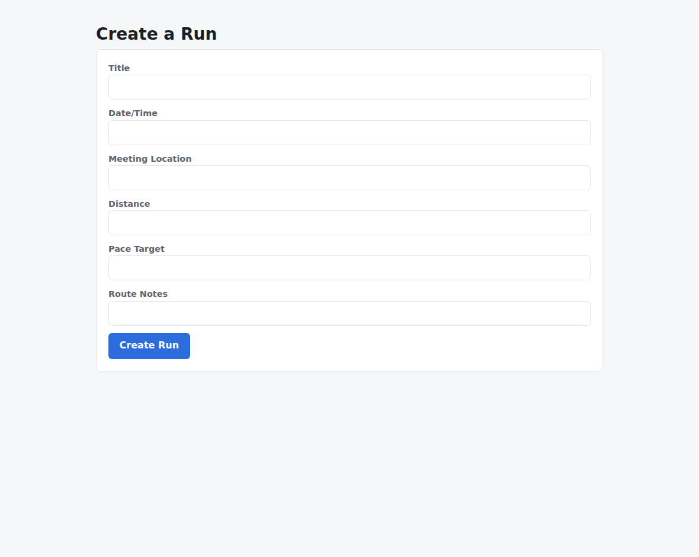
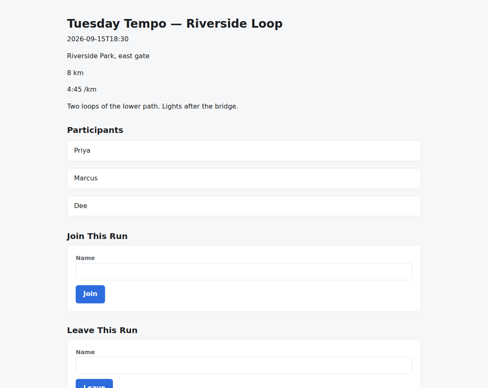
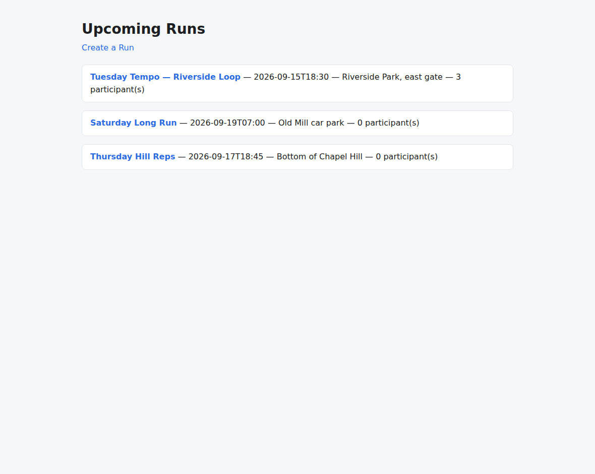
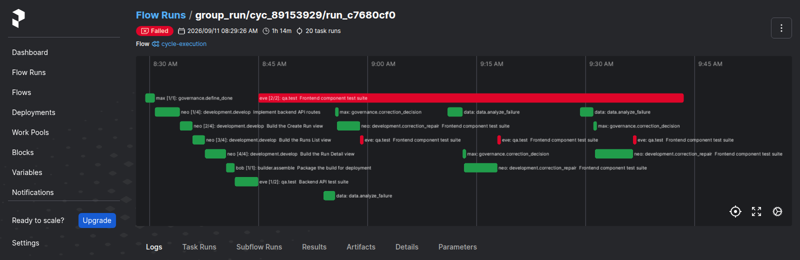

# v1.7.5

**Released 2026-09-12** · [tag `v1.7.5`](https://github.com/backspring-labs/squad-ops/releases/tag/v1.7.5)

**The three closures — the fifth patch line of 1.7, and the close of the line.** Plan:
`docs/plans/1-7-5-plan.md` (rev 5, amended §3.9a). Record:
`docs/plans/1-7-5-verification-set-record.md`.

1.7.5 makes the remaining ports real at start-up and through the LLM call path, and proves the
recovery path still behaves after the code that runs it was taken apart.

**Start-up truth.** The runtime API is composed from a config value rather than at import
(#286); every comms and filesystem binding enters through its factory with its selector
*required*, no schema default and no factory default (#301); and CI imports each composition
root under the lock its own image installs (#637). The last one grew a second step during the
line, and the reason is in the record: importing a root is not enough, because roots import
their factories lazily, so the job now imports what each root *composes at startup*.

**Invocation truth.** Seventeen call sites become one seam: `_llm_call` is the only place the
framework calls `chat_stream_with_usage`, and every call records what it spent (#929, #1206).
The deployed tree's call-site count is printed in each roll's identity block, and it reads 1.

**Recovery structural integrity.** The accepted-patch path, the outcome router, the correction
protocol and the repair half leave `DispatchedFlowExecutor` for named collaborators —
`PatchAcceptance` and `CorrectionRepair` — and the run's mutable state gets a name and its
substructures (#1152, via #1482–#1486, #1490, #1491). No behavioural change rides any of it:
every golden is byte-identical, none regenerated.

**The measurement-correction prelude**, which had to land before anything could be measured:
one three-state vocabulary for every record field — `observed` / `asked_none` / `unaskable`
(#1445); a banked failed emission carries its attempt, so a record counts emissions rather than
artifacts (#1436); the sandbox image is named for what it ships (#1197); a framing run stops
reporting `blocked_unverified` for checks it cannot subject (#1428); the fill-mode qa
declaration becomes `LOW`, not `NONE` (#1434); an environment skip does not erase a criterion
another producer executed and passed (#1406); baseline stylesheets for both skeletons (#906,
#1463) and the QA build workspace that must admit them (#1476); interface coherence across an
entity's own endpoints (#820); a qa suite's mock of the frozen API client honouring its declared
surface (#668); and a failed frontend build that says why (#1468, #1472, #1475).

**Found by the line's own shakeout, and named because it is a closure finding.** Both arms of
deploy B's first pair died in two seconds on `cycles create` with HTTP 500: the comms factory
imported `A2AServerAdapter` at module scope, only `agent.lock` ships the `a2a` SDK, and
`_init_cycle_subsystem`'s broad `except` turned it into one log line behind a passing health
check. The server is a local import now (#1494), a runtime API that cannot bind its cycle ports
refuses to start (#1495), and #637's guard was extended to catch the class.

**Ops and tooling.** A weekly Docker reclaim on the backup timer's pattern (#1465); memory
containment for the Spark with a doctor check swap cannot fool (#1178); the deployment database
refuses the test role at the server (#1180); the framework's pipeline invariants machine-checked
(#1492); and the release package's screenshots become two commands and a guard rule, after
v1.7.0–v1.7.4 each shipped an empty `assets/` (#1500).

**Validated by a pre-registered two-arm verification set** on frozen deploy `8fd30eb8` (HEAD
pinned at `1e6ac721`), **zero drift under `src/` or `adapters/` between the deploy and the
tag**, and one image set across all nine rolls. FastAPI+React **4 of 6**, Next.js+TS **3 of 3** —
**functional 7 of 9**, 159/161 criteria, boot audit PASS 9/9, P0 held 9/9, zero framing
re-rolls. The line's bar held: **zero contentless emissions across 167**. The shakeout loop
exited at **round 1** where deploy A took four.

**Stated at the cut, not implied.** The experimental gate was **not met as written**: four of
the five diagnostics reached their seam, and `contentless-builder` did not — #1372's aimed retry
recovers the builder before correction, so the readout's second conjunct is unproducible, and it
read YES on 1.7.4 only because that deploy predated the fix by eight hours. The owner ruled the
line closes anyway; plan §3.9a records it. Consequently **F1 (#1374) is unexercised on any
deploy carrying #1372**, and that diagnostic's two-run budget stands at one. The fill hypothesis
holds with its ceiling named — one of three Next.js rolls spent its entire completion budget.
Both rejections are one defect, filed as #1501.

## Merged pull requests (50)

| PR | Title | Closes |
|---|---|---|
| [#1503](https://github.com/backspring-labs/squad-ops/pull/1503) | chore(release): 1.7.5 — the three closures | — |
| [#1502](https://github.com/backspring-labs/squad-ops/pull/1502) | docs(1.7.5): the verification-set record, and the gate amendment it rests on | — |
| [#1500](https://github.com/backspring-labs/squad-ops/pull/1500) | feat(release): capture the package's screenshots by command, and guard them | — |
| [#1498](https://github.com/backspring-labs/squad-ops/pull/1498) | docs(1.7.5): the diagnostics result, the unreached seam, and the ruling | — |
| [#1497](https://github.com/backspring-labs/squad-ops/pull/1497) | docs(1.7.5): the verification-set pre-registration, frozen on deploy B | — |
| [#1496](https://github.com/backspring-labs/squad-ops/pull/1496) | docs(1.7.5): the five diagnostic configs, re-registered against the extracted seams | — |
| [#1495](https://github.com/backspring-labs/squad-ops/pull/1495) | fix(runtime-api): refuse to serve when the cycle ports will not bind | — |
| [#1494](https://github.com/backspring-labs/squad-ops/pull/1494) | fix(comms): the A2A server SDK is an agent dependency, not a factory import | — |
| [#1493](https://github.com/backspring-labs/squad-ops/pull/1493) | docs(1.7.5): the deploy identity asks about the closures, not only the prelude | — |
| [#1492](https://github.com/backspring-labs/squad-ops/pull/1492) | test(smoke): the framework's pipeline invariants, machine-checked (#176 recipe 1) | — |
| [#1491](https://github.com/backspring-labs/squad-ops/pull/1491) | refactor(recovery): one task of the plan gets its own method (#1152 step 6, PR 2 of 2 — the map is complete) | — |
| [#1490](https://github.com/backspring-labs/squad-ops/pull/1490) | refactor(recovery): the run's own mutable state gets a name (#1152 step 6, PR 1 of 2) | — |
| [#1489](https://github.com/backspring-labs/squad-ops/pull/1489) | fix(console): the router tests, not the router graph — and the fastapi cap goes (#198) | [#198](https://github.com/backspring-labs/squad-ops/issues/198) |
| [#1488](https://github.com/backspring-labs/squad-ops/pull/1488) | test(harness): retire the deprecated event_loop override and the duplicate marker list (#580) | [#580](https://github.com/backspring-labs/squad-ops/issues/580) |
| [#1487](https://github.com/backspring-labs/squad-ops/pull/1487) | test(architecture): no file under tests/ addresses the deployment database (#1182) | [#1182](https://github.com/backspring-labs/squad-ops/issues/1182) |
| [#1486](https://github.com/backspring-labs/squad-ops/pull/1486) | refactor(recovery): the repair half becomes a CorrectionRepair collaborator (#1152 step 5 — core complete) | — |
| [#1485](https://github.com/backspring-labs/squad-ops/pull/1485) | refactor(recovery): the correction protocol becomes its five steps (#1152 step 4) | — |
| [#1484](https://github.com/backspring-labs/squad-ops/pull/1484) | refactor(recovery): the outcome router becomes the four blocks it already named (#1152 step 3) | — |
| [#1483](https://github.com/backspring-labs/squad-ops/pull/1483) | refactor(recovery): the accepted-patch path leaves the executor for a collaborator (#1152 step 2) | — |
| [#1482](https://github.com/backspring-labs/squad-ops/pull/1482) | refactor(recovery): the accepted-patch path becomes the seven blocks it already named (#1152 step 1) | — |
| [#1481](https://github.com/backspring-labs/squad-ops/pull/1481) | refactor(observability): one LLM call seam, and every call records what it spent (#929, #1206) | [#929](https://github.com/backspring-labs/squad-ops/issues/929) [#1206](https://github.com/backspring-labs/squad-ops/issues/1206) |
| [#1480](https://github.com/backspring-labs/squad-ops/pull/1480) | ci(roots): each composition root imports under the lock its image installs (#637) | [#637](https://github.com/backspring-labs/squad-ops/issues/637) |
| [#1479](https://github.com/backspring-labs/squad-ops/pull/1479) | feat(roots): every comms and filesystem binding enters through its factory, selectors required (#301) | [#301](https://github.com/backspring-labs/squad-ops/issues/301) |
| [#1478](https://github.com/backspring-labs/squad-ops/pull/1478) | refactor(runtime): the app is composed from a config value, not at import (#286) | [#286](https://github.com/backspring-labs/squad-ops/issues/286) |
| [#1477](https://github.com/backspring-labs/squad-ops/pull/1477) | fix(qa): the QA build workspace admits the frozen stylesheet the entry point imports (#1476) | [#1476](https://github.com/backspring-labs/squad-ops/issues/1476) |
| [#1475](https://github.com/backspring-labs/squad-ops/pull/1475) | fix(verification): the derived reason respects the per-failure split (#1472) | — |
| [#1474](https://github.com/backspring-labs/squad-ops/pull/1474) | docs(1.7.5): record #1472 in the prelude, and let the pair prove it | — |
| [#1473](https://github.com/backspring-labs/squad-ops/pull/1473) | fix(verification): a failed row's reason survives normalization (#1472) | [#1472](https://github.com/backspring-labs/squad-ops/issues/1472) |
| [#1471](https://github.com/backspring-labs/squad-ops/pull/1471) | docs(1.7.5): the pair proves #1468 loaded, not merely merged | — |
| [#1470](https://github.com/backspring-labs/squad-ops/pull/1470) | fix(verification): a failed frontend build says why, and its signature can move (#1468) | [#1468](https://github.com/backspring-labs/squad-ops/issues/1468) |
| [#1467](https://github.com/backspring-labs/squad-ops/pull/1467) | docs(1.7.5): author the verification set, and name #1463 in the prelude | — |
| [#1466](https://github.com/backspring-labs/squad-ops/pull/1466) | feat(ops): a weekly Docker reclaim, on the backup timer's pattern (#1465) | [#1465](https://github.com/backspring-labs/squad-ops/issues/1465) |
| [#1464](https://github.com/backspring-labs/squad-ops/pull/1464) | feat(scaffold): a baseline stylesheet for the React skeleton (#1463) | [#1463](https://github.com/backspring-labs/squad-ops/issues/1463) |
| [#1462](https://github.com/backspring-labs/squad-ops/pull/1462) | fix(doctor): read earlyoom's thresholds from the running process, not the declared unit (#1178) | — |
| [#1461](https://github.com/backspring-labs/squad-ops/pull/1461) | fix(database): the deployment database refuses the test role at the server, not by a guard we remember (#1180) | [#1180](https://github.com/backspring-labs/squad-ops/issues/1180) |
| [#1460](https://github.com/backspring-labs/squad-ops/pull/1460) | feat(checks): a qa suite's mock of the frozen API client honours its declared surface (#668) | [#668](https://github.com/backspring-labs/squad-ops/issues/668) |
| [#1459](https://github.com/backspring-labs/squad-ops/pull/1459) | fix(bootstrap): memory containment for the Spark, and a doctor check that swap cannot fool (#1178) | [#1178](https://github.com/backspring-labs/squad-ops/issues/1178) |
| [#1457](https://github.com/backspring-labs/squad-ops/pull/1457) | feat(gates): the interface-coherence proof — one entity, one parameter name, across its own endpoints (#820) | [#820](https://github.com/backspring-labs/squad-ops/issues/820) |
| [#1458](https://github.com/backspring-labs/squad-ops/pull/1458) | feat(scaffold): a baseline stylesheet for the Next.js skeleton (#906) | — |
| [#1456](https://github.com/backspring-labs/squad-ops/pull/1456) | fix(verification): an environment skip does not erase a criterion another producer executed and passed (#1406) | [#1406](https://github.com/backspring-labs/squad-ops/issues/1406) |
| [#1451](https://github.com/backspring-labs/squad-ops/pull/1451) | docs(#1149): harvest the accept-patch rationale into the decision register (entries 16–26) before the extraction | — |
| [#1450](https://github.com/backspring-labs/squad-ops/pull/1450) | fix(reasoning): the fill-mode qa declaration is LOW, not NONE — a fill is synthesis under a scaffold (#1434) | [#1434](https://github.com/backspring-labs/squad-ops/issues/1434) |
| [#1454](https://github.com/backspring-labs/squad-ops/pull/1454) | fix(verification): a run owes only the required checks its planned task types can subject — framing runs stop reporting blocked_unverified (#1428) | [#1428](https://github.com/backspring-labs/squad-ops/issues/1428) |
| [#1452](https://github.com/backspring-labs/squad-ops/pull/1452) | fix(sandbox): the environment image is named for what it ships, from one source (#1197) | [#1197](https://github.com/backspring-labs/squad-ops/issues/1197) |
| [#1453](https://github.com/backspring-labs/squad-ops/pull/1453) | fix(executor): a banked failed emission carries its attempt, so the record counts emissions, not artifacts (#1436) | [#1436](https://github.com/backspring-labs/squad-ops/issues/1436) |
| [#1455](https://github.com/backspring-labs/squad-ops/pull/1455) | feat(verification-sets): one three-state vocabulary for every record field — observed / asked_none / unaskable (#1445) | [#1445](https://github.com/backspring-labs/squad-ops/issues/1445) |
| [#1447](https://github.com/backspring-labs/squad-ops/pull/1447) | docs(1.7.5): the two design artifacts, rev 2 — the composition-roots standard and the recovery extraction map; plan rev 5 | — |
| [#1446](https://github.com/backspring-labs/squad-ops/pull/1446) | docs(1.7.5): plan rev 4 — the Scoped Code Revision review is the 1.8 plan's step | — |
| [#1442](https://github.com/backspring-labs/squad-ops/pull/1442) | docs(1.7.5): plan rev 3 — three closure contracts and the close of 1.7 | — |
| [#1441](https://github.com/backspring-labs/squad-ops/pull/1441) | docs(release): capture the v1.7.4 release package | — |

## Improvement proposals amended in place

No lifecycle change — each was edited under the status it already had (a post-acceptance amendment, CLAUDE.md step 5a).

| Proposal | Status |
|---|---|
| [SIP-0061-LangFuse-Integration-Foundation](../../design/sips/SIP-0061-LangFuse-Integration-Foundation.md) | implemented |

## Cycle evidence

### `cyc_f1f25d100436`

**Verdict:** `accepted` · **Runs:** 2 · **Role:** counted

| | Checks |
|---|---|
| Verified | acceptance:assertion_kinds_match, acceptance:command_exit_zero, acceptance:contract_assertions_match, acceptance:declared_imports, acceptance:endpoint_defined, acceptance:fill_slot_signature, acceptance:frontend_compiles, acceptance:function_defined, acceptance:harness_boundary, acceptance:import_present, acceptance:module_imports, acceptance:undefined_names, acceptance:unterminated_source, acceptance_criteria_prose, expected_artifacts, frontend_build, no_self_mocking_tests, no_stub_fallback_tests, non_stub_files, required_files, tests_pass, vc-probe-runs, vc-probe-runs-join, vc-probe-runs-join-duplicate, vc-probe-runs-leave, vc-probe-runs-rejects-blank |
| Failed | — |
| Required unmet | — |
| Never executed | — |

### `cyc_5a6e5ed0caeb`

**Verdict:** `accepted` · **Runs:** 2 · **Role:** counted

| | Checks |
|---|---|
| Verified | acceptance:additive_containment, acceptance:assertion_kinds_match, acceptance:client_mock_surface, acceptance:command_exit_zero, acceptance:contract_assertions_match, acceptance:declared_imports, acceptance:dom_anchor_queries, acceptance:endpoint_defined, acceptance:fill_slot_signature, acceptance:frontend_compiles, acceptance:function_defined, acceptance:harness_boundary, acceptance:import_present, acceptance:module_imports, acceptance:undefined_names, acceptance:unterminated_source, acceptance_criteria_prose, expected_artifacts, frontend_build, no_self_mocking_tests, no_stub_fallback_tests, non_stub_files, required_files, tests_pass, vc-probe-runs, vc-probe-runs-join, vc-probe-runs-join-duplicate, vc-probe-runs-leave, vc-probe-runs-rejects-blank |
| Failed | — |
| Required unmet | — |
| Never executed | — |

### `cyc_89153929749f`

**Verdict:** `rejected` · **Runs:** 2 · **Role:** counted

| | Checks |
|---|---|
| Verified | acceptance:additive_containment, acceptance:assertion_kinds_match, acceptance:client_mock_surface, acceptance:command_exit_zero, acceptance:contract_assertions_match, acceptance:declared_imports, acceptance:dom_anchor_queries, acceptance:endpoint_defined, acceptance:fill_slot_signature, acceptance:frontend_compiles, acceptance:function_defined, acceptance:harness_boundary, acceptance:import_present, acceptance:module_imports, acceptance:undefined_names, acceptance:unterminated_source, acceptance_criteria_prose, expected_artifacts, frontend_build, no_self_mocking_tests, no_stub_fallback_tests, non_stub_files, required_files, tests_pass, vc-probe-runs, vc-probe-runs-join, vc-probe-runs-join-duplicate, vc-probe-runs-leave, vc-probe-runs-rejects-blank |
| Failed | tests_pass |
| Required unmet | — |
| Never executed | — |

### `cyc_25b77dad0ef1`

**Verdict:** `accepted` · **Runs:** 2 · **Role:** counted

| | Checks |
|---|---|
| Verified | acceptance:additive_containment, acceptance:assertion_kinds_match, acceptance:client_mock_surface, acceptance:command_exit_zero, acceptance:container_packaging, acceptance:declared_imports, acceptance:dom_anchor_queries, acceptance:endpoint_defined, acceptance:fill_slot_signature, acceptance:frontend_compiles, acceptance:function_defined, acceptance:import_present, acceptance:module_imports, acceptance:undefined_names, acceptance:unterminated_source, acceptance_criteria_prose, expected_artifacts, frontend_build, no_self_mocking_tests, no_stub_fallback_tests, non_stub_files, required_files, tests_pass, vc-probe-runs, vc-probe-runs-join, vc-probe-runs-join-duplicate, vc-probe-runs-leave, vc-probe-runs-rejects-blank |
| Failed | — |
| Required unmet | — |
| Never executed | — |

### `cyc_0eab68279d8e`

**Verdict:** `accepted` · **Runs:** 2 · **Role:** counted

| | Checks |
|---|---|
| Verified | acceptance:additive_containment, acceptance:assertion_kinds_match, acceptance:client_mock_surface, acceptance:command_exit_zero, acceptance:container_packaging, acceptance:contract_assertions_match, acceptance:declared_imports, acceptance:dom_anchor_queries, acceptance:endpoint_defined, acceptance:fill_slot_signature, acceptance:frontend_compiles, acceptance:harness_boundary, acceptance:import_present, acceptance:module_imports, acceptance:undefined_names, acceptance:unterminated_source, acceptance_criteria_prose, expected_artifacts, frontend_build, no_self_mocking_tests, no_stub_fallback_tests, non_stub_files, required_files, tests_pass, vc-probe-runs, vc-probe-runs-join, vc-probe-runs-join-duplicate, vc-probe-runs-leave, vc-probe-runs-rejects-blank |
| Failed | — |
| Required unmet | — |
| Never executed | — |

### `cyc_18aa25b4a57e`

**Verdict:** `rejected` · **Runs:** 2 · **Role:** counted

| | Checks |
|---|---|
| Verified | acceptance:command_exit_zero, acceptance:declared_imports, acceptance:endpoint_defined, acceptance:fill_slot_signature, acceptance:frontend_compiles, acceptance:import_present, acceptance:module_imports, acceptance:undefined_names, acceptance:unterminated_source, acceptance_criteria_prose, expected_artifacts, frontend_build, no_self_mocking_tests, no_stub_fallback_tests, non_stub_files, required_files, vc-probe-runs, vc-probe-runs-participants, vc-probe-runs-participants-duplicate, vc-probe-runs-rejects-blank |
| Failed | tests_pass |
| Required unmet | — |
| Never executed | — |

### `cyc_8d383802f3a1`

**Verdict:** `accepted` · **Runs:** 2 · **Role:** counted

| | Checks |
|---|---|
| Verified | acceptance:additive_containment, acceptance:assertion_kinds_match, acceptance:declared_imports, acceptance:dom_anchor_queries, acceptance:frontend_compiles, acceptance:undefined_names, acceptance:unterminated_source, acceptance_criteria_prose, expected_artifacts, frontend_build, no_self_mocking_tests, no_stub_fallback_tests, non_stub_files, required_files, tests_pass, vc-probe-api-runs, vc-probe-api-runs-join, vc-probe-api-runs-join-duplicate, vc-probe-api-runs-leave |
| Failed | — |
| Required unmet | — |
| Never executed | — |

### `cyc_551eaf49884a`

**Verdict:** `accepted` · **Runs:** 2 · **Role:** counted

| | Checks |
|---|---|
| Verified | acceptance:additive_containment, acceptance:assertion_kinds_match, acceptance:container_packaging, acceptance:declared_imports, acceptance:dom_anchor_queries, acceptance:frontend_compiles, acceptance:undefined_names, acceptance:unterminated_source, acceptance_criteria_prose, expected_artifacts, frontend_build, no_self_mocking_tests, no_stub_fallback_tests, non_stub_files, required_files, tests_pass, vc-probe-api-runs, vc-probe-api-runs-join, vc-probe-api-runs-join-duplicate, vc-probe-api-runs-leave, vc-probe-api-runs-rejects-blank |
| Failed | — |
| Required unmet | — |
| Never executed | — |

### `cyc_6156e09ad6da`

**Verdict:** `accepted` · **Runs:** 2 · **Role:** counted

| | Checks |
|---|---|
| Verified | acceptance:additive_containment, acceptance:assertion_kinds_match, acceptance:declared_imports, acceptance:dom_anchor_queries, acceptance:frontend_compiles, acceptance:undefined_names, acceptance:unterminated_source, acceptance_criteria_prose, expected_artifacts, frontend_build, no_self_mocking_tests, no_stub_fallback_tests, non_stub_files, required_files, tests_pass, vc-probe-api-runs, vc-probe-api-runs-join, vc-probe-api-runs-join-duplicate, vc-probe-api-runs-leave |
| Failed | — |
| Required unmet | — |
| Never executed | — |

### `cyc_c27e0677aa08`

**Verdict:** `accepted` · **Runs:** 2 · **Role:** shakeout — non-counting: the deploy's shakeout, read for seam findings

| | Checks |
|---|---|
| Verified | acceptance:additive_containment, acceptance:assertion_kinds_match, acceptance:client_mock_surface, acceptance:command_exit_zero, acceptance:container_packaging, acceptance:declared_imports, acceptance:dom_anchor_queries, acceptance:endpoint_defined, acceptance:fill_slot_signature, acceptance:frontend_compiles, acceptance:import_present, acceptance:module_imports, acceptance:undefined_names, acceptance:unterminated_source, acceptance_criteria_prose, expected_artifacts, frontend_build, no_self_mocking_tests, no_stub_fallback_tests, non_stub_files, required_files, tests_pass, vc-probe-runs, vc-probe-runs-join, vc-probe-runs-join-duplicate, vc-probe-runs-leave, vc-probe-runs-rejects-blank |
| Failed | — |
| Required unmet | — |
| Never executed | — |

### `cyc_b0c92f268f0c`

**Verdict:** `accepted` · **Runs:** 2 · **Role:** shakeout — non-counting: the deploy's shakeout, read for seam findings

| | Checks |
|---|---|
| Verified | acceptance:additive_containment, acceptance:assertion_kinds_match, acceptance:container_packaging, acceptance:declared_imports, acceptance:dom_anchor_queries, acceptance:frontend_compiles, acceptance:undefined_names, acceptance:unterminated_source, acceptance_criteria_prose, expected_artifacts, frontend_build, no_self_mocking_tests, no_stub_fallback_tests, non_stub_files, required_files, tests_pass, vc-probe-api-runs, vc-probe-api-runs-join, vc-probe-api-runs-join-duplicate, vc-probe-api-runs-leave, vc-probe-api-runs-rejects-blank |
| Failed | — |
| Required unmet | — |
| Never executed | — |

### `cyc_a1ce2ade14f6`

**Verdict:** `accepted` · **Runs:** 2 · **Role:** diagnostic — fault-injected, non-counting: its verdict is not a verdict about the squad (#1251)

| | Checks |
|---|---|
| Verified | acceptance:additive_containment, acceptance:assertion_kinds_match, acceptance:client_mock_surface, acceptance:command_exit_zero, acceptance:container_packaging, acceptance:contract_assertions_match, acceptance:declared_imports, acceptance:dom_anchor_queries, acceptance:endpoint_defined, acceptance:fill_slot_signature, acceptance:frontend_compiles, acceptance:function_defined, acceptance:harness_boundary, acceptance:import_present, acceptance:module_imports, acceptance:undefined_names, acceptance:unterminated_source, acceptance_criteria_prose, expected_artifacts, frontend_build, no_self_mocking_tests, no_stub_fallback_tests, non_stub_files, required_files, tests_pass, vc-probe-runs, vc-probe-runs-join, vc-probe-runs-join-duplicate, vc-probe-runs-leave, vc-probe-runs-rejects-blank |
| Failed | — |
| Required unmet | — |
| Never executed | — |

### `cyc_6df2c89cba2e`

**Verdict:** `accepted` · **Runs:** 2 · **Role:** diagnostic — fault-injected, non-counting: its verdict is not a verdict about the squad (#1251)

| | Checks |
|---|---|
| Verified | acceptance:assertion_kinds_match, acceptance:command_exit_zero, acceptance:contract_assertions_match, acceptance:declared_imports, acceptance:endpoint_defined, acceptance:fill_slot_signature, acceptance:frontend_compiles, acceptance:function_defined, acceptance:harness_boundary, acceptance:import_present, acceptance:module_imports, acceptance:undefined_names, acceptance:unterminated_source, acceptance_criteria_prose, expected_artifacts, frontend_build, no_self_mocking_tests, no_stub_fallback_tests, non_stub_files, required_files, tests_pass, vc-probe-runs, vc-probe-runs-join, vc-probe-runs-join-duplicate, vc-probe-runs-leave, vc-probe-runs-rejects-blank |
| Failed | — |
| Required unmet | — |
| Never executed | — |

### `cyc_7915cd09d127`

**Verdict:** `rejected` · **Runs:** 2 · **Role:** diagnostic — fault-injected, non-counting: its verdict is not a verdict about the squad (#1251)

| | Checks |
|---|---|
| Verified | acceptance:command_exit_zero, acceptance:declared_imports, acceptance:endpoint_defined, acceptance:fill_slot_signature, acceptance:frontend_compiles, acceptance:function_defined, acceptance:import_present, acceptance:module_imports, acceptance:undefined_names, acceptance:unterminated_source, acceptance_criteria_prose, expected_artifacts, frontend_build, no_self_mocking_tests, no_stub_fallback_tests, non_stub_files, required_files, tests_pass, vc-probe-runs, vc-probe-runs-join, vc-probe-runs-join-duplicate, vc-probe-runs-leave, vc-probe-runs-rejects-blank |
| Failed | acceptance:additive_containment, no_self_mocking_tests |
| Required unmet | — |
| Never executed | — |

### `cyc_3b8465a79fee`

**Verdict:** `accepted` · **Runs:** 2 · **Role:** diagnostic — fault-injected, non-counting: its verdict is not a verdict about the squad (#1251)

| | Checks |
|---|---|
| Verified | acceptance:additive_containment, acceptance:assertion_kinds_match, acceptance:client_mock_surface, acceptance:command_exit_zero, acceptance:container_packaging, acceptance:declared_imports, acceptance:dom_anchor_queries, acceptance:endpoint_defined, acceptance:fill_slot_signature, acceptance:frontend_compiles, acceptance:function_defined, acceptance:import_present, acceptance:module_imports, acceptance:undefined_names, acceptance:unterminated_source, acceptance_criteria_prose, expected_artifacts, frontend_build, no_self_mocking_tests, no_stub_fallback_tests, non_stub_files, required_files, tests_pass, vc-probe-runs, vc-probe-runs-participants, vc-probe-runs-participants-duplicate, vc-probe-runs-rejects-blank |
| Failed | — |
| Required unmet | — |
| Never executed | — |

### `cyc_269fb79cea43`

**Verdict:** `accepted` · **Runs:** 2 · **Role:** diagnostic — fault-injected, non-counting: its verdict is not a verdict about the squad (#1251)

| | Checks |
|---|---|
| Verified | acceptance:assertion_kinds_match, acceptance:command_exit_zero, acceptance:contract_assertions_match, acceptance:declared_imports, acceptance:endpoint_defined, acceptance:fill_slot_signature, acceptance:frontend_compiles, acceptance:function_defined, acceptance:harness_boundary, acceptance:import_present, acceptance:module_imports, acceptance:undefined_names, acceptance:unterminated_source, acceptance_criteria_prose, expected_artifacts, frontend_build, no_self_mocking_tests, no_stub_fallback_tests, non_stub_files, required_files, tests_pass, vc-probe-runs, vc-probe-runs-join, vc-probe-runs-join-duplicate, vc-probe-runs-leave, vc-probe-runs-rejects-blank |
| Failed | — |
| Required unmet | — |
| Never executed | — |

## Screenshots

Of cycle `cyc_89153929749f` (counted) — the counted roll with the most recovery — three correction rounds on the extracted path. It is a REJECTED roll, and it is the one shown because the release is the recovery extraction: the seven accepted rolls took zero correction rounds and their timelines demonstrate nothing about it. Its delivered app passed the boot audit; what did not converge was its own test suite (#1501).

*delivered app create run form*

*delivered app run detail with participants*

*delivered app run list*

*prefect flow run three correction rounds on a rejected roll*
