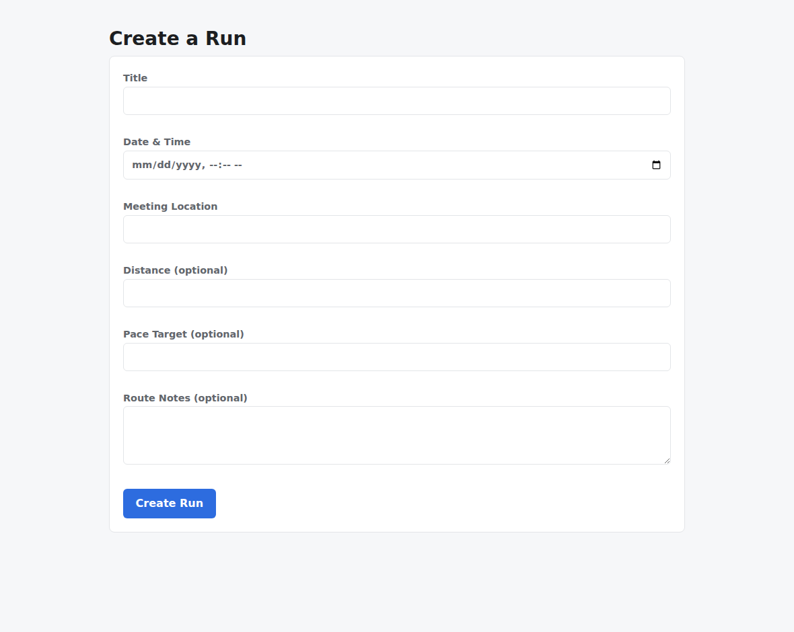
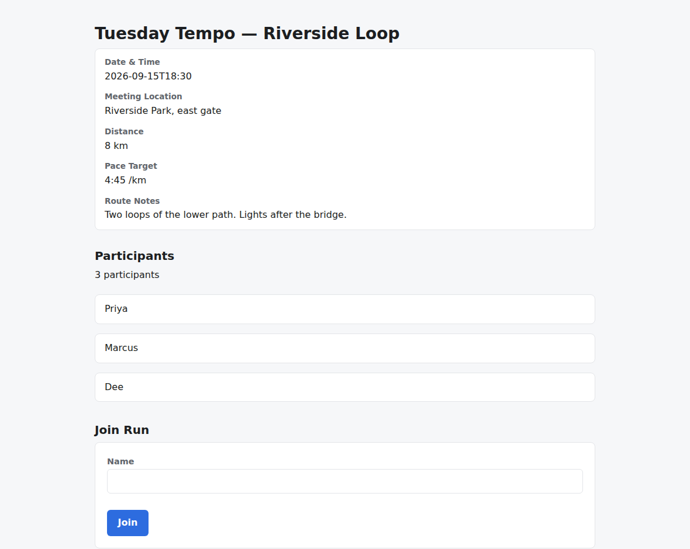
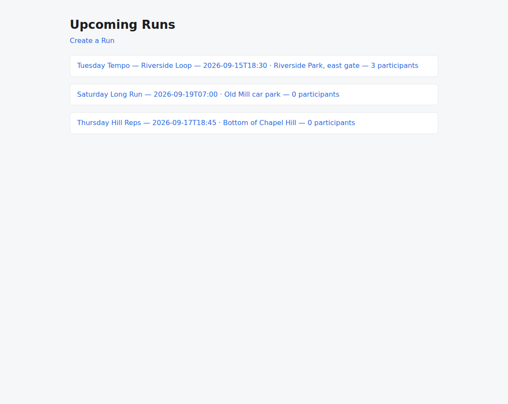
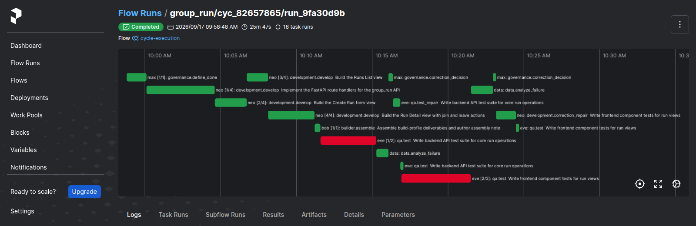

# v1.8.0

**Released 2026-09-17** · [tag `v1.8.0`](https://github.com/backspring-labs/squad-ops/releases/tag/v1.8.0)

**The Judgement release — Scoped Code Revision, and the Cycle Evaluation Scorecard's 1.8 slice.**
Plan: `docs/plans/1-8-0-plan.md` (rev 11). Record:
`docs/plans/1-8-0-verification-set-preregistration.md` §10 — the deploy-E set in §10a–§10b, the
deploy-F set in §10c.

**Scoped Code Revision (SIP-0107, steps 1–6).** A repair of an existing artifact is a transaction:
the candidate has an identity and the stored set must be that candidate (step 1, #1543); the qa
fill merge is the revision transaction's first caller (step 2, #1547); the dev lane carries a
write grant (step 3, #1550); repairs revise existing files by exact anchored edit under an edit
grammar (step 4, #1553, #1555); Python and JSX by entity on a tree-sitter resolver, then TypeScript,
TSX and the handler's try block (steps 5–6, #1557, #1559, #1560, #1561). The line's shakeout then
amended the contract six times, each with its evidence: every repair records the form it was
offered and the form it took (§46k, #1574); a repair offered the edit form is asked for edits, not
the whole file (§46l, #1575); the repair prompt shows the files it asks the model to revise (§46m,
#1577 — the readiness probe read a 5% edit with the file shown against a 93% blind rewrite without
it); an anchor may be a fragment of a line (§46n, #1578); the revision form reads the span each
transaction replaced (§46o, #1579); a fill-mode repair's free-authored files are anchorable (§46p,
#1584). **The default flip, step 7, is 1.8.1's by design** (§46a, the owner's ruling of 2026-09-13).

**The Cycle Evaluation Scorecard, the 1.8 slice (SIP-0108 (a)–(c)).** The run summary row — LLM
usage accounted at the one seam, refunded rounds and the correction movement sequence, the
structured terminal decision, round failures and absent emissions — persisted per run (#1545,
#1546, #1548, #1554); one failure-attribution registry over the eight source vocabularies, with the
inter-workload gate's refusal recorded as values (#1544, #1551); the cycle assessment as a pure
projection, four dimensions of three-state indicators each citing evidence that resolves (#1552,
#1556); the benchmark registry, 79 counted rolls from 1.6.3 through 1.7.5 re-graded read-only
(#1563). **(d), the comparison window, is 1.8.1's** (rev 7, §10g); §10h–§10j name its arms, Solo
and Free-Solo, the placement thesis, and the three aims the scorecard serves.

**The rails and the hardening.** Container packaging rendered from the environment contract, the
builder authoring only the notes (#598); every cycle records the framework version and commit that
created it (#80); every provider and telemetry selector required everywhere — schema, compose,
constructors, both roots (#1449); the pre-memory rejection baseline emitted, 90 cycles read-only
(plan §3.5 B1); the lineage seam extracted (#1527); one frontmatter parser (#579); a round that
carries failures without progress terminates (#1501); the contentless-builder diagnostic split in
two (#1506) and a dev-lane fault registered (#1529); a prose-only diff runs the prose lane in CI
(#1516); the Nostromo crew contract enforced on crew PRs (#1511); the registry audit reports
unparseable frontmatter (#1509); the fill-merge evidence refreshed after every self-eval merge
(#1535); a declared qa suite must be one the runner collects (#1534); a suite loading the app with
a dynamic import invokes it (#1533); a failed containment row routes to the suite's author (#1532);
every record reports the suites the runner never collected (#1540); the next attempt is told why an
unauthorized write was dropped (#1549); the test-database ownership loop skips table-linked
sequences (#1531); the baseline stylesheet styles definition lists (#1499).

**Found by the line's own sets, and fixed on the deploy the cut measures.** The deploy-E set found
seven latent seams in one night, every one surfaced by plan-author variance the framework accepted
at one seam and disowned at another: a qa suite repair for an emission failure refused unheard when
the plan attached no typed row (#1586); a suite at a root-level `tests/` the stack's namespace does
not own, routed to the dev (#1587); an empty repair round verified and retested on nothing (#1589);
a seam read without asking whether its fault applied (#1588); a caret-anchored `regex_match` that
could never match below a document's first line — a counted roll rejected on notes that carried the
headings (#1594); the lead's `verification` label not read as suite-side (#1596); and the seeded
conftest's missing store isolation (#1598, the owner's ruling). Six fixes (#1590, #1591, #1592,
#1593, #1595, #1597) became deploy F, and the set restarted on it.

**Validated by a pre-registered two-arm verification set** on frozen deploy `969cd44e` (HEAD
pinned at `c276419c`; images `runtime-api b3278c26dd25`, `max 36cc6eb9a923`, `neo 07498c2a4a94`,
`nat 1ddf151647c0`, `bob b59711b8f653`, `eve 14d15dc8e3f7`, `data 9a41965b25ad`), **zero drift
under `src/` or `adapters/` between the deploy and the tag**. Eight diagnostics first, each
reaching its seam inside the two-run budget — six on the first run, and the two second runs a
driver reader defect (#1600) and a lead's rewind, not seam misses. Then the counted arm:
FastAPI+React **6 of 6**, Next.js+TS **2 of 3** — **functional 8 of 9**, boot audit PASS 9/9, P0
held 9/9, zero framing re-rolls, every gate on the fixed notes. The bar held: **L1, zero contentless
emissions on every counted roll**. On deploy E the same set had read 4 of 6 and 3 of 3; those
readings stand in §10a–§10b as evidence and do not count.

**Stated at the cut, not implied.** The experimental gate was **not met as registered**: SIP-0107
§39.8's N read **5 of 6**, with the **qa × Next.js cell empty**. Its diagnostic supply — the
own-frame diagnostic in fill mode — was named in the pre-registration's supply table and never
registered, a defect of the pre-registration itself; and the one Next.js roll that produced a qa
fill repair lost its retest to #1602, the fill branch aiming at the shells and never at the failing
free-authored suite beside them (PR #1603, held for 1.8.1 so the tag carries no source drift). The
owner ruled the line closes with the gap named (the 1.7.5 precedent); the flip stays 1.8.1's. The
cells that filled — qa × React 2, dev × React 2, dev × Next.js 1 — include the dev lane's first
live scoped transactions on both stacks: anchored edits of 3% to 11% of the file, verified,
retested, persisted under the identity verified. **#598** read unaskable on every counted roll — no
`container_packaging` row was evaluated on any run — so that prediction is neither held nor
falsified here. **The evidence gate:** every counted cycle's assessment resolves every evidence
reference (22 indicators, 0 unresolved, nine of nine), with `verified_executable` and
`verified_functional` unaskable on every cycle because the clean-room verdict is not yet in the
derivation (SIP-0102 step 5, open); the record does not carry the assessment inline — it is
recomputed from the stores on read, and no reader prints it yet.

**SIP status at the cut.** SIP-0107 stays `accepted` (step 7 is 1.8.1's; §39 measured, not met).
SIP-0108 stays `accepted` ((d) and §5 criteria 6–7 are 1.8.1's). SIP-0105 amended by #598, status
unchanged.

## Merged pull requests (74)

| PR | Title | Closes |
|---|---|---|
| [#1605](https://github.com/backspring-labs/squad-ops/pull/1605) | chore(release): 1.8.0 — the Judgement release | — |
| [#1604](https://github.com/backspring-labs/squad-ops/pull/1604) | docs(1.8.0): pre-registration §10c — the deploy-F set's readings, the §3c count, and the ruling to close on F | — |
| [#1601](https://github.com/backspring-labs/squad-ops/pull/1601) | docs(sip-0108): §10h–§10j — three aims, the Solo and Free-Solo arms, placement on the arm axis | — |
| [#1599](https://github.com/backspring-labs/squad-ops/pull/1599) | docs(1.8.0): pre-registration rev 10 — the set restarts on deploy F after the E set re-opened the loop | — |
| [#1597](https://github.com/backspring-labs/squad-ops/pull/1597) | fix(correction): the lead's 'verification' label reads as suite-side (#1596) | [#1596](https://github.com/backspring-labs/squad-ops/issues/1596) |
| [#1595](https://github.com/backspring-labs/squad-ops/pull/1595) | fix(checks): regex_match anchors lines — a caret-anchored heading check on a document can pass (#1594) | [#1594](https://github.com/backspring-labs/squad-ops/issues/1594) |
| [#1593](https://github.com/backspring-labs/squad-ops/pull/1593) | fix(verification-sets): a seam is read only when its fault applied — the hook's own lines, read into the record (#1588) | [#1588](https://github.com/backspring-labs/squad-ops/issues/1588) |
| [#1592](https://github.com/backspring-labs/squad-ops/pull/1592) | fix(plans): a qa suite must live in the stack's qa test namespace — collected is not owned (#1587) | [#1587](https://github.com/backspring-labs/squad-ops/issues/1587) |
| [#1591](https://github.com/backspring-labs/squad-ops/pull/1591) | fix(correction): an empty repair round is refunded and re-taken, not verified and retested on nothing (#1589) | [#1589](https://github.com/backspring-labs/squad-ops/issues/1589) |
| [#1590](https://github.com/backspring-labs/squad-ops/pull/1590) | fix(correction): a qa suite repair for an emission failure is retested, not refused unheard (#1586) | [#1586](https://github.com/backspring-labs/squad-ops/issues/1586) |
| [#1585](https://github.com/backspring-labs/squad-ops/pull/1585) | docs(1.8.0): the loop set's pre-registration on deploy E — N = 6 with a floor per cell, eight diagnostics, the set configs pinned (plan §7 step 8, rev 9) | — |
| [#1584](https://github.com/backspring-labs/squad-ops/pull/1584) | fix(correction): a fill-mode repair's free-authored files are anchorable; an unoffered whole re-emission reads as whole-file (SIP-0107 §46p, #1583) | [#1583](https://github.com/backspring-labs/squad-ops/issues/1583) |
| [#1580](https://github.com/backspring-labs/squad-ops/pull/1580) | docs(sips): the compile loop and the contested result, drafted for 1.8.1 (SIP-0086 §12a, SIP-0096 §17a); the prompt authoring standard | — |
| [#1582](https://github.com/backspring-labs/squad-ops/pull/1582) | fix(correction): a failing assertion both readings blame on the qa suite is repaired by its author (#1581) | — |
| [#1579](https://github.com/backspring-labs/squad-ops/pull/1579) | feat(correction): the revision form reads the span each transaction replaced (SIP-0107 §46o) | — |
| [#1578](https://github.com/backspring-labs/squad-ops/pull/1578) | feat(revision): an anchor may be a fragment of a line — two exact readings, line first (SIP-0107 §46n) | — |
| [#1577](https://github.com/backspring-labs/squad-ops/pull/1577) | feat(correction): the repair prompt shows the files it asks the model to revise (SIP-0107 §46m, #1576) | [#1576](https://github.com/backspring-labs/squad-ops/issues/1576) |
| [#1575](https://github.com/backspring-labs/squad-ops/pull/1575) | fix(correction): a repair offered the edit form is asked for edits, not the whole file (SIP-0107 §46l) | — |
| [#1574](https://github.com/backspring-labs/squad-ops/pull/1574) | feat(correction): every repair records the edit form it was offered and the form it took (SIP-0107 §46k) | — |
| [#1573](https://github.com/backspring-labs/squad-ops/pull/1573) | fix(verification-sets): the snapshot check reads through `squad-profiles show` — `profiles show` is no command (#1571 follow-up) | — |
| [#1572](https://github.com/backspring-labs/squad-ops/pull/1572) | docs(1.8.0): the set configs for deploy B's checkpoint pair — headline probes, verified live | — |
| [#1569](https://github.com/backspring-labs/squad-ops/pull/1569) | fix(roots): every adapter-factory selector is required — and the agent's memory call named a keyword the factory never read (closes #1449) | [#1449](https://github.com/backspring-labs/squad-ops/issues/1449) |
| [#1571](https://github.com/backspring-labs/squad-ops/pull/1571) | fix(verification-sets): a counting roll refuses to launch on a squad profile the set is not frozen on (#1568) | — |
| [#1567](https://github.com/backspring-labs/squad-ops/pull/1567) | feat(baseline): the pre-memory rejection baseline emitted — 90 cycles, read-only (1.8.0 §3.5, B1) | — |
| [#1566](https://github.com/backspring-labs/squad-ops/pull/1566) | docs(1.8.0): rev 7 — the comparison harness and its window are 1.8.1's (SIP-0108 §10g) | — |
| [#1570](https://github.com/backspring-labs/squad-ops/pull/1570) | fix(config): every provider selector required everywhere — schema, compose, constructors; squad profiles from Postgres (closes #1568) | [#1568](https://github.com/backspring-labs/squad-ops/issues/1568) |
| [#1565](https://github.com/backspring-labs/squad-ops/pull/1565) | fix(roots): the telemetry selectors are required — factories, both roots, and the agent's backend (#1449, telemetry) | — |
| [#1564](https://github.com/backspring-labs/squad-ops/pull/1564) | fix(baseline): the rejection-baseline emitter imports, refuses an unread input, and counts framing runs only (#1562) | [#1562](https://github.com/backspring-labs/squad-ops/issues/1562) |
| [#1563](https://github.com/backspring-labs/squad-ops/pull/1563) | feat(scorecard): the benchmark registry — 79 counted rolls re-graded read-only, captured (SIP-0108 (c)) | — |
| [#1561](https://github.com/backspring-labs/squad-ops/pull/1561) | feat(correction): the structural path on Next.js — TypeScript, TSX and the handler's try block (SIP-0107 step 6) | — |
| [#1560](https://github.com/backspring-labs/squad-ops/pull/1560) | feat(correction): repairs revise Python and JSX by entity (SIP-0107 step 5, model-facing contract) | — |
| [#1559](https://github.com/backspring-labs/squad-ops/pull/1559) | feat(correction): the JavaScript/JSX structural resolver, on tree-sitter (SIP-0107 step 5) | — |
| [#1558](https://github.com/backspring-labs/squad-ops/pull/1558) | fix(correction): tell the next attempt why an unauthorized write was dropped (#1549) | [#1549](https://github.com/backspring-labs/squad-ops/issues/1549) |
| [#1557](https://github.com/backspring-labs/squad-ops/pull/1557) | feat(correction): structural revision of Python — replace, insert, remove, proved by reconstruction (SIP-0107 step 5, first half) | — |
| [#1556](https://github.com/backspring-labs/squad-ops/pull/1556) | feat(scorecard): the assessment reads round failures and absent emissions (SIP-0108 §10e) | — |
| [#1555](https://github.com/backspring-labs/squad-ops/pull/1555) | feat(correction): repairs revise existing files by anchored edit (SIP-0107 step 4, second half) | [#1213](https://github.com/backspring-labs/squad-ops/issues/1213) |
| [#1554](https://github.com/backspring-labs/squad-ops/pull/1554) | feat(scorecard): round failures and absent emissions join the run summary (SIP-0108 §4.1, §4.2) | — |
| [#1553](https://github.com/backspring-labs/squad-ops/pull/1553) | feat(correction): exact anchored targets and the edit grammar (SIP-0107 step 4, first half) | — |
| [#1552](https://github.com/backspring-labs/squad-ops/pull/1552) | feat(scorecard): the cycle assessment — four dimensions over the durable record (SIP-0108 §4.1 (a)) | — |
| [#1551](https://github.com/backspring-labs/squad-ops/pull/1551) | feat(scorecard): the inter-workload gate records its refusal as values (SIP-0108 §4.2) | — |
| [#1550](https://github.com/backspring-labs/squad-ops/pull/1550) | feat(correction): the dev lane carries a write grant (SIP-0107 step 3) | — |
| [#1548](https://github.com/backspring-labs/squad-ops/pull/1548) | feat(scorecard): the structured terminal decision joins the run summary (SIP-0108 §4.1) | — |
| [#1547](https://github.com/backspring-labs/squad-ops/pull/1547) | feat(correction): the revision transaction — the qa fill merge becomes its first caller (SIP-0107 step 2) | — |
| [#1546](https://github.com/backspring-labs/squad-ops/pull/1546) | feat(scorecard): refunded rounds and the correction movement sequence join the run summary (SIP-0108 §4.1) | — |
| [#1545](https://github.com/backspring-labs/squad-ops/pull/1545) | feat(scorecard): the run summary row — LLM usage accounted at the one seam, persisted per run (SIP-0108 §4.1) | — |
| [#1544](https://github.com/backspring-labs/squad-ops/pull/1544) | feat(scorecard): one failure-attribution registry over the eight source vocabularies (SIP-0108 §4.2) | — |
| [#1543](https://github.com/backspring-labs/squad-ops/pull/1543) | feat(correction): a patch's candidate has an identity, and the stored set must be that candidate (SIP-0107 step 1) | — |
| [#1542](https://github.com/backspring-labs/squad-ops/pull/1542) | fix(qa): the fill-merge evidence describes the final artifacts — refreshed after every self-eval merge (#1535) | [#1535](https://github.com/backspring-labs/squad-ops/issues/1535) |
| [#1541](https://github.com/backspring-labs/squad-ops/pull/1541) | feat(verification-sets): every record reports the suites the runner never collected (#1540) | [#1540](https://github.com/backspring-labs/squad-ops/issues/1540) |
| [#1538](https://github.com/backspring-labs/squad-ops/pull/1538) | fix(plans): a declared qa suite must be one the runner collects — Next.js collection stated once (#1534) | [#1534](https://github.com/backspring-labs/squad-ops/issues/1534) |
| [#1537](https://github.com/backspring-labs/squad-ops/pull/1537) | fix(checks): a suite that loads the app with a dynamic import() invokes it (#1533) | [#1533](https://github.com/backspring-labs/squad-ops/issues/1533) |
| [#1536](https://github.com/backspring-labs/squad-ops/pull/1536) | fix(correction): a failed containment row routes to the suite's author — match the row's own name (#1532) | [#1532](https://github.com/backspring-labs/squad-ops/issues/1532) |
| [#1531](https://github.com/backspring-labs/squad-ops/pull/1531) | fix(infra): the test-database ownership loop skips table-linked sequences | — |
| [#1530](https://github.com/backspring-labs/squad-ops/pull/1530) | docs(1.8): deploy A's checkpoint configs — two shakeout arms and #1506's two diagnostics | — |
| [#1529](https://github.com/backspring-labs/squad-ops/pull/1529) | feat(diagnostics): a dev-lane fault — the join response omits the run's declared fields | — |
| [#1528](https://github.com/backspring-labs/squad-ops/pull/1528) | feat(scaffold): container packaging rendered from the environment contract; the builder authors the notes (#598) | [#598](https://github.com/backspring-labs/squad-ops/issues/598) |
| [#1527](https://github.com/backspring-labs/squad-ops/pull/1527) | refactor(cycles): the lineage seam — series_for and prior_in_series, extracted from the inert walk | — |
| [#1525](https://github.com/backspring-labs/squad-ops/pull/1525) | refactor(prompts): one frontmatter parser, squadops.prompts.frontmatter (#579) | [#579](https://github.com/backspring-labs/squad-ops/issues/579) |
| [#1524](https://github.com/backspring-labs/squad-ops/pull/1524) | feat(cycles): every cycle records the framework version and commit that created it (#80) | [#80](https://github.com/backspring-labs/squad-ops/issues/80) |
| [#1523](https://github.com/backspring-labs/squad-ops/pull/1523) | fix(scaffold): the baseline stylesheet styles definition lists (#1499) | [#1499](https://github.com/backspring-labs/squad-ops/issues/1499) |
| [#1521](https://github.com/backspring-labs/squad-ops/pull/1521) | fix(correction): a round that carries failures without progress terminates, not only an exact repeat (#1501) | [#1501](https://github.com/backspring-labs/squad-ops/issues/1501) |
| [#1520](https://github.com/backspring-labs/squad-ops/pull/1520) | sip(accepted): Cycle Evaluation Scorecard is SIP-0108; 1.8.0 plan rev 6 | — |
| [#1519](https://github.com/backspring-labs/squad-ops/pull/1519) | sip(proposed): Cycle Evaluation Scorecard — rev 2, rewritten to the 1.8 slice before its design review | — |
| [#1518](https://github.com/backspring-labs/squad-ops/pull/1518) | fix(diagnostics): the contentless-builder diagnostic is two — R1 on the retry, F1 on a fault that survives it (#1506) | [#1506](https://github.com/backspring-labs/squad-ops/issues/1506) |
| [#1516](https://github.com/backspring-labs/squad-ops/pull/1516) | ci: a prose-only diff runs the prose lane and skips the lanes prose cannot reach | — |
| [#1514](https://github.com/backspring-labs/squad-ops/pull/1514) | refactor(handlers): one self-eval loop and generation tail on the base; qa.test's fill steps become one shape (#1444) | [#1444](https://github.com/backspring-labs/squad-ops/issues/1444) |
| [#1515](https://github.com/backspring-labs/squad-ops/pull/1515) | fix(ci): point the crew check's default rules path at the renamed file | — |
| [#1510](https://github.com/backspring-labs/squad-ops/pull/1510) | docs(1.8): the default flip is 1.8.1's by design — SIP-0107 §46a and plan rev 5 | — |
| [#1511](https://github.com/backspring-labs/squad-ops/pull/1511) | ci: enforce the Nostromo crew contract on crew pull requests | — |
| [#1509](https://github.com/backspring-labs/squad-ops/pull/1509) | fix(sips): the registry audit reports frontmatter it cannot parse — SIP-0020's was broken and skipped | — |
| [#1508](https://github.com/backspring-labs/squad-ops/pull/1508) | docs(1.8): the plan — two headlines by lane, two moves off the row, every open issue placed | — |
| [#1325](https://github.com/backspring-labs/squad-ops/pull/1325) | sip(accepted): Scoped Code Revision is SIP-0107 — accepted at design review, rev 4 folds the required revisions | — |
| [#1505](https://github.com/backspring-labs/squad-ops/pull/1505) | docs(release): capture the v1.7.5 release package | — |
| [#1504](https://github.com/backspring-labs/squad-ops/pull/1504) | fix(release): the package reads squash-merged PRs, not only merge commits | — |

## Improvement proposals

| Proposal | From | To |
|---|---|---|
| [SIP-0107-Scoped-Code-Revision](../../design/sips/SIP-0107-Scoped-Code-Revision.md) | new | accepted |
| [SIP-0108-Cycle-Evaluation-Scorecard](../../design/sips/SIP-0108-Cycle-Evaluation-Scorecard.md) | proposed | accepted |

## Improvement proposals amended in place

No lifecycle change — each was edited under the status it already had (a post-acceptance amendment, CLAUDE.md step 5a).

| Proposal | Status |
|---|---|
| [SIP-0020-Health-Check-WarmBoot-Enhancement](../../design/sips/SIP-0020-Health-Check-WarmBoot-Enhancement.md) | deprecated |
| [SIP-0071-Builder-Role-Dedicated-Product](../../design/sips/SIP-0071-Builder-Role-Dedicated-Product.md) | implemented |
| [SIP-0086-Build-Convergence-Loop-Dynamic](../../design/sips/SIP-0086-Build-Convergence-Loop-Dynamic.md) | implemented |
| [SIP-0096-Verification-Evidence-Integrity](../../design/sips/SIP-0096-Verification-Evidence-Integrity.md) | implemented |
| [SIP-0102-Ephemeral-Application-Sandbox](../../design/sips/SIP-0102-Ephemeral-Application-Sandbox.md) | accepted |
| [SIP-0105-Stack-Blueprint-Contract](../../design/sips/SIP-0105-Stack-Blueprint-Contract.md) | accepted |
| [SIP-Agent-Embodiment-Runtime](../../design/sips/SIP-Agent-Embodiment-Runtime.md) | proposed |
| [SIP-Campaign-Orchestration](../../design/sips/SIP-Campaign-Orchestration.md) | proposed |
| [SIP-Cross-Cycle-Memory](../../design/sips/SIP-Cross-Cycle-Memory.md) | proposed |

## Cycle evidence

### `cyc_0d319c3f68f3`

**Verdict:** `accepted` · **Runs:** 2 · **Role:** diagnostic — fault-injected, non-counting: its verdict is not a verdict about the squad (#1251)

| | Checks |
|---|---|
| Verified | acceptance:command_exit_zero, acceptance:declared_imports, acceptance:endpoint_defined, acceptance:fill_slot_signature, acceptance:frontend_compiles, acceptance:function_defined, acceptance:import_present, acceptance:module_imports, acceptance:undefined_names, acceptance:unterminated_source, acceptance_criteria_prose, expected_artifacts, frontend_build, no_self_mocking_tests, no_stub_fallback_tests, non_stub_files, required_files, tests_pass, vc-probe-runs, vc-probe-runs-join, vc-probe-runs-join-duplicate, vc-probe-runs-leave, vc-probe-runs-rejects-blank |
| Failed | — |
| Required unmet | — |
| Never executed | — |

### `cyc_ad721e796487`

**Verdict:** `accepted` · **Runs:** 2 · **Role:** diagnostic — fault-injected, non-counting: its verdict is not a verdict about the squad (#1251)

| | Checks |
|---|---|
| Verified | acceptance:additive_containment, acceptance:assertion_kinds_match, acceptance:client_mock_surface, acceptance:command_exit_zero, acceptance:declared_imports, acceptance:dom_anchor_queries, acceptance:endpoint_defined, acceptance:fill_slot_signature, acceptance:frontend_compiles, acceptance:import_present, acceptance:module_imports, acceptance:undefined_names, acceptance:unterminated_source, acceptance_criteria_prose, expected_artifacts, frontend_build, no_self_mocking_tests, no_stub_fallback_tests, non_stub_files, required_files, tests_pass, vc-probe-runs, vc-probe-runs-join, vc-probe-runs-join-duplicate, vc-probe-runs-leave, vc-probe-runs-rejects-blank |
| Failed | — |
| Required unmet | — |
| Never executed | — |

### `cyc_19f760e456c5`

**Verdict:** `accepted` · **Runs:** 2 · **Role:** diagnostic — fault-injected, non-counting: its verdict is not a verdict about the squad (#1251)

| | Checks |
|---|---|
| Verified | acceptance:additive_containment, acceptance:assertion_kinds_match, acceptance:client_mock_surface, acceptance:command_exit_zero, acceptance:contract_assertions_match, acceptance:declared_imports, acceptance:dom_anchor_queries, acceptance:endpoint_defined, acceptance:fill_slot_signature, acceptance:frontend_compiles, acceptance:function_defined, acceptance:harness_boundary, acceptance:import_present, acceptance:module_imports, acceptance:undefined_names, acceptance:unterminated_source, acceptance_criteria_prose, expected_artifacts, frontend_build, no_self_mocking_tests, no_stub_fallback_tests, non_stub_files, required_files, tests_pass, vc-probe-runs, vc-probe-runs-join, vc-probe-runs-join-duplicate, vc-probe-runs-leave, vc-probe-runs-rejects-blank |
| Failed | — |
| Required unmet | — |
| Never executed | — |

### `cyc_53d6ff52c989`

**Verdict:** `blocked_unverified` · **Runs:** 2 · **Role:** diagnostic — fault-injected, non-counting: its verdict is not a verdict about the squad (#1251)

| | Checks |
|---|---|
| Verified | acceptance:command_exit_zero, acceptance:declared_imports, acceptance:endpoint_defined, acceptance:fill_slot_signature, acceptance:frontend_compiles, acceptance:import_present, acceptance:module_imports, acceptance:undefined_names, acceptance:unterminated_source, acceptance_criteria_prose, expected_artifacts, non_stub_files, required_files |
| Failed | — |
| Required unmet | frontend_build, tests_pass |
| Never executed | frontend_build, tests_pass |

### `cyc_547a34c8c037`

**Verdict:** `accepted` · **Runs:** 2 · **Role:** diagnostic — fault-injected, non-counting: its verdict is not a verdict about the squad (#1251)

| | Checks |
|---|---|
| Verified | acceptance:command_exit_zero, acceptance:declared_imports, acceptance:endpoint_defined, acceptance:fill_slot_signature, acceptance:frontend_compiles, acceptance:function_defined, acceptance:import_present, acceptance:module_imports, acceptance:undefined_names, acceptance:unterminated_source, acceptance_criteria_prose, expected_artifacts, frontend_build, no_self_mocking_tests, no_stub_fallback_tests, non_stub_files, required_files, tests_pass, vc-probe-runs, vc-probe-runs-join, vc-probe-runs-join-duplicate, vc-probe-runs-rejects-blank |
| Failed | — |
| Required unmet | — |
| Never executed | — |

### `cyc_96d03cdfde2e`

**Verdict:** `accepted` · **Runs:** 2 · **Role:** diagnostic — fault-injected, non-counting: its verdict is not a verdict about the squad (#1251)

| | Checks |
|---|---|
| Verified | acceptance:additive_containment, acceptance:assertion_kinds_match, acceptance:client_mock_surface, acceptance:command_exit_zero, acceptance:contract_assertions_match, acceptance:declared_imports, acceptance:dom_anchor_queries, acceptance:endpoint_defined, acceptance:fill_slot_signature, acceptance:frontend_compiles, acceptance:function_defined, acceptance:harness_boundary, acceptance:import_present, acceptance:module_imports, acceptance:undefined_names, acceptance:unterminated_source, acceptance_criteria_prose, expected_artifacts, frontend_build, no_self_mocking_tests, no_stub_fallback_tests, non_stub_files, required_files, tests_pass, vc-probe-runs, vc-probe-runs-join, vc-probe-runs-join-duplicate, vc-probe-runs-leave, vc-probe-runs-rejects-blank, vc-probe-seed |
| Failed | — |
| Required unmet | — |
| Never executed | — |

### `cyc_1189dc498ac5`

**Verdict:** `accepted` · **Runs:** 2 · **Role:** diagnostic — fault-injected, non-counting: its verdict is not a verdict about the squad (#1251)

| | Checks |
|---|---|
| Verified | acceptance:command_exit_zero, acceptance:declared_imports, acceptance:endpoint_defined, acceptance:fill_slot_signature, acceptance:frontend_compiles, acceptance:function_defined, acceptance:import_present, acceptance:module_imports, acceptance:required_files, acceptance:undefined_names, acceptance:unterminated_source, acceptance_criteria_prose, expected_artifacts, frontend_build, no_self_mocking_tests, no_stub_fallback_tests, non_stub_files, required_files, tests_pass, vc-probe-runs, vc-probe-runs-join, vc-probe-runs-join-duplicate, vc-probe-runs-leave, vc-probe-runs-rejects-blank |
| Failed | — |
| Required unmet | — |
| Never executed | — |

### `cyc_cc6fde7bc637`

**Verdict:** `blocked_unverified` · **Runs:** 2 · **Role:** diagnostic — fault-injected, non-counting: its verdict is not a verdict about the squad (#1251)

| | Checks |
|---|---|
| Verified | acceptance:command_exit_zero, acceptance:declared_imports, acceptance:endpoint_defined, acceptance:fill_slot_signature, acceptance:frontend_compiles, acceptance:import_present, acceptance:module_imports, acceptance:undefined_names, acceptance:unterminated_source, acceptance_criteria_prose, expected_artifacts, non_stub_files |
| Failed | — |
| Required unmet | frontend_build, required_files, tests_pass |
| Never executed | frontend_build, required_files, tests_pass |

### `cyc_5f5a5e61d70c`

**Verdict:** `accepted` · **Runs:** 2 · **Role:** diagnostic — fault-injected, non-counting: its verdict is not a verdict about the squad (#1251)

| | Checks |
|---|---|
| Verified | acceptance:additive_containment, acceptance:assertion_kinds_match, acceptance:client_mock_surface, acceptance:command_exit_zero, acceptance:contract_assertions_match, acceptance:declared_imports, acceptance:dom_anchor_queries, acceptance:endpoint_defined, acceptance:fill_slot_signature, acceptance:frontend_compiles, acceptance:function_defined, acceptance:harness_boundary, acceptance:import_present, acceptance:module_imports, acceptance:required_files, acceptance:undefined_names, acceptance:unterminated_source, acceptance_criteria_prose, expected_artifacts, frontend_build, no_self_mocking_tests, no_stub_fallback_tests, non_stub_files, required_files, tests_pass, vc-probe-runs, vc-probe-runs-join, vc-probe-runs-join-duplicate, vc-probe-runs-leave, vc-probe-runs-rejects-blank |
| Failed | — |
| Required unmet | — |
| Never executed | — |

### `cyc_1417b1f9cfaf`

**Verdict:** `accepted` · **Runs:** 2 · **Role:** diagnostic — fault-injected, non-counting: its verdict is not a verdict about the squad (#1251)

| | Checks |
|---|---|
| Verified | acceptance:additive_containment, acceptance:assertion_kinds_match, acceptance:client_mock_surface, acceptance:command_exit_zero, acceptance:contract_assertions_match, acceptance:declared_imports, acceptance:dom_anchor_queries, acceptance:endpoint_defined, acceptance:fill_slot_signature, acceptance:frontend_compiles, acceptance:function_defined, acceptance:harness_boundary, acceptance:import_present, acceptance:module_imports, acceptance:regex_match, acceptance:undefined_names, acceptance:unterminated_source, acceptance_criteria_prose, expected_artifacts, frontend_build, no_self_mocking_tests, no_stub_fallback_tests, non_stub_files, required_files, tests_pass, vc-probe-runs, vc-probe-runs-join, vc-probe-runs-join-duplicate, vc-probe-runs-leave, vc-probe-runs-rejects-blank |
| Failed | — |
| Required unmet | — |
| Never executed | — |

### `cyc_46feb237a509`

**Verdict:** `accepted` · **Runs:** 2 · **Role:** diagnostic — fault-injected, non-counting: its verdict is not a verdict about the squad (#1251)

| | Checks |
|---|---|
| Verified | acceptance:additive_containment, acceptance:assertion_kinds_match, acceptance:client_mock_surface, acceptance:command_exit_zero, acceptance:contract_assertions_match, acceptance:declared_imports, acceptance:dom_anchor_queries, acceptance:endpoint_defined, acceptance:fill_slot_signature, acceptance:frontend_compiles, acceptance:function_defined, acceptance:harness_boundary, acceptance:import_present, acceptance:module_imports, acceptance:undefined_names, acceptance:unterminated_source, acceptance_criteria_prose, expected_artifacts, frontend_build, no_self_mocking_tests, no_stub_fallback_tests, non_stub_files, required_files, tests_pass, vc-probe-runs, vc-probe-runs-join, vc-probe-runs-join-duplicate, vc-probe-runs-leave, vc-probe-runs-rejects-blank |
| Failed | — |
| Required unmet | — |
| Never executed | — |

### `cyc_717f0bb0efcf`

**Verdict:** `accepted` · **Runs:** 2 · **Role:** diagnostic — fault-injected, non-counting: its verdict is not a verdict about the squad (#1251)

| | Checks |
|---|---|
| Verified | acceptance:command_exit_zero, acceptance:declared_imports, acceptance:endpoint_defined, acceptance:fill_slot_signature, acceptance:frontend_compiles, acceptance:function_defined, acceptance:import_present, acceptance:module_imports, acceptance:undefined_names, acceptance:unterminated_source, acceptance_criteria_prose, expected_artifacts, frontend_build, no_self_mocking_tests, no_stub_fallback_tests, non_stub_files, required_files, tests_pass, vc-probe-runs, vc-probe-runs-join, vc-probe-runs-join-duplicate, vc-probe-runs-leave, vc-probe-runs-rejects-blank |
| Failed | — |
| Required unmet | — |
| Never executed | — |

### `cyc_1a884daafed6`

**Verdict:** `rejected` · **Runs:** 2 · **Role:** diagnostic — fault-injected, non-counting: its verdict is not a verdict about the squad (#1251)

| | Checks |
|---|---|
| Verified | acceptance:assertion_kinds_match, acceptance:command_exit_zero, acceptance:contract_assertions_match, acceptance:declared_imports, acceptance:endpoint_defined, acceptance:fill_slot_signature, acceptance:frontend_compiles, acceptance:function_defined, acceptance:harness_boundary, acceptance:import_present, acceptance:module_imports, acceptance:undefined_names, acceptance:unterminated_source, acceptance_criteria_prose, expected_artifacts, frontend_build, no_self_mocking_tests, no_stub_fallback_tests, non_stub_files, required_files, vc-probe-runs-rejects-blank |
| Failed | vc-probe-runs, vc-probe-runs-join, vc-probe-runs-join-duplicate, vc-probe-runs-leave, tests_pass |
| Required unmet | — |
| Never executed | — |

### `cyc_b6a4ba977d5e`

**Verdict:** `accepted` · **Runs:** 2 · **Role:** diagnostic — fault-injected, non-counting: its verdict is not a verdict about the squad (#1251)

| | Checks |
|---|---|
| Verified | acceptance:additive_containment, acceptance:assertion_kinds_match, acceptance:declared_imports, acceptance:dom_anchor_queries, acceptance:frontend_compiles, acceptance:undefined_names, acceptance:unterminated_source, acceptance_criteria_prose, expected_artifacts, frontend_build, no_self_mocking_tests, no_stub_fallback_tests, non_stub_files, required_files, tests_pass, vc-probe-api-runs, vc-probe-api-runs-join, vc-probe-api-runs-join-duplicate, vc-probe-api-runs-leave, vc-probe-api-runs-rejects-blank |
| Failed | — |
| Required unmet | — |
| Never executed | — |

### `cyc_13f3a3056c29`

**Verdict:** `accepted` · **Runs:** 2 · **Role:** diagnostic — fault-injected, non-counting: its verdict is not a verdict about the squad (#1251)

| | Checks |
|---|---|
| Verified | acceptance:additive_containment, acceptance:assertion_kinds_match, acceptance:declared_imports, acceptance:dom_anchor_queries, acceptance:frontend_compiles, acceptance:regex_match, acceptance:required_files, acceptance:undefined_names, acceptance:unterminated_source, acceptance_criteria_prose, expected_artifacts, frontend_build, no_self_mocking_tests, no_stub_fallback_tests, non_stub_files, required_files, tests_pass, vc-probe-api-runs, vc-probe-api-runs-join, vc-probe-api-runs-join-duplicate, vc-probe-api-runs-leave, vc-probe-api-runs-rejects-blank |
| Failed | — |
| Required unmet | — |
| Never executed | — |

### `cyc_eee9b62e6a4f`

**Verdict:** `accepted` · **Runs:** 2 · **Role:** diagnostic — fault-injected, non-counting: its verdict is not a verdict about the squad (#1251)

| | Checks |
|---|---|
| Verified | acceptance:command_exit_zero, acceptance:declared_imports, acceptance:endpoint_defined, acceptance:fill_slot_signature, acceptance:frontend_compiles, acceptance:function_defined, acceptance:import_present, acceptance:module_imports, acceptance:undefined_names, acceptance:unterminated_source, acceptance_criteria_prose, expected_artifacts, frontend_build, no_self_mocking_tests, no_stub_fallback_tests, non_stub_files, required_files, tests_pass, vc-probe-runs, vc-probe-runs-join, vc-probe-runs-join-duplicate, vc-probe-runs-leave, vc-probe-runs-rejects-blank |
| Failed | — |
| Required unmet | — |
| Never executed | — |

### `cyc_44535c62fbe0`

**Verdict:** `accepted` · **Runs:** 2 · **Role:** diagnostic — fault-injected, non-counting: its verdict is not a verdict about the squad (#1251)

| | Checks |
|---|---|
| Verified | acceptance:additive_containment, acceptance:assertion_kinds_match, acceptance:client_mock_surface, acceptance:command_exit_zero, acceptance:contract_assertions_match, acceptance:declared_imports, acceptance:dom_anchor_queries, acceptance:endpoint_defined, acceptance:fill_slot_signature, acceptance:frontend_compiles, acceptance:function_defined, acceptance:harness_boundary, acceptance:import_present, acceptance:module_imports, acceptance:undefined_names, acceptance:unterminated_source, acceptance_criteria_prose, expected_artifacts, frontend_build, no_self_mocking_tests, no_stub_fallback_tests, non_stub_files, required_files, tests_pass, vc-probe-runs, vc-probe-runs-join, vc-probe-runs-join-duplicate, vc-probe-runs-leave, vc-probe-runs-rejects-blank |
| Failed | — |
| Required unmet | — |
| Never executed | — |

### `cyc_cffd397343a4`

**Verdict:** `accepted` · **Runs:** 2 · **Role:** diagnostic — fault-injected, non-counting: its verdict is not a verdict about the squad (#1251)

| | Checks |
|---|---|
| Verified | acceptance:additive_containment, acceptance:assertion_kinds_match, acceptance:client_mock_surface, acceptance:command_exit_zero, acceptance:contract_assertions_match, acceptance:declared_imports, acceptance:dom_anchor_queries, acceptance:endpoint_defined, acceptance:fill_slot_signature, acceptance:frontend_compiles, acceptance:function_defined, acceptance:harness_boundary, acceptance:import_present, acceptance:module_imports, acceptance:undefined_names, acceptance:unterminated_source, acceptance_criteria_prose, expected_artifacts, frontend_build, no_self_mocking_tests, no_stub_fallback_tests, non_stub_files, required_files, tests_pass, vc-probe-runs, vc-probe-runs-join, vc-probe-runs-join-duplicate, vc-probe-runs-leave, vc-probe-runs-rejects-blank |
| Failed | — |
| Required unmet | — |
| Never executed | — |

### `cyc_a466aa7690bb`

**Verdict:** `accepted` · **Runs:** 2 · **Role:** diagnostic — fault-injected, non-counting: its verdict is not a verdict about the squad (#1251)

| | Checks |
|---|---|
| Verified | acceptance:assertion_kinds_match, acceptance:command_exit_zero, acceptance:contract_assertions_match, acceptance:declared_imports, acceptance:endpoint_defined, acceptance:fill_slot_signature, acceptance:frontend_compiles, acceptance:function_defined, acceptance:harness_boundary, acceptance:import_present, acceptance:module_imports, acceptance:undefined_names, acceptance:unterminated_source, acceptance_criteria_prose, expected_artifacts, frontend_build, no_self_mocking_tests, no_stub_fallback_tests, non_stub_files, required_files, tests_pass, vc-probe-runs, vc-probe-runs-join, vc-probe-runs-join-duplicate, vc-probe-runs-leave, vc-probe-runs-rejects-blank |
| Failed | — |
| Required unmet | — |
| Never executed | — |

### `cyc_f653c9ea9d9e`

**Verdict:** `accepted` · **Runs:** 2 · **Role:** diagnostic — fault-injected, non-counting: its verdict is not a verdict about the squad (#1251)

| | Checks |
|---|---|
| Verified | acceptance:additive_containment, acceptance:assertion_kinds_match, acceptance:client_mock_surface, acceptance:command_exit_zero, acceptance:contract_assertions_match, acceptance:declared_imports, acceptance:dom_anchor_queries, acceptance:endpoint_defined, acceptance:fill_slot_signature, acceptance:frontend_compiles, acceptance:function_defined, acceptance:harness_boundary, acceptance:import_present, acceptance:module_imports, acceptance:undefined_names, acceptance:unterminated_source, acceptance_criteria_prose, expected_artifacts, frontend_build, no_self_mocking_tests, no_stub_fallback_tests, non_stub_files, required_files, tests_pass, vc-probe-runs, vc-probe-runs-join, vc-probe-runs-join-duplicate, vc-probe-runs-leave, vc-probe-runs-rejects-blank |
| Failed | — |
| Required unmet | — |
| Never executed | — |

### `cyc_9fd0990f1912`

**Verdict:** `accepted` · **Runs:** 2 · **Role:** void — void: the roll was stopped and the set restarted (the record's §0)

| | Checks |
|---|---|
| Verified | acceptance:command_exit_zero, acceptance:declared_imports, acceptance:endpoint_defined, acceptance:fill_slot_signature, acceptance:frontend_compiles, acceptance:function_defined, acceptance:import_present, acceptance:module_imports, acceptance:undefined_names, acceptance:unterminated_source, acceptance_criteria_prose, expected_artifacts, frontend_build, no_self_mocking_tests, no_stub_fallback_tests, non_stub_files, required_files, tests_pass, vc-probe-runs, vc-probe-runs-join, vc-probe-runs-join-duplicate, vc-probe-runs-leave, vc-probe-runs-rejects-blank |
| Failed | — |
| Required unmet | — |
| Never executed | — |

### `cyc_0b545fbf8997`

**Verdict:** `accepted` · **Runs:** 2 · **Role:** void — void: the roll was stopped and the set restarted (the record's §0)

| | Checks |
|---|---|
| Verified | acceptance:command_exit_zero, acceptance:declared_imports, acceptance:endpoint_defined, acceptance:fill_slot_signature, acceptance:frontend_compiles, acceptance:function_defined, acceptance:import_present, acceptance:module_imports, acceptance:undefined_names, acceptance:unterminated_source, acceptance_criteria_prose, expected_artifacts, frontend_build, no_self_mocking_tests, no_stub_fallback_tests, non_stub_files, required_files, tests_pass, vc-probe-runs, vc-probe-runs-join, vc-probe-runs-join-duplicate, vc-probe-runs-leave, vc-probe-runs-rejects-blank, vc-probe-runs-seed |
| Failed | — |
| Required unmet | — |
| Never executed | — |

### `cyc_83934970bdba`

**Verdict:** `accepted` · **Runs:** 2 · **Role:** void — void: the roll was stopped and the set restarted (the record's §0)

| | Checks |
|---|---|
| Verified | acceptance:additive_containment, acceptance:assertion_kinds_match, acceptance:client_mock_surface, acceptance:command_exit_zero, acceptance:declared_imports, acceptance:dom_anchor_queries, acceptance:endpoint_defined, acceptance:fill_slot_signature, acceptance:frontend_compiles, acceptance:function_defined, acceptance:import_present, acceptance:module_imports, acceptance:undefined_names, acceptance:unterminated_source, acceptance_criteria_prose, expected_artifacts, frontend_build, no_self_mocking_tests, no_stub_fallback_tests, non_stub_files, required_files, tests_pass, vc-probe-runs, vc-probe-runs-join, vc-probe-runs-join-duplicate, vc-probe-runs-leave, vc-probe-runs-rejects-blank |
| Failed | — |
| Required unmet | — |
| Never executed | — |

### `cyc_7599ed9ef73b`

**Verdict:** `accepted` · **Runs:** 2 · **Role:** void — void: the roll was stopped and the set restarted (the record's §0)

| | Checks |
|---|---|
| Verified | acceptance:additive_containment, acceptance:assertion_kinds_match, acceptance:client_mock_surface, acceptance:command_exit_zero, acceptance:declared_imports, acceptance:dom_anchor_queries, acceptance:endpoint_defined, acceptance:fill_slot_signature, acceptance:frontend_compiles, acceptance:function_defined, acceptance:import_present, acceptance:module_imports, acceptance:undefined_names, acceptance:unterminated_source, acceptance_criteria_prose, expected_artifacts, frontend_build, no_self_mocking_tests, no_stub_fallback_tests, non_stub_files, required_files, tests_pass, vc-probe-runs, vc-probe-runs-join, vc-probe-runs-join-duplicate, vc-probe-runs-leave, vc-probe-runs-rejects-blank |
| Failed | — |
| Required unmet | — |
| Never executed | — |

### `cyc_7998e63be37f`

**Verdict:** `blocked_unverified` · **Runs:** 2 · **Role:** void — void: the roll was stopped and the set restarted (the record's §0)

| | Checks |
|---|---|
| Verified | acceptance:command_exit_zero, acceptance:declared_imports, acceptance:endpoint_defined, acceptance:fill_slot_signature, acceptance:frontend_compiles, acceptance:import_present, acceptance:module_imports, acceptance:undefined_names, acceptance:unterminated_source, acceptance_criteria_prose, expected_artifacts, non_stub_files, required_files |
| Failed | acceptance:regex_match |
| Required unmet | frontend_build, tests_pass |
| Never executed | frontend_build, tests_pass |

### `cyc_767ad2dc59d2`

**Verdict:** `rejected` · **Runs:** 2 · **Role:** void — void: the roll was stopped and the set restarted (the record's §0)

| | Checks |
|---|---|
| Verified | acceptance:assertion_kinds_match, acceptance:command_exit_zero, acceptance:contract_assertions_match, acceptance:declared_imports, acceptance:endpoint_defined, acceptance:fill_slot_signature, acceptance:frontend_compiles, acceptance:function_defined, acceptance:harness_boundary, acceptance:import_present, acceptance:module_imports, acceptance:undefined_names, acceptance:unterminated_source, acceptance_criteria_prose, expected_artifacts, frontend_build, no_self_mocking_tests, no_stub_fallback_tests, non_stub_files, required_files, vc-probe-runs, vc-probe-runs-join, vc-probe-runs-join-duplicate, vc-probe-runs-leave, vc-probe-runs-rejects-blank |
| Failed | tests_pass |
| Required unmet | — |
| Never executed | — |

### `cyc_7529a4eb8f1f`

**Verdict:** `accepted` · **Runs:** 2 · **Role:** void — void: the roll was stopped and the set restarted (the record's §0)

| | Checks |
|---|---|
| Verified | acceptance:additive_containment, acceptance:assertion_kinds_match, acceptance:declared_imports, acceptance:dom_anchor_queries, acceptance:frontend_compiles, acceptance:undefined_names, acceptance:unterminated_source, acceptance_criteria_prose, expected_artifacts, frontend_build, no_self_mocking_tests, no_stub_fallback_tests, non_stub_files, required_files, tests_pass, vc-probe-api-runs, vc-probe-api-runs-join, vc-probe-api-runs-join-duplicate, vc-probe-api-runs-leave, vc-probe-api-runs-rejects-blank |
| Failed | — |
| Required unmet | — |
| Never executed | — |

### `cyc_11a72c6842dc`

**Verdict:** `accepted` · **Runs:** 2 · **Role:** void — void: the roll was stopped and the set restarted (the record's §0)

| | Checks |
|---|---|
| Verified | acceptance:additive_containment, acceptance:assertion_kinds_match, acceptance:count_at_least, acceptance:declared_imports, acceptance:dom_anchor_queries, acceptance:frontend_compiles, acceptance:undefined_names, acceptance:unterminated_source, acceptance_criteria_prose, expected_artifacts, frontend_build, no_self_mocking_tests, no_stub_fallback_tests, non_stub_files, required_files, tests_pass, vc-probe-api-runs, vc-probe-api-runs-participants, vc-probe-api-runs-participants-duplicate, vc-probe-api-runs-rejects-blank |
| Failed | — |
| Required unmet | — |
| Never executed | — |

### `cyc_c2cae2841022`

**Verdict:** `accepted` · **Runs:** 2 · **Role:** void — void: the roll was stopped and the set restarted (the record's §0)

| | Checks |
|---|---|
| Verified | acceptance:additive_containment, acceptance:assertion_kinds_match, acceptance:declared_imports, acceptance:dom_anchor_queries, acceptance:frontend_compiles, acceptance:undefined_names, acceptance:unterminated_source, acceptance_criteria_prose, expected_artifacts, frontend_build, no_self_mocking_tests, no_stub_fallback_tests, non_stub_files, required_files, tests_pass, vc-probe-api-runs, vc-probe-api-runs-join, vc-probe-api-runs-join-duplicate, vc-probe-api-runs-leave, vc-probe-api-runs-rejects-blank |
| Failed | — |
| Required unmet | — |
| Never executed | — |

### `cyc_235bc295e807`

**Verdict:** `accepted` · **Runs:** 2 · **Role:** counted

| | Checks |
|---|---|
| Verified | acceptance:additive_containment, acceptance:assertion_kinds_match, acceptance:client_mock_surface, acceptance:command_exit_zero, acceptance:contract_assertions_match, acceptance:declared_imports, acceptance:dom_anchor_queries, acceptance:endpoint_defined, acceptance:fill_slot_signature, acceptance:frontend_compiles, acceptance:function_defined, acceptance:harness_boundary, acceptance:import_present, acceptance:module_imports, acceptance:undefined_names, acceptance:unterminated_source, acceptance_criteria_prose, expected_artifacts, frontend_build, no_self_mocking_tests, no_stub_fallback_tests, non_stub_files, required_files, tests_pass, vc-probe-runs, vc-probe-runs-join, vc-probe-runs-join-duplicate, vc-probe-runs-leave, vc-probe-runs-rejects-blank |
| Failed | — |
| Required unmet | — |
| Never executed | — |

### `cyc_17cf89a479eb`

**Verdict:** `accepted` · **Runs:** 2 · **Role:** counted

| | Checks |
|---|---|
| Verified | acceptance:additive_containment, acceptance:assertion_kinds_match, acceptance:client_mock_surface, acceptance:command_exit_zero, acceptance:contract_assertions_match, acceptance:declared_imports, acceptance:dom_anchor_queries, acceptance:endpoint_defined, acceptance:fill_slot_signature, acceptance:frontend_compiles, acceptance:function_defined, acceptance:harness_boundary, acceptance:import_present, acceptance:module_imports, acceptance:undefined_names, acceptance:unterminated_source, acceptance_criteria_prose, expected_artifacts, frontend_build, no_self_mocking_tests, no_stub_fallback_tests, non_stub_files, required_files, tests_pass, vc-probe-runs, vc-probe-runs-leave, vc-probe-runs-participants, vc-probe-runs-participants-duplicate, vc-probe-runs-rejects-blank |
| Failed | — |
| Required unmet | — |
| Never executed | — |

### `cyc_8265786551de`

**Verdict:** `accepted` · **Runs:** 2 · **Role:** counted

| | Checks |
|---|---|
| Verified | acceptance:additive_containment, acceptance:assertion_kinds_match, acceptance:client_mock_surface, acceptance:command_exit_zero, acceptance:contract_assertions_match, acceptance:declared_imports, acceptance:dom_anchor_queries, acceptance:endpoint_defined, acceptance:fill_slot_signature, acceptance:frontend_compiles, acceptance:function_defined, acceptance:harness_boundary, acceptance:import_present, acceptance:module_imports, acceptance:undefined_names, acceptance:unterminated_source, acceptance_criteria_prose, expected_artifacts, frontend_build, no_self_mocking_tests, no_stub_fallback_tests, non_stub_files, required_files, tests_pass, vc-probe-runs, vc-probe-runs-participants, vc-probe-runs-participants-duplicate, vc-probe-runs-rejects-blank |
| Failed | — |
| Required unmet | — |
| Never executed | — |

### `cyc_f4770fd1a688`

**Verdict:** `accepted` · **Runs:** 2 · **Role:** counted

| | Checks |
|---|---|
| Verified | acceptance:additive_containment, acceptance:assertion_kinds_match, acceptance:client_mock_surface, acceptance:command_exit_zero, acceptance:contract_assertions_match, acceptance:declared_imports, acceptance:dom_anchor_queries, acceptance:endpoint_defined, acceptance:fill_slot_signature, acceptance:frontend_compiles, acceptance:function_defined, acceptance:harness_boundary, acceptance:import_present, acceptance:module_imports, acceptance:undefined_names, acceptance:unterminated_source, acceptance_criteria_prose, expected_artifacts, frontend_build, no_self_mocking_tests, no_stub_fallback_tests, non_stub_files, required_files, tests_pass, vc-probe-runs, vc-probe-runs-join, vc-probe-runs-join-duplicate, vc-probe-runs-leave, vc-probe-runs-rejects-blank |
| Failed | — |
| Required unmet | — |
| Never executed | — |

### `cyc_eba0687f150a`

**Verdict:** `accepted` · **Runs:** 2 · **Role:** counted

| | Checks |
|---|---|
| Verified | acceptance:additive_containment, acceptance:assertion_kinds_match, acceptance:client_mock_surface, acceptance:command_exit_zero, acceptance:contract_assertions_match, acceptance:declared_imports, acceptance:dom_anchor_queries, acceptance:endpoint_defined, acceptance:fill_slot_signature, acceptance:frontend_compiles, acceptance:function_defined, acceptance:harness_boundary, acceptance:import_present, acceptance:module_imports, acceptance:undefined_names, acceptance:unterminated_source, acceptance_criteria_prose, expected_artifacts, frontend_build, no_self_mocking_tests, no_stub_fallback_tests, non_stub_files, required_files, tests_pass, vc-probe-runs, vc-probe-runs-join, vc-probe-runs-join-duplicate, vc-probe-runs-leave, vc-probe-runs-rejects-blank |
| Failed | — |
| Required unmet | — |
| Never executed | — |

### `cyc_af936062dbad`

**Verdict:** `accepted` · **Runs:** 2 · **Role:** counted

| | Checks |
|---|---|
| Verified | acceptance:additive_containment, acceptance:assertion_kinds_match, acceptance:client_mock_surface, acceptance:command_exit_zero, acceptance:contract_assertions_match, acceptance:declared_imports, acceptance:dom_anchor_queries, acceptance:endpoint_defined, acceptance:fill_slot_signature, acceptance:frontend_compiles, acceptance:function_defined, acceptance:harness_boundary, acceptance:import_present, acceptance:module_imports, acceptance:undefined_names, acceptance:unterminated_source, acceptance_criteria_prose, expected_artifacts, frontend_build, no_self_mocking_tests, no_stub_fallback_tests, non_stub_files, required_files, tests_pass, vc-probe-runs, vc-probe-runs-join, vc-probe-runs-join-duplicate, vc-probe-runs-leave, vc-probe-runs-rejects-blank |
| Failed | — |
| Required unmet | — |
| Never executed | — |

### `cyc_bb493eb4725b`

**Verdict:** `rejected` · **Runs:** 2 · **Role:** counted

| | Checks |
|---|---|
| Verified | acceptance:additive_containment, acceptance:assertion_kinds_match, acceptance:count_at_least, acceptance:declared_imports, acceptance:dom_anchor_queries, acceptance:frontend_compiles, acceptance:undefined_names, acceptance:unterminated_source, acceptance_criteria_prose, expected_artifacts, frontend_build, no_self_mocking_tests, no_stub_fallback_tests, non_stub_files, required_files, vc-probe-api-runs, vc-probe-api-runs-join, vc-probe-api-runs-join-duplicate, vc-probe-api-runs-leave, vc-probe-api-runs-rejects-blank |
| Failed | tests_pass |
| Required unmet | — |
| Never executed | — |

### `cyc_76ec16b86eeb`

**Verdict:** `accepted` · **Runs:** 2 · **Role:** counted

| | Checks |
|---|---|
| Verified | acceptance:additive_containment, acceptance:assertion_kinds_match, acceptance:declared_imports, acceptance:dom_anchor_queries, acceptance:frontend_compiles, acceptance:undefined_names, acceptance:unterminated_source, acceptance_criteria_prose, expected_artifacts, frontend_build, no_self_mocking_tests, no_stub_fallback_tests, non_stub_files, required_files, tests_pass, vc-probe-api-runs, vc-probe-api-runs-join, vc-probe-api-runs-join-duplicate, vc-probe-api-runs-rejects-blank |
| Failed | — |
| Required unmet | — |
| Never executed | — |

### `cyc_df0bc3d30e53`

**Verdict:** `accepted` · **Runs:** 2 · **Role:** counted

| | Checks |
|---|---|
| Verified | acceptance:additive_containment, acceptance:assertion_kinds_match, acceptance:declared_imports, acceptance:dom_anchor_queries, acceptance:frontend_compiles, acceptance:regex_match, acceptance:undefined_names, acceptance:unterminated_source, acceptance_criteria_prose, expected_artifacts, frontend_build, no_self_mocking_tests, no_stub_fallback_tests, non_stub_files, required_files, tests_pass, vc-probe-api-runs, vc-probe-api-runs-participants, vc-probe-api-runs-participants-duplicate, vc-probe-api-runs-rejects-blank |
| Failed | — |
| Required unmet | — |
| Never executed | — |

### `cyc_930df0dbb13c`

**Verdict:** `accepted` · **Runs:** 2 · **Role:** shakeout — non-counting: the deploy's shakeout, read for seam findings

| | Checks |
|---|---|
| Verified | acceptance:additive_containment, acceptance:assertion_kinds_match, acceptance:client_mock_surface, acceptance:command_exit_zero, acceptance:declared_imports, acceptance:dom_anchor_queries, acceptance:endpoint_defined, acceptance:fill_slot_signature, acceptance:frontend_compiles, acceptance:function_defined, acceptance:import_present, acceptance:module_imports, acceptance:undefined_names, acceptance:unterminated_source, acceptance_criteria_prose, expected_artifacts, frontend_build, no_self_mocking_tests, no_stub_fallback_tests, non_stub_files, required_files, tests_pass, vc-probe-runs, vc-probe-runs-join, vc-probe-runs-join-duplicate, vc-probe-runs-leave, vc-probe-runs-rejects-blank |
| Failed | — |
| Required unmet | — |
| Never executed | — |

### `cyc_2b8da9f82ed7`

**Verdict:** `accepted` · **Runs:** 2 · **Role:** shakeout — non-counting: the deploy's shakeout, read for seam findings

| | Checks |
|---|---|
| Verified | acceptance:additive_containment, acceptance:assertion_kinds_match, acceptance:declared_imports, acceptance:dom_anchor_queries, acceptance:frontend_compiles, acceptance:undefined_names, acceptance:unterminated_source, acceptance_criteria_prose, expected_artifacts, frontend_build, no_self_mocking_tests, no_stub_fallback_tests, non_stub_files, required_files, tests_pass, vc-probe-api-runs, vc-probe-api-runs-join, vc-probe-api-runs-join-duplicate, vc-probe-api-runs-leave, vc-probe-api-runs-rejects-blank |
| Failed | — |
| Required unmet | — |
| Never executed | — |

## Screenshots

Of cycle `cyc_8265786551de` (counted) — the counted roll that carried both headline transactions — a qa anchored edit (2% of the suite) and a dev anchored edit (4% of a view), each verified, retested and persisted under the identity verified; the six clean rolls show nothing of the headline, and the Next.js roll that shows its gap (#1602) is named in the record.

*delivered app create run form*

*delivered app run detail with participants*

*delivered app run list*

*prefect flow run with a qa and a dev scoped repair*
