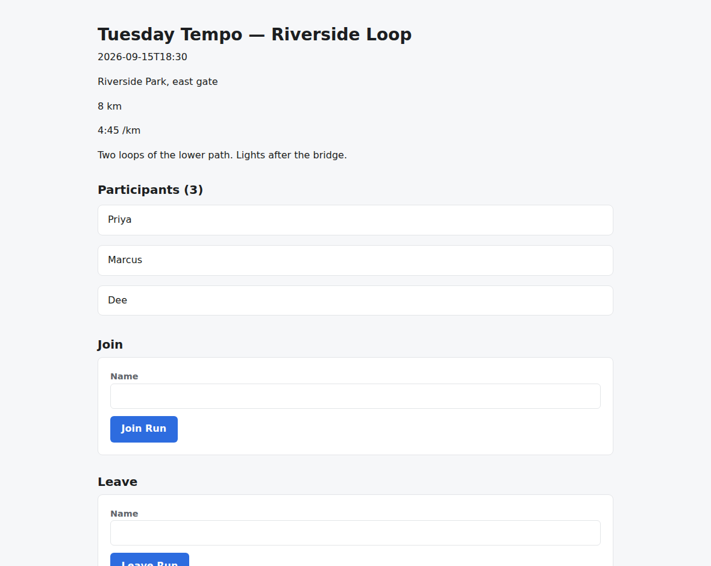
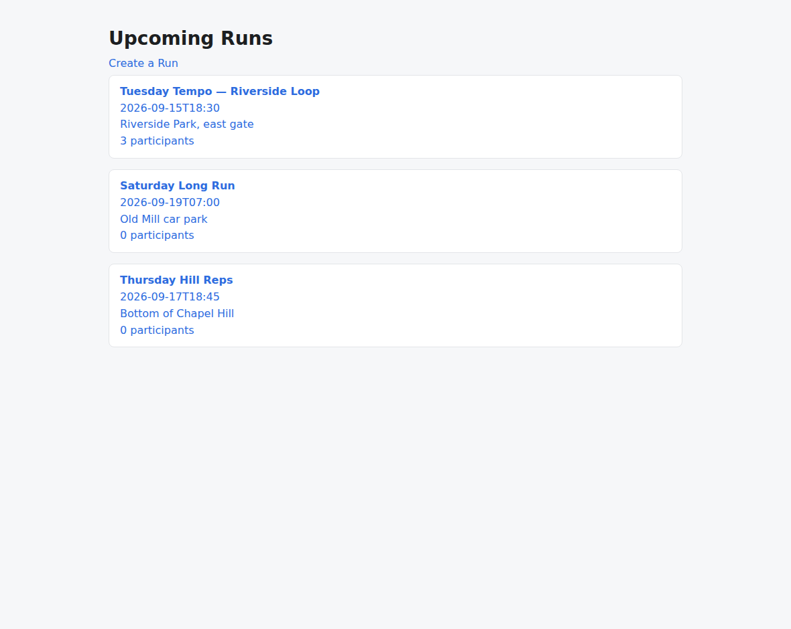
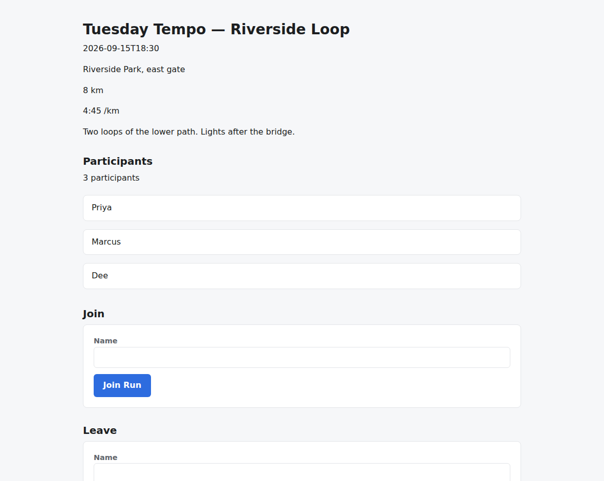
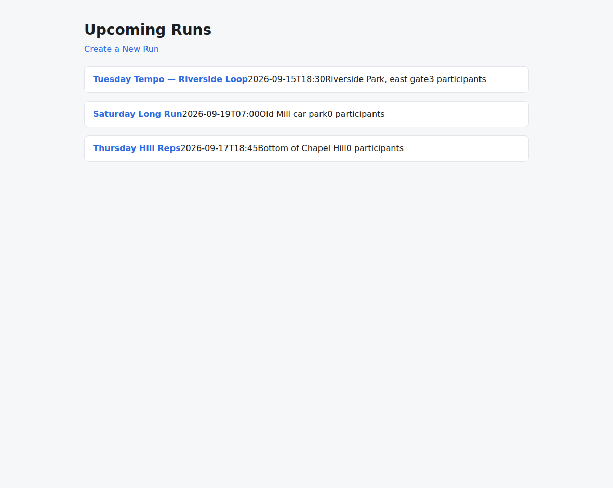
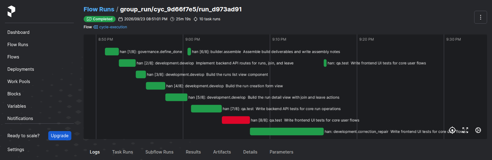

# v1.8.1

**Released 2026-09-24** · [tag `v1.8.1`](https://github.com/backspring-labs/squad-ops/releases/tag/v1.8.1)

**The comparison release: the squad against one generalist, measured.** Plan:
`docs/plans/1-8-1-plan.md` (rev 5). Record: `docs/plans/1-8-1-verification-set-preregistration.md`
§10 (deploy A) and `docs/plans/1-8-1-window-preregistration.md` §10 (B′, B″ and the window), with
the cut record in §10f.

**The comparison window (SIP-0108 (d)).** Six interleaved pairs on frozen deploy B″ (`3faab510`):
the squad (`full-38`) against **Solo**, one generalist process ("Han") serving every role on the
same deterministic substrate. **Squad / Solo / ties 0 / 0 / 6**, criterion **neither**, closed
complete with no voids. All 12 rolls accepted-functional with the boot audit passing, and zero
container errors. Cost is within about 2%: squad 76,490 completion tokens and 52.2 min per roll,
Solo 75,070 and 51.5.

**Stated as built:** the task plan is held equal, so the arms differ in the identity fragment and
in the correction protocol (the analyzer and the lead's decision, or a deterministic patch rule).
On this PRD, this model and this deploy, those two did not change the outcome or the cost. Whether
the organized pipeline beats an agent without it is the Free-Solo window's question (SIP-0108
§10j). **Solo stays as a declared mode** (§10o), the first topology variant for the placement
experiments.

**What building Solo fixed, for everyone.** The squad profile declares its role → agent map, and
the silent fallback that dispatched to queues nothing consumed is deleted (#1611). A process serves
the roles its roster entry declares (#1615). The correction protocol's steps are declared by the
request profile (#1614). The identity layer reads the role the process runs as; every container
used to default to "lead" (#1641, SIP-0108 §10m). Also: the generalist identity fragment (#1640),
the `solo` and `validated-fullstack-solo` profiles (#1642), Han's roster entry, image and compose
service (#1643, #1646, #1647), and an optional decision section in the repair brief (#1644).

**The measurement apparatus.**
- The driver's arm axis, with the substrate held equal and the Solo absences proved (#1620).
- The window runner: interleaved pairs, the void rule, a pre-loop comparison gate over the exact
  pair (#1638).
- A reader for the cycle assessment, one route and one CLI command (#1613), rendered on every
  record (#1618).
- The 1.8.1 diagnostics, including the qa × Next.js supply 1.8.0 never registered (#1617).

**Fixed on the line.**
- A redelivered task is refused, not run again (#1626, #1627).
- A structural node row outside the content is a corrupt parse, not an index (#1628).
- A round whose repair emitted nothing is not a `plan_defect` round (#1658, #1659).
- A fill-mode qa repair targets the free-authored suite failing beside its slots (#1602, #1603).
- The seeded conftest owns store isolation (#1598).
- The qa source set excludes a root-level `__tests__/` (#1539).
- The inert series history is read as of the perspective cycle (#1526).
- Driver readers:
  - A1 reads the refutation mechanism, not a literal token (#1600, #1631).
  - L7 reads where the repair went (#1624).
  - Emission facts are read from the containers the set names (#1651).
  - The assessment read logs in first (#1654).
  - Solo's absences are the analyzer and the decision (#1650, SIP-0108 §10n).
  - Correction rounds are counted by round index in both arms (#1653).

**Stated at the cut, not implied.**
- **SIP-0107's flip did not land.** Deploy A's N read **4 of 6, with qa × Next.js empty** for the
  second line running. SIP-0107 stays `accepted` with step 7 open; whether 1.8.2 re-supplies N is
  that plan's decision 1. L1 held on all six of A's counted rolls.
- Eight records' assessments were unaskable at the roll because of #1654 and were **backfilled at
  the cut** by the same reader, disclosed as such.
- `verified_executable` and `verified_functional` read unaskable on every cycle (SIP-0102 step 5,
  open).
- I2 and the Solo brief's rule section are unaskable. The repair brief exceeds LangFuse's
  10,000-character input cap (#1661, carried).
- A cancelled run's already-dispatched task still runs (#1648, carried; guarded procedurally in the
  window).
- Rev 3 of the window's registration merged without a crew review, by the owner's ruling.
- The ops rider is re-placed to 1.8.2.

**Drift:** zero under `src/` and `adapters/` between B″ and the tag, apart from the version string.

**SIP status at the cut.** **SIP-0108 → `implemented`** (§5 criteria 1–5 on 1.8.0, 6–7 on this
window). SIP-0107 stays `accepted` (step 7 open). SIP-0086 and SIP-0096 stay `implemented`, with
§12a and §17a re-targeted to 1.8.2. SIP-0102 step 5 stays open.

## Merged pull requests (43)

| PR | Title | Closes |
|---|---|---|
| [#1663](https://github.com/backspring-labs/squad-ops/pull/1663) | release: 1.8.1 — the comparison release | — |
| [#1662](https://github.com/backspring-labs/squad-ops/pull/1662) | docs(1.8.1): the window's readings and the cut record — 0/0/6, Solo kept as a declared mode (SIP-0108 §10o) | — |
| [#1660](https://github.com/backspring-labs/squad-ops/pull/1660) | docs(1.8.1): the comparison window's pre-registration, rev 3 — deploy B″, the amended rules, the termination rule stated | — |
| [#1659](https://github.com/backspring-labs/squad-ops/pull/1659) | fix(cycles): a round whose repair emitted nothing is not a plan_defect round | [#1658](https://github.com/backspring-labs/squad-ops/issues/1658) |
| [#1657](https://github.com/backspring-labs/squad-ops/pull/1657) | fix(verification-sets): correction rounds are counted by round index, in both arms | [#1653](https://github.com/backspring-labs/squad-ops/issues/1653) |
| [#1656](https://github.com/backspring-labs/squad-ops/pull/1656) | fix(verification-sets): Solo's absences are the analyzer and the decision, not every governance step (SIP-0108 §10n) | [#1650](https://github.com/backspring-labs/squad-ops/issues/1650) |
| [#1655](https://github.com/backspring-labs/squad-ops/pull/1655) | fix(verification-sets): the assessment read logs in first — it runs an hour after launch | [#1654](https://github.com/backspring-labs/squad-ops/issues/1654) |
| [#1652](https://github.com/backspring-labs/squad-ops/pull/1652) | fix(verification-sets): the driver reads emission facts from the containers the set names | [#1651](https://github.com/backspring-labs/squad-ops/issues/1651) |
| [#1649](https://github.com/backspring-labs/squad-ops/pull/1649) | docs(1.8.1): the comparison window's pre-registration, rev 2 — the pins from deploy B′ and the squad shakeout pair | — |
| [#1647](https://github.com/backspring-labs/squad-ops/pull/1647) | fix(ops): rebuild_and_deploy maps han to the generalist role | — |
| [#1646](https://github.com/backspring-labs/squad-ops/pull/1646) | ops: Han's compose service (SIP-0108 §10i item 4) | — |
| [#1645](https://github.com/backspring-labs/squad-ops/pull/1645) | docs(1.8.1): the comparison window's pre-registration, rev 1 — rules and arms before deploy B′ exists | — |
| [#1644](https://github.com/backspring-labs/squad-ops/pull/1644) | feat(prompts): the repair brief's decision section is optional — the rule chose patch where no lead decided (SIP-0108 §10i item 5) | — |
| [#1643](https://github.com/backspring-labs/squad-ops/pull/1643) | feat(agents): Han's roster entry and the generalist image inputs (SIP-0108 §10i item 4) | — |
| [#1642](https://github.com/backspring-labs/squad-ops/pull/1642) | feat(profiles): the Solo arm's two declarations — the solo squad profile and validated-fullstack-solo (SIP-0108 §10i) | — |
| [#1641](https://github.com/backspring-labs/squad-ops/pull/1641) | feat(agents): the identity layer reads what the process is, not what the step does (SIP-0108 §10m) | — |
| [#1640](https://github.com/backspring-labs/squad-ops/pull/1640) | feat(prompts): the generalist role's identity fragment (SIP-0108 §10i item 4) | — |
| [#1638](https://github.com/backspring-labs/squad-ops/pull/1638) | feat(verification-sets): the window runs as interleaved pairs with the void rule (plan §4.3) | — |
| [#1636](https://github.com/backspring-labs/squad-ops/pull/1636) | docs(1.8.1): §10 closed — the Next.js rolls and the N reading: 4 of 6, qa × Next.js empty | — |
| [#1635](https://github.com/backspring-labs/squad-ops/pull/1635) | docs(1.8.1): §10 readings appended, §1 record rows corrected, the counting ruling recorded | — |
| [#1634](https://github.com/backspring-labs/squad-ops/pull/1634) | docs(1.8.1): rev 5 — the counted arms' config-hash pins were stale, corrected | — |
| [#1633](https://github.com/backspring-labs/squad-ops/pull/1633) | fix(verification-sets): the refutation marker reaches the reader (#1631) | [#1631](https://github.com/backspring-labs/squad-ops/issues/1631) |
| [#1630](https://github.com/backspring-labs/squad-ops/pull/1630) | docs(1.8.1): pre-registration rev 3 — re-made after the second finding, on rebuilt images | — |
| [#1629](https://github.com/backspring-labs/squad-ops/pull/1629) | docs(sip): x-death absence on consumer-death requeue is measured, not asserted | — |
| [#1627](https://github.com/backspring-labs/squad-ops/pull/1627) | fix(agents): a redelivered task is refused, not run again (#1626) | — |
| [#1628](https://github.com/backspring-labs/squad-ops/pull/1628) | fix(structural): a node row outside the content is a corrupt parse, not an index (PARTIAL — does not fix #1626's segfault) | — |
| [#1625](https://github.com/backspring-labs/squad-ops/pull/1625) | docs(1.8.1): pre-registration rev 2 — re-made after the shakeout's first finding | — |
| [#1624](https://github.com/backspring-labs/squad-ops/pull/1624) | fix(verification-sets): L7 reads where the repair went, not which branch logged it | [#1623](https://github.com/backspring-labs/squad-ops/issues/1623) |
| [#1622](https://github.com/backspring-labs/squad-ops/pull/1622) | docs(1.8.1): the deploy A pre-registration, and SIP-0108 §10l on the arms' equal cap | — |
| [#1620](https://github.com/backspring-labs/squad-ops/pull/1620) | feat(verification-sets): the arm axis, with the substrate held equal and the solo absences proved | — |
| [#1616](https://github.com/backspring-labs/squad-ops/pull/1616) | fix(verification-sets): A1 reads the refutation mechanism, not a literal token (#1600) | [#1600](https://github.com/backspring-labs/squad-ops/issues/1600) |
| [#1618](https://github.com/backspring-labs/squad-ops/pull/1618) | feat(verification-sets): the per-roll record renders the cycle assessment | — |
| [#1617](https://github.com/backspring-labs/squad-ops/pull/1617) | feat(verification-sets): register the 1.8.1 diagnostics, including the supply 1.8.0 never had | — |
| [#1615](https://github.com/backspring-labs/squad-ops/pull/1615) | feat(agents): a process serves the roles its roster entry declares | — |
| [#1614](https://github.com/backspring-labs/squad-ops/pull/1614) | feat(correction): the protocol's steps are declared by the request profile | — |
| [#1611](https://github.com/backspring-labs/squad-ops/pull/1611) | feat(squad-profiles): the role to agent map is declared, and the silent fallback is deleted | [#1610](https://github.com/backspring-labs/squad-ops/issues/1610) |
| [#1609](https://github.com/backspring-labs/squad-ops/pull/1609) | fix(scaffold): the seeded conftest owns store isolation (#1598) | [#1598](https://github.com/backspring-labs/squad-ops/issues/1598) |
| [#1613](https://github.com/backspring-labs/squad-ops/pull/1613) | feat(cycles): a reader for the cycle assessment — one route and one CLI command | — |
| [#1612](https://github.com/backspring-labs/squad-ops/pull/1612) | fix(inert): the series history is read as of the perspective cycle, not as of now (#1526) | [#1526](https://github.com/backspring-labs/squad-ops/issues/1526) |
| [#1608](https://github.com/backspring-labs/squad-ops/pull/1608) | fix(qa-source-set): a root-level __tests__/ directory is excluded from the qa source set (#1539) | [#1539](https://github.com/backspring-labs/squad-ops/issues/1539) |
| [#1603](https://github.com/backspring-labs/squad-ops/pull/1603) | fix(correction): a qa task's free-authored suite failing beside its fill slots is a repair target with the shells (#1602) | [#1602](https://github.com/backspring-labs/squad-ops/issues/1602) |
| [#1607](https://github.com/backspring-labs/squad-ops/pull/1607) | docs(1.8.1): the release plan, rev 4 — the flip on a fresh N, the Solo window as pairs; §12a/§17a to 1.8.2, #1448 to 1.9 | — |
| [#1606](https://github.com/backspring-labs/squad-ops/pull/1606) | docs(release): capture the v1.8.0 release package | — |

## Improvement proposals

| Proposal | From | To |
|---|---|---|
| [SIP-0108-Cycle-Evaluation-Scorecard](../../design/sips/SIP-0108-Cycle-Evaluation-Scorecard.md) | accepted | implemented |

## Improvement proposals amended in place

No lifecycle change — each was edited under the status it already had (a post-acceptance amendment, CLAUDE.md step 5a).

| Proposal | Status |
|---|---|
| [SIP-0086-Build-Convergence-Loop-Dynamic](../../design/sips/SIP-0086-Build-Convergence-Loop-Dynamic.md) | implemented |
| [SIP-0096-Verification-Evidence-Integrity](../../design/sips/SIP-0096-Verification-Evidence-Integrity.md) | implemented |
| [SIP-Agent-Comms-Delivery-Guarantees](../../design/sips/SIP-Agent-Comms-Delivery-Guarantees.md) | proposed |
| [SIP-Agent-Embodiment-Runtime](../../design/sips/SIP-Agent-Embodiment-Runtime.md) | proposed |

## Cycle evidence

### `cyc_b98c45fcd5c8`

**Verdict:** `rejected` · **Runs:** 2 · **Role:** counted

| | Checks |
|---|---|
| Verified | acceptance:additive_containment, acceptance:assertion_kinds_match, acceptance:client_mock_surface, acceptance:command_exit_zero, acceptance:declared_imports, acceptance:dom_anchor_queries, acceptance:endpoint_defined, acceptance:fill_slot_signature, acceptance:frontend_compiles, acceptance:function_defined, acceptance:harness_boundary, acceptance:module_imports, acceptance:undefined_names, acceptance:unterminated_source, acceptance_criteria_prose, expected_artifacts, frontend_build, no_self_mocking_tests, no_stub_fallback_tests, non_stub_files, required_files, vc-probe-runs, vc-probe-runs-participants |
| Failed | acceptance:contract_assertions_match, vc-probe-dev-seed, tests_pass |
| Required unmet | — |
| Never executed | — |

### `cyc_d50ab727db40`

**Verdict:** `accepted` · **Runs:** 2 · **Role:** counted

| | Checks |
|---|---|
| Verified | acceptance:assertion_kinds_match, acceptance:command_exit_zero, acceptance:contract_assertions_match, acceptance:declared_imports, acceptance:endpoint_defined, acceptance:fill_slot_signature, acceptance:frontend_compiles, acceptance:function_defined, acceptance:harness_boundary, acceptance:import_present, acceptance:module_imports, acceptance:undefined_names, acceptance:unterminated_source, acceptance_criteria_prose, expected_artifacts, frontend_build, no_self_mocking_tests, no_stub_fallback_tests, non_stub_files, required_files, tests_pass, vc-probe-runs, vc-probe-runs-join, vc-probe-runs-join-duplicate, vc-probe-runs-leave, vc-probe-runs-rejects-blank |
| Failed | — |
| Required unmet | — |
| Never executed | — |

### `cyc_6bcef7f3f8e4`

**Verdict:** `accepted` · **Runs:** 2 · **Role:** counted

| | Checks |
|---|---|
| Verified | acceptance:additive_containment, acceptance:assertion_kinds_match, acceptance:client_mock_surface, acceptance:command_exit_zero, acceptance:contract_assertions_match, acceptance:declared_imports, acceptance:dom_anchor_queries, acceptance:endpoint_defined, acceptance:fill_slot_signature, acceptance:frontend_compiles, acceptance:function_defined, acceptance:harness_boundary, acceptance:import_present, acceptance:module_imports, acceptance:undefined_names, acceptance:unterminated_source, acceptance_criteria_prose, expected_artifacts, frontend_build, no_self_mocking_tests, no_stub_fallback_tests, non_stub_files, required_files, tests_pass, vc-probe-runs, vc-probe-runs-join, vc-probe-runs-join-duplicate, vc-probe-runs-leave, vc-probe-runs-rejects-blank |
| Failed | — |
| Required unmet | — |
| Never executed | — |

### `cyc_a7354627cf1c`

**Verdict:** `accepted` · **Runs:** 2 · **Role:** counted

| | Checks |
|---|---|
| Verified | acceptance:additive_containment, acceptance:assertion_kinds_match, acceptance:client_mock_surface, acceptance:command_exit_zero, acceptance:contract_assertions_match, acceptance:declared_imports, acceptance:dom_anchor_queries, acceptance:endpoint_defined, acceptance:fill_slot_signature, acceptance:frontend_compiles, acceptance:function_defined, acceptance:harness_boundary, acceptance:import_present, acceptance:module_imports, acceptance:undefined_names, acceptance:unterminated_source, acceptance_criteria_prose, expected_artifacts, frontend_build, no_self_mocking_tests, no_stub_fallback_tests, non_stub_files, required_files, tests_pass, vc-probe-runs, vc-probe-runs-participants, vc-probe-runs-participants-duplicate, vc-probe-runs-rejects-blank |
| Failed | — |
| Required unmet | — |
| Never executed | — |

### `cyc_4d9602ce0a66`

**Verdict:** `accepted` · **Runs:** 2 · **Role:** counted

| | Checks |
|---|---|
| Verified | acceptance:additive_containment, acceptance:assertion_kinds_match, acceptance:declared_imports, acceptance:dom_anchor_queries, acceptance:frontend_compiles, acceptance:undefined_names, acceptance:unterminated_source, acceptance_criteria_prose, expected_artifacts, frontend_build, no_self_mocking_tests, no_stub_fallback_tests, non_stub_files, required_files, tests_pass, vc-probe-api-runs, vc-probe-api-runs-join, vc-probe-api-runs-join-duplicate, vc-probe-api-runs-leave, vc-probe-api-runs-rejects-blank |
| Failed | — |
| Required unmet | — |
| Never executed | — |

### `cyc_5bbf85db4622`

**Verdict:** `accepted` · **Runs:** 2 · **Role:** counted

| | Checks |
|---|---|
| Verified | acceptance:additive_containment, acceptance:assertion_kinds_match, acceptance:declared_imports, acceptance:dom_anchor_queries, acceptance:frontend_compiles, acceptance:undefined_names, acceptance:unterminated_source, acceptance_criteria_prose, expected_artifacts, frontend_build, no_self_mocking_tests, no_stub_fallback_tests, non_stub_files, required_files, tests_pass, vc-probe-api-runs, vc-probe-api-runs-join, vc-probe-api-runs-join-duplicate, vc-probe-api-runs-leave, vc-probe-api-runs-rejects-blank |
| Failed | — |
| Required unmet | — |
| Never executed | — |

### `cyc_75f7ce05d797`

**Verdict:** `accepted` · **Runs:** 2 · **Role:** counted

| | Checks |
|---|---|
| Verified | acceptance:additive_containment, acceptance:assertion_kinds_match, acceptance:client_mock_surface, acceptance:command_exit_zero, acceptance:contract_assertions_match, acceptance:declared_imports, acceptance:dom_anchor_queries, acceptance:endpoint_defined, acceptance:fill_slot_signature, acceptance:frontend_compiles, acceptance:function_defined, acceptance:harness_boundary, acceptance:import_present, acceptance:module_imports, acceptance:undefined_names, acceptance:unterminated_source, acceptance_criteria_prose, expected_artifacts, frontend_build, no_self_mocking_tests, no_stub_fallback_tests, non_stub_files, required_files, tests_pass, vc-probe-runs, vc-probe-runs-join, vc-probe-runs-join-duplicate, vc-probe-runs-leave, vc-probe-runs-rejects-blank |
| Failed | — |
| Required unmet | — |
| Never executed | — |

### `cyc_ff6c7cd5deb1`

**Verdict:** `accepted` · **Runs:** 2 · **Role:** counted

| | Checks |
|---|---|
| Verified | acceptance:additive_containment, acceptance:assertion_kinds_match, acceptance:client_mock_surface, acceptance:command_exit_zero, acceptance:contract_assertions_match, acceptance:declared_imports, acceptance:dom_anchor_queries, acceptance:endpoint_defined, acceptance:fill_slot_signature, acceptance:frontend_compiles, acceptance:function_defined, acceptance:harness_boundary, acceptance:import_present, acceptance:module_imports, acceptance:undefined_names, acceptance:unterminated_source, acceptance_criteria_prose, expected_artifacts, frontend_build, no_self_mocking_tests, no_stub_fallback_tests, non_stub_files, required_files, tests_pass, vc-probe-runs, vc-probe-runs-join, vc-probe-runs-join-duplicate, vc-probe-runs-leave, vc-probe-runs-rejects-blank |
| Failed | — |
| Required unmet | — |
| Never executed | — |

### `cyc_3a3d9ee8f12d`

**Verdict:** `accepted` · **Runs:** 2 · **Role:** counted

| | Checks |
|---|---|
| Verified | acceptance:additive_containment, acceptance:assertion_kinds_match, acceptance:client_mock_surface, acceptance:command_exit_zero, acceptance:contract_assertions_match, acceptance:declared_imports, acceptance:dom_anchor_queries, acceptance:endpoint_defined, acceptance:fill_slot_signature, acceptance:frontend_compiles, acceptance:function_defined, acceptance:harness_boundary, acceptance:import_present, acceptance:module_imports, acceptance:undefined_names, acceptance:unterminated_source, acceptance_criteria_prose, expected_artifacts, frontend_build, no_self_mocking_tests, no_stub_fallback_tests, non_stub_files, required_files, tests_pass, vc-probe-runs, vc-probe-runs-participants, vc-probe-runs-participants-duplicate, vc-probe-runs-rejects-blank |
| Failed | — |
| Required unmet | — |
| Never executed | — |

### `cyc_787cc98c8524`

**Verdict:** `accepted` · **Runs:** 2 · **Role:** counted

| | Checks |
|---|---|
| Verified | acceptance:additive_containment, acceptance:assertion_kinds_match, acceptance:client_mock_surface, acceptance:command_exit_zero, acceptance:contract_assertions_match, acceptance:declared_imports, acceptance:dom_anchor_queries, acceptance:endpoint_defined, acceptance:fill_slot_signature, acceptance:frontend_compiles, acceptance:harness_boundary, acceptance:import_present, acceptance:module_imports, acceptance:undefined_names, acceptance:unterminated_source, acceptance_criteria_prose, expected_artifacts, frontend_build, no_self_mocking_tests, no_stub_fallback_tests, non_stub_files, required_files, tests_pass, vc-probe-runs, vc-probe-runs-join, vc-probe-runs-join-duplicate, vc-probe-runs-leave, vc-probe-runs-rejects-blank |
| Failed | — |
| Required unmet | — |
| Never executed | — |

### `cyc_9ab3b4adc8de`

**Verdict:** `accepted` · **Runs:** 2 · **Role:** counted

| | Checks |
|---|---|
| Verified | acceptance:additive_containment, acceptance:assertion_kinds_match, acceptance:client_mock_surface, acceptance:command_exit_zero, acceptance:contract_assertions_match, acceptance:declared_imports, acceptance:dom_anchor_queries, acceptance:endpoint_defined, acceptance:fill_slot_signature, acceptance:frontend_compiles, acceptance:function_defined, acceptance:harness_boundary, acceptance:import_present, acceptance:module_imports, acceptance:undefined_names, acceptance:unterminated_source, acceptance_criteria_prose, expected_artifacts, frontend_build, no_self_mocking_tests, no_stub_fallback_tests, non_stub_files, required_files, tests_pass, vc-probe-runs, vc-probe-runs-leave, vc-probe-runs-participants, vc-probe-runs-participants-duplicate, vc-probe-runs-rejects-blank |
| Failed | — |
| Required unmet | — |
| Never executed | — |

### `cyc_bb6d949323b8`

**Verdict:** `accepted` · **Runs:** 2 · **Role:** counted

| | Checks |
|---|---|
| Verified | acceptance:additive_containment, acceptance:assertion_kinds_match, acceptance:client_mock_surface, acceptance:command_exit_zero, acceptance:contract_assertions_match, acceptance:declared_imports, acceptance:dom_anchor_queries, acceptance:endpoint_defined, acceptance:fill_slot_signature, acceptance:frontend_compiles, acceptance:function_defined, acceptance:harness_boundary, acceptance:import_present, acceptance:module_imports, acceptance:undefined_names, acceptance:unterminated_source, acceptance_criteria_prose, expected_artifacts, frontend_build, no_self_mocking_tests, no_stub_fallback_tests, non_stub_files, required_files, tests_pass, vc-probe-runs, vc-probe-runs-join, vc-probe-runs-join-duplicate, vc-probe-runs-leave, vc-probe-runs-rejects-blank |
| Failed | — |
| Required unmet | — |
| Never executed | — |

### `cyc_4fd319b021bc`

**Verdict:** `accepted` · **Runs:** 2 · **Role:** shakeout — non-counting: the deploy's shakeout, read for seam findings

| | Checks |
|---|---|
| Verified | acceptance:additive_containment, acceptance:assertion_kinds_match, acceptance:client_mock_surface, acceptance:command_exit_zero, acceptance:contract_assertions_match, acceptance:declared_imports, acceptance:dom_anchor_queries, acceptance:endpoint_defined, acceptance:fill_slot_signature, acceptance:frontend_compiles, acceptance:function_defined, acceptance:harness_boundary, acceptance:import_present, acceptance:module_imports, acceptance:undefined_names, acceptance:unterminated_source, acceptance_criteria_prose, expected_artifacts, frontend_build, no_self_mocking_tests, no_stub_fallback_tests, non_stub_files, required_files, tests_pass, vc-probe-runs, vc-probe-runs-join, vc-probe-runs-join-duplicate, vc-probe-runs-leave, vc-probe-runs-rejects-blank |
| Failed | — |
| Required unmet | — |
| Never executed | — |

### `cyc_a1909a39b8a1`

**Verdict:** `accepted` · **Runs:** 2 · **Role:** shakeout — non-counting: the deploy's shakeout, read for seam findings

| | Checks |
|---|---|
| Verified | acceptance:additive_containment, acceptance:assertion_kinds_match, acceptance:client_mock_surface, acceptance:command_exit_zero, acceptance:contract_assertions_match, acceptance:declared_imports, acceptance:dom_anchor_queries, acceptance:endpoint_defined, acceptance:fill_slot_signature, acceptance:frontend_compiles, acceptance:function_defined, acceptance:harness_boundary, acceptance:import_present, acceptance:module_imports, acceptance:undefined_names, acceptance:unterminated_source, acceptance_criteria_prose, expected_artifacts, frontend_build, no_self_mocking_tests, no_stub_fallback_tests, non_stub_files, required_files, tests_pass, vc-probe-runs, vc-probe-runs-join, vc-probe-runs-join-duplicate, vc-probe-runs-leave, vc-probe-runs-leave-duplicate, vc-probe-runs-rejects-blank, vc-probe-seed |
| Failed | — |
| Required unmet | — |
| Never executed | — |

### `cyc_9c40f4a750a7`

**Verdict:** `accepted` · **Runs:** 2 · **Role:** shakeout — non-counting: the deploy's shakeout, read for seam findings

| | Checks |
|---|---|
| Verified | acceptance:additive_containment, acceptance:assertion_kinds_match, acceptance:client_mock_surface, acceptance:command_exit_zero, acceptance:contract_assertions_match, acceptance:count_at_least, acceptance:declared_imports, acceptance:dom_anchor_queries, acceptance:endpoint_defined, acceptance:fill_slot_signature, acceptance:frontend_compiles, acceptance:function_defined, acceptance:harness_boundary, acceptance:import_present, acceptance:module_imports, acceptance:undefined_names, acceptance:unterminated_source, acceptance_criteria_prose, expected_artifacts, frontend_build, no_self_mocking_tests, no_stub_fallback_tests, non_stub_files, required_files, tests_pass, vc-probe-runs, vc-probe-runs-join, vc-probe-runs-join-duplicate, vc-probe-runs-leave, vc-probe-runs-leave-duplicate, vc-probe-runs-rejects-blank |
| Failed | — |
| Required unmet | — |
| Never executed | — |

### `cyc_47a8718ff9e3`

**Verdict:** `accepted` · **Runs:** 2 · **Role:** shakeout — non-counting: the deploy's shakeout, read for seam findings

| | Checks |
|---|---|
| Verified | acceptance:additive_containment, acceptance:assertion_kinds_match, acceptance:client_mock_surface, acceptance:command_exit_zero, acceptance:contract_assertions_match, acceptance:declared_imports, acceptance:dom_anchor_queries, acceptance:endpoint_defined, acceptance:fill_slot_signature, acceptance:frontend_compiles, acceptance:function_defined, acceptance:harness_boundary, acceptance:import_present, acceptance:module_imports, acceptance:undefined_names, acceptance:unterminated_source, acceptance_criteria_prose, expected_artifacts, frontend_build, no_self_mocking_tests, no_stub_fallback_tests, non_stub_files, required_files, tests_pass, vc-probe-runs, vc-probe-runs-join, vc-probe-runs-join-duplicate, vc-probe-runs-leave, vc-probe-runs-rejects-blank |
| Failed | — |
| Required unmet | — |
| Never executed | — |

### `cyc_27eabd120b9d`

**Verdict:** `accepted` · **Runs:** 2 · **Role:** counted

| | Checks |
|---|---|
| Verified | acceptance:additive_containment, acceptance:assertion_kinds_match, acceptance:client_mock_surface, acceptance:command_exit_zero, acceptance:contract_assertions_match, acceptance:declared_imports, acceptance:dom_anchor_queries, acceptance:endpoint_defined, acceptance:fill_slot_signature, acceptance:frontend_compiles, acceptance:function_defined, acceptance:harness_boundary, acceptance:import_present, acceptance:module_imports, acceptance:undefined_names, acceptance:unterminated_source, acceptance_criteria_prose, expected_artifacts, frontend_build, no_self_mocking_tests, no_stub_fallback_tests, non_stub_files, required_files, tests_pass, vc-probe-runs, vc-probe-runs-join, vc-probe-runs-join-duplicate, vc-probe-runs-leave, vc-probe-runs-rejects-blank |
| Failed | — |
| Required unmet | — |
| Never executed | — |

### `cyc_279bc17abf60`

**Verdict:** `accepted` · **Runs:** 2 · **Role:** counted

| | Checks |
|---|---|
| Verified | acceptance:additive_containment, acceptance:assertion_kinds_match, acceptance:client_mock_surface, acceptance:command_exit_zero, acceptance:contract_assertions_match, acceptance:declared_imports, acceptance:dom_anchor_queries, acceptance:endpoint_defined, acceptance:fill_slot_signature, acceptance:frontend_compiles, acceptance:harness_boundary, acceptance:import_present, acceptance:module_imports, acceptance:undefined_names, acceptance:unterminated_source, acceptance_criteria_prose, expected_artifacts, frontend_build, no_self_mocking_tests, no_stub_fallback_tests, non_stub_files, required_files, tests_pass, vc-probe-runs, vc-probe-runs-join, vc-probe-runs-join-duplicate, vc-probe-runs-leave, vc-probe-runs-rejects-blank |
| Failed | — |
| Required unmet | — |
| Never executed | — |

### `cyc_5ed239de8fc9`

**Verdict:** `accepted` · **Runs:** 2 · **Role:** counted

| | Checks |
|---|---|
| Verified | acceptance:additive_containment, acceptance:assertion_kinds_match, acceptance:client_mock_surface, acceptance:command_exit_zero, acceptance:contract_assertions_match, acceptance:declared_imports, acceptance:dom_anchor_queries, acceptance:endpoint_defined, acceptance:fill_slot_signature, acceptance:frontend_compiles, acceptance:function_defined, acceptance:harness_boundary, acceptance:import_present, acceptance:module_imports, acceptance:undefined_names, acceptance:unterminated_source, acceptance_criteria_prose, expected_artifacts, frontend_build, no_self_mocking_tests, no_stub_fallback_tests, non_stub_files, required_files, tests_pass, vc-probe-runs, vc-probe-runs-join, vc-probe-runs-join-duplicate, vc-probe-runs-leave, vc-probe-runs-rejects-blank |
| Failed | — |
| Required unmet | — |
| Never executed | — |

### `cyc_6c9bf65f6b69`

**Verdict:** `accepted` · **Runs:** 2 · **Role:** counted

| | Checks |
|---|---|
| Verified | acceptance:additive_containment, acceptance:assertion_kinds_match, acceptance:client_mock_surface, acceptance:command_exit_zero, acceptance:contract_assertions_match, acceptance:declared_imports, acceptance:dom_anchor_queries, acceptance:endpoint_defined, acceptance:fill_slot_signature, acceptance:frontend_compiles, acceptance:function_defined, acceptance:harness_boundary, acceptance:import_present, acceptance:module_imports, acceptance:undefined_names, acceptance:unterminated_source, acceptance_criteria_prose, expected_artifacts, frontend_build, no_self_mocking_tests, no_stub_fallback_tests, non_stub_files, required_files, tests_pass, vc-probe-runs, vc-probe-runs-join, vc-probe-runs-join-duplicate, vc-probe-runs-rejects-blank |
| Failed | — |
| Required unmet | — |
| Never executed | — |

### `cyc_9d66f7e5d5b2`

**Verdict:** `accepted` · **Runs:** 2 · **Role:** counted

| | Checks |
|---|---|
| Verified | acceptance:additive_containment, acceptance:assertion_kinds_match, acceptance:client_mock_surface, acceptance:command_exit_zero, acceptance:contract_assertions_match, acceptance:declared_imports, acceptance:dom_anchor_queries, acceptance:endpoint_defined, acceptance:fill_slot_signature, acceptance:frontend_compiles, acceptance:function_defined, acceptance:harness_boundary, acceptance:import_present, acceptance:module_imports, acceptance:undefined_names, acceptance:unterminated_source, acceptance_criteria_prose, expected_artifacts, frontend_build, no_self_mocking_tests, no_stub_fallback_tests, non_stub_files, required_files, tests_pass, vc-probe-runs, vc-probe-runs-join, vc-probe-runs-join-duplicate, vc-probe-runs-leave, vc-probe-runs-rejects-blank |
| Failed | — |
| Required unmet | — |
| Never executed | — |

### `cyc_04190c786d73`

**Verdict:** `accepted` · **Runs:** 2 · **Role:** counted

| | Checks |
|---|---|
| Verified | acceptance:additive_containment, acceptance:assertion_kinds_match, acceptance:client_mock_surface, acceptance:command_exit_zero, acceptance:contract_assertions_match, acceptance:declared_imports, acceptance:dom_anchor_queries, acceptance:endpoint_defined, acceptance:fill_slot_signature, acceptance:frontend_compiles, acceptance:function_defined, acceptance:harness_boundary, acceptance:import_present, acceptance:module_imports, acceptance:regex_match, acceptance:required_files, acceptance:undefined_names, acceptance:unterminated_source, acceptance_criteria_prose, expected_artifacts, frontend_build, no_self_mocking_tests, no_stub_fallback_tests, non_stub_files, required_files, tests_pass, vc-probe-runs, vc-probe-runs-join, vc-probe-runs-join-duplicate, vc-probe-runs-leave, vc-probe-runs-rejects-blank |
| Failed | — |
| Required unmet | — |
| Never executed | — |

### `cyc_8c6d36b89b6d`

**Verdict:** `rejected` · **Runs:** 2 · **Role:** shakeout — non-counting: the deploy's shakeout, read for seam findings

| | Checks |
|---|---|
| Verified | acceptance:additive_containment, acceptance:assertion_kinds_match, acceptance:client_mock_surface, acceptance:command_exit_zero, acceptance:contract_assertions_match, acceptance:declared_imports, acceptance:dom_anchor_queries, acceptance:endpoint_defined, acceptance:fill_slot_signature, acceptance:frontend_compiles, acceptance:function_defined, acceptance:harness_boundary, acceptance:import_present, acceptance:module_imports, acceptance:undefined_names, acceptance:unterminated_source, acceptance_criteria_prose, expected_artifacts, frontend_build, no_self_mocking_tests, no_stub_fallback_tests, non_stub_files, required_files, tests_pass, vc-probe-runs, vc-probe-runs-join, vc-probe-runs-join-duplicate, vc-probe-runs-leave, vc-probe-runs-rejects-blank |
| Failed | tests_pass |
| Required unmet | — |
| Never executed | — |

### `cyc_30ee4777d182`

**Verdict:** `rejected` · **Runs:** 2 · **Role:** shakeout — non-counting: the deploy's shakeout, read for seam findings

| | Checks |
|---|---|
| Verified | acceptance:additive_containment, acceptance:assertion_kinds_match, acceptance:client_mock_surface, acceptance:command_exit_zero, acceptance:contract_assertions_match, acceptance:declared_imports, acceptance:dom_anchor_queries, acceptance:endpoint_defined, acceptance:fill_slot_signature, acceptance:frontend_compiles, acceptance:function_defined, acceptance:harness_boundary, acceptance:import_present, acceptance:module_imports, acceptance:undefined_names, acceptance:unterminated_source, acceptance_criteria_prose, expected_artifacts, frontend_build, no_self_mocking_tests, no_stub_fallback_tests, non_stub_files, required_files, tests_pass, vc-probe-runs, vc-probe-runs-join, vc-probe-runs-join-duplicate, vc-probe-runs-leave, vc-probe-runs-rejects-blank |
| Failed | tests_pass |
| Required unmet | — |
| Never executed | — |

### `cyc_878cbcd1f581`

**Verdict:** `accepted` · **Runs:** 2 · **Role:** shakeout — non-counting: the deploy's shakeout, read for seam findings

| | Checks |
|---|---|
| Verified | acceptance:additive_containment, acceptance:assertion_kinds_match, acceptance:client_mock_surface, acceptance:command_exit_zero, acceptance:contract_assertions_match, acceptance:declared_imports, acceptance:dom_anchor_queries, acceptance:endpoint_defined, acceptance:fill_slot_signature, acceptance:frontend_compiles, acceptance:function_defined, acceptance:harness_boundary, acceptance:import_present, acceptance:module_imports, acceptance:undefined_names, acceptance:unterminated_source, acceptance_criteria_prose, expected_artifacts, frontend_build, no_self_mocking_tests, no_stub_fallback_tests, non_stub_files, required_files, tests_pass, vc-probe-runs, vc-probe-runs-join, vc-probe-runs-join-duplicate, vc-probe-runs-leave, vc-probe-runs-rejects-blank |
| Failed | — |
| Required unmet | — |
| Never executed | — |

### `cyc_e8d021124a00`

**Verdict:** `accepted` · **Runs:** 2 · **Role:** shakeout — non-counting: the deploy's shakeout, read for seam findings

| | Checks |
|---|---|
| Verified | acceptance:additive_containment, acceptance:assertion_kinds_match, acceptance:client_mock_surface, acceptance:command_exit_zero, acceptance:contract_assertions_match, acceptance:declared_imports, acceptance:dom_anchor_queries, acceptance:endpoint_defined, acceptance:fill_slot_signature, acceptance:frontend_compiles, acceptance:function_defined, acceptance:harness_boundary, acceptance:import_present, acceptance:module_imports, acceptance:undefined_names, acceptance:unterminated_source, acceptance_criteria_prose, expected_artifacts, frontend_build, no_self_mocking_tests, no_stub_fallback_tests, non_stub_files, required_files, tests_pass, vc-probe-runs, vc-probe-runs-join, vc-probe-runs-join-duplicate, vc-probe-runs-leave, vc-probe-runs-rejects-blank |
| Failed | — |
| Required unmet | — |
| Never executed | — |

### `cyc_36646382b789`

**Verdict:** `accepted` · **Runs:** 2 · **Role:** void — void: the roll was stopped and the set restarted (the record's §0)

| | Checks |
|---|---|
| Verified | acceptance:additive_containment, acceptance:assertion_kinds_match, acceptance:client_mock_surface, acceptance:command_exit_zero, acceptance:contract_assertions_match, acceptance:declared_imports, acceptance:dom_anchor_queries, acceptance:endpoint_defined, acceptance:fill_slot_signature, acceptance:frontend_compiles, acceptance:function_defined, acceptance:harness_boundary, acceptance:import_present, acceptance:module_imports, acceptance:undefined_names, acceptance:unterminated_source, acceptance_criteria_prose, expected_artifacts, frontend_build, no_self_mocking_tests, no_stub_fallback_tests, non_stub_files, required_files, tests_pass, vc-probe-runs, vc-probe-runs-join, vc-probe-runs-join-duplicate, vc-probe-runs-leave, vc-probe-runs-rejects-blank |
| Failed | — |
| Required unmet | — |
| Never executed | — |

### `cyc_6070e7a96402`

**Verdict:** `rejected` · **Runs:** 2 · **Role:** diagnostic — fault-injected, non-counting: its verdict is not a verdict about the squad (#1251)

| | Checks |
|---|---|
| Verified | acceptance:assertion_kinds_match, acceptance:command_exit_zero, acceptance:contract_assertions_match, acceptance:declared_imports, acceptance:endpoint_defined, acceptance:fill_slot_signature, acceptance:frontend_compiles, acceptance:function_defined, acceptance:harness_boundary, acceptance:import_present, acceptance:module_imports, acceptance:undefined_names, acceptance:unterminated_source, acceptance_criteria_prose, expected_artifacts, frontend_build, no_self_mocking_tests, no_stub_fallback_tests, non_stub_files, required_files, vc-probe-runs-rejects-blank |
| Failed | vc-probe-runs, vc-probe-runs-join, vc-probe-runs-join-duplicate, vc-probe-runs-leave, tests_pass |
| Required unmet | — |
| Never executed | — |

### `cyc_38cbb5b54693`

**Verdict:** `rejected` · **Runs:** 2 · **Role:** diagnostic — fault-injected, non-counting: its verdict is not a verdict about the squad (#1251)

| | Checks |
|---|---|
| Verified | acceptance:additive_containment, acceptance:assertion_kinds_match, acceptance:client_mock_surface, acceptance:command_exit_zero, acceptance:contract_assertions_match, acceptance:count_at_least, acceptance:declared_imports, acceptance:dom_anchor_queries, acceptance:endpoint_defined, acceptance:fill_slot_signature, acceptance:frontend_compiles, acceptance:function_defined, acceptance:harness_boundary, acceptance:import_present, acceptance:module_imports, acceptance:regex_match, acceptance:undefined_names, acceptance:unterminated_source, acceptance_criteria_prose, expected_artifacts, frontend_build, no_self_mocking_tests, no_stub_fallback_tests, non_stub_files, required_files, tests_pass, vc-probe-runs, vc-probe-runs-participants, vc-probe-runs-participants-duplicate, vc-probe-runs-rejects-blank |
| Failed | tests_pass |
| Required unmet | — |
| Never executed | — |

### `cyc_fecad3e1f03b`

**Verdict:** `blocked_unverified` · **Runs:** 2 · **Role:** void — void: the roll was stopped and the set restarted (the record's §0)

| | Checks |
|---|---|
| Verified | acceptance:command_exit_zero, acceptance:declared_imports, acceptance:endpoint_defined, acceptance:fill_slot_signature, acceptance:frontend_compiles, acceptance:import_present, acceptance:module_imports, acceptance:undefined_names, acceptance:unterminated_source, acceptance_criteria_prose, expected_artifacts, non_stub_files, required_files |
| Failed | — |
| Required unmet | frontend_build, tests_pass |
| Never executed | frontend_build, tests_pass |

### `cyc_e6eecfd14869`

**Verdict:** `accepted` · **Runs:** 2 · **Role:** void — void: the roll was stopped and the set restarted (the record's §0)

| | Checks |
|---|---|
| Verified | acceptance:additive_containment, acceptance:assertion_kinds_match, acceptance:client_mock_surface, acceptance:command_exit_zero, acceptance:contract_assertions_match, acceptance:declared_imports, acceptance:dom_anchor_queries, acceptance:endpoint_defined, acceptance:fill_slot_signature, acceptance:frontend_compiles, acceptance:harness_boundary, acceptance:import_present, acceptance:module_imports, acceptance:undefined_names, acceptance:unterminated_source, acceptance_criteria_prose, expected_artifacts, frontend_build, no_self_mocking_tests, no_stub_fallback_tests, non_stub_files, required_files, tests_pass, vc-probe-runs, vc-probe-runs-join, vc-probe-runs-join-duplicate, vc-probe-runs-leave, vc-probe-runs-rejects-blank |
| Failed | — |
| Required unmet | — |
| Never executed | — |

### `cyc_df65ea551311`

**Verdict:** `accepted` · **Runs:** 2 · **Role:** diagnostic — fault-injected, non-counting: its verdict is not a verdict about the squad (#1251)

| | Checks |
|---|---|
| Verified | acceptance:additive_containment, acceptance:assertion_kinds_match, acceptance:client_mock_surface, acceptance:command_exit_zero, acceptance:contract_assertions_match, acceptance:declared_imports, acceptance:dom_anchor_queries, acceptance:endpoint_defined, acceptance:fill_slot_signature, acceptance:frontend_compiles, acceptance:function_defined, acceptance:harness_boundary, acceptance:import_present, acceptance:module_imports, acceptance:undefined_names, acceptance:unterminated_source, acceptance_criteria_prose, expected_artifacts, frontend_build, no_self_mocking_tests, no_stub_fallback_tests, non_stub_files, required_files, tests_pass, vc-probe-runs, vc-probe-runs-join, vc-probe-runs-join-duplicate, vc-probe-runs-leave, vc-probe-runs-rejects-blank |
| Failed | — |
| Required unmet | — |
| Never executed | — |

### `cyc_dd2822190433`

**Verdict:** `accepted` · **Runs:** 2 · **Role:** diagnostic — fault-injected, non-counting: its verdict is not a verdict about the squad (#1251)

| | Checks |
|---|---|
| Verified | acceptance:additive_containment, acceptance:assertion_kinds_match, acceptance:client_mock_surface, acceptance:command_exit_zero, acceptance:contract_assertions_match, acceptance:declared_imports, acceptance:dom_anchor_queries, acceptance:endpoint_defined, acceptance:fill_slot_signature, acceptance:frontend_compiles, acceptance:function_defined, acceptance:harness_boundary, acceptance:import_present, acceptance:module_imports, acceptance:regex_match, acceptance:undefined_names, acceptance:unterminated_source, acceptance_criteria_prose, expected_artifacts, frontend_build, no_self_mocking_tests, no_stub_fallback_tests, non_stub_files, required_files, tests_pass, vc-probe-runs, vc-probe-runs-join, vc-probe-runs-join-duplicate, vc-probe-runs-rejects-blank |
| Failed | — |
| Required unmet | — |
| Never executed | — |

### `cyc_9e47702af705`

**Verdict:** `accepted` · **Runs:** 2 · **Role:** diagnostic — fault-injected, non-counting: its verdict is not a verdict about the squad (#1251)

| | Checks |
|---|---|
| Verified | acceptance:additive_containment, acceptance:assertion_kinds_match, acceptance:client_mock_surface, acceptance:command_exit_zero, acceptance:contract_assertions_match, acceptance:declared_imports, acceptance:dom_anchor_queries, acceptance:endpoint_defined, acceptance:fill_slot_signature, acceptance:frontend_compiles, acceptance:function_defined, acceptance:harness_boundary, acceptance:import_present, acceptance:module_imports, acceptance:undefined_names, acceptance:unterminated_source, acceptance_criteria_prose, expected_artifacts, frontend_build, no_self_mocking_tests, no_stub_fallback_tests, non_stub_files, required_files, tests_pass, vc-probe-runs, vc-probe-runs-join, vc-probe-runs-join-duplicate, vc-probe-runs-leave, vc-probe-runs-rejects-blank |
| Failed | — |
| Required unmet | — |
| Never executed | — |

### `cyc_b7058e601977`

**Verdict:** `rejected` · **Runs:** 2 · **Role:** diagnostic — fault-injected, non-counting: its verdict is not a verdict about the squad (#1251)

| | Checks |
|---|---|
| Verified | acceptance:additive_containment, acceptance:assertion_kinds_match, acceptance:client_mock_surface, acceptance:command_exit_zero, acceptance:contract_assertions_match, acceptance:declared_imports, acceptance:dom_anchor_queries, acceptance:endpoint_defined, acceptance:fill_slot_signature, acceptance:frontend_compiles, acceptance:function_defined, acceptance:harness_boundary, acceptance:import_present, acceptance:module_imports, acceptance:regex_match, acceptance:required_files, acceptance:undefined_names, acceptance:unterminated_source, acceptance_criteria_prose, expected_artifacts, frontend_build, no_self_mocking_tests, no_stub_fallback_tests, non_stub_files, required_files, tests_pass, vc-probe-runs, vc-probe-runs-join, vc-probe-runs-join-duplicate, vc-probe-runs-leave, vc-probe-runs-rejects-blank |
| Failed | tests_pass |
| Required unmet | — |
| Never executed | — |

### `cyc_d5b371320f0c`

**Verdict:** `accepted` · **Runs:** 2 · **Role:** void — void: the roll was stopped and the set restarted (the record's §0)

| | Checks |
|---|---|
| Verified | acceptance:additive_containment, acceptance:assertion_kinds_match, acceptance:client_mock_surface, acceptance:command_exit_zero, acceptance:contract_assertions_match, acceptance:declared_imports, acceptance:dom_anchor_queries, acceptance:endpoint_defined, acceptance:fill_slot_signature, acceptance:frontend_compiles, acceptance:function_defined, acceptance:harness_boundary, acceptance:import_present, acceptance:module_imports, acceptance:undefined_names, acceptance:unterminated_source, acceptance_criteria_prose, expected_artifacts, frontend_build, no_self_mocking_tests, no_stub_fallback_tests, non_stub_files, required_files, tests_pass, vc-probe-runs, vc-probe-runs-join, vc-probe-runs-join-duplicate, vc-probe-runs-leave, vc-probe-runs-rejects-blank |
| Failed | — |
| Required unmet | — |
| Never executed | — |

### `cyc_4535eb6c687c`

**Verdict:** `accepted` · **Runs:** 2 · **Role:** diagnostic — fault-injected, non-counting: its verdict is not a verdict about the squad (#1251)

| | Checks |
|---|---|
| Verified | acceptance:additive_containment, acceptance:assertion_kinds_match, acceptance:client_mock_surface, acceptance:command_exit_zero, acceptance:contract_assertions_match, acceptance:declared_imports, acceptance:dom_anchor_queries, acceptance:endpoint_defined, acceptance:fill_slot_signature, acceptance:frontend_compiles, acceptance:function_defined, acceptance:harness_boundary, acceptance:import_present, acceptance:module_imports, acceptance:undefined_names, acceptance:unterminated_source, acceptance_criteria_prose, expected_artifacts, frontend_build, no_self_mocking_tests, no_stub_fallback_tests, non_stub_files, required_files, tests_pass, vc-probe-runs, vc-probe-runs-join, vc-probe-runs-join-duplicate, vc-probe-runs-leave, vc-probe-runs-rejects-blank |
| Failed | — |
| Required unmet | — |
| Never executed | — |

### `cyc_12d5d6ff7a2c`

**Verdict:** `accepted` · **Runs:** 2 · **Role:** void — void: the roll was stopped and the set restarted (the record's §0)

| | Checks |
|---|---|
| Verified | acceptance:additive_containment, acceptance:assertion_kinds_match, acceptance:count_at_least, acceptance:declared_imports, acceptance:dom_anchor_queries, acceptance:frontend_compiles, acceptance:undefined_names, acceptance:unterminated_source, acceptance_criteria_prose, expected_artifacts, frontend_build, no_self_mocking_tests, no_stub_fallback_tests, non_stub_files, required_files, tests_pass, vc-probe-api-runs, vc-probe-api-runs-join, vc-probe-api-runs-join-duplicate, vc-probe-api-runs-leave, vc-probe-api-runs-rejects-blank |
| Failed | — |
| Required unmet | — |
| Never executed | — |

### `cyc_4162e71ebc57`

**Verdict:** `accepted` · **Runs:** 2 · **Role:** diagnostic — fault-injected, non-counting: its verdict is not a verdict about the squad (#1251)

| | Checks |
|---|---|
| Verified | acceptance:additive_containment, acceptance:assertion_kinds_match, acceptance:declared_imports, acceptance:dom_anchor_queries, acceptance:frontend_compiles, acceptance:regex_match, acceptance:undefined_names, acceptance:unterminated_source, acceptance_criteria_prose, expected_artifacts, frontend_build, no_self_mocking_tests, no_stub_fallback_tests, non_stub_files, required_files, tests_pass, vc-probe-api-runs, vc-probe-api-runs-join, vc-probe-api-runs-join-duplicate, vc-probe-api-runs-leave, vc-probe-api-runs-rejects-blank |
| Failed | — |
| Required unmet | — |
| Never executed | — |

### `cyc_0396488b4d39`

**Verdict:** `accepted` · **Runs:** 2 · **Role:** void — void: the roll was stopped and the set restarted (the record's §0)

| | Checks |
|---|---|
| Verified | acceptance:additive_containment, acceptance:assertion_kinds_match, acceptance:client_mock_surface, acceptance:command_exit_zero, acceptance:contract_assertions_match, acceptance:declared_imports, acceptance:dom_anchor_queries, acceptance:endpoint_defined, acceptance:fill_slot_signature, acceptance:frontend_compiles, acceptance:harness_boundary, acceptance:import_present, acceptance:module_imports, acceptance:undefined_names, acceptance:unterminated_source, acceptance_criteria_prose, expected_artifacts, frontend_build, no_self_mocking_tests, no_stub_fallback_tests, non_stub_files, required_files, tests_pass, vc-probe-runs, vc-probe-runs-join, vc-probe-runs-join-duplicate, vc-probe-runs-leave, vc-probe-runs-rejects-blank |
| Failed | — |
| Required unmet | — |
| Never executed | — |

### `cyc_3ba9057e5cdf`

**Verdict:** `accepted` · **Runs:** 2 · **Role:** diagnostic — fault-injected, non-counting: its verdict is not a verdict about the squad (#1251)

| | Checks |
|---|---|
| Verified | acceptance:additive_containment, acceptance:assertion_kinds_match, acceptance:client_mock_surface, acceptance:command_exit_zero, acceptance:contract_assertions_match, acceptance:declared_imports, acceptance:dom_anchor_queries, acceptance:endpoint_defined, acceptance:fill_slot_signature, acceptance:frontend_compiles, acceptance:function_defined, acceptance:harness_boundary, acceptance:import_present, acceptance:module_imports, acceptance:regex_match, acceptance:undefined_names, acceptance:unterminated_source, acceptance_criteria_prose, expected_artifacts, frontend_build, no_self_mocking_tests, no_stub_fallback_tests, non_stub_files, required_files, tests_pass, vc-probe-runs, vc-probe-runs-join, vc-probe-runs-join-duplicate, vc-probe-runs-leave, vc-probe-runs-rejects-blank |
| Failed | — |
| Required unmet | — |
| Never executed | — |

### `cyc_464625db7c2b`

**Verdict:** `accepted` · **Runs:** 2 · **Role:** void — void: the roll was stopped and the set restarted (the record's §0)

| | Checks |
|---|---|
| Verified | acceptance:additive_containment, acceptance:assertion_kinds_match, acceptance:count_at_least, acceptance:declared_imports, acceptance:dom_anchor_queries, acceptance:frontend_compiles, acceptance:regex_match, acceptance:undefined_names, acceptance:unterminated_source, acceptance_criteria_prose, expected_artifacts, frontend_build, no_self_mocking_tests, no_stub_fallback_tests, non_stub_files, required_files, tests_pass, vc-probe-api-runs, vc-probe-api-runs-join, vc-probe-api-runs-join-duplicate, vc-probe-api-runs-leave, vc-probe-api-runs-rejects-blank |
| Failed | — |
| Required unmet | — |
| Never executed | — |

### `cyc_162510005044`

**Verdict:** `accepted` · **Runs:** 2 · **Role:** void — void: the roll was stopped and the set restarted (the record's §0)

| | Checks |
|---|---|
| Verified | acceptance:additive_containment, acceptance:assertion_kinds_match, acceptance:declared_imports, acceptance:dom_anchor_queries, acceptance:frontend_compiles, acceptance:undefined_names, acceptance:unterminated_source, acceptance_criteria_prose, expected_artifacts, frontend_build, no_self_mocking_tests, no_stub_fallback_tests, non_stub_files, required_files, tests_pass, vc-probe-api-runs, vc-probe-api-runs-participants, vc-probe-api-runs-participants-duplicate, vc-probe-api-runs-rejects-blank |
| Failed | — |
| Required unmet | — |
| Never executed | — |

### `cyc_de7f3c333ee5`

**Verdict:** `accepted` · **Runs:** 2 · **Role:** void — void: the roll was stopped and the set restarted (the record's §0)

| | Checks |
|---|---|
| Verified | acceptance:additive_containment, acceptance:assertion_kinds_match, acceptance:declared_imports, acceptance:dom_anchor_queries, acceptance:frontend_compiles, acceptance:undefined_names, acceptance:unterminated_source, acceptance_criteria_prose, expected_artifacts, frontend_build, no_self_mocking_tests, no_stub_fallback_tests, non_stub_files, required_files, tests_pass, vc-probe-api-runs, vc-probe-api-runs-leave, vc-probe-api-runs-participants, vc-probe-api-runs-participants-duplicate, vc-probe-api-runs-rejects-blank |
| Failed | — |
| Required unmet | — |
| Never executed | — |

### `cyc_53dd83ddda50`

**Verdict:** `accepted` · **Runs:** 2 · **Role:** diagnostic — fault-injected, non-counting: its verdict is not a verdict about the squad (#1251)

| | Checks |
|---|---|
| Verified | acceptance:additive_containment, acceptance:assertion_kinds_match, acceptance:declared_imports, acceptance:dom_anchor_queries, acceptance:frontend_compiles, acceptance:undefined_names, acceptance:unterminated_source, acceptance_criteria_prose, expected_artifacts, frontend_build, no_self_mocking_tests, no_stub_fallback_tests, non_stub_files, required_files, tests_pass, vc-probe-api-runs, vc-probe-api-runs-join, vc-probe-api-runs-join-duplicate, vc-probe-api-runs-leave, vc-probe-api-runs-rejects-blank |
| Failed | — |
| Required unmet | — |
| Never executed | — |

### `cyc_bce374af7e89`

**Verdict:** `accepted` · **Runs:** 2 · **Role:** diagnostic — fault-injected, non-counting: its verdict is not a verdict about the squad (#1251)

| | Checks |
|---|---|
| Verified | acceptance:additive_containment, acceptance:assertion_kinds_match, acceptance:declared_imports, acceptance:dom_anchor_queries, acceptance:frontend_compiles, acceptance:undefined_names, acceptance:unterminated_source, acceptance_criteria_prose, expected_artifacts, frontend_build, no_self_mocking_tests, no_stub_fallback_tests, non_stub_files, required_files, tests_pass, vc-probe-api-runs, vc-probe-api-runs-join, vc-probe-api-runs-join-duplicate, vc-probe-api-runs-leave, vc-probe-api-runs-rejects-blank |
| Failed | — |
| Required unmet | — |
| Never executed | — |

### `cyc_4cc271160ce1`

**Verdict:** `accepted` · **Runs:** 2 · **Role:** void — void: the roll was stopped and the set restarted (the record's §0)

| | Checks |
|---|---|
| Verified | acceptance:additive_containment, acceptance:assertion_kinds_match, acceptance:client_mock_surface, acceptance:command_exit_zero, acceptance:contract_assertions_match, acceptance:declared_imports, acceptance:dom_anchor_queries, acceptance:endpoint_defined, acceptance:fill_slot_signature, acceptance:frontend_compiles, acceptance:harness_boundary, acceptance:import_present, acceptance:module_imports, acceptance:undefined_names, acceptance:unterminated_source, acceptance_criteria_prose, expected_artifacts, frontend_build, no_self_mocking_tests, no_stub_fallback_tests, non_stub_files, required_files, tests_pass, vc-probe-runs, vc-probe-runs-join, vc-probe-runs-join-duplicate, vc-probe-runs-leave, vc-probe-runs-rejects-blank |
| Failed | — |
| Required unmet | — |
| Never executed | — |

### `cyc_d797d515c06b`

**Verdict:** `accepted` · **Runs:** 2 · **Role:** diagnostic — fault-injected, non-counting: its verdict is not a verdict about the squad (#1251)

| | Checks |
|---|---|
| Verified | acceptance:additive_containment, acceptance:assertion_kinds_match, acceptance:client_mock_surface, acceptance:command_exit_zero, acceptance:contract_assertions_match, acceptance:declared_imports, acceptance:dom_anchor_queries, acceptance:endpoint_defined, acceptance:fill_slot_signature, acceptance:frontend_compiles, acceptance:function_defined, acceptance:harness_boundary, acceptance:import_present, acceptance:module_imports, acceptance:regex_match, acceptance:undefined_names, acceptance:unterminated_source, acceptance_criteria_prose, expected_artifacts, frontend_build, no_self_mocking_tests, no_stub_fallback_tests, non_stub_files, required_files, tests_pass, vc-probe-runs, vc-probe-runs-join, vc-probe-runs-join-duplicate, vc-probe-runs-leave, vc-probe-runs-rejects-blank |
| Failed | — |
| Required unmet | — |
| Never executed | — |

## Screenshots

Of cycle `cyc_9d66f7e5d5b2` (counted) — Pair 5 of the comparison window, the showcase pair the plan asks for (§3.10): Han's roll, whose correction shows the Solo variant legibly (a failed qa.test answered by one dev repair, with no analyzer or lead decision, verified and retested), beside its squad partner cyc_9ab3b4adc8de, which needed no correction. Both delivered apps and Han's flow-run timeline are shown. Chosen because the Solo correction path is the new thing this release measures, not because the pair is typical: 4 of the window's 12 rolls corrected..

*delivered app solo run detail with participants*

*delivered app solo run list*

*delivered app squad run detail with participants*

*delivered app squad run list*

*prefect flow run solo correction a repair alone with no analyzer or decision*
