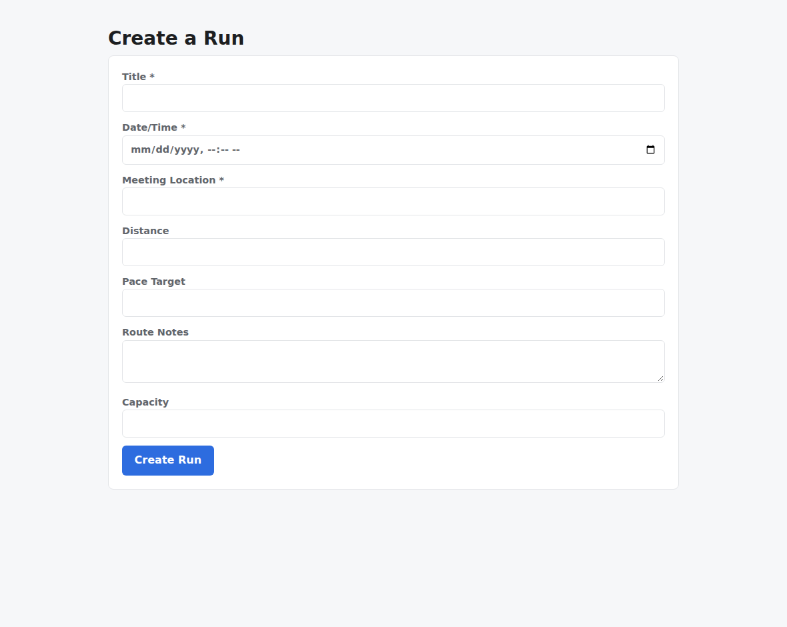
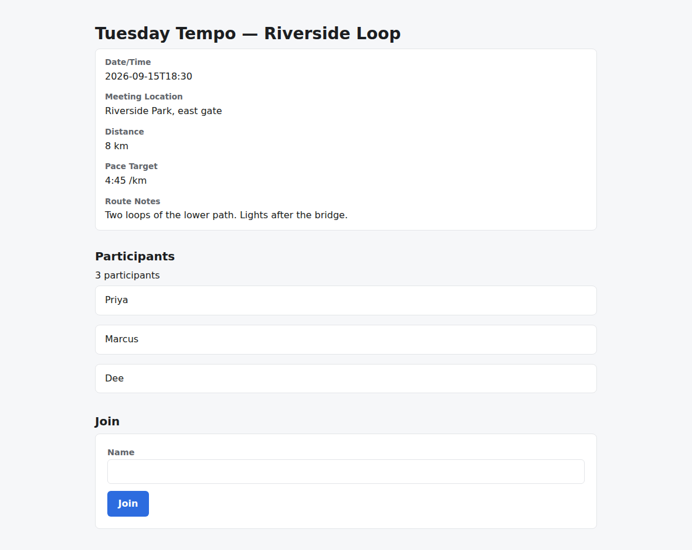
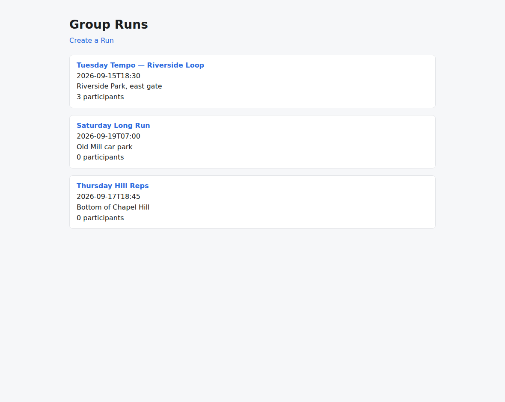
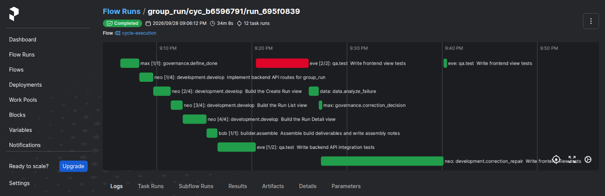

# v1.8.2

**Released 2026-09-29** · [tag `v1.8.2`](https://github.com/backspring-labs/squad-ops/releases/tag/v1.8.2)

**The unattended release: a cycle you can leave running.** Plan: `docs/plans/1-8-2-plan.md`
(rev 4). Record: `docs/plans/1-8-2-deploy-a-preregistration.md` §10, deploy A′, with the cut record
there.

**The claim, measured on deploy A′ (`8e2c2e87`).** A cycle is safe to leave running when four
things hold:
- it reaches a terminal state within a bound;
- a cancel leaves nothing running;
- a crash or a hang is contained and recorded as a typed fact;
- the next cycle starts on a quiet box.

The `unattended-chain` diagnostic ran four React cycles back to back, with an injected cancel, a
killed agent and a hung handler, and read **YES on every row**. The cancel ended its wait in 6 s,
where deploy A held it for 30 minutes (#1699). Every cycle was assessed, and no step was manual.

The counted set: **six of six rolls accepted** (React 21/21 ×4, Next.js 18/18 and 17/17), with L1
held on every one. **No 1.8.3 opens** (plan §3.10): no qa task failed by its declared wait, and
no contentless emission went unrecovered.

**The unattended seams.**
- A run's cancel reaches the agent already holding its task (#1683).
- A cancel ends the run's open reply wait, and the quiet check sees an unfinished executor (#1700).
- The per-task wait is declared, never inherited, and is the same bound on both sides (#1675,
  #1678).
- The JSX parse runs in a worker process, so a native fault kills the worker and not the agent
  (#1679).
- The repair records which correction-decision section its brief carried (#1674).
- A call that spent its whole token budget and wrote nothing is asked again once, with the fact
  (#1681).

**Capability.**
- **The self-evaluation pass becomes the model's compile loop** (SIP-0086 §12a changes 1–3):
  - the loop's depth is declared by the request profile (#1682), and each pass is booked under its
    own usage key (#1686);
  - a failed TypeScript build carries every type error, not the first (#1687);
  - a pass, and a qa re-take, see what they edit (#1688).
- **A producer's dispute of a check is captured, marked, routed and read** (SIP-0096 §17a, #1684,
  #1685; closes #1581).
- **The qa repair brief shows the line each failing case failed on** (#1680).

**Evidence that survives an unattended line.**
- Records have one home, the main checkout's `var/` (#1666).
- `worktree_hygiene.py` and cut step 8 (#1667).
- A line's records are attached to its Release after a credential scan (#1670).
- The chain command runs K cycles back to back (#1668).
- A marker self-check at preflight (#1672).
- The retest readout (#1676).
- The delivered-app capture reads the run's own interface (#1671).
- The closure guard reads the title and the commits (#1669).
- A secret scan over every change (#1713).
- The release-package capture obtains its own token (#1721).

**Not landed, stated.**
- **SIP-0107's flip.** N was unmet a third time: the total was 8 against 6, but dev × Next.js was
  at zero (SIP-0107 §46q). Step 7 is now a 2.0 decision.
- **The convergence replay (item 12), #1039 and the ops rider** move to 1.9 (plan §3.9).
- **SIP-0086 §12a change 4** is held for the owner.
- **Two diagnostic seams unreached on A′, each by the owner's ruling:** the dev lane, whose fault
  the task's own self-evaluation reverts (#1716), and F1's rewind path (#1723).
- **Deploy A was voided** for #1699, and the set re-made on A′.

## Merged pull requests (42)

| PR | Title | Closes |
|---|---|---|
| [#1729](https://github.com/backspring-labs/squad-ops/pull/1729) | release: 1.8.2 — the unattended release | — |
| [#1725](https://github.com/backspring-labs/squad-ops/pull/1725) | docs(1.8.2): the set's close — five diagnostics, L5, the six counted rolls, no 1.8.3, N unmet, the cut record (§11i; SIP-0107 §46q) | — |
| [#1721](https://github.com/backspring-labs/squad-ops/pull/1721) | fix(release package): the capture obtains a current token itself — refresh, then a non-interactive login | — |
| [#1717](https://github.com/backspring-labs/squad-ops/pull/1717) | docs(1.8.2): the dev lane on deploy A′, a run lost to the box, and the owner's two rulings (§11g, §11h) | — |
| [#1713](https://github.com/backspring-labs/squad-ops/pull/1713) | ci: a gitleaks secret scan over every change, with this project's own secret shapes | — |
| [#1715](https://github.com/backspring-labs/squad-ops/pull/1715) | docs(roadmap reconciliation): the nostromo repository is public now | — |
| [#1712](https://github.com/backspring-labs/squad-ops/pull/1712) | docs(roadmap): 2.0 as the inner of two loops — the squad evolves the app, frontier models the framework | — |
| [#1704](https://github.com/backspring-labs/squad-ops/pull/1704) | docs(1.8.2): whether a 1.8.3 opens — a rule read on deploy A′'s counted rolls, registered before roll 1 (plan rev 4) | — |
| [#1703](https://github.com/backspring-labs/squad-ops/pull/1703) | docs(1.8.2): deploy A′'s first six readings, and the owner's ruling on own-frame React's L4 (pre-registration rev 6) | — |
| [#1702](https://github.com/backspring-labs/squad-ops/pull/1702) | docs(1.8.2): deploy A is void — the set is re-made on deploy A′ (pre-registration rev 5, #1699) | — |
| [#1700](https://github.com/backspring-labs/squad-ops/pull/1700) | fix(cycles): a cancel ends the run's open reply wait; the quiet check sees an unfinished executor (#1699) | [#1699](https://github.com/backspring-labs/squad-ops/issues/1699) |
| [#1698](https://github.com/backspring-labs/squad-ops/pull/1698) | fix(driver): a round index two dispatches share is set aside, never joined (#1697); deploy A pre-registration rev 4 | — |
| [#1695](https://github.com/backspring-labs/squad-ops/pull/1695) | fix(driver): a planted row's APPLIED line reads as applied; deploy A pre-registration rev 3 | — |
| [#1694](https://github.com/backspring-labs/squad-ops/pull/1694) | fix(driver): collect the pass and qa re-take revision forms; deploy A pre-registration rev 2 | — |
| [#1693](https://github.com/backspring-labs/squad-ops/pull/1693) | docs(ideas): the reselling squad — agents operating a Backspring back office | — |
| [#1690](https://github.com/backspring-labs/squad-ops/pull/1690) | docs(1.8.2): deploy A pre-registration — the rules, the arms, thirteen diagnostics and the pins (plan §4.1, §4.4) | — |
| [#1689](https://github.com/backspring-labs/squad-ops/pull/1689) | feat(diagnostics): the faults deploy A's three new diagnostics run on (1.8.2 plan §4.1) | — |
| [#1688](https://github.com/backspring-labs/squad-ops/pull/1688) | feat(self-eval): a pass, and a qa re-take, see what they edit (SIP-0086 §12a change 3) | — |
| [#1687](https://github.com/backspring-labs/squad-ops/pull/1687) | feat(checks): a failed TypeScript build carries every type error, not the first (SIP-0086 §12a change 2) | — |
| [#1686](https://github.com/backspring-labs/squad-ops/pull/1686) | feat(usage): a self-evaluation pass is booked under its own key (SIP-0086 §12a change 1) | — |
| [#1685](https://github.com/backspring-labs/squad-ops/pull/1685) | feat(verification): a disputed check is marked, asked about, routed and read (SIP-0096 §17a changes 2–5) | [#1581](https://github.com/backspring-labs/squad-ops/issues/1581) |
| [#1684](https://github.com/backspring-labs/squad-ops/pull/1684) | feat(verification): a producer's dispute of a check is captured as a typed output (SIP-0096 §17a change 1) | — |
| [#1683](https://github.com/backspring-labs/squad-ops/pull/1683) | fix(agents): a run's cancel reaches the agent already holding its task (1.8.2 item 10) | [#1648](https://github.com/backspring-labs/squad-ops/issues/1648) |
| [#1681](https://github.com/backspring-labs/squad-ops/pull/1681) | fix(llm): a call that spent its whole budget and wrote nothing is asked again once, with the fact (1.8.2 item 2) | — |
| [#1678](https://github.com/backspring-labs/squad-ops/pull/1678) | fix(agents): the hang bound is the declared wait on both sides, and a hang fault proves it (1.8.2 item 15) | — |
| [#1680](https://github.com/backspring-labs/squad-ops/pull/1680) | fix(qa): the repair brief shows the line each failing case failed on (1.8.2 item 6) | — |
| [#1682](https://github.com/backspring-labs/squad-ops/pull/1682) | feat(self-eval): the loop's depth is the request profile's, required (SIP-0086 §12a change 1) | — |
| [#1679](https://github.com/backspring-labs/squad-ops/pull/1679) | fix(structural): the JSX parse runs in a worker process, so a native fault kills it, not the agent (1.8.2 item 3) | — |
| [#1676](https://github.com/backspring-labs/squad-ops/pull/1676) | feat(driver): the retest readout, where a retested patch still fails (1.8.2 item 1) | — |
| [#1677](https://github.com/backspring-labs/squad-ops/pull/1677) | fix(driver): the chain reads a cancelled run's late replies where they land | — |
| [#1673](https://github.com/backspring-labs/squad-ops/pull/1673) | test(driver): a pin carried from an earlier line says why (1.8.2 item 5) | — |
| [#1675](https://github.com/backspring-labs/squad-ops/pull/1675) | fix(dispatch): the per-task wait is declared, never inherited (1.8.2 item 15) | — |
| [#1674](https://github.com/backspring-labs/squad-ops/pull/1674) | fix(repair): record which Correction Decision section the brief carried (1.8.2 item 11) | [#1661](https://github.com/backspring-labs/squad-ops/issues/1661) |
| [#1672](https://github.com/backspring-labs/squad-ops/pull/1672) | feat(driver): the marker self-check at preflight, one real line per collector (1.8.2 item 4) | [#1632](https://github.com/backspring-labs/squad-ops/issues/1632) |
| [#1671](https://github.com/backspring-labs/squad-ops/pull/1671) | fix(capture): the delivered-app capture reads the run's own interface (1.8.2 item 13) | [#1665](https://github.com/backspring-labs/squad-ops/issues/1665) |
| [#1670](https://github.com/backspring-labs/squad-ops/pull/1670) | feat(maintainer): attach_release_records.py, a line's records on its Release after a credential scan (1.8.2 item 16) | — |
| [#1669](https://github.com/backspring-labs/squad-ops/pull/1669) | fix(tooling): the closure guard reads the title and commits; the manifest rewrite is anchored to its entry (1.8.2 item 7) | [#1621](https://github.com/backspring-labs/squad-ops/issues/1621) [#1639](https://github.com/backspring-labs/squad-ops/issues/1639) |
| [#1668](https://github.com/backspring-labs/squad-ops/pull/1668) | feat(driver): the chain command, K cycles back to back unattended (1.8.2 item 14) | — |
| [#1667](https://github.com/backspring-labs/squad-ops/pull/1667) | feat(dev): worktree_hygiene.py, plus cut step 8 to run it (1.8.2 item 9) | — |
| [#1666](https://github.com/backspring-labs/squad-ops/pull/1666) | fix(driver): records have one home, the main checkout's var/ (1.8.2 item 8) | — |
| [#1637](https://github.com/backspring-labs/squad-ops/pull/1637) | docs(1.8.2): the plan, rev 3 — campaign readiness first, the flip conditional; records attached to the Release | — |
| [#1664](https://github.com/backspring-labs/squad-ops/pull/1664) | docs(release): capture the v1.8.1 release package | — |

## Improvement proposals amended in place

No lifecycle change — each was edited under the status it already had (a post-acceptance amendment, CLAUDE.md step 5a).

| Proposal | Status |
|---|---|
| [SIP-0086-Build-Convergence-Loop-Dynamic](../../design/sips/SIP-0086-Build-Convergence-Loop-Dynamic.md) | implemented |
| [SIP-0096-Verification-Evidence-Integrity](../../design/sips/SIP-0096-Verification-Evidence-Integrity.md) | implemented |
| [SIP-0107-Scoped-Code-Revision](../../design/sips/SIP-0107-Scoped-Code-Revision.md) | accepted |

## Cycle evidence

### `cyc_02a140a4b78d`

**Verdict:** `accepted` · **Runs:** 2 · **Role:** counted

| | Checks |
|---|---|
| Verified | acceptance:additive_containment, acceptance:assertion_kinds_match, acceptance:client_mock_surface, acceptance:command_exit_zero, acceptance:contract_assertions_match, acceptance:declared_imports, acceptance:dom_anchor_queries, acceptance:endpoint_defined, acceptance:fill_slot_signature, acceptance:frontend_compiles, acceptance:function_defined, acceptance:harness_boundary, acceptance:import_present, acceptance:module_imports, acceptance:undefined_names, acceptance:unterminated_source, acceptance_criteria_prose, expected_artifacts, frontend_build, no_self_mocking_tests, no_stub_fallback_tests, non_stub_files, required_files, tests_pass, vc-probe-runs, vc-probe-runs-join, vc-probe-runs-join-duplicate, vc-probe-runs-leave, vc-probe-runs-rejects-blank |
| Failed | — |
| Required unmet | — |
| Never executed | — |

### `cyc_b6596791666a`

**Verdict:** `accepted` · **Runs:** 2 · **Role:** counted

| | Checks |
|---|---|
| Verified | acceptance:additive_containment, acceptance:assertion_kinds_match, acceptance:client_mock_surface, acceptance:command_exit_zero, acceptance:contract_assertions_match, acceptance:declared_imports, acceptance:dom_anchor_queries, acceptance:endpoint_defined, acceptance:fill_slot_signature, acceptance:frontend_compiles, acceptance:function_defined, acceptance:harness_boundary, acceptance:import_present, acceptance:module_imports, acceptance:undefined_names, acceptance:unterminated_source, acceptance_criteria_prose, expected_artifacts, frontend_build, no_self_mocking_tests, no_stub_fallback_tests, non_stub_files, required_files, tests_pass, vc-probe-runs, vc-probe-runs-join, vc-probe-runs-join-duplicate, vc-probe-runs-leave, vc-probe-runs-rejects-blank |
| Failed | — |
| Required unmet | — |
| Never executed | — |

### `cyc_cc8f314dd766`

**Verdict:** `accepted` · **Runs:** 2 · **Role:** counted

| | Checks |
|---|---|
| Verified | acceptance:additive_containment, acceptance:assertion_kinds_match, acceptance:client_mock_surface, acceptance:command_exit_zero, acceptance:contract_assertions_match, acceptance:declared_imports, acceptance:dom_anchor_queries, acceptance:endpoint_defined, acceptance:fill_slot_signature, acceptance:frontend_compiles, acceptance:function_defined, acceptance:harness_boundary, acceptance:import_present, acceptance:module_imports, acceptance:undefined_names, acceptance:unterminated_source, acceptance_criteria_prose, expected_artifacts, frontend_build, no_self_mocking_tests, no_stub_fallback_tests, non_stub_files, required_files, tests_pass, vc-probe-runs, vc-probe-runs-join, vc-probe-runs-join-duplicate, vc-probe-runs-leave, vc-probe-runs-rejects-blank |
| Failed | — |
| Required unmet | — |
| Never executed | — |

### `cyc_bffc046e2cd3`

**Verdict:** `accepted` · **Runs:** 2 · **Role:** counted

| | Checks |
|---|---|
| Verified | acceptance:additive_containment, acceptance:assertion_kinds_match, acceptance:client_mock_surface, acceptance:command_exit_zero, acceptance:contract_assertions_match, acceptance:declared_imports, acceptance:dom_anchor_queries, acceptance:endpoint_defined, acceptance:fill_slot_signature, acceptance:frontend_compiles, acceptance:function_defined, acceptance:harness_boundary, acceptance:import_present, acceptance:module_imports, acceptance:undefined_names, acceptance:unterminated_source, acceptance_criteria_prose, expected_artifacts, frontend_build, no_self_mocking_tests, no_stub_fallback_tests, non_stub_files, required_files, tests_pass, vc-probe-runs, vc-probe-runs-join, vc-probe-runs-join-duplicate, vc-probe-runs-leave, vc-probe-runs-rejects-blank |
| Failed | — |
| Required unmet | — |
| Never executed | — |

### `cyc_1c545ccd8d4c`

**Verdict:** `accepted` · **Runs:** 2 · **Role:** counted

| | Checks |
|---|---|
| Verified | acceptance:additive_containment, acceptance:assertion_kinds_match, acceptance:count_at_least, acceptance:declared_imports, acceptance:dom_anchor_queries, acceptance:frontend_compiles, acceptance:regex_match, acceptance:required_files, acceptance:undefined_names, acceptance:unterminated_source, acceptance_criteria_prose, expected_artifacts, frontend_build, no_self_mocking_tests, no_stub_fallback_tests, non_stub_files, required_files, tests_pass, vc-probe-api-runs, vc-probe-api-runs-join, vc-probe-api-runs-join-duplicate, vc-probe-api-runs-leave, vc-probe-api-runs-rejects-blank |
| Failed | — |
| Required unmet | — |
| Never executed | — |

### `cyc_557776e00957`

**Verdict:** `accepted` · **Runs:** 2 · **Role:** counted

| | Checks |
|---|---|
| Verified | acceptance:additive_containment, acceptance:assertion_kinds_match, acceptance:declared_imports, acceptance:dom_anchor_queries, acceptance:frontend_compiles, acceptance:regex_match, acceptance:undefined_names, acceptance:unterminated_source, acceptance_criteria_prose, expected_artifacts, frontend_build, no_self_mocking_tests, no_stub_fallback_tests, non_stub_files, required_files, tests_pass, vc-probe-api-runs, vc-probe-api-runs-join, vc-probe-api-runs-join-duplicate, vc-probe-api-runs-leave, vc-probe-api-runs-rejects-blank |
| Failed | — |
| Required unmet | — |
| Never executed | — |

### `cyc_c78d29f83a80`

**Verdict:** `accepted` · **Runs:** 2 · **Role:** diagnostic — fault-injected, non-counting: its verdict is not a verdict about the squad (#1251)

| | Checks |
|---|---|
| Verified | acceptance:additive_containment, acceptance:assertion_kinds_match, acceptance:client_mock_surface, acceptance:command_exit_zero, acceptance:declared_imports, acceptance:dom_anchor_queries, acceptance:endpoint_defined, acceptance:fill_slot_signature, acceptance:frontend_compiles, acceptance:import_present, acceptance:module_imports, acceptance:undefined_names, acceptance:unterminated_source, acceptance_criteria_prose, expected_artifacts, frontend_build, no_self_mocking_tests, no_stub_fallback_tests, non_stub_files, required_files, tests_pass, vc-probe-runs, vc-probe-runs-participants, vc-probe-runs-participants-duplicate, vc-probe-runs-rejects-blank |
| Failed | — |
| Required unmet | — |
| Never executed | — |

### `cyc_e009d4bef185`

**Verdict:** `accepted` · **Runs:** 2 · **Role:** diagnostic — fault-injected, non-counting: its verdict is not a verdict about the squad (#1251)

| | Checks |
|---|---|
| Verified | acceptance:additive_containment, acceptance:assertion_kinds_match, acceptance:client_mock_surface, acceptance:command_exit_zero, acceptance:contract_assertions_match, acceptance:declared_imports, acceptance:dom_anchor_queries, acceptance:endpoint_defined, acceptance:fill_slot_signature, acceptance:frontend_compiles, acceptance:function_defined, acceptance:harness_boundary, acceptance:import_present, acceptance:module_imports, acceptance:undefined_names, acceptance:unterminated_source, acceptance_criteria_prose, expected_artifacts, frontend_build, no_self_mocking_tests, no_stub_fallback_tests, non_stub_files, required_files, tests_pass, vc-probe-runs, vc-probe-runs-join, vc-probe-runs-join-duplicate, vc-probe-runs-leave, vc-probe-runs-rejects-blank |
| Failed | — |
| Required unmet | — |
| Never executed | — |

### `cyc_55d4ced0cffa`

**Verdict:** `accepted` · **Runs:** 2 · **Role:** diagnostic — fault-injected, non-counting: its verdict is not a verdict about the squad (#1251)

| | Checks |
|---|---|
| Verified | acceptance:additive_containment, acceptance:assertion_kinds_match, acceptance:declared_imports, acceptance:dom_anchor_queries, acceptance:frontend_compiles, acceptance:regex_match, acceptance:undefined_names, acceptance:unterminated_source, acceptance_criteria_prose, expected_artifacts, frontend_build, no_self_mocking_tests, no_stub_fallback_tests, non_stub_files, required_files, tests_pass, vc-probe-api-runs, vc-probe-api-runs-join, vc-probe-api-runs-join-duplicate, vc-probe-api-runs-leave, vc-probe-api-runs-rejects-blank |
| Failed | — |
| Required unmet | — |
| Never executed | — |

### `cyc_92caa0c9758a`

**Verdict:** `blocked_unverified` · **Runs:** 2 · **Role:** diagnostic — fault-injected, non-counting: its verdict is not a verdict about the squad (#1251)

| | Checks |
|---|---|
| Verified | acceptance:command_exit_zero, acceptance:declared_imports, acceptance:endpoint_defined, acceptance:fill_slot_signature, acceptance:frontend_compiles, acceptance:import_present, acceptance:module_imports, acceptance:undefined_names, acceptance:unterminated_source, acceptance_criteria_prose, expected_artifacts, non_stub_files |
| Failed | — |
| Required unmet | frontend_build, required_files, tests_pass |
| Never executed | frontend_build, required_files, tests_pass |

### `cyc_2c036055e67e`

**Verdict:** `blocked_unverified` · **Runs:** 2 · **Role:** diagnostic — fault-injected, non-counting: its verdict is not a verdict about the squad (#1251)

| | Checks |
|---|---|
| Verified | acceptance:command_exit_zero, acceptance:declared_imports, acceptance:endpoint_defined, acceptance:fill_slot_signature, acceptance:frontend_compiles, acceptance:import_present, acceptance:module_imports, acceptance:undefined_names, acceptance:unterminated_source, acceptance_criteria_prose, expected_artifacts, non_stub_files |
| Failed | — |
| Required unmet | frontend_build, required_files, tests_pass |
| Never executed | frontend_build, required_files, tests_pass |

### `cyc_9f0d91b70570`

**Verdict:** `accepted` · **Runs:** 2 · **Role:** diagnostic — fault-injected, non-counting: its verdict is not a verdict about the squad (#1251)

| | Checks |
|---|---|
| Verified | acceptance:additive_containment, acceptance:assertion_kinds_match, acceptance:client_mock_surface, acceptance:command_exit_zero, acceptance:contract_assertions_match, acceptance:declared_imports, acceptance:dom_anchor_queries, acceptance:endpoint_defined, acceptance:fill_slot_signature, acceptance:frontend_compiles, acceptance:harness_boundary, acceptance:import_present, acceptance:module_imports, acceptance:undefined_names, acceptance:unterminated_source, acceptance_criteria_prose, expected_artifacts, frontend_build, no_self_mocking_tests, no_stub_fallback_tests, non_stub_files, required_files, tests_pass, vc-probe-runs, vc-probe-runs-join, vc-probe-runs-join-duplicate, vc-probe-runs-leave, vc-probe-runs-rejects-blank |
| Failed | — |
| Required unmet | — |
| Never executed | — |

### `cyc_25a7a6ad8ebd`

**Verdict:** `accepted` · **Runs:** 2 · **Role:** diagnostic — fault-injected, non-counting: its verdict is not a verdict about the squad (#1251)

| | Checks |
|---|---|
| Verified | acceptance:additive_containment, acceptance:assertion_kinds_match, acceptance:client_mock_surface, acceptance:command_exit_zero, acceptance:contract_assertions_match, acceptance:declared_imports, acceptance:dom_anchor_queries, acceptance:endpoint_defined, acceptance:fill_slot_signature, acceptance:frontend_compiles, acceptance:function_defined, acceptance:harness_boundary, acceptance:import_present, acceptance:module_imports, acceptance:undefined_names, acceptance:unterminated_source, acceptance_criteria_prose, expected_artifacts, frontend_build, no_self_mocking_tests, no_stub_fallback_tests, non_stub_files, required_files, tests_pass, vc-probe-runs, vc-probe-runs-participants, vc-probe-runs-participants-duplicate, vc-probe-runs-rejects-blank |
| Failed | — |
| Required unmet | — |
| Never executed | — |

### `cyc_18608cb78207`

**Verdict:** `accepted` · **Runs:** 2 · **Role:** diagnostic — fault-injected, non-counting: its verdict is not a verdict about the squad (#1251)

| | Checks |
|---|---|
| Verified | acceptance:additive_containment, acceptance:assertion_kinds_match, acceptance:client_mock_surface, acceptance:command_exit_zero, acceptance:contract_assertions_match, acceptance:declared_imports, acceptance:dom_anchor_queries, acceptance:endpoint_defined, acceptance:fill_slot_signature, acceptance:frontend_compiles, acceptance:function_defined, acceptance:harness_boundary, acceptance:import_present, acceptance:module_imports, acceptance:undefined_names, acceptance:unterminated_source, acceptance_criteria_prose, expected_artifacts, frontend_build, no_self_mocking_tests, no_stub_fallback_tests, non_stub_files, required_files, tests_pass, vc-probe-runs, vc-probe-runs-join, vc-probe-runs-join-duplicate, vc-probe-runs-leave, vc-probe-runs-rejects-blank |
| Failed | — |
| Required unmet | — |
| Never executed | — |

### `cyc_959b9e726a4e`

**Verdict:** `blocked_unverified` · **Runs:** 2 · **Role:** diagnostic — fault-injected, non-counting: its verdict is not a verdict about the squad (#1251)

| | Checks |
|---|---|
| Verified | acceptance:declared_imports, acceptance:frontend_compiles, acceptance:undefined_names, acceptance:unterminated_source, acceptance_criteria_prose, expected_artifacts, non_stub_files |
| Failed | acceptance:declared_imports |
| Required unmet | frontend_build, required_files, tests_pass |
| Never executed | frontend_build, required_files, tests_pass |

### `cyc_96656c0e48be`

**Verdict:** `accepted` · **Runs:** 2 · **Role:** diagnostic — fault-injected, non-counting: its verdict is not a verdict about the squad (#1251)

| | Checks |
|---|---|
| Verified | acceptance:additive_containment, acceptance:assertion_kinds_match, acceptance:declared_imports, acceptance:dom_anchor_queries, acceptance:frontend_compiles, acceptance:undefined_names, acceptance:unterminated_source, acceptance_criteria_prose, expected_artifacts, frontend_build, no_self_mocking_tests, no_stub_fallback_tests, non_stub_files, required_files, tests_pass, vc-probe-api-runs, vc-probe-api-runs-join, vc-probe-api-runs-join-duplicate, vc-probe-api-runs-leave, vc-probe-api-runs-rejects-blank |
| Failed | — |
| Required unmet | — |
| Never executed | — |

### `cyc_2aa540e76e80`

**Verdict:** `accepted` · **Runs:** 2 · **Role:** diagnostic — fault-injected, non-counting: its verdict is not a verdict about the squad (#1251)

| | Checks |
|---|---|
| Verified | acceptance:additive_containment, acceptance:assertion_kinds_match, acceptance:client_mock_surface, acceptance:command_exit_zero, acceptance:contract_assertions_match, acceptance:declared_imports, acceptance:dom_anchor_queries, acceptance:endpoint_defined, acceptance:fill_slot_signature, acceptance:frontend_compiles, acceptance:function_defined, acceptance:harness_boundary, acceptance:import_present, acceptance:module_imports, acceptance:undefined_names, acceptance:unterminated_source, acceptance_criteria_prose, expected_artifacts, frontend_build, no_self_mocking_tests, no_stub_fallback_tests, non_stub_files, required_files, tests_pass, vc-probe-runs, vc-probe-runs-join, vc-probe-runs-join-duplicate, vc-probe-runs-leave, vc-probe-runs-rejects-blank |
| Failed | — |
| Required unmet | — |
| Never executed | — |

### `cyc_a68192cdc29b`

**Verdict:** `accepted` · **Runs:** 2 · **Role:** diagnostic — fault-injected, non-counting: its verdict is not a verdict about the squad (#1251)

| | Checks |
|---|---|
| Verified | acceptance:additive_containment, acceptance:assertion_kinds_match, acceptance:command_exit_zero, acceptance:contract_assertions_match, acceptance:declared_imports, acceptance:dom_anchor_queries, acceptance:endpoint_defined, acceptance:fill_slot_signature, acceptance:frontend_compiles, acceptance:function_defined, acceptance:harness_boundary, acceptance:import_present, acceptance:module_imports, acceptance:undefined_names, acceptance:unterminated_source, acceptance_criteria_prose, expected_artifacts, frontend_build, no_self_mocking_tests, no_stub_fallback_tests, non_stub_files, required_files, tests_pass, vc-probe-runs, vc-probe-runs-join, vc-probe-runs-join-duplicate, vc-probe-runs-leave, vc-probe-runs-rejects-blank |
| Failed | — |
| Required unmet | — |
| Never executed | — |

### `cyc_40887327dda6`

**Verdict:** `accepted` · **Runs:** 2 · **Role:** diagnostic — fault-injected, non-counting: its verdict is not a verdict about the squad (#1251)

| | Checks |
|---|---|
| Verified | acceptance:additive_containment, acceptance:assertion_kinds_match, acceptance:client_mock_surface, acceptance:command_exit_zero, acceptance:contract_assertions_match, acceptance:declared_imports, acceptance:dom_anchor_queries, acceptance:endpoint_defined, acceptance:fill_slot_signature, acceptance:frontend_compiles, acceptance:function_defined, acceptance:harness_boundary, acceptance:import_present, acceptance:module_imports, acceptance:undefined_names, acceptance:unterminated_source, acceptance_criteria_prose, expected_artifacts, frontend_build, no_self_mocking_tests, no_stub_fallback_tests, non_stub_files, required_files, tests_pass, vc-probe-runs, vc-probe-runs-join, vc-probe-runs-join-duplicate, vc-probe-runs-leave, vc-probe-runs-rejects-blank |
| Failed | — |
| Required unmet | — |
| Never executed | — |

### `cyc_3cd308de2690`

**Verdict:** `accepted` · **Runs:** 2 · **Role:** diagnostic — fault-injected, non-counting: its verdict is not a verdict about the squad (#1251)

| | Checks |
|---|---|
| Verified | acceptance:additive_containment, acceptance:assertion_kinds_match, acceptance:client_mock_surface, acceptance:command_exit_zero, acceptance:contract_assertions_match, acceptance:declared_imports, acceptance:dom_anchor_queries, acceptance:endpoint_defined, acceptance:fill_slot_signature, acceptance:frontend_compiles, acceptance:function_defined, acceptance:harness_boundary, acceptance:import_present, acceptance:module_imports, acceptance:undefined_names, acceptance:unterminated_source, acceptance_criteria_prose, expected_artifacts, frontend_build, no_self_mocking_tests, no_stub_fallback_tests, non_stub_files, required_files, tests_pass, vc-probe-runs, vc-probe-runs-join, vc-probe-runs-join-duplicate, vc-probe-runs-leave, vc-probe-runs-rejects-blank |
| Failed | — |
| Required unmet | — |
| Never executed | — |

### `cyc_c2f4e5a01334`

**Verdict:** `blocked_unverified` · **Runs:** 2 · **Role:** diagnostic — fault-injected, non-counting: its verdict is not a verdict about the squad (#1251)

| | Checks |
|---|---|
| Verified | — |
| Failed | — |
| Required unmet | frontend_build, required_files, tests_pass |
| Never executed | frontend_build, required_files, tests_pass |

### `cyc_38b52cc68c19`

**Verdict:** `accepted` · **Runs:** 2 · **Role:** diagnostic — fault-injected, non-counting: its verdict is not a verdict about the squad (#1251)

| | Checks |
|---|---|
| Verified | acceptance:additive_containment, acceptance:assertion_kinds_match, acceptance:client_mock_surface, acceptance:command_exit_zero, acceptance:contract_assertions_match, acceptance:declared_imports, acceptance:dom_anchor_queries, acceptance:endpoint_defined, acceptance:fill_slot_signature, acceptance:frontend_compiles, acceptance:function_defined, acceptance:harness_boundary, acceptance:import_present, acceptance:module_imports, acceptance:undefined_names, acceptance:unterminated_source, acceptance_criteria_prose, expected_artifacts, frontend_build, no_self_mocking_tests, no_stub_fallback_tests, non_stub_files, required_files, tests_pass, vc-probe-runs, vc-probe-runs-join, vc-probe-runs-join-duplicate, vc-probe-runs-leave, vc-probe-runs-rejects-blank |
| Failed | — |
| Required unmet | — |
| Never executed | — |

### `cyc_3aff012fd86a`

**Verdict:** `accepted` · **Runs:** 2 · **Role:** diagnostic — fault-injected, non-counting: its verdict is not a verdict about the squad (#1251)

| | Checks |
|---|---|
| Verified | acceptance:additive_containment, acceptance:assertion_kinds_match, acceptance:command_exit_zero, acceptance:contract_assertions_match, acceptance:declared_imports, acceptance:dom_anchor_queries, acceptance:endpoint_defined, acceptance:fill_slot_signature, acceptance:frontend_compiles, acceptance:harness_boundary, acceptance:import_present, acceptance:module_imports, acceptance:undefined_names, acceptance:unterminated_source, acceptance_criteria_prose, expected_artifacts, frontend_build, no_self_mocking_tests, no_stub_fallback_tests, non_stub_files, required_files, tests_pass, vc-probe-runs, vc-probe-runs-join, vc-probe-runs-join-duplicate, vc-probe-runs-rejects-blank |
| Failed | — |
| Required unmet | — |
| Never executed | — |

### `cyc_0716b8d637c2`

**Verdict:** `accepted` · **Runs:** 1 · **Role:** void — void: the roll was stopped and the set restarted (the record's §0)

| | Checks |
|---|---|
| Verified | — |
| Failed | — |
| Required unmet | — |
| Never executed | — |

### `cyc_eb4ed3bde52d`

**Verdict:** `accepted` · **Runs:** 2 · **Role:** void — void: the roll was stopped and the set restarted (the record's §0)

| | Checks |
|---|---|
| Verified | acceptance:additive_containment, acceptance:assertion_kinds_match, acceptance:count_at_least, acceptance:declared_imports, acceptance:dom_anchor_queries, acceptance:frontend_compiles, acceptance:regex_match, acceptance:required_files, acceptance:undefined_names, acceptance:unterminated_source, acceptance_criteria_prose, expected_artifacts, frontend_build, no_self_mocking_tests, no_stub_fallback_tests, non_stub_files, required_files, tests_pass, vc-probe-api-runs, vc-probe-api-runs-join, vc-probe-api-runs-leave, vc-probe-api-runs-rejects-blank |
| Failed | — |
| Required unmet | — |
| Never executed | — |

### `cyc_1727c96394da`

**Verdict:** `blocked_unverified` · **Runs:** 2 · **Role:** void — void: the roll was stopped and the set restarted (the record's §0)

| | Checks |
|---|---|
| Verified | acceptance:declared_imports, acceptance:frontend_compiles, acceptance:undefined_names, acceptance:unterminated_source, acceptance_criteria_prose, expected_artifacts, non_stub_files |
| Failed | acceptance:declared_imports |
| Required unmet | frontend_build, required_files, tests_pass |
| Never executed | frontend_build, required_files, tests_pass |

### `cyc_db35b68f0a20`

**Verdict:** `blocked_unverified` · **Runs:** 3 · **Role:** void — void: the roll was stopped and the set restarted (the record's §0)

| | Checks |
|---|---|
| Verified | acceptance:declared_imports, acceptance:frontend_compiles, acceptance:undefined_names, acceptance:unterminated_source, acceptance_criteria_prose, expected_artifacts, non_stub_files |
| Failed | acceptance:declared_imports |
| Required unmet | frontend_build, required_files, tests_pass |
| Never executed | frontend_build, required_files, tests_pass |

### `cyc_8176207ea2f3`

**Verdict:** `accepted` · **Runs:** 2 · **Role:** void — void: the roll was stopped and the set restarted (the record's §0)

| | Checks |
|---|---|
| Verified | acceptance:additive_containment, acceptance:assertion_kinds_match, acceptance:client_mock_surface, acceptance:command_exit_zero, acceptance:contract_assertions_match, acceptance:declared_imports, acceptance:dom_anchor_queries, acceptance:endpoint_defined, acceptance:fill_slot_signature, acceptance:frontend_compiles, acceptance:function_defined, acceptance:harness_boundary, acceptance:import_present, acceptance:module_imports, acceptance:undefined_names, acceptance:unterminated_source, acceptance_criteria_prose, expected_artifacts, frontend_build, no_self_mocking_tests, no_stub_fallback_tests, non_stub_files, required_files, tests_pass, vc-probe-runs, vc-probe-runs-join, vc-probe-runs-join-duplicate, vc-probe-runs-leave, vc-probe-runs-rejects-blank |
| Failed | — |
| Required unmet | — |
| Never executed | — |

### `cyc_6eb0f6a5c519`

**Verdict:** `accepted` · **Runs:** 2 · **Role:** void — void: the roll was stopped and the set restarted (the record's §0)

| | Checks |
|---|---|
| Verified | acceptance:additive_containment, acceptance:assertion_kinds_match, acceptance:client_mock_surface, acceptance:command_exit_zero, acceptance:contract_assertions_match, acceptance:declared_imports, acceptance:dom_anchor_queries, acceptance:endpoint_defined, acceptance:fill_slot_signature, acceptance:frontend_compiles, acceptance:function_defined, acceptance:harness_boundary, acceptance:import_present, acceptance:module_imports, acceptance:undefined_names, acceptance:unterminated_source, acceptance_criteria_prose, expected_artifacts, frontend_build, no_self_mocking_tests, no_stub_fallback_tests, non_stub_files, required_files, tests_pass, vc-probe-runs, vc-probe-runs-join, vc-probe-runs-join-duplicate, vc-probe-runs-rejects-blank |
| Failed | — |
| Required unmet | — |
| Never executed | — |

### `cyc_6ba758cd448c`

**Verdict:** `blocked_unverified` · **Runs:** 2 · **Role:** void — void: the roll was stopped and the set restarted (the record's §0)

| | Checks |
|---|---|
| Verified | — |
| Failed | — |
| Required unmet | frontend_build, required_files, tests_pass |
| Never executed | frontend_build, required_files, tests_pass |

### `cyc_4d7272311706`

**Verdict:** `accepted` · **Runs:** 2 · **Role:** void — void: the roll was stopped and the set restarted (the record's §0)

| | Checks |
|---|---|
| Verified | acceptance:additive_containment, acceptance:assertion_kinds_match, acceptance:client_mock_surface, acceptance:command_exit_zero, acceptance:contract_assertions_match, acceptance:declared_imports, acceptance:dom_anchor_queries, acceptance:endpoint_defined, acceptance:fill_slot_signature, acceptance:frontend_compiles, acceptance:harness_boundary, acceptance:import_present, acceptance:module_imports, acceptance:undefined_names, acceptance:unterminated_source, acceptance_criteria_prose, expected_artifacts, frontend_build, no_self_mocking_tests, no_stub_fallback_tests, non_stub_files, required_files, tests_pass, vc-probe-runs, vc-probe-runs-join, vc-probe-runs-join-duplicate, vc-probe-runs-leave, vc-probe-runs-rejects-blank |
| Failed | — |
| Required unmet | — |
| Never executed | — |

### `cyc_505ad15d0f5d`

**Verdict:** `accepted` · **Runs:** 2 · **Role:** void — void: the roll was stopped and the set restarted (the record's §0)

| | Checks |
|---|---|
| Verified | acceptance:additive_containment, acceptance:assertion_kinds_match, acceptance:client_mock_surface, acceptance:command_exit_zero, acceptance:contract_assertions_match, acceptance:declared_imports, acceptance:dom_anchor_queries, acceptance:endpoint_defined, acceptance:fill_slot_signature, acceptance:frontend_compiles, acceptance:function_defined, acceptance:harness_boundary, acceptance:import_present, acceptance:module_imports, acceptance:undefined_names, acceptance:unterminated_source, acceptance_criteria_prose, expected_artifacts, frontend_build, no_self_mocking_tests, no_stub_fallback_tests, non_stub_files, required_files, tests_pass, vc-probe-runs, vc-probe-runs-join, vc-probe-runs-join-duplicate, vc-probe-runs-leave, vc-probe-runs-rejects-blank |
| Failed | — |
| Required unmet | — |
| Never executed | — |

## Screenshots

Of cycle `cyc_b6596791666a` (counted) — Counted React roll 2, the one counted roll whose correction round shows the line's recovery path: a failed qa.test (frontend view tests) went to data.analyze_failure and governance.correction_decision, and the dev correction repair spent its whole 12,288-token budget on reasoning, was asked again once with the fact (1.8.2 item 2), and its anchored edit (8% of RunListView.jsx) was accepted, verified and retested. Chosen because that recovery is what this release adds, not because the roll is typical: 2 of the 6 counted rolls corrected..

*delivered app react roll 2 create run form*

*delivered app react roll 2 run detail with participants*

*delivered app react roll 2 run list*

*prefect flow run react roll 2 a dev repair that spent its budget asked again and accepted*
