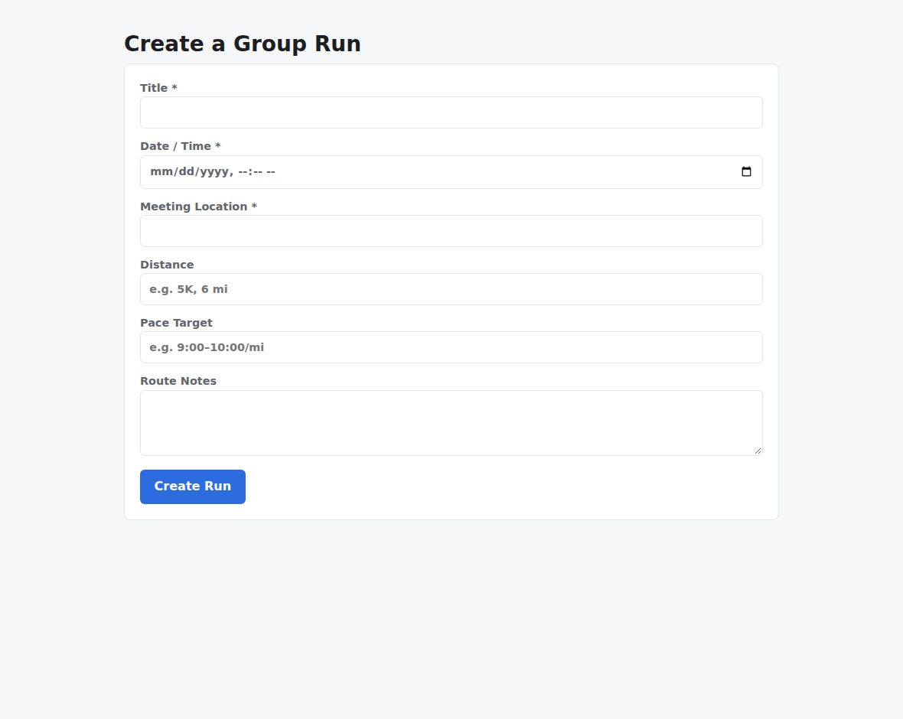
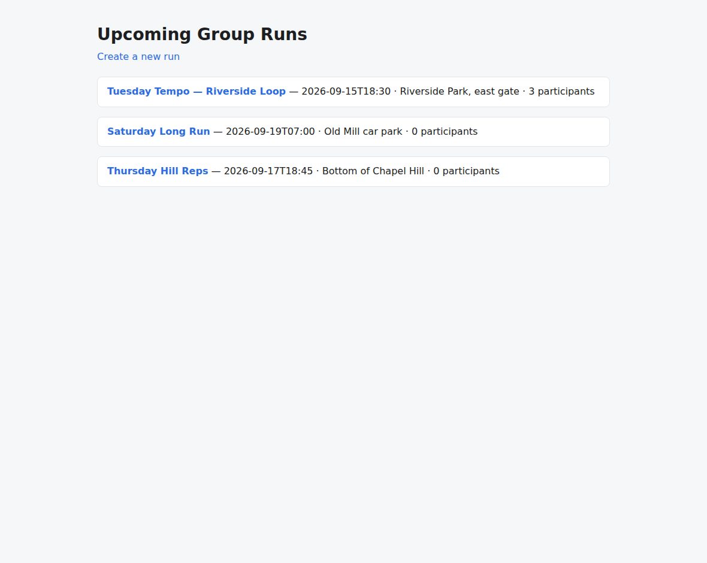
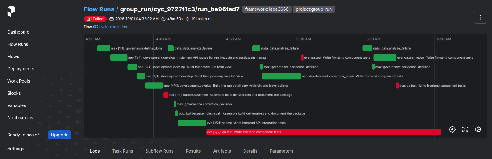

# v1.9.0

**Released 2026-10-01** · [tag `v1.9.0`](https://github.com/backspring-labs/squad-ops/releases/tag/v1.9.0)

**The completion boundary: the executor's run spine, extracted, and the line's records kept.** Plan:
`docs/plans/1-9-0-plan.md` (rev 9). Record: `docs/plans/1-9-0-preregistration.md` §10–§13, with
the cut record in §13.

**The claim, measured on the 1.9 deploy (`1abe3666`, `dep_d413c36959ab`).** Moving `execute_run`,
`execute_cycle` and the framing gate out of the executor (#1507) changed nothing a cycle does that
the set could see.
- **The diagnostics** read as on 1.8.2's deploy:
  - compile-loop, false-criterion and redelivery cleared on run 1;
  - own-frame cleared on both stacks, Next.js on its second run;
  - **the unattended chain read YES on every row**: a cancel, a killed agent and a hung handler,
    four cycles back to back, with no manual step.
- **Round identity (#1697) holds.** No repair id repeated across the set. The own-frame diagnostic
  read its refund seam directly, where 1.8.2's needed a ruling.
- **The dev lane reached its seam on Next.js** (#1716). On React it was UNASKABLE on the set's
  deploy: the fault keyed on a `/join` spelling, and both runs' designs named the join otherwise
  (#1774, fixed after the set and read on the post-set deploy).
- **The counted set: four of six, with L1 held on every roll.** React 2 of 4, Next.js 2 of 2. The
  registered bar was six of six, so it is **unmet by its letter**, and the owner ruled the cut at
  four of six (§11e). Both rejections were React view tests whose `waitFor` timed out, on a
  correction path the extraction did not move. **Their one root cause:** the view threw a
  `TypeError` under jsdom. Vitest printed it only in its unhandled-error block, which nothing read,
  so the analysis and every repair aimed at the timeout. The evidence fix is #1784, in this release.
  The prevention, showing the two jsdom pitfalls in the develop and qa prompts, is #1785, in 2.0.

**The completion boundary (#1507).**
- The framing gate's plan check leaves the executor (#1748).
- `execute_run` is split by concern: provisioning and admission leave it (#1749).
- `execute_cycle`'s gate leaves it, and every way a cycle ends meets `CycleCompletion` (#1750).
- A run that did not complete ends the workload sequence, uncancelled (#1754, #1759).

**Lineage: what ran, recorded.**
- Each deploy writes a record of what it put in service, and each cycle references it (#1720,
  #1760, #1761).
- Every image carries its source revision, and agents report theirs on the heartbeat (#1753).
- Prefect flow runs carry project, framework and replay tags (#1722).
- The prompt fragments' hashes are stamped at the image build (#353).

**Named debts.**
- The routes read their ports from the request's app (#1448).
- A run already in its target state is not transitioned again (#1701).
- Prompts sync before the agents restart, and an agent is healthy only once it runs (#1691).
- The records tarball is byte-stable, and the upload refuses anything but the approved bytes (#1732).
- The deploy's own two findings: the recorder loads the deploy's secrets, and `all` rebuilds every
  agent service (#1762).

**The instruments.**
- The driver reads a window a rebuild took from Prefect's stored log (#1745).
- An unbitten fault is recorded as ran-and-unchanged (#1718).
- The #1699 guard excuses a run that started before the runtime-api's current process (#1714).
- The marker self-check counts every sample line (#1696).
- The record carries each qa re-take's verification (#1724).
- The retest readout joins by round identity, and refunds read in both forms (#1697).

**After the set, on the post-set deploy (`8a058dc3`, `dep_23e742c972e7`).**
- **A repair that makes progress is kept** (#1522). When a repair's retest clears some failures
  without passing, the kept files stand and the next round starts from that retest, rather than the
  repair being discarded wholesale. SIP-0086 §12b.
- **Vitest's unhandled errors reach the failure evidence** (#1784) as the run's `app_traceback`,
  which the analysis and the repair brief already read.
- **The dev-lane fault finds the join the manifest declares** (#1774).
- urllib3 2.8.0 retires three advisories published during the set (#1776).
- **Read on that deploy (pre-registration §12):**
  - both dev-lane diagnostics reached their seam on the first run (on React, the seam d7 could not
    ask on the set's deploy), and the Next.js dev repair persisted where the set's was discarded at
    its retest;
  - one counted React roll was accepted, 21 of 21, with no correction round and L1 held;
  - #1522 and #1784 were silent and unexercised: no view threw, and no retest made partial
    progress.
- **The convergence replay** (#1764): scoped against whole-file repair on 16 stored failing rounds,
  three samples each. No prediction was falsified. The scoped arm accepted more (9 against 7 on
  Next.js, 16 against 11 on React) and regressed in no sample, where whole-file regressed in 1 and
  8. Nine scoped Next.js dev repairs came back empty, and the harness keeps no raw response to say
  why (#1788). This is 2.0's flip decision's input.
- The docs site shows what a cycle delivers, generated from the newest release package (#1039,
  partly).

**Not landed, stated.**
- **The yield bar:** four of six against six of six, cut on the owner's ruling (§11e).
- **#414 moves to 2.0** (the owner's ruling). Its gate, measured, does not support the reserve.
- **#1785 moves to 2.0,** the rejections' prevention.
- **#567 and #1031 move to 2.0**, and so do #1755 and #1757. **#1469 moves to 2.0**: its corpus
  has still not arrived.
- **#1039's remainder:** a LangFuse screenshot and the home page's hierarchy.
- **SIP-0107's flip** stays a 2.0 decision. N was read a fourth time as texture (§46r).

## Merged pull requests (53)

| PR | Title | Closes |
|---|---|---|
| [#1792](https://github.com/backspring-labs/squad-ops/pull/1792) | release: 1.9.0 — the completion-boundary release | — |
| [#1791](https://github.com/backspring-labs/squad-ops/pull/1791) | docs(1.9): the post-set readings, the yield ruling (§11e), the cut record (§13), and N's fourth count (SIP-0107 §46r) | — |
| [#1790](https://github.com/backspring-labs/squad-ops/pull/1790) | docs(1.9): the post-set configs — two dev-lane diagnostics and one counted React roll (pre-registration §12) | — |
| [#1769](https://github.com/backspring-labs/squad-ops/pull/1769) | feat(correction): a repair that makes progress is kept, and the next round starts from its retest | [#1522](https://github.com/backspring-labs/squad-ops/issues/1522) |
| [#1789](https://github.com/backspring-labs/squad-ops/pull/1789) | docs(1.9): the post-set registration (§12); #1522 merges in 1.9 (plan rev 8) | — |
| [#1786](https://github.com/backspring-labs/squad-ops/pull/1786) | fix(test-runner): vitest's unhandled errors reach the failure evidence as the run's traceback | [#1784](https://github.com/backspring-labs/squad-ops/issues/1784) |
| [#1787](https://github.com/backspring-labs/squad-ops/pull/1787) | docs(1.9): rev 7 — the counted rejections' root cause; #1784 to 1.9, #1785 to 2.0 | — |
| [#1783](https://github.com/backspring-labs/squad-ops/pull/1783) | deps: urllib3 2.8.0, retiring the three advisories accepted until the post-set rebuild | [#1776](https://github.com/backspring-labs/squad-ops/issues/1776) |
| [#1782](https://github.com/backspring-labs/squad-ops/pull/1782) | fix(fault-injection): the dev-lane fault finds the join the manifest declares | [#1774](https://github.com/backspring-labs/squad-ops/issues/1774) |
| [#1781](https://github.com/backspring-labs/squad-ops/pull/1781) | fix(replay): a replayed round carries no fault declaration | — |
| [#1780](https://github.com/backspring-labs/squad-ops/pull/1780) | docs(1.9): the set closes — rolls 3–6; yield 4 of 6, ruled at the cut | — |
| [#1779](https://github.com/backspring-labs/squad-ops/pull/1779) | docs(1.9): React rolls 1–2 — roll 2 rejected on a known signature; the set resumes (§11d) | — |
| [#1778](https://github.com/backspring-labs/squad-ops/pull/1778) | docs(1.9): d8 reading — the dev lane reaches its seam on Next.js; the diagnostics close, the counted set opens | — |
| [#1777](https://github.com/backspring-labs/squad-ops/pull/1777) | deps: accept urllib3 2.7.0's three new advisories until the post-set rebuild | — |
| [#1775](https://github.com/backspring-labs/squad-ops/pull/1775) | docs(1.9): d7 read UNASKABLE, and the set resumes on the owner's ruling | — |
| [#1773](https://github.com/backspring-labs/squad-ops/pull/1773) | docs(1.9): d5 and d6 readings — own-frame cleared on both stacks | — |
| [#1772](https://github.com/backspring-labs/squad-ops/pull/1772) | docs(1.9): d4 unattended-chain's reading — YES on every row of the campaign-readiness claim | — |
| [#1771](https://github.com/backspring-labs/squad-ops/pull/1771) | docs(1.9): rev 6 — #414 moves to 2.0 | — |
| [#1770](https://github.com/backspring-labs/squad-ops/pull/1770) | docs(site): what a cycle delivers — the latest release's screenshots, generated from its package | — |
| [#1768](https://github.com/backspring-labs/squad-ops/pull/1768) | docs(1.9): d3 redelivery's reading — cleared; round identity holds where A′ collided | — |
| [#1767](https://github.com/backspring-labs/squad-ops/pull/1767) | docs(1.9): d2 false-criterion's reading, and the checkout moves after the eighth diagnostic | — |
| [#1766](https://github.com/backspring-labs/squad-ops/pull/1766) | docs(1.9): the diagnostics' records go to the 1.9 line's own directory, and d1's reading | — |
| [#1765](https://github.com/backspring-labs/squad-ops/pull/1765) | feat(replay): the convergence replay's harness — stored failing rounds, rebuilt by the product's code, repaired per arm | — |
| [#1763](https://github.com/backspring-labs/squad-ops/pull/1763) | docs(1.9): the pre-registration — the set's rules, predictions and pins on the 1.9 deploy | — |
| [#1762](https://github.com/backspring-labs/squad-ops/pull/1762) | fix(deploy): the 1.9 deploy's two findings — the recorder loads the deploy's secrets, and all rebuilds every agent service | — |
| [#1761](https://github.com/backspring-labs/squad-ops/pull/1761) | fix(lineage): the fleet read flags an agent changed since the deploy record, and SIP-0108's lineage reads the record first | [#1720](https://github.com/backspring-labs/squad-ops/issues/1720) |
| [#1760](https://github.com/backspring-labs/squad-ops/pull/1760) | fix(lineage): each deploy writes a record of what it put in service, and each cycle references it | — |
| [#1758](https://github.com/backspring-labs/squad-ops/pull/1758) | docs(1.9): rev 4 — the ten rulings after adoption, and the passages they correct | — |
| [#1759](https://github.com/backspring-labs/squad-ops/pull/1759) | fix(executor): a run that did not complete ends the workload sequence, uncancelled | [#1754](https://github.com/backspring-labs/squad-ops/issues/1754) |
| [#1745](https://github.com/backspring-labs/squad-ops/pull/1745) | feat(driver): a window a rebuild took is read from Prefect's stored log | — |
| [#1753](https://github.com/backspring-labs/squad-ops/pull/1753) | fix(lineage): every image carries its source revision, and agents report theirs on the heartbeat | — |
| [#1752](https://github.com/backspring-labs/squad-ops/pull/1752) | refactor(prompts): the fragment hashes are stamped at the image build, not kept in the manifest | [#353](https://github.com/backspring-labs/squad-ops/issues/353) |
| [#1751](https://github.com/backspring-labs/squad-ops/pull/1751) | refactor(api): the routes read their ports from the request's app, not a process-wide registry | [#1448](https://github.com/backspring-labs/squad-ops/issues/1448) |
| [#1750](https://github.com/backspring-labs/squad-ops/pull/1750) | refactor(executor): execute_cycle's gate leaves it, and every way a cycle ends meets CycleCompletion (#1507 step 3) | [#1507](https://github.com/backspring-labs/squad-ops/issues/1507) |
| [#1749](https://github.com/backspring-labs/squad-ops/pull/1749) | refactor(executor): execute_run by concern — provisioning and admission leave it (#1507 step 2) | — |
| [#1748](https://github.com/backspring-labs/squad-ops/pull/1748) | refactor(executor): the framing gate's plan check leaves the executor (#1507 step 1) | — |
| [#1747](https://github.com/backspring-labs/squad-ops/pull/1747) | docs(1.9): §3.1's result — #1697 reads on both re-runs | — |
| [#1746](https://github.com/backspring-labs/squad-ops/pull/1746) | docs(1.9): the completion-boundary map for #1507 | — |
| [#1743](https://github.com/backspring-labs/squad-ops/pull/1743) | feat(prefect): flow runs carry project, framework and replay tags | [#1722](https://github.com/backspring-labs/squad-ops/issues/1722) |
| [#1741](https://github.com/backspring-labs/squad-ops/pull/1741) | fix(deploy): prompts sync before the agents restart, and an agent is healthy only once it runs | [#1691](https://github.com/backspring-labs/squad-ops/issues/1691) |
| [#1744](https://github.com/backspring-labs/squad-ops/pull/1744) | fix(driver): the retest readout joins a round by its identity, not its index alone | — |
| [#1740](https://github.com/backspring-labs/squad-ops/pull/1740) | fix(executor): a run already in the target state is not transitioned again | [#1701](https://github.com/backspring-labs/squad-ops/issues/1701) |
| [#1742](https://github.com/backspring-labs/squad-ops/pull/1742) | fix(driver): refunded_rounds reads the refund line in both forms | — |
| [#1739](https://github.com/backspring-labs/squad-ops/pull/1739) | fix(release): the records tarball is byte-stable, and the upload refuses anything but the approved bytes | [#1732](https://github.com/backspring-labs/squad-ops/issues/1732) |
| [#1738](https://github.com/backspring-labs/squad-ops/pull/1738) | fix(fault-injection): the dev-lane fault survives the develop task's own self-evaluation | [#1716](https://github.com/backspring-labs/squad-ops/issues/1716) |
| [#1737](https://github.com/backspring-labs/squad-ops/pull/1737) | feat(driver): the record carries each qa re-take's verification and each pass that wrote a file | [#1724](https://github.com/backspring-labs/squad-ops/issues/1724) |
| [#1736](https://github.com/backspring-labs/squad-ops/pull/1736) | fix(driver): the marker self-check holds every sample line to counting | [#1696](https://github.com/backspring-labs/squad-ops/issues/1696) |
| [#1735](https://github.com/backspring-labs/squad-ops/pull/1735) | fix(driver): an unbitten fault is recorded as ran-and-unchanged, not as never-ran | [#1718](https://github.com/backspring-labs/squad-ops/issues/1718) |
| [#1734](https://github.com/backspring-labs/squad-ops/pull/1734) | fix(driver): the #1699 guard excuses a run that started before the runtime-api's current process | [#1714](https://github.com/backspring-labs/squad-ops/issues/1714) |
| [#1733](https://github.com/backspring-labs/squad-ops/pull/1733) | fix(correction): a round's task ids are unique within the run, even when a refund re-takes its index | [#1697](https://github.com/backspring-labs/squad-ops/issues/1697) |
| [#1726](https://github.com/backspring-labs/squad-ops/pull/1726) | docs(1.9): the plan, rev 3 (adopted) — #1697 first, the executor's completion boundary (#1507), every open issue on a release line | — |
| [#1731](https://github.com/backspring-labs/squad-ops/pull/1731) | docs(release): v1.8.2's records attached to the Release — the package names the asset | — |
| [#1730](https://github.com/backspring-labs/squad-ops/pull/1730) | docs(release): capture the v1.8.2 release package; the capture seeds under the interface's base path | — |

## Improvement proposals amended in place

No lifecycle change — each was edited under the status it already had (a post-acceptance amendment, CLAUDE.md step 5a).

| Proposal | Status |
|---|---|
| [SIP-0057-Hexagonal-Layered-Prompt-System](../../design/sips/SIP-0057-Hexagonal-Layered-Prompt-System.md) | implemented |
| [SIP-0086-Build-Convergence-Loop-Dynamic](../../design/sips/SIP-0086-Build-Convergence-Loop-Dynamic.md) | implemented |
| [SIP-0107-Scoped-Code-Revision](../../design/sips/SIP-0107-Scoped-Code-Revision.md) | accepted |
| [SIP-0108-Cycle-Evaluation-Scorecard](../../design/sips/SIP-0108-Cycle-Evaluation-Scorecard.md) | implemented |

## Cycle evidence

### `cyc_20a01ea59964`

**Verdict:** `accepted` · **Runs:** 2 · **Role:** counted

| | Checks |
|---|---|
| Verified | acceptance:additive_containment, acceptance:assertion_kinds_match, acceptance:client_mock_surface, acceptance:command_exit_zero, acceptance:contract_assertions_match, acceptance:declared_imports, acceptance:dom_anchor_queries, acceptance:endpoint_defined, acceptance:fill_slot_signature, acceptance:frontend_compiles, acceptance:function_defined, acceptance:harness_boundary, acceptance:import_present, acceptance:module_imports, acceptance:undefined_names, acceptance:unterminated_source, acceptance_criteria_prose, expected_artifacts, frontend_build, no_self_mocking_tests, no_stub_fallback_tests, non_stub_files, required_files, tests_pass, vc-probe-runs, vc-probe-runs-join, vc-probe-runs-join-duplicate, vc-probe-runs-leave, vc-probe-runs-rejects-blank |
| Failed | — |
| Required unmet | — |
| Never executed | — |

### `cyc_189cb78ce86b`

**Verdict:** `rejected` · **Runs:** 2 · **Role:** counted

| | Checks |
|---|---|
| Verified | acceptance:additive_containment, acceptance:assertion_kinds_match, acceptance:client_mock_surface, acceptance:command_exit_zero, acceptance:contract_assertions_match, acceptance:declared_imports, acceptance:dom_anchor_queries, acceptance:endpoint_defined, acceptance:fill_slot_signature, acceptance:frontend_compiles, acceptance:function_defined, acceptance:harness_boundary, acceptance:import_present, acceptance:module_imports, acceptance:undefined_names, acceptance:unterminated_source, acceptance_criteria_prose, expected_artifacts, frontend_build, no_self_mocking_tests, no_stub_fallback_tests, non_stub_files, required_files, tests_pass, vc-probe-runs, vc-probe-runs-join, vc-probe-runs-join-duplicate, vc-probe-runs-leave, vc-probe-runs-rejects-blank |
| Failed | tests_pass |
| Required unmet | — |
| Never executed | — |

### `cyc_cf13ebda0daa`

**Verdict:** `accepted` · **Runs:** 2 · **Role:** counted

| | Checks |
|---|---|
| Verified | acceptance:additive_containment, acceptance:assertion_kinds_match, acceptance:client_mock_surface, acceptance:command_exit_zero, acceptance:contract_assertions_match, acceptance:declared_imports, acceptance:dom_anchor_queries, acceptance:endpoint_defined, acceptance:fill_slot_signature, acceptance:frontend_compiles, acceptance:function_defined, acceptance:harness_boundary, acceptance:import_present, acceptance:module_imports, acceptance:undefined_names, acceptance:unterminated_source, acceptance_criteria_prose, expected_artifacts, frontend_build, no_self_mocking_tests, no_stub_fallback_tests, non_stub_files, required_files, tests_pass, vc-probe-runs, vc-probe-runs-join, vc-probe-runs-join-duplicate, vc-probe-runs-leave, vc-probe-runs-rejects-blank |
| Failed | — |
| Required unmet | — |
| Never executed | — |

### `cyc_9727f1c382e2`

**Verdict:** `rejected` · **Runs:** 2 · **Role:** counted

| | Checks |
|---|---|
| Verified | acceptance:additive_containment, acceptance:assertion_kinds_match, acceptance:client_mock_surface, acceptance:command_exit_zero, acceptance:contract_assertions_match, acceptance:declared_imports, acceptance:dom_anchor_queries, acceptance:endpoint_defined, acceptance:fill_slot_signature, acceptance:frontend_compiles, acceptance:harness_boundary, acceptance:import_present, acceptance:module_imports, acceptance:required_files, acceptance:undefined_names, acceptance:unterminated_source, acceptance_criteria_prose, expected_artifacts, frontend_build, no_self_mocking_tests, no_stub_fallback_tests, non_stub_files, required_files, tests_pass, vc-probe-runs, vc-probe-runs-join, vc-probe-runs-join-duplicate, vc-probe-runs-leave, vc-probe-runs-rejects-blank |
| Failed | tests_pass |
| Required unmet | — |
| Never executed | — |

### `cyc_d23bc93670f6`

**Verdict:** `accepted` · **Runs:** 2 · **Role:** counted

| | Checks |
|---|---|
| Verified | acceptance:additive_containment, acceptance:assertion_kinds_match, acceptance:declared_imports, acceptance:dom_anchor_queries, acceptance:frontend_compiles, acceptance:undefined_names, acceptance:unterminated_source, acceptance_criteria_prose, expected_artifacts, frontend_build, no_self_mocking_tests, no_stub_fallback_tests, non_stub_files, required_files, tests_pass, vc-probe-api-runs, vc-probe-api-runs-participants, vc-probe-api-runs-participants-duplicate, vc-probe-api-runs-rejects-blank |
| Failed | — |
| Required unmet | — |
| Never executed | — |

### `cyc_c3ab78540862`

**Verdict:** `accepted` · **Runs:** 2 · **Role:** counted

| | Checks |
|---|---|
| Verified | acceptance:additive_containment, acceptance:assertion_kinds_match, acceptance:count_at_least, acceptance:declared_imports, acceptance:dom_anchor_queries, acceptance:frontend_compiles, acceptance:regex_match, acceptance:undefined_names, acceptance:unterminated_source, acceptance_criteria_prose, expected_artifacts, frontend_build, no_self_mocking_tests, no_stub_fallback_tests, non_stub_files, required_files, tests_pass, vc-probe-api-runs, vc-probe-api-runs-join, vc-probe-api-runs-join-duplicate, vc-probe-api-runs-leave, vc-probe-api-runs-rejects-blank |
| Failed | — |
| Required unmet | — |
| Never executed | — |

### `cyc_f4fca4758e83`

**Verdict:** `accepted` · **Runs:** 2 · **Role:** diagnostic — fault-injected, non-counting: its verdict is not a verdict about the squad (#1251)

| | Checks |
|---|---|
| Verified | acceptance:additive_containment, acceptance:assertion_kinds_match, acceptance:declared_imports, acceptance:dom_anchor_queries, acceptance:frontend_compiles, acceptance:regex_match, acceptance:undefined_names, acceptance:unterminated_source, acceptance_criteria_prose, expected_artifacts, frontend_build, no_self_mocking_tests, no_stub_fallback_tests, non_stub_files, required_files, tests_pass, vc-probe-api-runs, vc-probe-api-runs-join, vc-probe-api-runs-join-duplicate, vc-probe-api-runs-leave, vc-probe-api-runs-rejects-blank |
| Failed | — |
| Required unmet | — |
| Never executed | — |

### `cyc_75be94aadbd3`

**Verdict:** `blocked_unverified` · **Runs:** 2 · **Role:** diagnostic — fault-injected, non-counting: its verdict is not a verdict about the squad (#1251)

| | Checks |
|---|---|
| Verified | acceptance:declared_imports, acceptance:frontend_compiles, acceptance:undefined_names, acceptance:unterminated_source, acceptance_criteria_prose, expected_artifacts, non_stub_files |
| Failed | acceptance:declared_imports |
| Required unmet | frontend_build, required_files, tests_pass |
| Never executed | frontend_build, required_files, tests_pass |

### `cyc_9ee4b3bb2d19`

**Verdict:** `accepted` · **Runs:** 2 · **Role:** diagnostic — fault-injected, non-counting: its verdict is not a verdict about the squad (#1251)

| | Checks |
|---|---|
| Verified | acceptance:additive_containment, acceptance:assertion_kinds_match, acceptance:client_mock_surface, acceptance:command_exit_zero, acceptance:contract_assertions_match, acceptance:declared_imports, acceptance:dom_anchor_queries, acceptance:endpoint_defined, acceptance:fill_slot_signature, acceptance:frontend_compiles, acceptance:function_defined, acceptance:harness_boundary, acceptance:import_present, acceptance:module_imports, acceptance:undefined_names, acceptance:unterminated_source, acceptance_criteria_prose, expected_artifacts, frontend_build, no_self_mocking_tests, no_stub_fallback_tests, non_stub_files, required_files, tests_pass, vc-probe-runs, vc-probe-runs-join, vc-probe-runs-join-duplicate, vc-probe-runs-leave, vc-probe-runs-rejects-blank |
| Failed | — |
| Required unmet | — |
| Never executed | — |

### `cyc_c6faa57c49d9`

**Verdict:** `accepted` · **Runs:** 2 · **Role:** diagnostic — fault-injected, non-counting: its verdict is not a verdict about the squad (#1251)

| | Checks |
|---|---|
| Verified | acceptance:additive_containment, acceptance:assertion_kinds_match, acceptance:client_mock_surface, acceptance:command_exit_zero, acceptance:contract_assertions_match, acceptance:declared_imports, acceptance:dom_anchor_queries, acceptance:endpoint_defined, acceptance:fill_slot_signature, acceptance:frontend_compiles, acceptance:function_defined, acceptance:harness_boundary, acceptance:import_present, acceptance:module_imports, acceptance:undefined_names, acceptance:unterminated_source, acceptance_criteria_prose, expected_artifacts, frontend_build, no_self_mocking_tests, no_stub_fallback_tests, non_stub_files, required_files, tests_pass, vc-probe-runs, vc-probe-runs-participants, vc-probe-runs-participants-duplicate, vc-probe-runs-rejects-blank |
| Failed | — |
| Required unmet | — |
| Never executed | — |

### `cyc_baa44d5f73d4`

**Verdict:** `blocked_unverified` · **Runs:** 2 · **Role:** diagnostic — fault-injected, non-counting: its verdict is not a verdict about the squad (#1251)

| | Checks |
|---|---|
| Verified | — |
| Failed | — |
| Required unmet | frontend_build, required_files, tests_pass |
| Never executed | frontend_build, required_files, tests_pass |

### `cyc_48b45a9af31f`

**Verdict:** `accepted` · **Runs:** 2 · **Role:** diagnostic — fault-injected, non-counting: its verdict is not a verdict about the squad (#1251)

| | Checks |
|---|---|
| Verified | acceptance:additive_containment, acceptance:assertion_kinds_match, acceptance:client_mock_surface, acceptance:command_exit_zero, acceptance:contract_assertions_match, acceptance:declared_imports, acceptance:dom_anchor_queries, acceptance:endpoint_defined, acceptance:fill_slot_signature, acceptance:frontend_compiles, acceptance:function_defined, acceptance:harness_boundary, acceptance:import_present, acceptance:module_imports, acceptance:undefined_names, acceptance:unterminated_source, acceptance_criteria_prose, expected_artifacts, frontend_build, no_self_mocking_tests, no_stub_fallback_tests, non_stub_files, required_files, tests_pass, vc-probe-runs, vc-probe-runs-join, vc-probe-runs-join-duplicate, vc-probe-runs-leave, vc-probe-runs-rejects-blank |
| Failed | — |
| Required unmet | — |
| Never executed | — |

### `cyc_3ab2cf9c55ce`

**Verdict:** `accepted` · **Runs:** 2 · **Role:** diagnostic — fault-injected, non-counting: its verdict is not a verdict about the squad (#1251)

| | Checks |
|---|---|
| Verified | acceptance:additive_containment, acceptance:assertion_kinds_match, acceptance:client_mock_surface, acceptance:command_exit_zero, acceptance:contract_assertions_match, acceptance:declared_imports, acceptance:dom_anchor_queries, acceptance:endpoint_defined, acceptance:fill_slot_signature, acceptance:frontend_compiles, acceptance:function_defined, acceptance:harness_boundary, acceptance:import_present, acceptance:module_imports, acceptance:undefined_names, acceptance:unterminated_source, acceptance_criteria_prose, expected_artifacts, frontend_build, no_self_mocking_tests, no_stub_fallback_tests, non_stub_files, required_files, tests_pass, vc-probe-runs, vc-probe-runs-join, vc-probe-runs-join-duplicate, vc-probe-runs-leave, vc-probe-runs-rejects-blank |
| Failed | — |
| Required unmet | — |
| Never executed | — |

### `cyc_1d359f7fa22c`

**Verdict:** `accepted` · **Runs:** 2 · **Role:** diagnostic — fault-injected, non-counting: its verdict is not a verdict about the squad (#1251)

| | Checks |
|---|---|
| Verified | acceptance:additive_containment, acceptance:assertion_kinds_match, acceptance:count_at_least, acceptance:declared_imports, acceptance:dom_anchor_queries, acceptance:frontend_compiles, acceptance:undefined_names, acceptance:unterminated_source, acceptance_criteria_prose, expected_artifacts, frontend_build, no_self_mocking_tests, no_stub_fallback_tests, non_stub_files, required_files, tests_pass, vc-probe-api-runs, vc-probe-api-runs-join, vc-probe-api-runs-join-duplicate, vc-probe-api-runs-leave, vc-probe-api-runs-rejects-blank |
| Failed | — |
| Required unmet | — |
| Never executed | — |

### `cyc_359759afe0af`

**Verdict:** `accepted` · **Runs:** 2 · **Role:** diagnostic — fault-injected, non-counting: its verdict is not a verdict about the squad (#1251)

| | Checks |
|---|---|
| Verified | acceptance:additive_containment, acceptance:assertion_kinds_match, acceptance:declared_imports, acceptance:dom_anchor_queries, acceptance:frontend_compiles, acceptance:undefined_names, acceptance:unterminated_source, acceptance_criteria_prose, expected_artifacts, frontend_build, no_self_mocking_tests, no_stub_fallback_tests, non_stub_files, required_files, tests_pass, vc-probe-api-runs, vc-probe-api-runs-join, vc-probe-api-runs-join-duplicate, vc-probe-api-runs-leave, vc-probe-api-runs-leave-duplicate, vc-probe-api-runs-rejects-blank |
| Failed | — |
| Required unmet | — |
| Never executed | — |

### `cyc_a045fa94c30f`

**Verdict:** `accepted` · **Runs:** 2 · **Role:** diagnostic — fault-injected, non-counting: its verdict is not a verdict about the squad (#1251)

| | Checks |
|---|---|
| Verified | acceptance:additive_containment, acceptance:assertion_kinds_match, acceptance:client_mock_surface, acceptance:command_exit_zero, acceptance:contract_assertions_match, acceptance:declared_imports, acceptance:dom_anchor_queries, acceptance:endpoint_defined, acceptance:fill_slot_signature, acceptance:frontend_compiles, acceptance:function_defined, acceptance:harness_boundary, acceptance:import_present, acceptance:module_imports, acceptance:undefined_names, acceptance:unterminated_source, acceptance_criteria_prose, expected_artifacts, frontend_build, no_self_mocking_tests, no_stub_fallback_tests, non_stub_files, required_files, tests_pass, vc-probe-runs, vc-probe-runs-join, vc-probe-runs-join-duplicate, vc-probe-runs-leave, vc-probe-runs-rejects-blank |
| Failed | — |
| Required unmet | — |
| Never executed | — |

### `cyc_1e1c9364efe3`

**Verdict:** `accepted` · **Runs:** 2 · **Role:** diagnostic — fault-injected, non-counting: its verdict is not a verdict about the squad (#1251)

| | Checks |
|---|---|
| Verified | acceptance:additive_containment, acceptance:assertion_kinds_match, acceptance:client_mock_surface, acceptance:command_exit_zero, acceptance:contract_assertions_match, acceptance:declared_imports, acceptance:dom_anchor_queries, acceptance:endpoint_defined, acceptance:fill_slot_signature, acceptance:frontend_compiles, acceptance:harness_boundary, acceptance:import_present, acceptance:module_imports, acceptance:undefined_names, acceptance:unterminated_source, acceptance_criteria_prose, expected_artifacts, frontend_build, no_self_mocking_tests, no_stub_fallback_tests, non_stub_files, required_files, tests_pass, vc-probe-runs, vc-probe-runs-participants, vc-probe-runs-participants-duplicate, vc-probe-runs-rejects-blank |
| Failed | — |
| Required unmet | — |
| Never executed | — |

### `cyc_7a67a1c5b903`

**Verdict:** `accepted` · **Runs:** 2 · **Role:** diagnostic — fault-injected, non-counting: its verdict is not a verdict about the squad (#1251)

| | Checks |
|---|---|
| Verified | acceptance:additive_containment, acceptance:assertion_kinds_match, acceptance:client_mock_surface, acceptance:command_exit_zero, acceptance:contract_assertions_match, acceptance:declared_imports, acceptance:dom_anchor_queries, acceptance:endpoint_defined, acceptance:fill_slot_signature, acceptance:frontend_compiles, acceptance:function_defined, acceptance:harness_boundary, acceptance:import_present, acceptance:module_imports, acceptance:undefined_names, acceptance:unterminated_source, acceptance_criteria_prose, expected_artifacts, frontend_build, no_self_mocking_tests, no_stub_fallback_tests, non_stub_files, required_files, tests_pass, vc-probe-runs, vc-probe-runs-participants, vc-probe-runs-participants-duplicate, vc-probe-runs-rejects-blank |
| Failed | — |
| Required unmet | — |
| Never executed | — |

### `cyc_98a316402a1b`

**Verdict:** `rejected` · **Runs:** 2 · **Role:** diagnostic — fault-injected, non-counting: its verdict is not a verdict about the squad (#1251)

| | Checks |
|---|---|
| Verified | acceptance:additive_containment, acceptance:assertion_kinds_match, acceptance:declared_imports, acceptance:dom_anchor_queries, acceptance:frontend_compiles, acceptance:undefined_names, acceptance:unterminated_source, acceptance_criteria_prose, expected_artifacts, frontend_build, no_self_mocking_tests, no_stub_fallback_tests, non_stub_files, required_files, vc-probe-api-runs, vc-probe-api-runs-join-duplicate, vc-probe-api-runs-leave, vc-probe-api-runs-rejects-blank |
| Failed | vc-probe-api-runs-join, tests_pass |
| Required unmet | — |
| Never executed | — |

### `cyc_d95e002a2bc6`

**Verdict:** `accepted` · **Runs:** 2 · **Role:** diagnostic — fault-injected, non-counting: its verdict is not a verdict about the squad (#1251)

| | Checks |
|---|---|
| Verified | acceptance:additive_containment, acceptance:assertion_kinds_match, acceptance:client_mock_surface, acceptance:command_exit_zero, acceptance:contract_assertions_match, acceptance:declared_imports, acceptance:dom_anchor_queries, acceptance:endpoint_defined, acceptance:fill_slot_signature, acceptance:frontend_compiles, acceptance:function_defined, acceptance:harness_boundary, acceptance:import_present, acceptance:module_imports, acceptance:undefined_names, acceptance:unterminated_source, acceptance_criteria_prose, expected_artifacts, frontend_build, no_self_mocking_tests, no_stub_fallback_tests, non_stub_files, required_files, tests_pass, vc-probe-runs, vc-probe-runs-join, vc-probe-runs-join-duplicate, vc-probe-runs-leave, vc-probe-runs-rejects-blank |
| Failed | — |
| Required unmet | — |
| Never executed | — |

### `cyc_8daf320a41fb`

**Verdict:** `accepted` · **Runs:** 2 · **Role:** diagnostic — fault-injected, non-counting: its verdict is not a verdict about the squad (#1251)

| | Checks |
|---|---|
| Verified | acceptance:additive_containment, acceptance:assertion_kinds_match, acceptance:declared_imports, acceptance:dom_anchor_queries, acceptance:frontend_compiles, acceptance:undefined_names, acceptance:unterminated_source, acceptance_criteria_prose, expected_artifacts, frontend_build, no_self_mocking_tests, no_stub_fallback_tests, non_stub_files, required_files, tests_pass, vc-probe-api-runs, vc-probe-api-runs-join, vc-probe-api-runs-join-duplicate, vc-probe-api-runs-leave, vc-probe-api-runs-rejects-blank |
| Failed | — |
| Required unmet | — |
| Never executed | — |

### `cyc_7a4b7a6fbf0e`

**Verdict:** `accepted` · **Runs:** 2 · **Role:** shakeout — non-counting: the deploy's shakeout, read for seam findings

| | Checks |
|---|---|
| Verified | acceptance:additive_containment, acceptance:assertion_kinds_match, acceptance:client_mock_surface, acceptance:command_exit_zero, acceptance:contract_assertions_match, acceptance:declared_imports, acceptance:dom_anchor_queries, acceptance:endpoint_defined, acceptance:fill_slot_signature, acceptance:frontend_compiles, acceptance:function_defined, acceptance:harness_boundary, acceptance:import_present, acceptance:module_imports, acceptance:undefined_names, acceptance:unterminated_source, acceptance_criteria_prose, expected_artifacts, frontend_build, no_self_mocking_tests, no_stub_fallback_tests, non_stub_files, required_files, tests_pass, vc-probe-runs, vc-probe-runs-join, vc-probe-runs-join-duplicate, vc-probe-runs-leave, vc-probe-runs-rejects-blank |
| Failed | — |
| Required unmet | — |
| Never executed | — |

## Screenshots

Of cycle `cyc_9727f1c382e2` (counted) — Counted React roll 4, rejected after three correction rounds: a builder round, then two repairs aimed at a test timeout whose cause, a TypeError only jsdom raises, was printed where nothing read it (#1784). Its delivered app boots, lists runs and renders its create form; its detail page cannot be shown, because the scaffold wrote its manifest's route as /runs/{run_id}, which the router never matches (#1794).

*delivered app react roll 4 create run form*

*delivered app react roll 4 run list*

*prefect flow run react roll 4 a builder round then two repairs aimed at a test timeout whose cause went unread*
