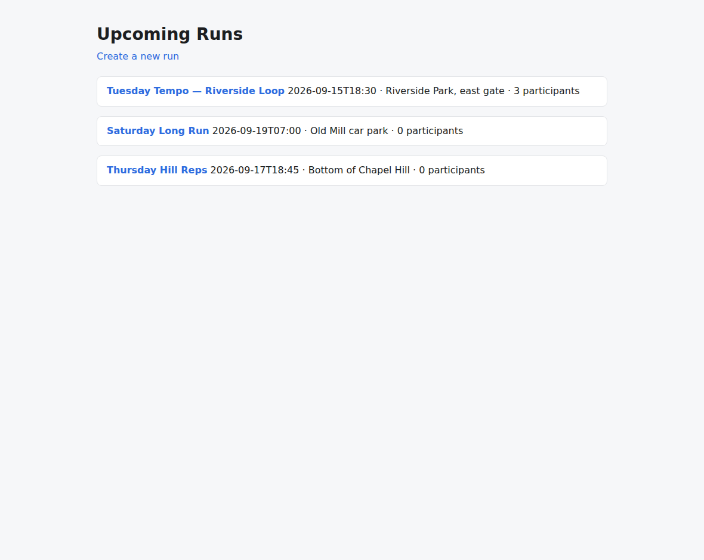
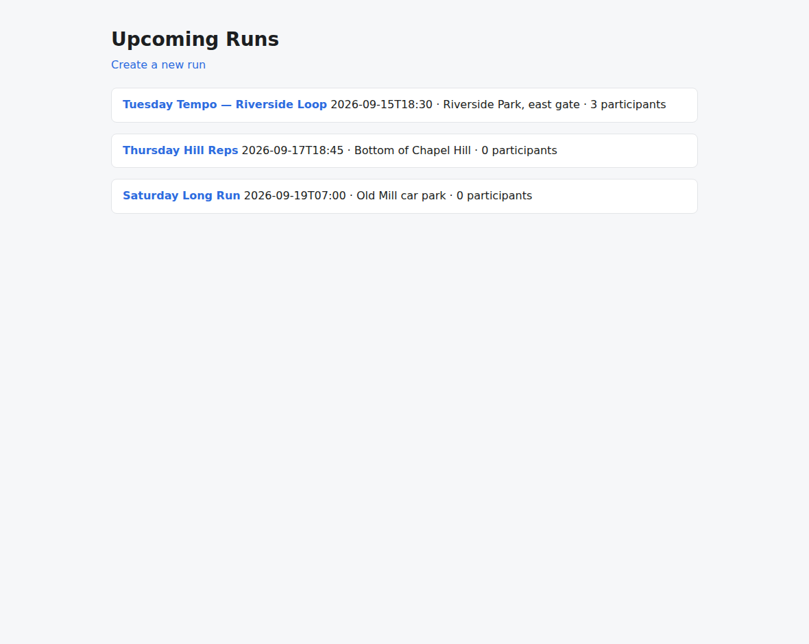
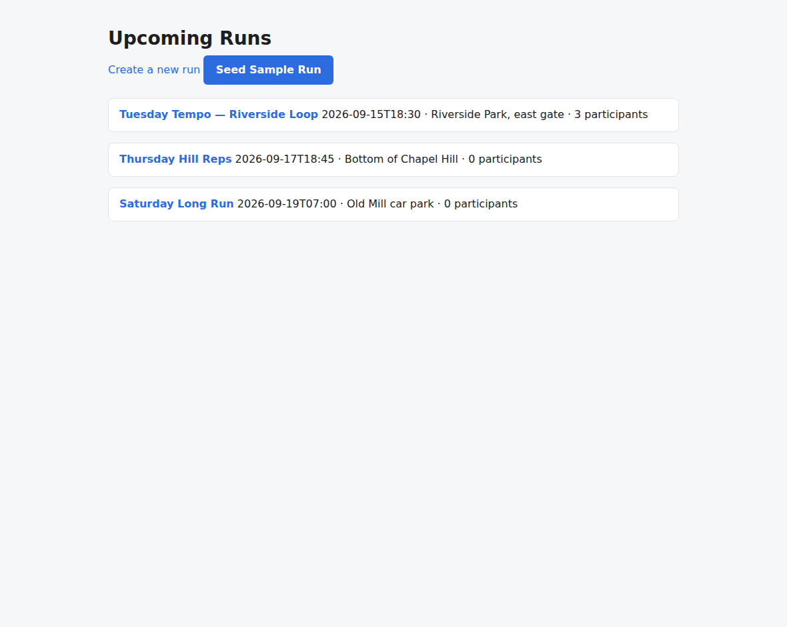
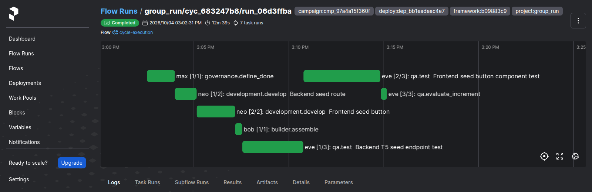

# v2.0.0

**Released 2026-10-04** · [tag `v2.0.0`](https://github.com/backspring-labs/squad-ops/releases/tag/v2.0.0)

**Campaign: the squad evolves one delivered app increment by increment, unattended between one
supervised gate per increment.** SIP-0109 (Campaign Orchestration), the 2.x line's headline. Plan:
`docs/plans/2-0-0-plan.md` (rev 10). Record: `docs/plans/2-0-0-preregistration.md` §10.

**The claim, measured on rebuild 22 (`b09883c9`, `dep_bb1eadeac4e7`): PASS.** Two pre-registered
campaigns ran group_run from a calibration cycle through three accepted increments each, with a
supervisor ruling each proposal through the interface and no owner action.
- **Both campaigns completed by their objective** (§10 row 3). Every increment was built on the one
  before it, and every earlier frozen criterion passed on each later increment.
- **Every safety guarantee held in both:**
  - no build without an approving ruling bound to its proposal version and accepted tree;
  - no stale, conflicting or lost ruling;
  - one cycle per launch intent;
  - every promotion carries its whole tree (`tree_ref`) and its criteria's bundles;
  - no launch beside a crew model.
- **Both evidence packages were complete at close.** No escalation, no limit reached, no framework fix
  during the set.
- **Five predictions held** (P1, P2, P3, P6, P7) and three were not exercised (P4, P5, P8), since no
  increment failed. **P9 is falsified:** each approved request stated only its feature, but two
  criterion files frozen at promotion add rules none stated (a tie order; a white-box store check).
  #1884 moves to 2.1.
- **The reference scenario,** a fixed increment on a pinned baseline outside any campaign, gave the
  same outcome before and after the two campaigns.
- **The shakeout loop took ten campaigns.** The first four each found the next seam defect, and the
  tenth found none on the registered deploy.

**The campaign (SIP-0109).**
- **The campaign object:** its lifecycle, control log and launch outbox, in Postgres, with
  `/api/v1/campaigns`, the supervisor and triage roles, the `squadops campaigns` commands, and every
  control-log row projected as an event and an audit record (#1808, #1809, #1815, #1816, #1838).
- **The continuation decision:** §10's fourteen rows as a pure function; the completion hook that
  hears a cycle end; the owner's word on a held or escalated action; the objective's measurement,
  read so row 3 can end a campaign in success (#1825, #1834, #1835, #1907).
- **The increment proposal and its gate:** a typed change request with its rails, written by the
  strategy role's proposal run (#1818, #1820, #1821). At the increment gate the submission is
  recorded, and the ruling is bound to the version and accepted tree, recorded before it acts
  (#1828). A returned proposal is revised in a new run from the version it returned (#1830), and a
  supervisor rules from the change request they reviewed (#1836). The proposal ledger and the
  supervisor's classification (#1841); the ruling bound, recorded as it passes, for whoever holds the
  seat (#1895, #1920).
- **The brownfield increment cycle:** an approved increment binds its framing to the candidate
  manifest and frames only its approved change; its implementation starts from the accepted tree and
  writes only the slots its change touches; each new criterion is proven in its own test file; the
  increment ends in its evaluation, and an accepted one is promoted with its criteria frozen; every
  declared route renders, read in the qa container (#1840, #1842–#1844, #1847–#1852, #1854).
- **Accumulated acceptance:** the evaluator trees, verifier bundles and test identity; discrimination,
  frozen criteria and route rendering, executed on the stack's runner; frozen verifiers protected,
  retired criteria leaving the frozen set, a replaced verifier frozen anew (#1822, #1823, #1839,
  #1855, #1863).
- **Repair and retry:** a rejected increment is repaired from its own candidate under its approved
  plan; a retry reuses the increment's bound request, ruling, baseline and footprint; each is shown
  the failed cycle's own record (the prior-cycle brief), and a proposal after an abandoned increment
  is shown why it was abandoned (#1856, #1858, #1861, #1862).
- **Recovery:** a cycle whose completion hook did not decide is re-heard at startup; a restart takes
  up the campaign cycle it died inside; a task a restarted runtime asks for again is answered, not run
  twice; the recovery diagnostics harness (#1860, #1923, #1924, #1932).
- **The box lease and the quiet-box check:** stored, with its API, and refused at every launch path.
  A run start waits for a quiet box as a launch does (#1829, #1915, #1931).
- **Evidence:** a cycle's failure records persisted at its ending, and the attribution read from them;
  the package and morning digest materialized at close; what died with the container logs (the runs'
  revision forms, each cycle's log window) kept (#1811, #1813, #1837, #1919). **After the set,** the
  digest says what each increment shipped, how each proposal was ruled, and the package's size against
  its bound (#1998).
- **The reference scenario's build and proposal halves,** with a per-mechanism report and a typed
  rating (#1853, #1879, #1882, #1896).
- **Campaign definitions are tracked with their project,** each reconciled against the stored
  campaign, and the records tarball carries the line's campaigns' outputs through the same scan
  (#1942, #1953).
- **The runbook:** running, supervising and recovering a campaign (#1904). After the set, it gained the
  outer loop's second half and the approval boundary (#1997).

**What the proposer is told, each from a shakeout's finding.** Each frozen criterion's assertion,
not only its id (#1939). The rule a new criterion is judged by: it must fail on the accepted tree
(#1947). What an optional field left out comes back as on the stack (#1949). An increment's plan asks
only for tests of what the approved change states (#1886).

**SIP-0107's flip** (step 7): a repair's whole re-emission of an offered file is refused (#1909),
read on its checkpoint pair before registration (#1910).

**Found by the shakeouts, each fixed and closed:**
- the completion hook counts a cycle's stored usage instead of crashing on it (#1857);
- the plan check judges only the workloads whose gate judges the plan (#1864);
- an escalated campaign can be resumed with the owner's action (#1866);
- an increment's plan authors are told which footprint files the scaffold writes (#1868);
- an increment's framing runs the plan proposers (#1870);
- the startup sweep skips a cycle that ended through the completion boundary (#1872);
- an increment's proposers see every surface the merger does (#1874);
- an increment builds on its candidate's frozen files, and request models take their entities' types
  (#1876, #1877);
- an increment's evaluation judges the candidate with its qa suites (#1880);
- a question the accepted cycle's gate answered is not asked again (#1885);
- an increment's accepted tree is the whole app, recorded at promotion (#1887);
- the cycles list pages, and a status filter reads past the newest page (#1891);
- a self-evaluation pass's edit keeps the type of the file it edits (#1897);
- `contract_assertions_match` reads a reused name as its latest call (#1898);
- an accepted repair proposes from the manifest it ran against (#1902);
- an increment's plan gate reads the seed forwarded to its framing (#1905);
- a qa test task declares the suite it authors (#1912);
- the frozen-statement lookup is a function of stored data alone (#1943).

**Carried in from 1.9, landed.**
- The two jsdom-safe forms are shown to the develop and qa roles (#1785).
- A manifest route's parameter renders in the stack's router syntax (#1794).
- An endpoint error the contract does not define is unwinnable (#1819).
- The technical design shows the revision request it is handed (#1845).
- One rule for the files a run delivered (#1833).
- A qa re-take keeps the suite files it leaves alone (#1755).
- The replay keeps each repair's responses (#1788).
- `campaign:` and `deploy:` Prefect flow-run tags (#1728).

**Records.**
- Every accepted SIP carries a delivery ledger, and `sips/PORTFOLIO.md` tracks overlap and
  reconciliation (#1970).
- SIP-Outcome-Evaluation is proposed (#1963).
- The 2.1.0 plan is adopted (#1955).

**Not landed, stated.**
- **#1884 stays open:** the set read P9 falsified. The fix is on the qa author's side, or in what the
  evaluation freezes (2.1.0).
- **The set's other findings,** #1961, #1962 and #1995, are placed in 2.1.0. Each was caught by the
  supervisor at the gate, and none was fixed during the set.
- **#1708's auto-decision tier and escalation queue** are 2.2.0.
- **#1710's squad first pass** is not built: who writes it is the owner's open question.
- **#1824:** §10's retry rows stay unreachable, since no cycle produces an environment-attributed
  rejection (2.1.0).
- **SIP-0109's unbuilt items** are placed: #1971, #1972, #1973 (2.1.0).

**Drift from the registered deploy, declared.** After the set: the digest's renderings (#1998, digest
text only, with no verdict, gate or package identity), the runbook (#1997), the records tool (#1953),
and docs and SIP records. None of the set's evidence depends on them.

## Merged pull requests (120)

| PR | Title | Closes |
|---|---|---|
| [#1999](https://github.com/backspring-labs/squad-ops/pull/1999) | chore(release): 2.0.0 - Campaign | — |
| [#1998](https://github.com/backspring-labs/squad-ops/pull/1998) | feat(campaigns): the morning digest says what each increment shipped, how each proposal was ruled, and the package's size against its bound | — |
| [#1997](https://github.com/backspring-labs/squad-ops/pull/1997) | docs(ops): the campaign runbook's second half - fix, redeploy, the next campaign, the approval boundary | [#1711](https://github.com/backspring-labs/squad-ops/issues/1711) |
| [#1996](https://github.com/backspring-labs/squad-ops/pull/1996) | docs(plans): the 2.0 counted set's readings - PASS; P9 falsified, so the criterion-file finding moves to 2.1 | — |
| [#1953](https://github.com/backspring-labs/squad-ops/pull/1953) | feat(release): the records tarball carries the line's campaigns' outputs, through the same scan (#1941 item 6) | [#1941](https://github.com/backspring-labs/squad-ops/issues/1941) |
| [#1963](https://github.com/backspring-labs/squad-ops/pull/1963) | sips: SIP-Outcome-Evaluation (proposed) - outcome evidence beside output evidence, from the owner's idea | — |
| [#1955](https://github.com/backspring-labs/squad-ops/pull/1955) | docs(plans): the 2.1.0 plan - ADOPTED: hardening after Campaign, the optimization crew's enablers first, 23 issues | — |
| [#1970](https://github.com/backspring-labs/squad-ops/pull/1970) | sips: delivery ledgers in every accepted SIP, sips/PORTFOLIO.md, and the ledger-and-intake rule | — |
| [#1908](https://github.com/backspring-labs/squad-ops/pull/1908) | docs(plans): the 2.0 campaign set's pre-registration - REGISTERED on rebuild 22 | — |
| [#1952](https://github.com/backspring-labs/squad-ops/pull/1952) | examples(campaigns): provenance regenerated - shakeouts 8-10 and the rebuild 20-22 diagnostics reconciled (#1941) | — |
| [#1951](https://github.com/backspring-labs/squad-ops/pull/1951) | docs(plans): 2.0 plan ledger - #1938 #1943 #1946 #1948 closed; #1950 placed in 2.1.0 | — |
| [#1949](https://github.com/backspring-labs/squad-ops/pull/1949) | fix(campaigns): the proposer is told what an optional field left out comes back as - the stack's frozen null (SIP-0109 §24ar) | [#1948](https://github.com/backspring-labs/squad-ops/issues/1948) |
| [#1947](https://github.com/backspring-labs/squad-ops/pull/1947) | fix(campaigns): the proposer is told the rule a new criterion is judged by - it must fail on the accepted tree | [#1946](https://github.com/backspring-labs/squad-ops/issues/1946) |
| [#1945](https://github.com/backspring-labs/squad-ops/pull/1945) | examples(campaigns): shakeout 8's definition, shakeout 7's objective and policy exactly | — |
| [#1944](https://github.com/backspring-labs/squad-ops/pull/1944) | fix(campaigns): the frozen-statement lookup is a function of stored data alone, so a promotion's replay computes the same binding | [#1943](https://github.com/backspring-labs/squad-ops/issues/1943) |
| [#1942](https://github.com/backspring-labs/squad-ops/pull/1942) | feat(campaigns): campaign definitions tracked with their project, each reconciled against the stored campaign | — |
| [#1939](https://github.com/backspring-labs/squad-ops/pull/1939) | fix(campaigns): a proposal is told what each frozen criterion asserts, not only its id | [#1938](https://github.com/backspring-labs/squad-ops/issues/1938) |
| [#1936](https://github.com/backspring-labs/squad-ops/pull/1936) | docs(sip-0109): the box lease's deployed proof read, both halves; §24an proven live | — |
| [#1935](https://github.com/backspring-labs/squad-ops/pull/1935) | docs(2.0): #1934 placed - a proposal task is not recognised by the restart replay | — |
| [#1933](https://github.com/backspring-labs/squad-ops/pull/1933) | fix(scripts): the kill before promotion reads what was committed while the process is down | — |
| [#1932](https://github.com/backspring-labs/squad-ops/pull/1932) | fix(campaigns): a restart leaves its runs for the re-attach, and a task a restarted runtime asks for again is answered, not run twice | [#1929](https://github.com/backspring-labs/squad-ops/issues/1929) |
| [#1931](https://github.com/backspring-labs/squad-ops/pull/1931) | fix(campaigns): a run start refuses what a launch refuses - it waits for a quiet box, not only the lease (owner's ruling) | [#1928](https://github.com/backspring-labs/squad-ops/issues/1928) |
| [#1926](https://github.com/backspring-labs/squad-ops/pull/1926) | docs(2.0): plan §3.6 amended by the owner's ruling, and the diagnostics run before the exit shakeout | — |
| [#1927](https://github.com/backspring-labs/squad-ops/pull/1927) | fix(scripts): the recovery diagnostics log in before every CLI call, by the driver's rule | — |
| [#1925](https://github.com/backspring-labs/squad-ops/pull/1925) | fix(scripts): the release captures read the main checkout's vault and name the browser's own error page | [#1793](https://github.com/backspring-labs/squad-ops/issues/1793) |
| [#1924](https://github.com/backspring-labs/squad-ops/pull/1924) | feat(scripts): the campaign recovery diagnostics harness - a restart at each state, the kill before promotion, each a pure verdict over the records | — |
| [#1923](https://github.com/backspring-labs/squad-ops/pull/1923) | fix(campaigns): a restart takes up the campaign cycle it died inside - its gate open again, its run resumed | [#1922](https://github.com/backspring-labs/squad-ops/issues/1922) |
| [#1920](https://github.com/backspring-labs/squad-ops/pull/1920) | feat(campaigns): one supervisor's ruling bound, whoever holds the seat | — |
| [#1807](https://github.com/backspring-labs/squad-ops/pull/1807) | docs(2.0): the validation plan — verification matrix, recovery diagnostics, reference scenario inputs | — |
| [#1921](https://github.com/backspring-labs/squad-ops/pull/1921) | docs(2.0): the flip's checkpoint pair read (SIP-0107 §46s), and plan rev 10 - §5a current | [#1788](https://github.com/backspring-labs/squad-ops/issues/1788) |
| [#1919](https://github.com/backspring-labs/squad-ops/pull/1919) | feat(campaigns): what died with the logs is kept - the runs' revision forms, and each cycle's log window | — |
| [#1918](https://github.com/backspring-labs/squad-ops/pull/1918) | feat(campaigns): a plan gate waiting on a design question is bounded as the increment gate is | — |
| [#1917](https://github.com/backspring-labs/squad-ops/pull/1917) | docs(plans): 2.0 plan rev 9 - every 2.0 issue's status after the shakeout loop, what remains, and proposed re-placements | [#1799](https://github.com/backspring-labs/squad-ops/issues/1799) |
| [#1915](https://github.com/backspring-labs/squad-ops/pull/1915) | feat(campaigns): the box lease, enforced - stored, its API, and refused at every launch path | [#1802](https://github.com/backspring-labs/squad-ops/issues/1802) |
| [#1914](https://github.com/backspring-labs/squad-ops/pull/1914) | fix(plans): a qa.test task declares the suite it authors - a suiteless one is refused at both plan gates and at dispatch | [#1912](https://github.com/backspring-labs/squad-ops/issues/1912) |
| [#1910](https://github.com/backspring-labs/squad-ops/pull/1910) | plans(verification-sets): the flip's checkpoint pair - React and Next.js regression configs with the flip loaded | — |
| [#1909](https://github.com/backspring-labs/squad-ops/pull/1909) | feat(repair): SIP-0107 step 7, the flip — a repair's whole re-emission of an offered file is refused | — |
| [#1907](https://github.com/backspring-labs/squad-ops/pull/1907) | feat(campaigns): the objective's measurement has a reader, so row 3 can end a campaign in success | — |
| [#1906](https://github.com/backspring-labs/squad-ops/pull/1906) | fix(cycles): an increment's plan gate reads the seed forwarded to its framing | [#1905](https://github.com/backspring-labs/squad-ops/issues/1905) |
| [#1904](https://github.com/backspring-labs/squad-ops/pull/1904) | docs(ops): the campaign runbook — running, supervising and recovering a campaign | — |
| [#1901](https://github.com/backspring-labs/squad-ops/pull/1901) | fix(cycles): the cycles list pages, and a status filter reads past the newest page | [#1891](https://github.com/backspring-labs/squad-ops/issues/1891) |
| [#1903](https://github.com/backspring-labs/squad-ops/pull/1903) | fix(campaigns): an accepted repair proposes from the manifest it ran against | [#1902](https://github.com/backspring-labs/squad-ops/issues/1902) |
| [#1900](https://github.com/backspring-labs/squad-ops/pull/1900) | fix(checks): contract_assertions_match reads a reused name as its latest call | [#1898](https://github.com/backspring-labs/squad-ops/issues/1898) |
| [#1896](https://github.com/backspring-labs/squad-ops/pull/1896) | feat(campaigns): the reference scenario's proposal half, proposed and rated | — |
| [#1899](https://github.com/backspring-labs/squad-ops/pull/1899) | fix(handlers): a self-evaluation pass's edit keeps the type of the file it edits | [#1897](https://github.com/backspring-labs/squad-ops/issues/1897) |
| [#1895](https://github.com/backspring-labs/squad-ops/pull/1895) | feat(campaigns): the increment gate's ruling bound is recorded as it passes | — |
| [#1894](https://github.com/backspring-labs/squad-ops/pull/1894) | fix(campaigns): a question the accepted cycle's gate answered is not asked again | [#1885](https://github.com/backspring-labs/squad-ops/issues/1885) |
| [#1893](https://github.com/backspring-labs/squad-ops/pull/1893) | fix(campaigns): the per-mechanism report names which increment it reads | — |
| [#1892](https://github.com/backspring-labs/squad-ops/pull/1892) | feat(replay): a sample keeps each repair's responses, their parse and usage | — |
| [#1890](https://github.com/backspring-labs/squad-ops/pull/1890) | fix(qa): a re-take keeps the suite files it leaves alone | [#1755](https://github.com/backspring-labs/squad-ops/issues/1755) |
| [#1889](https://github.com/backspring-labs/squad-ops/pull/1889) | feat(cycles): campaign: and deploy: Prefect flow-run tags | [#1728](https://github.com/backspring-labs/squad-ops/issues/1728) |
| [#1888](https://github.com/backspring-labs/squad-ops/pull/1888) | fix(campaigns): an increment's accepted tree is the whole app, recorded at promotion | [#1887](https://github.com/backspring-labs/squad-ops/issues/1887) |
| [#1886](https://github.com/backspring-labs/squad-ops/pull/1886) | fix(campaigns): an increment's plan asks only for tests of what the approved change states | — |
| [#1883](https://github.com/backspring-labs/squad-ops/pull/1883) | docs(sip-0109): §24ab — the builder still assembles an increment's build | — |
| [#1882](https://github.com/backspring-labs/squad-ops/pull/1882) | test(campaigns): the per-mechanism report, on the first evaluated increment's record | — |
| [#1881](https://github.com/backspring-labs/squad-ops/pull/1881) | fix(campaigns): an increment's evaluation judges the candidate with its qa suites | [#1880](https://github.com/backspring-labs/squad-ops/issues/1880) |
| [#1879](https://github.com/backspring-labs/squad-ops/pull/1879) | feat(campaigns): the reference scenario's per-mechanism report, read from the record — SIP-0109 §11a | — |
| [#1878](https://github.com/backspring-labs/squad-ops/pull/1878) | fix(campaigns): an increment builds on its candidate's frozen files, and request models take their entities' types | [#1876](https://github.com/backspring-labs/squad-ops/issues/1876) [#1877](https://github.com/backspring-labs/squad-ops/issues/1877) |
| [#1875](https://github.com/backspring-labs/squad-ops/pull/1875) | fix(campaigns): an increment's proposers are shown every increment surface the merger is | [#1874](https://github.com/backspring-labs/squad-ops/issues/1874) |
| [#1873](https://github.com/backspring-labs/squad-ops/pull/1873) | fix(api): the startup sweep skips a cycle that ended through the completion boundary | [#1872](https://github.com/backspring-labs/squad-ops/issues/1872) |
| [#1871](https://github.com/backspring-labs/squad-ops/pull/1871) | fix(campaigns): an increment's framing runs the plan proposers — both campaign profiles name their contributors | [#1870](https://github.com/backspring-labs/squad-ops/issues/1870) |
| [#1869](https://github.com/backspring-labs/squad-ops/pull/1869) | fix(campaigns): an increment's plan authors are told which footprint files the scaffold writes, and are not offered a builder | [#1868](https://github.com/backspring-labs/squad-ops/issues/1868) |
| [#1867](https://github.com/backspring-labs/squad-ops/pull/1867) | fix(cli): campaigns resume can name the owner's action — an escalated campaign can be resumed | [#1866](https://github.com/backspring-labs/squad-ops/issues/1866) |
| [#1865](https://github.com/backspring-labs/squad-ops/pull/1865) | fix(cycles): the plan check judges only the workloads whose gate judges the plan — an increment's proposal is ruled, not refused | [#1864](https://github.com/backspring-labs/squad-ops/issues/1864) |
| [#1863](https://github.com/backspring-labs/squad-ops/pull/1863) | feat(campaigns): a replaced verifier is frozen anew from the candidate — SIP-0109 §8.1 | — |
| [#1862](https://github.com/backspring-labs/squad-ops/pull/1862) | feat(campaigns): a proposal after an abandoned increment is shown why it was abandoned — SIP-0109 §7, row 13 | — |
| [#1861](https://github.com/backspring-labs/squad-ops/pull/1861) | feat(campaigns): a retry or repair is shown the failed cycle's own record — the prior-cycle brief | — |
| [#1860](https://github.com/backspring-labs/squad-ops/pull/1860) | feat(campaigns): a cycle whose completion hook did not decide is re-heard at startup — SIP-0109 §12a | — |
| [#1858](https://github.com/backspring-labs/squad-ops/pull/1858) | feat(campaigns): a rejected increment is repaired from its own candidate under its approved plan — SIP-0109 §10a | — |
| [#1859](https://github.com/backspring-labs/squad-ops/pull/1859) | fix(campaigns): the completion hook counts a cycle's stored usage instead of crashing on it | [#1857](https://github.com/backspring-labs/squad-ops/issues/1857) |
| [#1856](https://github.com/backspring-labs/squad-ops/pull/1856) | feat(campaigns): retry cycles reuse the increment's bound request, ruling and baseline (SIP-0109 §10a) | — |
| [#1853](https://github.com/backspring-labs/squad-ops/pull/1853) | feat(campaigns): the brownfield reference scenario — a fixed, pinned increment (SIP-0109 #1804) | — |
| [#1855](https://github.com/backspring-labs/squad-ops/pull/1855) | feat(campaigns): frozen verifiers are protected, and retired criteria leave the frozen set (SIP-0109 §19 items 7, 12e) | — |
| [#1854](https://github.com/backspring-labs/squad-ops/pull/1854) | feat(campaigns): every declared route renders, read in the qa container (SIP-0109 step e, part 3) | — |
| [#1852](https://github.com/backspring-labs/squad-ops/pull/1852) | feat(campaigns): an accepted increment is promoted and its criteria frozen (SIP-0109 step e, part 2) | — |
| [#1851](https://github.com/backspring-labs/squad-ops/pull/1851) | feat(campaigns): an increment's implementation ends in its evaluation (SIP-0109 step e, part 1) | — |
| [#1850](https://github.com/backspring-labs/squad-ops/pull/1850) | feat(campaigns): each new criterion is proven in its own test file (SIP-0109 step e, part 0) | — |
| [#1849](https://github.com/backspring-labs/squad-ops/pull/1849) | fix(cycles): the plan gate judges a plan against the cycle the run saw | — |
| [#1848](https://github.com/backspring-labs/squad-ops/pull/1848) | feat(campaigns): an increment's producers write only the slots its change touches (SIP-0109 step c2) | — |
| [#1829](https://github.com/backspring-labs/squad-ops/pull/1829) | feat(campaigns): the box lease and the quiet-box check — decisions and reads (SIP-0109 #1802) | — |
| [#1847](https://github.com/backspring-labs/squad-ops/pull/1847) | feat(campaigns): an increment's framing frames its approved change request, and its seed binds every workload (SIP-0109 step d) | — |
| [#1846](https://github.com/backspring-labs/squad-ops/pull/1846) | fix(framing): the technical design shows the revision request it is handed | [#1845](https://github.com/backspring-labs/squad-ops/issues/1845) |
| [#1844](https://github.com/backspring-labs/squad-ops/pull/1844) | feat(campaigns): the campaign-increment profile — a campaign's increments reach their ruling (SIP-0109 step b) | — |
| [#1843](https://github.com/backspring-labs/squad-ops/pull/1843) | feat(campaigns): an increment's plan covers only its approved change — taught, then enforced at the plan gate — SIP-0109 #1705, step d | — |
| [#1842](https://github.com/backspring-labs/squad-ops/pull/1842) | feat(campaigns): an increment's implementation starts from the accepted tree — SIP-0109 #1705, step c1 | — |
| [#1840](https://github.com/backspring-labs/squad-ops/pull/1840) | feat(campaigns): an approved increment binds its framing to the candidate manifest — SIP-0109 #1705, step a (draft) | — |
| [#1841](https://github.com/backspring-labs/squad-ops/pull/1841) | feat(campaigns): the proposal ledger, read from the control log, and the supervisor's classification — SIP-0109 §9.4 | — |
| [#1839](https://github.com/backspring-labs/squad-ops/pull/1839) | feat(campaigns): an increment's acceptance, executed on the stack's runner — SIP-0109 step 4, part b | — |
| [#1838](https://github.com/backspring-labs/squad-ops/pull/1838) | feat(campaigns): every control-log row projected — the non-route writers through a projecting registry — SIP-0109 step 6 | — |
| [#1837](https://github.com/backspring-labs/squad-ops/pull/1837) | feat(campaigns): the evidence package and morning digest, materialized at a campaign's close — SIP-0109 step 7, part a | — |
| [#1836](https://github.com/backspring-labs/squad-ops/pull/1836) | feat(cli): rule the increment gate from the change request you reviewed — squadops runs gate … --change-request | — |
| [#1835](https://github.com/backspring-labs/squad-ops/pull/1835) | feat(campaigns): the owner's word — a held action resumed as recorded, an escalation ruled by its named action — SIP-0109 step 5, part e | — |
| [#1834](https://github.com/backspring-labs/squad-ops/pull/1834) | feat(campaigns): a campaign hears its cycle end — promotion, the counters, the decision's row — SIP-0109 step 5, part d-ii | — |
| [#1833](https://github.com/backspring-labs/squad-ops/pull/1833) | fix(cycles): one rule for the files a run delivered — the assembly and the screenshots no longer take rejected repairs or failed emissions | [#1832](https://github.com/backspring-labs/squad-ops/issues/1832) |
| [#1831](https://github.com/backspring-labs/squad-ops/pull/1831) | feat(campaigns): a campaign starts — its calibration cycle launched by the cycle-create path — SIP-0109 step 5, part d-i | — |
| [#1830](https://github.com/backspring-labs/squad-ops/pull/1830) | feat(campaigns): a returned proposal is revised in a new proposal run, from the version it returned — SIP-0109 step 5, part b-iii | — |
| [#1828](https://github.com/backspring-labs/squad-ops/pull/1828) | feat(campaigns): the increment gate — the proposal submitted, the ruling bound and recorded first — SIP-0109 step 5, part b-ii | — |
| [#1827](https://github.com/backspring-labs/squad-ops/pull/1827) | feat(campaigns): the campaign's accepted tree, moved only by a promotion — SIP-0109 step 5, part b-i | — |
| [#1826](https://github.com/backspring-labs/squad-ops/pull/1826) | test(cli): the integration test's vault lives in a temporary directory, not the live one | — |
| [#1825](https://github.com/backspring-labs/squad-ops/pull/1825) | feat(campaigns): the continuation decision — §10's fourteen rows, pure — SIP-0109 step 5, part a | — |
| [#1823](https://github.com/backspring-labs/squad-ops/pull/1823) | feat(campaigns): an increment's acceptance — discrimination, frozen criteria, route rendering — SIP-0109 step 4, decisions | — |
| [#1822](https://github.com/backspring-labs/squad-ops/pull/1822) | feat(campaigns): the evaluator trees, verifier bundles and test identity — SIP-0109 step 3 | — |
| [#1821](https://github.com/backspring-labs/squad-ops/pull/1821) | fix(campaigns): the proposal's accepted manifest travels in its persisted inputs, not through a vault the agent lacks | — |
| [#1820](https://github.com/backspring-labs/squad-ops/pull/1820) | feat(campaigns): the proposal run — strategy.propose_increment, its prompt, the proposal workload — SIP-0109 step 2, part b | — |
| [#1819](https://github.com/backspring-labs/squad-ops/pull/1819) | fix(manifest gates): an endpoint error the contract does not define is unwinnable | [#1817](https://github.com/backspring-labs/squad-ops/issues/1817) |
| [#1818](https://github.com/backspring-labs/squad-ops/pull/1818) | feat(campaigns): the typed change request and its rails — SIP-0109 step 2, part a | — |
| [#1816](https://github.com/backspring-labs/squad-ops/pull/1816) | feat(cli,campaigns): squadops campaigns commands, and each control-log row projected as an event — SIP-0109 §13 | — |
| [#1815](https://github.com/backspring-labs/squad-ops/pull/1815) | feat(campaigns): /api/v1/campaigns with the owner's supervisor and triage roles — SIP-0109 §13 | — |
| [#1814](https://github.com/backspring-labs/squad-ops/pull/1814) | fix(scripts): the snapshot and the backfill refuse evidence they could not read | — |
| [#1813](https://github.com/backspring-labs/squad-ops/pull/1813) | feat(assessment): a cycle's failure records persisted at its ending, and the attribution read from them — SIP-0109 step 1a, part 2 | — |
| [#1812](https://github.com/backspring-labs/squad-ops/pull/1812) | fix(prompts): show the two jsdom-safe forms — a form's values from state or FormData, a route-param view mounted under its route | [#1785](https://github.com/backspring-labs/squad-ops/issues/1785) |
| [#1811](https://github.com/backspring-labs/squad-ops/pull/1811) | refactor(assessment): failure_events(outcome, evidence), the one failure producer, with the attribution computed from it — SIP-0109 step 1a, part 1 | — |
| [#1810](https://github.com/backspring-labs/squad-ops/pull/1810) | docs(verification sets): the 2.0 regression roll's config — the 1.9 React roll's, uncounted, with loaded checks for what the first 2.0 deploy adds | — |
| [#1809](https://github.com/backspring-labs/squad-ops/pull/1809) | feat(campaigns): campaigns in Postgres, a cycle's campaign columns, idempotent creation by launch, and the launcher — SIP-0109 step 1, part B | — |
| [#1808](https://github.com/backspring-labs/squad-ops/pull/1808) | feat(campaigns): the campaign object, its lifecycle, the control log and the launch outbox — SIP-0109 step 1, part A | — |
| [#1719](https://github.com/backspring-labs/squad-ops/pull/1719) | docs(roadmap reconciliation): the squad takes the first pass; the crew triages between campaigns, through the CLI | — |
| [#1798](https://github.com/backspring-labs/squad-ops/pull/1798) | docs(2.0): the 2.0.0 plan draft and the Campaign SIP's revision 2 — for review | — |
| [#1805](https://github.com/backspring-labs/squad-ops/pull/1805) | docs(sips): Cross-Cycle Memory revision 3 — the v4 draft's additions, reconciled (split from #1798) | — |
| [#1797](https://github.com/backspring-labs/squad-ops/pull/1797) | fix(scaffold): a manifest route's parameter renders in the stack's router syntax, so React's detail route matches | [#1794](https://github.com/backspring-labs/squad-ops/issues/1794) |
| [#1795](https://github.com/backspring-labs/squad-ops/pull/1795) | docs(release): the v1.9.0 release package, its records, and roll 4's rounds in order | — |

## Improvement proposals

| Proposal | From | To |
|---|---|---|
| [SIP-0104-Deterministic-Verification-Scaffolding-with](../../design/sips/SIP-0104-Deterministic-Verification-Scaffolding-with.md) | accepted | implemented |
| [SIP-0109-Campaign-Orchestration](../../design/sips/SIP-0109-Campaign-Orchestration.md) | proposed | accepted |
| [SIP-Outcome-Evaluation](../../design/sips/SIP-Outcome-Evaluation.md) | new | proposed |
| [SIP-Verification-Yield](../../design/sips/SIP-Verification-Yield.md) | new | proposed |

## Improvement proposals amended in place

No lifecycle change — each was edited under the status it already had (a post-acceptance amendment, CLAUDE.md step 5a).

| Proposal | Status |
|---|---|
| [SIP-0083-Multi-Run-Cycle-Orchestration](../../design/sips/SIP-0083-Multi-Run-Cycle-Orchestration.md) | implemented |
| [SIP-0088-Agent-Runtime-Modes](../../design/sips/SIP-0088-Agent-Runtime-Modes.md) | accepted |
| [SIP-0089-Agent-Runtime-State](../../design/sips/SIP-0089-Agent-Runtime-State.md) | implemented |
| [SIP-0090-Agent-Embodiment-Substrate](../../design/sips/SIP-0090-Agent-Embodiment-Substrate.md) | accepted |
| [SIP-0091-Duty-Durability-via-Temporal](../../design/sips/SIP-0091-Duty-Durability-via-Temporal.md) | accepted |
| [SIP-0092-Implementation-Plan-Improvement](../../design/sips/SIP-0092-Implementation-Plan-Improvement.md) | accepted |
| [SIP-0093-Multi-Role-Plan-Authoring](../../design/sips/SIP-0093-Multi-Role-Plan-Authoring.md) | accepted |
| [SIP-0096-Verification-Evidence-Integrity](../../design/sips/SIP-0096-Verification-Evidence-Integrity.md) | implemented |
| [SIP-0101-Cycle-Replay-Harness](../../design/sips/SIP-0101-Cycle-Replay-Harness.md) | accepted |
| [SIP-0102-Ephemeral-Application-Sandbox](../../design/sips/SIP-0102-Ephemeral-Application-Sandbox.md) | accepted |
| [SIP-0103-Squad-Authored-Manifest](../../design/sips/SIP-0103-Squad-Authored-Manifest.md) | implemented |
| [SIP-0105-Stack-Blueprint-Contract](../../design/sips/SIP-0105-Stack-Blueprint-Contract.md) | accepted |
| [SIP-0107-Scoped-Code-Revision](../../design/sips/SIP-0107-Scoped-Code-Revision.md) | accepted |
| [SIP-0108-Cycle-Evaluation-Scorecard](../../design/sips/SIP-0108-Cycle-Evaluation-Scorecard.md) | implemented |
| [SIP-API-Contract-Hardening](../../design/sips/SIP-API-Contract-Hardening.md) | proposed |
| [SIP-Agent-Comms-Delivery-Guarantees](../../design/sips/SIP-Agent-Comms-Delivery-Guarantees.md) | proposed |
| [SIP-Agent-Embodiment-Runtime](../../design/sips/SIP-Agent-Embodiment-Runtime.md) | proposed |
| [SIP-Campaign-Self-Improvement-and-Test-Bay-Requirements](../../design/sips/SIP-Campaign-Self-Improvement-and-Test-Bay-Requirements.md) | proposed |
| [SIP-Capability-Backed-Agents](../../design/sips/SIP-Capability-Backed-Agents.md) | proposed |
| [SIP-Continuum-Runtime-Console](../../design/sips/SIP-Continuum-Runtime-Console.md) | proposed |
| SIP-Cross-Cycle-Memory | proposed |
| [SIP-Cycle-Request-Profile-Naming-Taxonomy](../../design/sips/SIP-Cycle-Request-Profile-Naming-Taxonomy.md) | proposed |
| [SIP-Design-Decision-Register](../../design/sips/SIP-Design-Decision-Register.md) | proposed |
| [SIP-Duty-Continuity-and-Handoff-Ledger](../../design/sips/SIP-Duty-Continuity-and-Handoff-Ledger.md) | proposed |
| [SIP-Edge-Deployment-Profile](../../design/sips/SIP-Edge-Deployment-Profile.md) | proposed |
| [SIP-LLM-Emission-Contracts](../../design/sips/SIP-LLM-Emission-Contracts.md) | proposed |
| [SIP-Post-Retest-Governance-Acceptance-Review](../../design/sips/SIP-Post-Retest-Governance-Acceptance-Review.md) | proposed |
| [SIP-Skill-Layer-For-Capabilities](../../design/sips/SIP-Skill-Layer-For-Capabilities.md) | proposed |
| [SIP-Test-First-Verification](../../design/sips/SIP-Test-First-Verification.md) | proposed |

## Cycle evidence

### `cyc_035199bf8994`

**Verdict:** `accepted` · **Runs:** 2 · **Role:** counted

| | Checks |
|---|---|
| Verified | acceptance:additive_containment, acceptance:assertion_kinds_match, acceptance:client_mock_surface, acceptance:command_exit_zero, acceptance:contract_assertions_match, acceptance:declared_imports, acceptance:dom_anchor_queries, acceptance:endpoint_defined, acceptance:fill_slot_signature, acceptance:frontend_compiles, acceptance:function_defined, acceptance:harness_boundary, acceptance:import_present, acceptance:module_imports, acceptance:regex_match, acceptance:undefined_names, acceptance:unterminated_source, acceptance_criteria_prose, expected_artifacts, frontend_build, no_self_mocking_tests, no_stub_fallback_tests, non_stub_files, required_files, tests_pass, vc-probe-runs, vc-probe-runs-join, vc-probe-runs-join-duplicate, vc-probe-runs-leave, vc-probe-runs-rejects-blank |
| Failed | — |
| Required unmet | — |
| Never executed | — |

### `cyc_e004181bf968`

**Verdict:** `accepted` · **Runs:** 3 · **Role:** counted

| | Checks |
|---|---|
| Verified | acceptance:assertion_kinds_match, acceptance:command_exit_zero, acceptance:contract_assertions_match, acceptance:endpoint_defined, acceptance:fill_slot_signature, acceptance:frontend_compiles, acceptance:function_defined, acceptance:harness_boundary, acceptance:import_present, acceptance:module_imports, acceptance:undefined_names, acceptance:unterminated_source, acceptance_criteria_prose, expected_artifacts, frontend_build, no_self_mocking_tests, no_stub_fallback_tests, non_stub_files, required_files, tests_pass, vc-probe-runs, vc-probe-runs-join, vc-probe-runs-join-duplicate, vc-probe-runs-leave, vc-probe-runs-rejects-blank |
| Failed | — |
| Required unmet | — |
| Never executed | — |

### `cyc_b10247505291`

**Verdict:** `accepted` · **Runs:** 5 · **Role:** counted

| | Checks |
|---|---|
| Verified | acceptance:assertion_kinds_match, acceptance:command_exit_zero, acceptance:contract_assertions_match, acceptance:endpoint_defined, acceptance:fill_slot_signature, acceptance:frontend_compiles, acceptance:function_defined, acceptance:harness_boundary, acceptance:import_present, acceptance:module_imports, acceptance:undefined_names, acceptance:unterminated_source, acceptance_criteria_prose, expected_artifacts, frontend_build, no_self_mocking_tests, no_stub_fallback_tests, non_stub_files, required_files, tests_pass, vc-probe-runs, vc-probe-runs-join, vc-probe-runs-join-duplicate, vc-probe-runs-leave, vc-probe-runs-rejects-blank, vc-probe-runs-seed |
| Failed | — |
| Required unmet | — |
| Never executed | — |

### `cyc_0a8a683749a8`

**Verdict:** `accepted` · **Runs:** 3 · **Role:** counted

| | Checks |
|---|---|
| Verified | acceptance:additive_containment, acceptance:assertion_kinds_match, acceptance:client_mock_surface, acceptance:command_exit_zero, acceptance:declared_imports, acceptance:dom_anchor_queries, acceptance:endpoint_defined, acceptance:frontend_compiles, acceptance:import_present, acceptance:module_imports, acceptance:undefined_names, acceptance:unterminated_source, acceptance_criteria_prose, expected_artifacts, frontend_build, no_self_mocking_tests, no_stub_fallback_tests, non_stub_files, required_files, tests_pass, vc-probe-runs, vc-probe-runs-join, vc-probe-runs-join-duplicate, vc-probe-runs-leave, vc-probe-runs-rejects-blank, vc-probe-runs-seed |
| Failed | — |
| Required unmet | — |
| Never executed | — |

### `cyc_6d6b0d848596`

**Verdict:** `accepted` · **Runs:** 2 · **Role:** counted

| | Checks |
|---|---|
| Verified | acceptance:additive_containment, acceptance:assertion_kinds_match, acceptance:client_mock_surface, acceptance:command_exit_zero, acceptance:contract_assertions_match, acceptance:declared_imports, acceptance:dom_anchor_queries, acceptance:endpoint_defined, acceptance:fill_slot_signature, acceptance:frontend_compiles, acceptance:function_defined, acceptance:harness_boundary, acceptance:import_present, acceptance:module_imports, acceptance:undefined_names, acceptance:unterminated_source, acceptance_criteria_prose, expected_artifacts, frontend_build, no_self_mocking_tests, no_stub_fallback_tests, non_stub_files, required_files, tests_pass, vc-probe-runs, vc-probe-runs-join, vc-probe-runs-join-duplicate, vc-probe-runs-leave, vc-probe-runs-rejects-blank |
| Failed | — |
| Required unmet | — |
| Never executed | — |

### `cyc_359d44170982`

**Verdict:** `accepted` · **Runs:** 4 · **Role:** counted

| | Checks |
|---|---|
| Verified | acceptance:assertion_kinds_match, acceptance:command_exit_zero, acceptance:contract_assertions_match, acceptance:endpoint_defined, acceptance:fill_slot_signature, acceptance:frontend_compiles, acceptance:function_defined, acceptance:harness_boundary, acceptance:import_present, acceptance:module_imports, acceptance:undefined_names, acceptance:unterminated_source, acceptance_criteria_prose, expected_artifacts, frontend_build, no_self_mocking_tests, no_stub_fallback_tests, non_stub_files, required_files, tests_pass, vc-probe-runs, vc-probe-runs-join, vc-probe-runs-join-duplicate, vc-probe-runs-leave, vc-probe-runs-rejects-blank |
| Failed | — |
| Required unmet | — |
| Never executed | — |

### `cyc_5c6ad38860f3`

**Verdict:** `accepted` · **Runs:** 3 · **Role:** counted

| | Checks |
|---|---|
| Verified | acceptance:assertion_kinds_match, acceptance:command_exit_zero, acceptance:contract_assertions_match, acceptance:endpoint_defined, acceptance:fill_slot_signature, acceptance:frontend_compiles, acceptance:function_defined, acceptance:harness_boundary, acceptance:import_present, acceptance:module_imports, acceptance:undefined_names, acceptance:unterminated_source, acceptance_criteria_prose, expected_artifacts, frontend_build, no_self_mocking_tests, no_stub_fallback_tests, non_stub_files, required_files, tests_pass, vc-probe-runs, vc-probe-runs-join, vc-probe-runs-join-duplicate, vc-probe-runs-leave, vc-probe-runs-rejects-blank |
| Failed | — |
| Required unmet | — |
| Never executed | — |

### `cyc_683247b84a40`

**Verdict:** `accepted` · **Runs:** 3 · **Role:** counted

| | Checks |
|---|---|
| Verified | acceptance:additive_containment, acceptance:assertion_kinds_match, acceptance:client_mock_surface, acceptance:command_exit_zero, acceptance:contract_assertions_match, acceptance:declared_imports, acceptance:dom_anchor_queries, acceptance:endpoint_defined, acceptance:fill_slot_signature, acceptance:frontend_compiles, acceptance:function_defined, acceptance:harness_boundary, acceptance:import_present, acceptance:module_imports, acceptance:undefined_names, acceptance:unterminated_source, acceptance_criteria_prose, expected_artifacts, frontend_build, no_self_mocking_tests, no_stub_fallback_tests, non_stub_files, required_files, tests_pass, vc-probe-runs, vc-probe-runs-join, vc-probe-runs-join-duplicate, vc-probe-runs-leave, vc-probe-runs-rejects-blank, vc-probe-runs-seed |
| Failed | — |
| Required unmet | — |
| Never executed | — |

## Screenshots

Of cycle `cyc_683247b84a40` (counted) — campaign 2 shown at each of its four accepted trees, calibration through this third increment, so the page reads as the app's evolution; the counted set's second campaign, every increment accepted on its first framing.

*campaign 2 calibration the run list in the order the runs were created*

*campaign 2 increment 1 capacity the backend refuses joins once full so the list is unchanged*

*campaign 2 increment 2 datetime sort the same runs now listed by date*

*campaign 2 increment 3 seed the list gains its seed sample run button*

*prefect flow run campaign 2 increment 3 framed built and accepted with no correction round*
