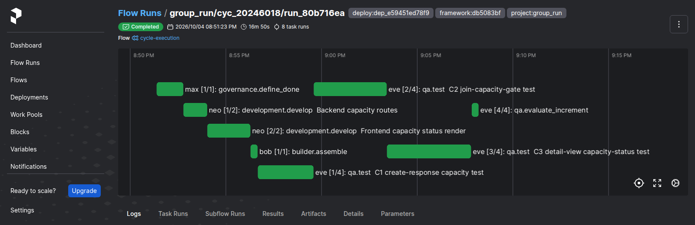

# v2.0.1

**Released 2026-10-04** · [tag `v2.0.1`](https://github.com/backspring-labs/squad-ops/releases/tag/v2.0.1)

**Security: an artifact is written inside its own directory, whatever filename or id it carries**
(advisory GHSA-3rw2-35gr-mvh3, #2003). The artifact ingest route passed a client-supplied `filename`
unvalidated to the filesystem vault, so an absolute name or one with a `..` segment was written
outside the vault. Exploiting it needed `cycles:write`.
- **One rule:** a filename is relative, has no `..` segment, is not blank and has no NUL.
- **The route** refuses a name that breaks it (`422 INVALID_FILENAME`), and nothing is stored.
- **The vault** refuses it too, for every caller, and checks that the artifact's directory and file
  both resolve inside the vault.
- **Model emissions were already guarded** by the fenced parser.

None of the deploy's 35,522 stored filenames is refused by the rule. **Upgrade from 2.0.0.**

**Also since 2.0.0:**
- the release capture rebuilds a campaign increment from the accepted tree its promotion recorded,
  not from its run's scaffold stubs (#2000);
- the v2.0.0 release package (#2001);
- SIP-0107 is promoted to implemented, its step 7 having shipped in 2.0.0 (#2002).

## Merged pull requests (4)

| PR | Title | Closes |
|---|---|---|
| [#2004](https://github.com/backspring-labs/squad-ops/pull/2004) | chore(release): 2.0.1 - a security patch | — |
| [#2003](https://github.com/backspring-labs/squad-ops/pull/2003) | fix(security): an artifact is written inside its own directory, whatever filename or id it carries | — |
| [#2002](https://github.com/backspring-labs/squad-ops/pull/2002) | sips: SIP-0107 promoted to implemented after the v2.0.0 tag | — |
| [#2001](https://github.com/backspring-labs/squad-ops/pull/2001) | docs(release): the v2.0.0 release package, with the capture fix it needed (a campaign increment rebuilt from its accepted tree) | [#1710](https://github.com/backspring-labs/squad-ops/issues/1710) [#2000](https://github.com/backspring-labs/squad-ops/issues/2000) |

## Improvement proposals

| Proposal | From | To |
|---|---|---|
| [SIP-0107-Scoped-Code-Revision](../../design/sips/SIP-0107-Scoped-Code-Revision.md) | accepted | implemented |

## Improvement proposals amended in place

No lifecycle change — each was edited under the status it already had (a post-acceptance amendment, CLAUDE.md step 5a).

| Proposal | Status |
|---|---|
| [SIP-0109-Campaign-Orchestration](../../design/sips/SIP-0109-Campaign-Orchestration.md) | accepted |

## Cycle evidence

### `cyc_20246018f2b8`

**Verdict:** `accepted` · **Runs:** 2 · **Role:** shakeout — non-counting: the deploy's shakeout, read for seam findings

| | Checks |
|---|---|
| Verified | acceptance:additive_containment, acceptance:assertion_kinds_match, acceptance:client_mock_surface, acceptance:command_exit_zero, acceptance:contract_assertions_match, acceptance:declared_imports, acceptance:dom_anchor_queries, acceptance:endpoint_defined, acceptance:fill_slot_signature, acceptance:frontend_compiles, acceptance:function_defined, acceptance:harness_boundary, acceptance:import_present, acceptance:module_imports, acceptance:undefined_names, acceptance:unterminated_source, acceptance_criteria_prose, expected_artifacts, frontend_build, no_self_mocking_tests, no_stub_fallback_tests, non_stub_files, required_files, tests_pass, vc-probe-runs, vc-probe-runs-join, vc-probe-runs-join-duplicate, vc-probe-runs-leave, vc-probe-runs-rejects-blank |
| Failed | — |
| Required unmet | — |
| Never executed | — |

## Screenshots

Of cycle `cyc_20246018f2b8` (shakeout) — the 2.0.1 deploy's check, the pinned reference increment on the rebuilt deploy, accepted as on the counted set's two reference runs.

*prefect flow run the 2 0 1 deploy check the reference increment framed and built with no correction round*
