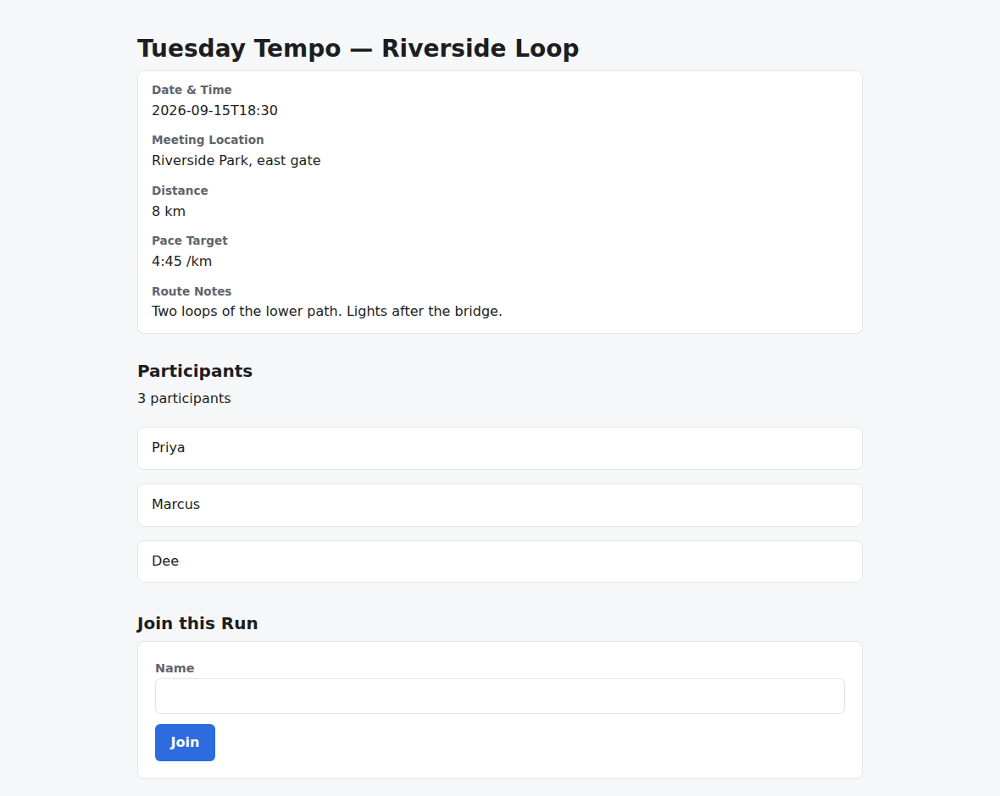
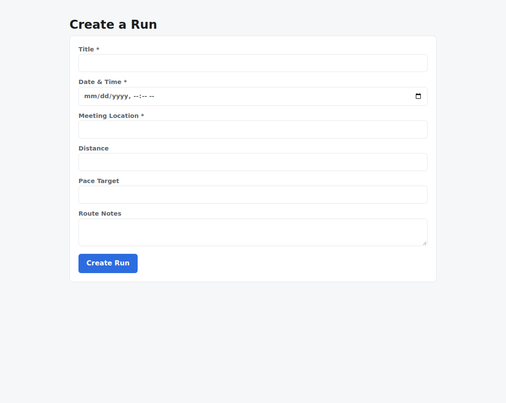
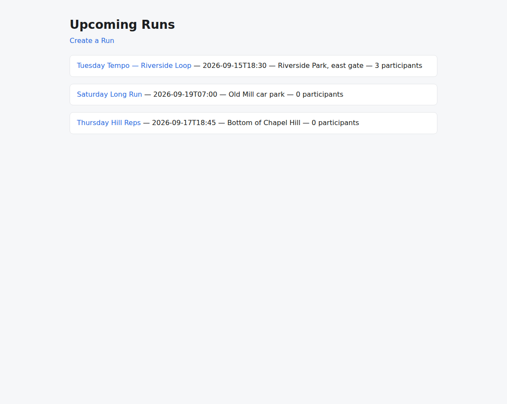
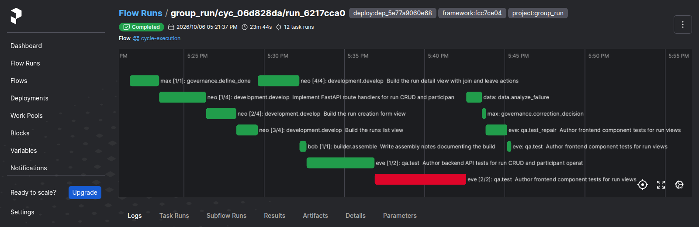

# v2.1.0

**Released 2026-10-07** · [tag `v2.1.0`](https://github.com/backspring-labs/squad-ops/releases/tag/v2.1.0)

**The 2.1 line: hardening after 2.0's campaign headline, feature-free by rule** (CLAUDE.md, #281). It closes the
debt 2.0 deferred, and every path the campaign relies on now holds on its own terms. Plan:
`docs/plans/2-1-0-plan.md`, which carries the owner's grant, rulings and each day's record.

**The cut's evidence: PASS** (`docs/plans/2-1-0-preregistration.md`, registered in #2090; its §10 in #2108). It was read
on the final deploy (`fcc7ce04`, `dep_5e77a9060e68`):
- **the counted set:** 4 of 4 regression rolls accepted, two per stack, every criterion verified (21, 15, 21, 16) and
  every boot audit passed. There was one correction round, with its reason recorded. P1–P4 held: lint readings,
  failed-round reasons, the Next.js detail page rendered, and the console acting as its caller;
- **the shakeout campaign:** clean in one round, with two increments accepted;
- **the recovery diagnostics, all PASS:** #1824's infrastructure retry end to end, and the restart set (#1934, #2007,
  #2042);
- **two defects found by #1824's live path** and fixed before the set: a refused run could not leave `queued` (#2094),
  and the retry rows were asked after the blocked rows (#2101).

The tagged tree differs from the validated deploy by #2104's LangFuse compose `HOSTNAME` and by prose. No squad image or
code differs.

**Campaigns: the 2.0 set's findings (SIP-0109).**
- **The proposer and its rails:** the rails refuse a behaviour change with nothing to build (#2011);
  the proposer is told every convention its stack's frozen code decides (#1962, #1950; #2013), and
  that a PRD delta states only what the request delivers (#1995; #2014).
- **#1884, by the owner's rule:** every author of an increment's tests is held to it (#2012), and
  behaviour a qa author would test but nothing accepted requires is returned as a proposal (#2019).
- **The supervisor:** its instruments are tracked, each verdict a tested function (#2025); it
  creates and manages a campaign, while escalations and limit pauses stay the owner's (#1940;
  #2047).
- **Recovery:** the sweep re-hears an ended cycle between restarts (#1972; #2038); a restart starts
  a successor run left queued (#2042; #2048); a launch the cycle-create path refuses escalates to
  the owner, who retries it or aborts (#1971; #2052). A cycle that failed outside the work is retried: the retry
  rows read the failure's attribution, and the box's and the queue's refusals are declared as such
  (#1824; #2080). The retry rows are asked before the blocked rows, since a run the box refused
  verified nothing and reads `blocked_unverified` (#2101; #2102, SIP-0109 §24bh).
- **A recovery cycle** is told what each correction round of the failed cycle tried, and the digest
  measures what recurred (#1692; #2071).
- **Evidence:** any increment can be replayed outside its campaign, on the current deploy (#1959;
  #2026); a campaign's creation row records the definition file that made it (#1954; #2050); the
  digest scores each increment from the package alone (#1960; #2027); a definition's comment names
  no deploy or round unless its bytes are pinned (#1958; #2039).
- **Next.js increments:** their pages are read, and a page written as the API writes it is seeded
  (#1973; #2059), including one whose collection sits under a prefix written into each endpoint path
  (#2084; #2085, SIP-0109 §24be).

**Cycles and the correction loop.**
- One recorder for every gate decision, and a refinement approval promotes (#1986; #2030); its notes
  are promoted when they are stored, and the CLI says who reads them (#2029; #2049).
- The restart re-attach replays a proposal task and ends the flow runs a dead process left open
  (#1934, #2007; #2033).
- A rewind on a `model_limitation` with repair unspent is a patch, and every override is recorded
  with the run (#1757; #2053).
- A qa task evaluates the set it stores, and a re-take proves it (SIP-0107 §20; #1727, #1913;
  #2061).
- A failed check's own account of why is kept with its round and its failure record (#2028; #2056),
  a failed `tests_pass` round's included: its failing cases and any runtime error (#2086; #2087). An
  empty repair records whether it was offered the scoped edit form (#1911; #2055).
- The last correction attempt is held for a required check (#414; #2067).
- Reporting-only lint and complexity findings on the delivered app (ruff, and the pinned ESLint on a
  TypeScript tree) are kept with each qa run and carried in the campaign package. They are evidence,
  never a gate (#1937; #2088).
- A run that fails before it starts ends failed, instead of staying queued (#2094; #2095, SIP-0064
  §15a).
- The manifest author is taught each error code's conventional status, and an unwarranted departure
  is reported (#1031; #2070).
- The boot audit renders each declared route, by the increment evaluation's own render (#1796;
  #2060).
- The flow executor's dependencies are required keywords, so a misspelling fails at boot (#1987;
  #2051).

**Processes and the sandbox.**
- Every check, build, boot and browser the agents run ends with everything it started, and a
  timed-out test run ends its whole process group (#1983; #2043, #2046).
- A sandbox run that outlives its limit is killed by name, and its docker client ended (#2045;
  #2057); a `secret://` service token is resolved by the provider the secrets section selects
  (#1982; #2035).

**Architecture.**
- One map of every package, guarded both ways (#1989; #2021). The package roots import nothing, and the
  packages' import direction is guarded (#1985; #2063).
- Tooling targets Python 3.12, and mypy runs in CI as a ratchet against a recorded baseline (#1988;
  #2020).
- Four layers no composition root builds are deleted (#1984; #2031), and so are the four
  stack-blueprint fields the second stack falsified (#1975; #2037).
- Every environment read outside the config loader is inventoried and guarded both ways (#1991;
  #2054); one helper each for the CLI client, text digests, string lists, the scaffold-integrity
  emitter and an unreadable vault ref (#1990; #2066).
- Cross-Cycle Memory's recall port, inert, and its call site (#1964; #2058).
- The benchmark registry refuses a replayed cycle (SIP-0101 §4.1; #2036).

**Security and dependencies.**
- **Every credential is the deploy's own,** generated at bootstrap and rotatable in place: a
  registry of the deploy's credentials, compose requiring each one, and a doctor check (#2006;
  #2069).
- **The token verifier moves to PyJWT** (#2073; #2075). python-jose had stopped releasing and
  carried two advisories with no fix version (GHSA-3qf3-8w2g-rqmx, and PYSEC-2026-1325 against
  `ecdsa`), both unreachable and accepted with their reasons in the meantime (#2074). PyJWT refuses
  three tokens python-jose accepted (no `aud`, no `kid`, an `iat` beyond the skew ahead), none of
  which the deploy's clients issue.
- multidict moves to 6.9.1 for GHSA-54p9-h82j-f925 (#2074).
- **Every console call to the runtime API carries its caller's own token,** and the console's service
  client is retired (#2068; #2081).
- The copy of `.env` a credential rotation keeps beside it is ignored by git (#2099; #2100).
- LangFuse listens on every interface, so its loopback health check passes. It had never passed since #581 (#2103;
  #2104).

**SIPs.**
- `update_sip_status.py` can retire a proposal without accepting it (#1968; #2015), and the 13
  proposals the portfolio ruled deprecated are retired (#2023).
- The delivery ledgers and the portfolio are guarded (#1969; #2016); every SIP part's issue carries
  `sip:NNNN`, matched to the ledgers both ways (#2022); new SIPs start from a template with an
  intake check and a delivery ledger (#1981; #2018); the S5 admission gate reads an empty string as
  unset (#1967; #2017).
- The release cut's SIP sweep is read from the ledgers, and the release PR must name what it finds
  (#1980; #2032).
- **Cross-Cycle Memory is accepted as SIP-0110** (revisions 4 and 5), with the 2.2 plan (#2097, closing #1964's
  re-read). Its Phase 1, the 2.2 headline, is the campaign's proposal gate, and is measured before 2.2.0's cut.

**Release and verification tooling.**
- A verification set records the tracked loaded checks, and refuses a deploy that answers with the
  old code (#2064); each rebuild adds its rows (#2077, #2091).
- The recovery diagnostics read #1934, #2007 and #2042 live (#2065), and hold the box past one lease
  to read #1824's retry back (#2089).
- The cut's shakeout campaign definition: two increments on 2.0's set policy (#2092).
- Cut steps 4 and 8 are checked: the ROADMAP entry and a recorded housekeeping run (#1957; #2040).
- The delivered-app capture photographs a reference-scenario cycle, whole (#2008; #2024); the
  records scan names a secret the repository already carries (#2005).
- Tests: the OTel adapter tests stop the exporter threads they start (#1930; #2034), and one helper
  watches a test's process end (#2076).

## Merged pull requests (81)

| PR | Title | Closes |
|---|---|---|
| [#2109](https://github.com/backspring-labs/squad-ops/pull/2109) | chore(release): 2.1.0 - hardening after Campaign: bump, markers, CHANGELOG, ROADMAP entry, the SIP sweep | — |
| [#2097](https://github.com/backspring-labs/squad-ops/pull/2097) | docs(plans): the 2.2.0 plan, drafted, and Cross-Cycle Memory accepted as SIP-0110 with revision 4 (the Phase-1 re-read moves Phase 1 to the proposal gate) | [#1964](https://github.com/backspring-labs/squad-ops/issues/1964) |
| [#2108](https://github.com/backspring-labs/squad-ops/pull/2108) | docs(plans): the 2.1 cut set's record - PASS, 4 of 4 accepted; and the cut day's record | — |
| [#2090](https://github.com/backspring-labs/squad-ops/pull/2090) | docs(plans): 2.1.0 pre-registration of the cut's set (REGISTERED) | — |
| [#2104](https://github.com/backspring-labs/squad-ops/pull/2104) | fix(deploy): LangFuse listens on every interface, so its loopback health check can pass | [#2103](https://github.com/backspring-labs/squad-ops/issues/2103) |
| [#2102](https://github.com/backspring-labs/squad-ops/pull/2102) | fix(campaigns): a cycle refused by the box is retried before it is repaired, whatever its verdict (SIP-0109 §24bh) | [#2101](https://github.com/backspring-labs/squad-ops/issues/2101) |
| [#2100](https://github.com/backspring-labs/squad-ops/pull/2100) | fix(ops): the previous .env a credential rotation keeps is ignored by git | [#2099](https://github.com/backspring-labs/squad-ops/issues/2099) |
| [#2098](https://github.com/backspring-labs/squad-ops/pull/2098) | docs(changelog): the 2.1 section, the line's last batch and the final deploy's fix | — |
| [#2095](https://github.com/backspring-labs/squad-ops/pull/2095) | fix(cycles): a run that fails before it starts ends failed, instead of staying queued for ever | [#2094](https://github.com/backspring-labs/squad-ops/issues/2094) |
| [#2093](https://github.com/backspring-labs/squad-ops/pull/2093) | docs(plans): 2.1.0 plan - the second night's record | — |
| [#2092](https://github.com/backspring-labs/squad-ops/pull/2092) | examples(campaigns): the 2.1 cut's shakeout campaign definition, two increments on 2.0's set policy | — |
| [#2020](https://github.com/backspring-labs/squad-ops/pull/2020) | build: tooling targets Python 3.12, and mypy runs in CI as a ratchet | [#1988](https://github.com/backspring-labs/squad-ops/issues/1988) |
| [#2091](https://github.com/backspring-labs/squad-ops/pull/2091) | fix(release): the final deploy's loaded checks for the line's last batch | — |
| [#2088](https://github.com/backspring-labs/squad-ops/pull/2088) | feat(cycles): reporting-only lint and complexity findings on the delivered app, kept with the run and carried in the campaign package | [#1937](https://github.com/backspring-labs/squad-ops/issues/1937) |
| [#2087](https://github.com/backspring-labs/squad-ops/pull/2087) | fix(cycles): a failed tests_pass round keeps why it failed: its failing cases and any runtime error | [#2086](https://github.com/backspring-labs/squad-ops/issues/2086) |
| [#2080](https://github.com/backspring-labs/squad-ops/pull/2080) | fix(campaigns): a cycle that failed outside the work is retried: the retry rows read the attribution, and the box's and the queue's refusals are declared | [#1824](https://github.com/backspring-labs/squad-ops/issues/1824) |
| [#2089](https://github.com/backspring-labs/squad-ops/pull/2089) | fix(campaigns): a recovery diagnostic holds the box past one lease and reads #1824's retry back live | — |
| [#2081](https://github.com/backspring-labs/squad-ops/pull/2081) | fix(console): every console call to the runtime API carries its caller's own token, and the console's service client is retired | [#2068](https://github.com/backspring-labs/squad-ops/issues/2068) |
| [#2070](https://github.com/backspring-labs/squad-ops/pull/2070) | fix(framing): the manifest author is taught each error code's conventional status, and an unwarranted departure is reported | [#1031](https://github.com/backspring-labs/squad-ops/issues/1031) |
| [#2071](https://github.com/backspring-labs/squad-ops/pull/2071) | fix(campaigns): a recovery cycle is told what each correction round of the failed cycle tried, and the digest measures what recurred | [#1692](https://github.com/backspring-labs/squad-ops/issues/1692) |
| [#2067](https://github.com/backspring-labs/squad-ops/pull/2067) | fix(cycles): the last correction attempt is held for a required check | [#414](https://github.com/backspring-labs/squad-ops/issues/414) |
| [#2063](https://github.com/backspring-labs/squad-ops/pull/2063) | refactor: the package roots import nothing, and the packages' import direction is guarded | [#1985](https://github.com/backspring-labs/squad-ops/issues/1985) |
| [#2085](https://github.com/backspring-labs/squad-ops/pull/2085) | fix(campaigns): a page's collection is found under a prefix written into each endpoint path, so a Next.js detail page is seeded | [#2084](https://github.com/backspring-labs/squad-ops/issues/2084) |
| [#2078](https://github.com/backspring-labs/squad-ops/pull/2078) | docs(changelog): the 2.1 line so far, in [Unreleased] | — |
| [#2077](https://github.com/backspring-labs/squad-ops/pull/2077) | fix(release): rebuild 2's loaded checks and regression pair: a row for each batch-2 change the running services execute | — |
| [#2076](https://github.com/backspring-labs/squad-ops/pull/2076) | fix(tests): one helper watches a test's process end, catching the race that failed main | — |
| [#2075](https://github.com/backspring-labs/squad-ops/pull/2075) | fix(auth): the token verifier moves to PyJWT, retiring python-jose and both of its accepted advisories | [#2073](https://github.com/backspring-labs/squad-ops/issues/2073) |
| [#2072](https://github.com/backspring-labs/squad-ops/pull/2072) | docs(plans): 2.1.0 plan - the first day's record | — |
| [#2074](https://github.com/backspring-labs/squad-ops/pull/2074) | fix(deps): the dependency audit is green again: python-jose's advisory is accepted with its reason, and multidict moves to 6.9.1 | — |
| [#2069](https://github.com/backspring-labs/squad-ops/pull/2069) | fix(deploy): every credential is the deploy's own, generated at bootstrap and rotatable in place | [#2006](https://github.com/backspring-labs/squad-ops/issues/2006) |
| [#2066](https://github.com/backspring-labs/squad-ops/pull/2066) | fix(cycles): one helper each for the CLI client, text digests, string lists, the scaffold-integrity emitter and an unreadable vault ref | [#1990](https://github.com/backspring-labs/squad-ops/issues/1990) |
| [#2061](https://github.com/backspring-labs/squad-ops/pull/2061) | fix(cycles): a qa task evaluates the set it stores, and a re-take proves it (SIP-0107 §20) | [#1727](https://github.com/backspring-labs/squad-ops/issues/1727) [#1913](https://github.com/backspring-labs/squad-ops/issues/1913) |
| [#2060](https://github.com/backspring-labs/squad-ops/pull/2060) | fix(audit): the boot audit renders each declared route, by the increment evaluation's own render | [#1796](https://github.com/backspring-labs/squad-ops/issues/1796) |
| [#2059](https://github.com/backspring-labs/squad-ops/pull/2059) | fix(campaigns): a Next.js increment's pages are read, and a page written as the API writes it is seeded | [#1973](https://github.com/backspring-labs/squad-ops/issues/1973) |
| [#2056](https://github.com/backspring-labs/squad-ops/pull/2056) | fix(cycles): a failed check's own account of why is kept with its round and its failure record | [#2028](https://github.com/backspring-labs/squad-ops/issues/2028) |
| [#2055](https://github.com/backspring-labs/squad-ops/pull/2055) | fix(cycles): an empty repair records whether it was offered the scoped edit form | — |
| [#2054](https://github.com/backspring-labs/squad-ops/pull/2054) | fix(config): every environment read outside the config loader is inventoried and guarded both ways | [#1991](https://github.com/backspring-labs/squad-ops/issues/1991) |
| [#2053](https://github.com/backspring-labs/squad-ops/pull/2053) | fix(cycles): a rewind on a model_limitation with repair unspent is a patch, and every override is recorded with the run | [#1757](https://github.com/backspring-labs/squad-ops/issues/1757) |
| [#2039](https://github.com/backspring-labs/squad-ops/pull/2039) | fix(campaigns): a campaign definition's comment names no deploy or round unless its bytes are pinned (#1958) | [#1958](https://github.com/backspring-labs/squad-ops/issues/1958) |
| [#2040](https://github.com/backspring-labs/squad-ops/pull/2040) | fix(release): cut steps 4 and 8 are checked, the ROADMAP entry and a recorded housekeeping run (#1957) | [#1957](https://github.com/backspring-labs/squad-ops/issues/1957) |
| [#2032](https://github.com/backspring-labs/squad-ops/pull/2032) | fix(sips): the release cut's SIP sweep is read from the ledgers, and the release PR must name what it finds (#1980) | [#1980](https://github.com/backspring-labs/squad-ops/issues/1980) |
| [#2065](https://github.com/backspring-labs/squad-ops/pull/2065) | fix(campaigns): the recovery diagnostics read #1934, #2007 and #2042 live, for 2.1 rebuild 1 | — |
| [#2064](https://github.com/backspring-labs/squad-ops/pull/2064) | fix(release): a verification set records the tracked loaded checks, and refuses a deploy that answers with the old code | — |
| [#2027](https://github.com/backspring-labs/squad-ops/pull/2027) | fix(campaigns): the digest scores each increment, from the package alone | [#1960](https://github.com/backspring-labs/squad-ops/issues/1960) |
| [#2052](https://github.com/backspring-labs/squad-ops/pull/2052) | fix(campaigns): a launch the cycle-create path refuses escalates to the owner, who retries it or aborts | [#1971](https://github.com/backspring-labs/squad-ops/issues/1971) |
| [#2057](https://github.com/backspring-labs/squad-ops/pull/2057) | fix(sandbox): a sandbox run that outlives its limit is killed by name, and its docker client ended | [#2045](https://github.com/backspring-labs/squad-ops/issues/2045) |
| [#2050](https://github.com/backspring-labs/squad-ops/pull/2050) | fix(campaigns): a campaign's creation row records the definition file that made it | [#1954](https://github.com/backspring-labs/squad-ops/issues/1954) |
| [#2049](https://github.com/backspring-labs/squad-ops/pull/2049) | fix(cycles): a refinement approval's notes are promoted when they are stored, and the CLI says who reads them | [#2029](https://github.com/backspring-labs/squad-ops/issues/2029) |
| [#2048](https://github.com/backspring-labs/squad-ops/pull/2048) | fix(campaigns): a restart starts a successor run left queued, so the cycle it belongs to moves | [#2042](https://github.com/backspring-labs/squad-ops/issues/2042) |
| [#2047](https://github.com/backspring-labs/squad-ops/pull/2047) | feat(campaigns): the supervisor creates and manages a campaign; escalations and limit pauses stay the owner's | [#1940](https://github.com/backspring-labs/squad-ops/issues/1940) |
| [#2037](https://github.com/backspring-labs/squad-ops/pull/2037) | fix(blueprint): delete the four stack-blueprint fields the second stack falsified (#1975) | [#1975](https://github.com/backspring-labs/squad-ops/issues/1975) |
| [#2058](https://github.com/backspring-labs/squad-ops/pull/2058) | feat(memory): Cross-Cycle Memory's recall port, inert, and its call site through plan_rejection_context | — |
| [#2036](https://github.com/backspring-labs/squad-ops/pull/2036) | fix(benchmark): the benchmark registry refuses a replayed cycle (SIP-0101 §4.1) | [#1974](https://github.com/backspring-labs/squad-ops/issues/1974) |
| [#2051](https://github.com/backspring-labs/squad-ops/pull/2051) | fix(cycles): the flow executor's dependencies are required keywords, so a misspelling fails at boot | [#1987](https://github.com/backspring-labs/squad-ops/issues/1987) |
| [#2046](https://github.com/backspring-labs/squad-ops/pull/2046) | fix(capabilities): every check, build, boot and browser the agents run ends with everything it started | [#1983](https://github.com/backspring-labs/squad-ops/issues/1983) |
| [#2034](https://github.com/backspring-labs/squad-ops/pull/2034) | fix(tests): the OTel adapter tests stop the exporter threads they start (#1930) | [#1930](https://github.com/backspring-labs/squad-ops/issues/1930) |
| [#2035](https://github.com/backspring-labs/squad-ops/pull/2035) | fix(sandbox): a secret:// service token is resolved by the configured secrets provider (#1982) | [#1982](https://github.com/backspring-labs/squad-ops/issues/1982) |
| [#2038](https://github.com/backspring-labs/squad-ops/pull/2038) | fix(campaigns): the sweep re-hears an ended cycle between restarts (SIP-0109 §24v) | [#1972](https://github.com/backspring-labs/squad-ops/issues/1972) |
| [#2033](https://github.com/backspring-labs/squad-ops/pull/2033) | fix(cycles): the restart re-attach replays a proposal task and ends the flow runs a dead process left open | [#1934](https://github.com/backspring-labs/squad-ops/issues/1934) [#2007](https://github.com/backspring-labs/squad-ops/issues/2007) |
| [#2031](https://github.com/backspring-labs/squad-ops/pull/2031) | fix(architecture): delete four layers no composition root builds (#1984) | [#1984](https://github.com/backspring-labs/squad-ops/issues/1984) |
| [#2044](https://github.com/backspring-labs/squad-ops/pull/2044) | docs(plans): 2.1.0 plan - the day's rulings, the line's findings placed, and the night's record | — |
| [#2043](https://github.com/backspring-labs/squad-ops/pull/2043) | fix(capabilities): a timed-out test run ends its whole process group, and no group kill can reach every process (part 1) | [#1983](https://github.com/backspring-labs/squad-ops/issues/1983) |
| [#2030](https://github.com/backspring-labs/squad-ops/pull/2030) | fix(cycles): one recorder for every gate decision, and a refinement approval promotes (#1986) | [#1986](https://github.com/backspring-labs/squad-ops/issues/1986) |
| [#2026](https://github.com/backspring-labs/squad-ops/pull/2026) | fix(campaigns): any campaign increment can be replayed outside its campaign, on the current deploy | [#1959](https://github.com/backspring-labs/squad-ops/issues/1959) |
| [#2025](https://github.com/backspring-labs/squad-ops/pull/2025) | fix(campaigns): the supervisor's instruments are tracked, each verdict a tested function | [#1956](https://github.com/backspring-labs/squad-ops/issues/1956) |
| [#2024](https://github.com/backspring-labs/squad-ops/pull/2024) | fix(release): the delivered-app capture photographs a reference-scenario cycle, whole | [#2008](https://github.com/backspring-labs/squad-ops/issues/2008) |
| [#2023](https://github.com/backspring-labs/squad-ops/pull/2023) | chore(sips): the 13 proposals the portfolio ruled deprecated are retired (Q14) | — |
| [#2022](https://github.com/backspring-labs/squad-ops/pull/2022) | fix(sips): every SIP part's issue carries sip:NNNN, matched to the ledgers both ways | [#1979](https://github.com/backspring-labs/squad-ops/issues/1979) |
| [#2021](https://github.com/backspring-labs/squad-ops/pull/2021) | docs(architecture): one map of every package, guarded both ways | [#1989](https://github.com/backspring-labs/squad-ops/issues/1989) |
| [#2017](https://github.com/backspring-labs/squad-ops/pull/2017) | fix(sips): the S5 admission gate reads an empty string as unset | [#1967](https://github.com/backspring-labs/squad-ops/issues/1967) |
| [#2018](https://github.com/backspring-labs/squad-ops/pull/2018) | fix(sips): new SIPs start from a template with an intake check and a delivery ledger | [#1981](https://github.com/backspring-labs/squad-ops/issues/1981) |
| [#2019](https://github.com/backspring-labs/squad-ops/pull/2019) | fix(campaigns): behaviour a qa author would test but nothing accepted requires is returned as a proposal (#1884, part 2) | [#1884](https://github.com/backspring-labs/squad-ops/issues/1884) |
| [#2016](https://github.com/backspring-labs/squad-ops/pull/2016) | fix(sips): the delivery ledgers and the portfolio are guarded | [#1969](https://github.com/backspring-labs/squad-ops/issues/1969) |
| [#2012](https://github.com/backspring-labs/squad-ops/pull/2012) | fix(campaigns): every author of an increment's tests is held to the owner's rule (#1884, part 1) | — |
| [#2015](https://github.com/backspring-labs/squad-ops/pull/2015) | fix(sips): update_sip_status.py can retire a proposal without accepting it | [#1968](https://github.com/backspring-labs/squad-ops/issues/1968) |
| [#2014](https://github.com/backspring-labs/squad-ops/pull/2014) | fix(campaigns): the proposer is told a PRD delta states only what the request delivers | [#1995](https://github.com/backspring-labs/squad-ops/issues/1995) |
| [#2013](https://github.com/backspring-labs/squad-ops/pull/2013) | fix(campaigns): the proposer is told every convention its stack's frozen code decides | [#1950](https://github.com/backspring-labs/squad-ops/issues/1950) [#1962](https://github.com/backspring-labs/squad-ops/issues/1962) |
| [#2011](https://github.com/backspring-labs/squad-ops/pull/2011) | fix(campaigns): the rails refuse a behaviour change with nothing to build | [#1961](https://github.com/backspring-labs/squad-ops/issues/1961) |
| [#2010](https://github.com/backspring-labs/squad-ops/pull/2010) | docs(plans): 2.1.0 plan - the line starts: the owner's grant and stop list, #1884's direction, #1965 listed | — |
| [#2009](https://github.com/backspring-labs/squad-ops/pull/2009) | docs(plans): 2.1.0 plan - the 2.0 cut's three findings placed | — |
| [#2005](https://github.com/backspring-labs/squad-ops/pull/2005) | fix(release): the records scan names a secret the repository already carries; the v2.0.0 records attached; the v2.0.1 package | — |

## Improvement proposals

| Proposal | From | To |
|---|---|---|
| [IDEA-QA-First-Test-Strategy-1h-Cycles-group_run](../../design/sips/IDEA-QA-First-Test-Strategy-1h-Cycles-group_run.md) | proposed | deprecated |
| [SIP-0012-Pattern-First-Development-Escalation-Protocol](../../design/sips/SIP-0012-Pattern-First-Development-Escalation-Protocol.md) | proposed | deprecated |
| [SIP-0013-Extensibility-Customization-Protocol](../../design/sips/SIP-0013-Extensibility-Customization-Protocol.md) | proposed | deprecated |
| [SIP-0016-HumanAgent-Hybrid-Squad-Operations](../../design/sips/SIP-0016-HumanAgent-Hybrid-Squad-Operations.md) | proposed | deprecated |
| [SIP-0018-Enterprise-Process-CoE-Enablement](../../design/sips/SIP-0018-Enterprise-Process-CoE-Enablement.md) | proposed | deprecated |
| [SIP-0018-v2-Squad-Context-Protocol](../../design/sips/SIP-0018-v2-Squad-Context-Protocol.md) | proposed | deprecated |
| [SIP-0023-Domain-Expert-Architecture-for-Product-Strategy](../../design/sips/SIP-0023-Domain-Expert-Architecture-for-Product-Strategy.md) | proposed | deprecated |
| [SIP-0028-Hybrid-Deployment-Model-Industry-Aligned-Architecture-for-Multi-Environment-Depl](../../design/sips/SIP-0028-Hybrid-Deployment-Model-Industry-Aligned-Architecture-for-Multi-Environment-Depl.md) | proposed | deprecated |
| [SIP-0110-Cross-Cycle-Memory](../../design/sips/SIP-0110-Cross-Cycle-Memory.md) | proposed | accepted |
| [SIP-API-Contract-Hardening](../../design/sips/SIP-API-Contract-Hardening.md) | proposed | deprecated |
| [SIP-Experiment-Queue-and-Cycle-Assessment](../../design/sips/SIP-Experiment-Queue-and-Cycle-Assessment.md) | proposed | deprecated |
| [SIP-Skill-Layer-For-Capabilities](../../design/sips/SIP-Skill-Layer-For-Capabilities.md) | proposed | deprecated |
| [SIP-Version-Bump-Hardening](../../design/sips/SIP-Version-Bump-Hardening.md) | proposed | deprecated |
| [SIP-intelligent-delegation-protocols](../../design/sips/SIP-intelligent-delegation-protocols.md) | proposed | deprecated |

## Improvement proposals amended in place

No lifecycle change — each was edited under the status it already had (a post-acceptance amendment, CLAUDE.md step 5a).

| Proposal | Status |
|---|---|
| [SIP-0026-Testing-Framework-and-Philosophy](../../design/sips/SIP-0026-Testing-Framework-and-Philosophy.md) | implemented |
| [SIP-0064-Project-Cycle-Request-API](../../design/sips/SIP-0064-Project-Cycle-Request-API.md) | implemented |
| [SIP-0086-Build-Convergence-Loop-Dynamic](../../design/sips/SIP-0086-Build-Convergence-Loop-Dynamic.md) | implemented |
| [SIP-0088-Agent-Runtime-Modes](../../design/sips/SIP-0088-Agent-Runtime-Modes.md) | accepted |
| [SIP-0090-Agent-Embodiment-Substrate](../../design/sips/SIP-0090-Agent-Embodiment-Substrate.md) | accepted |
| [SIP-0091-Duty-Durability-via-Temporal](../../design/sips/SIP-0091-Duty-Durability-via-Temporal.md) | accepted |
| [SIP-0092-Implementation-Plan-Improvement](../../design/sips/SIP-0092-Implementation-Plan-Improvement.md) | accepted |
| [SIP-0093-Multi-Role-Plan-Authoring](../../design/sips/SIP-0093-Multi-Role-Plan-Authoring.md) | accepted |
| [SIP-0101-Cycle-Replay-Harness](../../design/sips/SIP-0101-Cycle-Replay-Harness.md) | accepted |
| [SIP-0102-Ephemeral-Application-Sandbox](../../design/sips/SIP-0102-Ephemeral-Application-Sandbox.md) | accepted |
| [SIP-0105-Stack-Blueprint-Contract](../../design/sips/SIP-0105-Stack-Blueprint-Contract.md) | accepted |
| [SIP-0107-Scoped-Code-Revision](../../design/sips/SIP-0107-Scoped-Code-Revision.md) | implemented |
| [SIP-0108-Cycle-Evaluation-Scorecard](../../design/sips/SIP-0108-Cycle-Evaluation-Scorecard.md) | implemented |
| [SIP-0109-Campaign-Orchestration](../../design/sips/SIP-0109-Campaign-Orchestration.md) | accepted |
| [SIP-Agent-Comms-Delivery-Guarantees](../../design/sips/SIP-Agent-Comms-Delivery-Guarantees.md) | proposed |
| [SIP-Agent-Embodiment-Runtime](../../design/sips/SIP-Agent-Embodiment-Runtime.md) | proposed |
| [SIP-Capability-Backed-Agents](../../design/sips/SIP-Capability-Backed-Agents.md) | proposed |
| [SIP-Continuum-Runtime-Console](../../design/sips/SIP-Continuum-Runtime-Console.md) | proposed |
| [SIP-Cycle-Request-Profile-Naming-Taxonomy](../../design/sips/SIP-Cycle-Request-Profile-Naming-Taxonomy.md) | proposed |
| [SIP-Design-Decision-Register](../../design/sips/SIP-Design-Decision-Register.md) | proposed |
| [SIP-Duty-Continuity-and-Handoff-Ledger](../../design/sips/SIP-Duty-Continuity-and-Handoff-Ledger.md) | proposed |
| [SIP-Fine-Grained-Issue-Enumeration](../../design/sips/SIP-Fine-Grained-Issue-Enumeration.md) | proposed |
| [SIP-Outcome-Evaluation](../../design/sips/SIP-Outcome-Evaluation.md) | proposed |
| [SIP-Verification-Yield](../../design/sips/SIP-Verification-Yield.md) | proposed |

## Cycle evidence

### `cyc_06d828da487c`

**Verdict:** `accepted` · **Runs:** 2 · **Role:** counted

| | Checks |
|---|---|
| Verified | acceptance:additive_containment, acceptance:assertion_kinds_match, acceptance:client_mock_surface, acceptance:command_exit_zero, acceptance:contract_assertions_match, acceptance:declared_imports, acceptance:dom_anchor_queries, acceptance:endpoint_defined, acceptance:fill_slot_signature, acceptance:frontend_compiles, acceptance:function_defined, acceptance:harness_boundary, acceptance:import_present, acceptance:module_imports, acceptance:undefined_names, acceptance:unterminated_source, acceptance_criteria_prose, expected_artifacts, frontend_build, no_self_mocking_tests, no_stub_fallback_tests, non_stub_files, required_files, tests_pass, vc-probe-runs, vc-probe-runs-join, vc-probe-runs-join-duplicate, vc-probe-runs-leave, vc-probe-runs-rejects-blank |
| Failed | — |
| Required unmet | — |
| Never executed | — |

### `cyc_09d5dc572482`

**Verdict:** `accepted` · **Runs:** 2 · **Role:** counted

| | Checks |
|---|---|
| Verified | acceptance:additive_containment, acceptance:assertion_kinds_match, acceptance:declared_imports, acceptance:dom_anchor_queries, acceptance:frontend_compiles, acceptance:undefined_names, acceptance:unterminated_source, acceptance_criteria_prose, expected_artifacts, frontend_build, no_self_mocking_tests, no_stub_fallback_tests, non_stub_files, required_files, tests_pass, vc-probe-api-runs, vc-probe-api-runs-join, vc-probe-api-runs-join-duplicate, vc-probe-api-runs-leave |
| Failed | — |
| Required unmet | — |
| Never executed | — |

### `cyc_5a5805c5ea70`

**Verdict:** `accepted` · **Runs:** 2 · **Role:** counted

| | Checks |
|---|---|
| Verified | acceptance:additive_containment, acceptance:assertion_kinds_match, acceptance:client_mock_surface, acceptance:command_exit_zero, acceptance:contract_assertions_match, acceptance:declared_imports, acceptance:dom_anchor_queries, acceptance:endpoint_defined, acceptance:fill_slot_signature, acceptance:frontend_compiles, acceptance:function_defined, acceptance:harness_boundary, acceptance:import_present, acceptance:module_imports, acceptance:undefined_names, acceptance:unterminated_source, acceptance_criteria_prose, expected_artifacts, frontend_build, no_self_mocking_tests, no_stub_fallback_tests, non_stub_files, required_files, tests_pass, vc-probe-runs, vc-probe-runs-join, vc-probe-runs-join-duplicate, vc-probe-runs-leave, vc-probe-runs-rejects-blank |
| Failed | — |
| Required unmet | — |
| Never executed | — |

### `cyc_b6984d77fcf8`

**Verdict:** `accepted` · **Runs:** 2 · **Role:** counted

| | Checks |
|---|---|
| Verified | acceptance:additive_containment, acceptance:assertion_kinds_match, acceptance:declared_imports, acceptance:dom_anchor_queries, acceptance:frontend_compiles, acceptance:undefined_names, acceptance:unterminated_source, acceptance_criteria_prose, expected_artifacts, frontend_build, no_self_mocking_tests, no_stub_fallback_tests, non_stub_files, required_files, tests_pass, vc-probe-api-runs, vc-probe-api-runs-join, vc-probe-api-runs-join-duplicate, vc-probe-api-runs-leave, vc-probe-api-runs-rejects-blank |
| Failed | — |
| Required unmet | — |
| Never executed | — |

### `cyc_862df227bc0a`

**Verdict:** `accepted` · **Runs:** 2 · **Role:** shakeout — non-counting: the deploy's shakeout, read for seam findings

| | Checks |
|---|---|
| Verified | acceptance:additive_containment, acceptance:assertion_kinds_match, acceptance:client_mock_surface, acceptance:command_exit_zero, acceptance:contract_assertions_match, acceptance:declared_imports, acceptance:dom_anchor_queries, acceptance:endpoint_defined, acceptance:fill_slot_signature, acceptance:frontend_compiles, acceptance:harness_boundary, acceptance:import_present, acceptance:module_imports, acceptance:undefined_names, acceptance:unterminated_source, acceptance_criteria_prose, expected_artifacts, frontend_build, no_self_mocking_tests, no_stub_fallback_tests, non_stub_files, required_files, tests_pass, vc-probe-runs, vc-probe-runs-join, vc-probe-runs-join-duplicate, vc-probe-runs-leave, vc-probe-runs-rejects-blank |
| Failed | — |
| Required unmet | — |
| Never executed | — |

### `cyc_f32f3eaf007e`

**Verdict:** `accepted` · **Runs:** 3 · **Role:** shakeout — non-counting: the deploy's shakeout, read for seam findings

| | Checks |
|---|---|
| Verified | acceptance:additive_containment, acceptance:assertion_kinds_match, acceptance:client_mock_surface, acceptance:command_exit_zero, acceptance:contract_assertions_match, acceptance:declared_imports, acceptance:dom_anchor_queries, acceptance:endpoint_defined, acceptance:fill_slot_signature, acceptance:frontend_compiles, acceptance:function_defined, acceptance:harness_boundary, acceptance:import_present, acceptance:module_imports, acceptance:undefined_names, acceptance:unterminated_source, acceptance_criteria_prose, expected_artifacts, frontend_build, no_self_mocking_tests, no_stub_fallback_tests, non_stub_files, required_files, tests_pass, vc-probe-runs, vc-probe-runs-join, vc-probe-runs-join-duplicate, vc-probe-runs-leave, vc-probe-runs-rejects-blank |
| Failed | — |
| Required unmet | — |
| Never executed | — |

### `cyc_52603f6fa9f7`

**Verdict:** `accepted` · **Runs:** 3 · **Role:** shakeout — non-counting: the deploy's shakeout, read for seam findings

| | Checks |
|---|---|
| Verified | acceptance:assertion_kinds_match, acceptance:command_exit_zero, acceptance:contract_assertions_match, acceptance:count_at_least, acceptance:endpoint_defined, acceptance:fill_slot_signature, acceptance:frontend_compiles, acceptance:function_defined, acceptance:harness_boundary, acceptance:import_present, acceptance:module_imports, acceptance:undefined_names, acceptance:unterminated_source, acceptance_criteria_prose, expected_artifacts, frontend_build, no_self_mocking_tests, no_stub_fallback_tests, non_stub_files, required_files, tests_pass, vc-probe-runs, vc-probe-runs-join, vc-probe-runs-join-duplicate, vc-probe-runs-leave, vc-probe-runs-rejects-blank |
| Failed | — |
| Required unmet | — |
| Never executed | — |

### `cyc_168a3703f000`

**Verdict:** `accepted` · **Runs:** 2 · **Role:** diagnostic — fault-injected, non-counting: its verdict is not a verdict about the squad (#1251)

| | Checks |
|---|---|
| Verified | acceptance:additive_containment, acceptance:assertion_kinds_match, acceptance:client_mock_surface, acceptance:command_exit_zero, acceptance:contract_assertions_match, acceptance:declared_imports, acceptance:dom_anchor_queries, acceptance:endpoint_defined, acceptance:fill_slot_signature, acceptance:frontend_compiles, acceptance:function_defined, acceptance:harness_boundary, acceptance:import_present, acceptance:module_imports, acceptance:undefined_names, acceptance:unterminated_source, acceptance_criteria_prose, expected_artifacts, frontend_build, no_self_mocking_tests, no_stub_fallback_tests, non_stub_files, required_files, tests_pass, vc-probe-runs, vc-probe-runs-join, vc-probe-runs-join-duplicate, vc-probe-runs-leave, vc-probe-runs-rejects-blank |
| Failed | — |
| Required unmet | — |
| Never executed | — |

### `cyc_059fc8462fb3`

**Verdict:** `blocked_unverified` · **Runs:** 2 · **Role:** diagnostic — fault-injected, non-counting: its verdict is not a verdict about the squad (#1251)

| | Checks |
|---|---|
| Verified | — |
| Failed | — |
| Required unmet | — |
| Never executed | — |

### `cyc_9d7b483bb93f`

**Verdict:** `accepted` · **Runs:** 2 · **Role:** diagnostic — fault-injected, non-counting: its verdict is not a verdict about the squad (#1251)

| | Checks |
|---|---|
| Verified | acceptance:additive_containment, acceptance:assertion_kinds_match, acceptance:client_mock_surface, acceptance:command_exit_zero, acceptance:contract_assertions_match, acceptance:declared_imports, acceptance:dom_anchor_queries, acceptance:endpoint_defined, acceptance:fill_slot_signature, acceptance:frontend_compiles, acceptance:function_defined, acceptance:harness_boundary, acceptance:import_present, acceptance:module_imports, acceptance:undefined_names, acceptance:unterminated_source, acceptance_criteria_prose, expected_artifacts, frontend_build, no_self_mocking_tests, no_stub_fallback_tests, non_stub_files, required_files, tests_pass, vc-probe-runs, vc-probe-runs-join, vc-probe-runs-join-duplicate, vc-probe-runs-leave, vc-probe-runs-rejects-blank |
| Failed | — |
| Required unmet | — |
| Never executed | — |

### `cyc_1162b306f643`

**Verdict:** `accepted` · **Runs:** 2 · **Role:** diagnostic — fault-injected, non-counting: its verdict is not a verdict about the squad (#1251)

| | Checks |
|---|---|
| Verified | acceptance:additive_containment, acceptance:assertion_kinds_match, acceptance:client_mock_surface, acceptance:command_exit_zero, acceptance:contract_assertions_match, acceptance:declared_imports, acceptance:dom_anchor_queries, acceptance:endpoint_defined, acceptance:fill_slot_signature, acceptance:frontend_compiles, acceptance:harness_boundary, acceptance:import_present, acceptance:module_imports, acceptance:undefined_names, acceptance:unterminated_source, acceptance_criteria_prose, expected_artifacts, frontend_build, no_self_mocking_tests, no_stub_fallback_tests, non_stub_files, required_files, tests_pass, vc-probe-runs, vc-probe-runs-participants, vc-probe-runs-participants-duplicate, vc-probe-runs-rejects-blank |
| Failed | — |
| Required unmet | — |
| Never executed | — |

### `cyc_2c188880c5c0`

**Verdict:** `accepted` · **Runs:** 3 · **Role:** diagnostic — fault-injected, non-counting: its verdict is not a verdict about the squad (#1251)

| | Checks |
|---|---|
| Verified | acceptance:additive_containment, acceptance:assertion_kinds_match, acceptance:client_mock_surface, acceptance:command_exit_zero, acceptance:contract_assertions_match, acceptance:declared_imports, acceptance:dom_anchor_queries, acceptance:endpoint_defined, acceptance:fill_slot_signature, acceptance:frontend_compiles, acceptance:function_defined, acceptance:harness_boundary, acceptance:import_present, acceptance:module_imports, acceptance:undefined_names, acceptance:unterminated_source, acceptance_criteria_prose, expected_artifacts, frontend_build, no_self_mocking_tests, no_stub_fallback_tests, non_stub_files, required_files, tests_pass, vc-probe-runs, vc-probe-runs-participants, vc-probe-runs-participants-duplicate, vc-probe-runs-rejects-blank |
| Failed | — |
| Required unmet | — |
| Never executed | — |

## Screenshots

Of cycle `cyc_06d828da487c` (counted) — the counted set's one correction round: the Prefect run shows the failed qa round, its repair and the re-take, and the app is the React stack's as delivered.

*counted roll 1 a run s detail with its participants*

*counted roll 1 the create run form*

*counted roll 1 the run list with its seeded runs*

*prefect flow run counted roll 1 a qa round failed then repaired and re taken*
