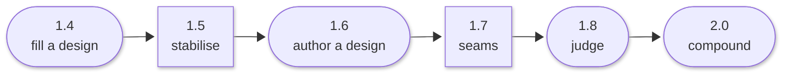

# Roadmap

The ladder in one line:

> **1.6 teaches the squad to design, 1.7 makes the seams hold, 1.8 teaches it to
> judge — and only then to run on its own.**

Each release that adds capability sits strictly behind the release that earned
the trust for it. Author over honest evidence; automate and grade over an
authored baseline; compound over trustworthy grades.

## Cadence

Semantic versioning with an even/odd convention on the minor:

| | |
|---|---|
| **Even minors** | Feature releases, led by a headline design proposal |
| **Odd minors** | Stabilisation. Feature-free by rule, and where structural refactors land so a regression during one is attributable to the refactor |
| **Patches** | Fixes, from either lane, at any time |

Scope completion gates a cut.

## Shipped

**1.4 — the verified canonical app build.** Contract-first scaffolding, a
verification contract derived from the design, and an ephemeral sandbox that
boots the delivered application. Exit measurement: 6 of 6 in seeded mode.

**1.5 — finish the promises, extract the proven.** Feature-free. Verification
evidence integrity completed, correction evidence and progress-aware
termination, and the structural extractions the 1.4 machinery had earned.

**1.6 — the Authorship release. Current.** The squad authors the interface
design from the requirement rather than being handed one, under the same gate
discipline. Exit measurement: 4 of 6 in authored mode.

## Planned

**1.7 — every port is actually a port.** Stabilisation, with a real claim rather
than a junk drawer. Where 1.5 extracted structure *inside* the machinery, 1.7
fixes where the machinery meets the outside world: vendor vocabulary leaking
into domain objects, composition roots bypassing their factories, provider
neutrality for the inference layer. Two later things depend on it — an inference
engine cannot be swapped safely while a vendor's status vocabulary lives in the
domain, and 1.8 grades across seams that must be stable first.

**1.8 — automation and learning.** Two co-headliners, ordered within the release.
A **cycle evaluation scorecard** turns a cycle outcome into a comparable grade
and makes the project's own thesis falsifiable via a squad-versus-single-model
harness. **Campaign orchestration** then relaunches cycles against an objective
until a continuation policy says stop.

Grades land before continuation policy, and the ordering is the point: a
campaign whose stopping rule reduces to "the cycle completed" would run
unattended at exactly the scale where a false green is most expensive.

**2.0 — compounding.** Capability-backed agents, campaign capability
augmentation, and self-improvement acting on *grades* rather than raw checks.
Cross-cycle memory is a decision point rather than a commitment — the rails ship
in 1.8 either way, so the choice becomes an adapter swap rather than a redesign.

## Standing rules

Two conventions shape more of the roadmap than any individual feature.

**Rails before mechanism.** A port, a no-op adapter and a wired call site ship
before the implementation behind them, so adding the implementation later is an
adapter swap.

**Nothing self-improving acts on raw checks.** Self-improvement consumes graded
assessments, never the underlying check results — which is why the scorecard has
to exist before anything is allowed to act on its own output.

---

Direction is recorded in the [improvement proposals](design/sips/index.md);
what has actually shipped is in [releases](releases/index.md), each with the
evidence it was cut on.
