# WarmBoot Run Summary: run-001

**Run ID:** run-001  
**PID:** PID-001  
**PRD:** PRD-001-HelloSquad.md  
**Date:** 2025-10-05  
**Status:** ✅ SUCCESS  

## Executive Summary

First successful WarmBoot execution demonstrating end-to-end agent collaboration between Max (LeadAgent) and Neo (DevAgent) to build and deploy the HelloSquad reference application.

## Run Details

### Agents Involved
- **Max (LeadAgent)**: Orchestration, task assignment, verification
- **Neo (DevAgent)**: Implementation, testing, deployment

### Technology Stack
- **Frontend**: Vue.js 3 with WebSocket integration
- **Backend**: Express.js with real-time communication
- **Infrastructure**: Docker containers, RabbitMQ, PostgreSQL, Redis
- **LLM**: Local Ollama models (Llama 3.1 8B, Qwen 2.5 7B)

### Deliverables
- ✅ HelloSquad web application deployed at http://localhost:3000
- ✅ API endpoint `/api/hello` serving JSON responses
- ✅ HTML page `/hello` with dynamic content
- ✅ Real-time WebSocket communication
- ✅ Complete Docker containerization
- ✅ Agent collaboration via RabbitMQ messaging

## Execution Timeline

```mermaid
gantt
    title WarmBoot Run-001 Timeline
    dateFormat  HH:mm
    axisFormat %H:%M
    
    section Planning
    Max creates project plan    :done, plan, 00:00, 00:05
    Task delegation            :done, delegate, 00:05, 00:10
    
    section Implementation
    Neo analyzes requirements  :done, analyze, 00:10, 00:15
    Neo implements backend     :done, backend, 00:15, 00:25
    Neo implements frontend    :done, frontend, 00:25, 00:35
    
    section Deployment
    Container build           :done, build, 00:35, 00:40
    Service deployment        :done, deploy, 00:40, 00:45
    Health verification       :done, verify, 00:45, 00:50
```

## Key Achievements

1. **Agent Collaboration**: Successful task assignment and execution via RabbitMQ
2. **Real LLM Integration**: Both agents using local Ollama models for decision making
3. **Full Stack Implementation**: Complete web application with frontend and backend
4. **Docker Deployment**: Application running as containerized service
5. **Process Compliance**: Full PID-001 traceability across all artifacts

## Metrics

- **Total Duration**: ~50 minutes
- **Tasks Completed**: 8
- **Messages Exchanged**: 12
- **Code Lines Generated**: ~200
- **Test Cases**: 5 (all passing)
- **Deployment Success**: 100%

## Artifacts Generated

- **Business Process**: docs/framework/business-processes/BP-001-HelloSquad.md
- **Use Case**: docs/framework/use-cases/UC-001-HelloSquad.md  
- **Test Case**: testing/test_cases/TC-001-HelloSquad.md
- **Application Code**: warm-boot/apps/hello-squad/
- **Docker Configuration**: Updated docker-compose.yml
- **Run Logs**: warm-boot/runs/run-001-logs.json

## Lessons Learned

1. **Agent Communication**: RabbitMQ messaging works effectively for task delegation
2. **LLM Integration**: Local Ollama models provide good performance for development tasks
3. **Container Orchestration**: Docker Compose successfully manages multi-service deployment
4. **Process Traceability**: PID-based tracking ensures complete audit trail

## Next Steps

- Monitor application performance and stability
- Plan run-002 for additional features or improvements
- Document agent collaboration patterns for future runs
- Consider adding EVE (QA) agent for enhanced testing

## Git Tags

- `v0.1-warmboot-001`: Initial successful run
- `v0.1-warmboot-001-hello-squad`: Application deployment

## Compliance Check

- ✅ PID-001 assigned and tracked
- ✅ PRD-001 requirements met
- ✅ All business artifacts created
- ✅ Test cases documented and passing
- ✅ WarmBoot run properly logged
- ✅ Git tags applied for reproducibility
