# WarmBoot Run Summary: run-002

**Run ID:** run-002  
**PID:** PID-001 (HelloSquad enhancement)  
**PRD:** PRD-001-HelloSquad.md (enhancement)  
**Date:** 2025-10-05  
**Status:** ✅ SUCCESS  

## Executive Summary

Second successful WarmBoot execution demonstrating agent collaboration enhancement. Max (LeadAgent) planned version tracking requirements, delegated tasks to Neo (DevAgent), who implemented version tracking features in the HelloSquad application footer.

## Run Details

### Enhancement Overview
- **Objective**: Add version tracking and WarmBoot identifier to HelloSquad footer
- **Scope**: Backend API enhancement, frontend footer update, build process integration
- **Agents**: Max (LeadAgent) + Neo (DevAgent)

### Technology Stack
- **Backend**: Express.js with new `/api/version` endpoint
- **Frontend**: Enhanced HTML with dynamic version loading
- **Build**: Docker with version environment variables
- **Version Info**: 1.1.0, run-002, build timestamp, git hash

### Deliverables
- ✅ New `/api/version` endpoint serving version metadata
- ✅ Enhanced footer with version display
- ✅ Docker build integration with version args
- ✅ Complete test validation (all tests passing)
- ✅ Version tracking visible in application footer

## Execution Timeline

```mermaid
gantt
    title WarmBoot Run-002 Timeline
    dateFormat  HH:mm
    axisFormat %H:%M
    
    section Planning
    Max creates enhancement plan    :done, plan, 00:00, 00:05
    Task delegation to Neo          :done, delegate, 00:05, 00:10
    
    section Implementation
    Neo implements backend API      :done, backend, 00:10, 00:20
    Neo updates frontend footer    :done, frontend, 00:20, 00:30
    Neo updates Dockerfile         :done, dockerfile, 00:30, 00:35
    
    section Deployment
    Docker build with version args  :done, build, 00:35, 00:40
    Application deployment         :done, deploy, 00:40, 00:45
    Test validation               :done, test, 00:45, 00:50
```

## Key Achievements

1. **Version API**: New `/api/version` endpoint with complete metadata
2. **Footer Enhancement**: Dynamic version display in application footer
3. **Build Integration**: Docker build args for version injection
4. **Test Validation**: All tests passing (API + Frontend + Integration)
5. **Process Compliance**: Full PID-001 traceability maintained

## Metrics

- **Total Duration**: ~50 minutes
- **Tasks Completed**: 3 (backend API, frontend footer, build integration)
- **New Endpoints**: 1 (`/api/version`)
- **Test Cases**: 3 (all passing)
- **Deployment Success**: 100%

## Test Results

### TC-VER-001: Version API Endpoint ✅
- **Status**: PASS
- **Response**: `{"version": "1.1.0", "run_id": "run-002", "timestamp": "2025-10-05T01:03:58Z", "git_hash": "3b4c483"}`

### TC-VER-002: Footer Version Display ✅
- **Status**: PASS
- **Display**: Version info visible in footer
- **Format**: "Version: 1.1.0 | WarmBoot: run-002 | Built: 10/5/2025"

### TC-VER-003: Integration Test ✅
- **Status**: PASS
- **Overall**: All components working together
- **Regression**: No impact on existing functionality

## Artifacts Generated

- **Requirements**: warm-boot/runs/run-002-requirements.md
- **Implementation**: Updated HelloSquad application
- **Test Results**: warmboot_run002_results.json
- **Run Logs**: warm-boot/runs/run-002-logs.json
- **Release Manifest**: warm-boot/runs/run-002/release_manifest.yaml

## Lessons Learned

1. **Version Tracking**: Critical for deployment visibility and rollback capability
2. **Build Integration**: Docker build args enable dynamic version injection
3. **API Design**: Simple version endpoint provides essential metadata
4. **Frontend Integration**: Dynamic loading improves user experience
5. **Test Validation**: Comprehensive testing ensures feature reliability

## Next Steps

- Monitor version tracking in production
- Plan run-003 for additional enhancements
- Consider automated version bumping
- Document version tracking patterns for future apps

## Git Tags

- `v0.2-warmboot-002`: Version tracking enhancement
- `v0.2-warmboot-002-hello-squad`: Enhanced application deployment

## Compliance Check

- ✅ PID-001 enhancement tracked
- ✅ Run-002 requirements met
- ✅ All test cases passing
- ✅ WarmBoot run properly logged
- ✅ Git tags applied for reproducibility
- ✅ Version tracking operational
